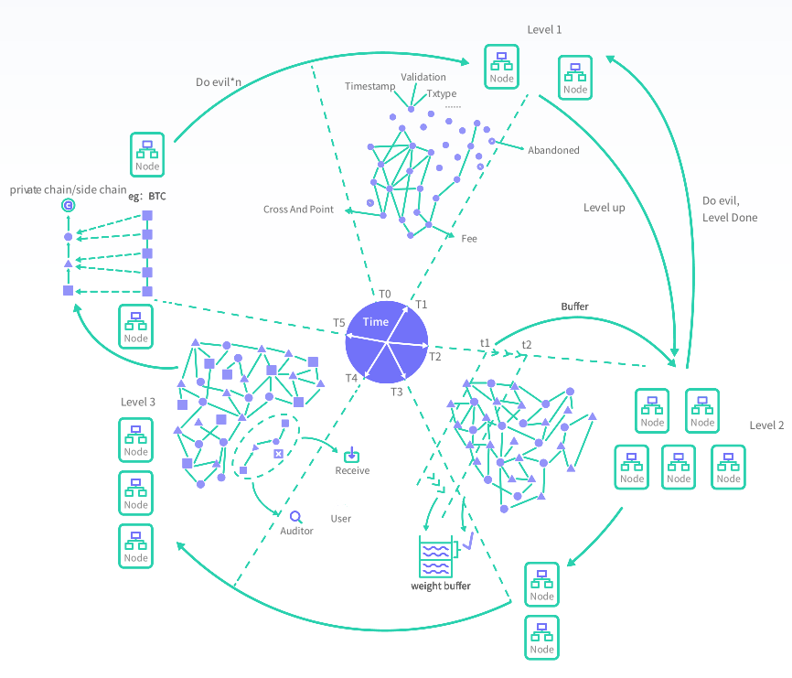
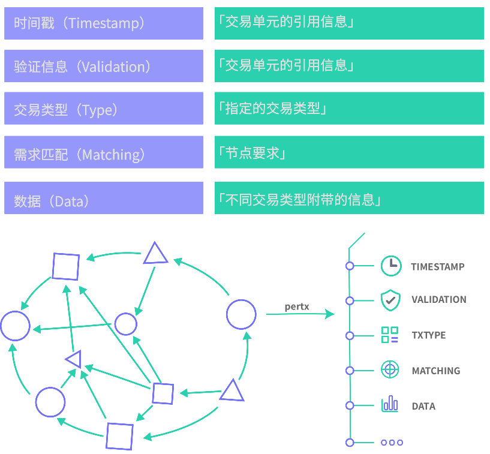
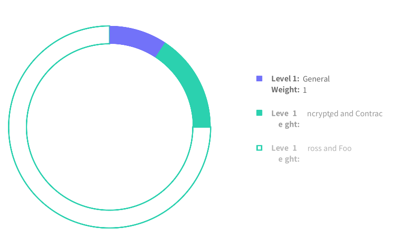
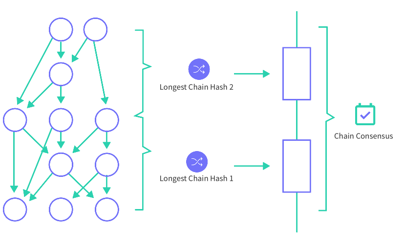

# AMBR白皮书

基于Gataxygraph算法的复合型分布式操作系统

[TOC]

## 概要

对于现有的区块链和DAG网络，Ambr在以下三方面做出了技术改进与革新：Galaxygraph算法，智能合约，多链与跨链。

Galaxygraph：重新定义交易单元，拓展多种交易类型，并在共识层使用复合型节点共识，同时根据节点信用进行动态赋权， 从而解决传统DAG网络手续费分发与节点激励的难点。

智能合约：改变传统区块链结构下因强一致性原则而必须使用固定时间戳执行交易与合约的方式，将指定时间域作为合约执行缓冲期，在一定权重周期内达成全网共识，以此来解决DAG网络偏序结构下难以实现智能合约的痛点。

多链与跨链：在多链共识中引入报信人与验证者角色，分别用于消息通信与交易确认，将链上功能封装为可拔插模块，并使其具有片区容错性。在Ambr的跨链系统中，可采用侧链作为中继链，实现可信消息传递与资产的价值转移。

## 前言

随着区块链技术的发展，DAPP的繁荣程度犹如雨后春笋，越来越多的中小型公司开始研究与开发自己的DAPP，试图在未来的区块链时代抢占一席之地。但是逐渐他们会发现，现如今区块链底层平台的功能性远远达不到他们的性能要求。安全性、交易速度、隐私保护、权限管理、合约语言功能性等等甚至远不如传统中心服务器。正是这种环境下，我们旨在提出一种安全的企业级可用、多链交互、具有快速交易速度、隐私保护性强、具有权限管理功能、易于编程的公共分布式平台解决方案，称之为Ambr，其底层原创算法我们称其为Galaxygraph（星河图）。

比特币的交易速度缓慢，扩容又成了一个难题，以太坊的网络堵塞，大量DAPP使得其使用更加缓慢。区块链的链式结构已经让速度成了一个难以突破的瓶颈。这也正是Ambr使用有向无环图（DAG）的原因。我们旨在基于此做一个去中心化分布式的“操作系统”。

DAG在智能合约和共识的激励制度上存在问题，本文中将提出一些解决方案并且我们将持续研究和开发。虚拟货币的本质是交易，交易构成区块链系统或者其他分布式系统，智能合约、加密、隐私保护都是交易的表现形式。我们将从交易本身出发，逐步列出因交易而衍生的功能、逻辑。因多种交易类型的存在，Ambr本身并不仅仅使用DAG来发送简单的交易。利用DAG结构来做多种交易类型并且达到多链、跨链交互 。

DAG的结构比链式结构更为复杂，交易处理速度提升，随之也带来一些问题。区块链系统的本质是状态机，通过维持其世界状态的一致来确认一笔交易的内容与其有效性。在DAG图结构中，由于其数据的快速增长和没有固定时间间隔的确认，导致世界状态的维持属于弱一致性。我们把世界状态的弱一致性问题归为数据与时间这两类确认问题。数据的确认问题涉及最长链（或最重链）的选取，时间的确认问题涉及在交易被不同节点所确认的时间先后问题。

## 历史与未来

### 1.区块链的历史

区块链的共识机制经历了多年的发展，每一种都经过了时间的考验，都有其优缺点，我们列举最经典的几种共识机制，并陈述其特性。

**POW即Proof of Work工作量证明**。工作量证明机制要求投入大量的计算资源去进行hash计算。这个过程也被称为挖矿。矿工根据预期来调整算力难度，再进行计算。在采用POW机制的比特币系统里，主要有两点限制了其交易速度：

1. 出块速度，
2. 区块大小。

出块速度过快会导致不安全，出快速度过慢会导致处理交易确认太慢；区块大小过大会导致区块链数据臃肿，体积庞大，区块大小过小会导致交易处理量级不足。诸多限制，使开发者们考虑创造更快的机制，而非仅仅从改变出块速度和区块大小入手。

**POS即Proof of Stake权益证明**。权益证明机制是根据持币数多少来解决记账权力问题，POS机制下的节点通过把自己持有的币解锁部分或全部去开启Staking，占全网Staking总数的比例即节点获得记账权力、奖励的比例。权益证明解决了POW的能源浪费问题。为了激励节点在一定程度上维护网络安全，POS往往有每年一定比例的通胀。虽然大部分POS币种提高了出块速率，降低了挖矿难度，但是却存在被攻击和偏向中心化的可能性。

**DPOS即Delegated Proof of Stake股份授权证明机制**。本质上和POS类似，记账由每个持币者选出的代表执行。持币的人都被称为股东，股东投票选出一些代表，由代表来快速记账。DPOS机制使验证交易的速度大幅增加，不过从一定程度上却牺牲了区块链系统部分去中心化的特性，属于弱中心化。一定程度上，币即权力的机制让想参与到系统中的人除了购买币之外没有其他方法。

**PBFT即Practical Byzantine Fault Tolerance实用拜占庭容错**。PBFT是非常优秀的拜占庭容错算法。这是一种状态机副本复制算法，将服务作为状态机来建模，状态机在分布式系统的不同节点来进行副本复制，它是一种基于消息传递一致性的算法。如图为三阶段协议广播来达成一致性，节点3不发出任何消息。

这种算法最多只能容忍33%的节点做恶，目前来看更加适合联盟链和私有链，来看不是特别适合公有链。

### 2.分布式系统的未来

区块链技术正如其名字一样，数据放在区块里面，区块组成一条链。每个区块中都存在merkle tree。其数据结构是一个树，树结构只是图的一种特殊情况。而DAG（Directed Acyclic Graph）有向无环图是一种图。DAG项目中，交易本身作为一个单元（unit）被传播到网络中，单元之间通过关系引用和权重来确认交易，没有了矿工的概念，使得交易的速度大大提升。

上图为一个典型的基于DAG的交易，一个交易子单元指向两个父单元。父子关系的延续保证了交易数据的有序性和合规性。在DAG整个序列中，会形成一个总序，总序保证了交易的唯一有效顺序，以总序的先后顺序来确认交易是否有效。每个点分叉之后又会快速融入进主序当中，图的优越性让交易更有优越性。DAG技术的出现让区块链行业眼前一亮，颠覆了传统的链式存储结构，故有人认为它并非“区块链“，所以在这里我们称它为分布式系统的未来。

## Universe与交易

### 1.总述

Ambr的交易因用途不同分为多种类型，主要有普通交易、加密交易、合约交易、跨链交易、自定义交易等多种类型。全部交易组成一个多元的有向无环图（Galaxygraph）。每种交易对于确认的节点类型有一定程度的划分与要求。星河图算法中，每个节点发起一笔交易时，放进一个Universe里面然后进行广播，Universe中包含了交易的多元性与多样的功能。

- 验证信息：包含了父单元的验证信息与私钥的签名信息
- 交易类型：用户指定的交易类型，有general,encrypted,contract,cross,foo等类型可以供用户自己选择
- 需求匹配：可以指定节点类型来确认自己的交易
- 数据：普通交易可附带20kb大小的简单字符串数据；加密交易可附带加密的地址信息，签名信息等；合约交易可附带合约字节码；跨链交易可附带权限验证信息、相关操作信息等

### 2.普通交易

Ambr的交易因用途不同分为多种类型，主要有普通交易、加密交易、合约交易、跨链交易、自定义交易等多种类型。全部交易组成一个多元的有向无环图（Galaxygraph）。每种交易对于确认的节点类型有一定程度的划分与要求。星河图算法中，每个节点发起一笔交易时，放进一个Universe里面然后进行广播，Universe中包含了交易的多元性与多样的功能。

### 3.加密交易

加密交易是一种Ambr的交易类型，这是一项可拔插的交易类型，用户可自己选择。其使用的算法是zk-snarks。

它是一个独立于普通交易的系统，普通交易的账户之于它仅有输入和输出，总账为零和。如图所示，用户先把自己的Ambr转入混币器系统，也可以使用钱包中类似Tor的网络系统流转后打入混币器地址。假设转入的所有币在同一时间内转出，那么总帐零和，所以进入的交易量越大越难以被追踪，使用的人数越多混币器系统越安全、越保护隐私。这种交易类型对于节点的硬件性能有一定的要求。且转账手续费高于普通交易。

### 4.合约交易

合约交易即包含智能合约的交易，要求用户对持币数有一定要求，并且对于确认合约交易的节点也有一定的币数要求。币数与记账权直接挂钩，并且与全网中普通交易和合约交易的比例相关，为动态数值。合约交易的手续费与操作数和调用的标准库函数量直接相关，手续费高于普通交易，且大多高于加密交易。

### 5.跨链交易

跨链交易是私链与公链之间的交易，其主要用于开启自我私链、跨链验证以及记载验证信息。手续费与普通交易相近，验证节点性能上有较高要求，所以通常要求早期的私链创建者自己提供与维持数个稳定节点。

### 6.自定义交易

上图是自定义交易的一个模型。自定义交易其实相当于一种综合了上述交易且可以自定义选择功能的交易，标准库中将会提供加密、合约、跨链的相关函数，用户选择与自己按照函数规范编写，在交易解释器测试之后按照标准提供执行步骤，自定义交易节点继而确认这笔交易，最终广播到主网，其手续费最高，对于节点的性能要求也最高。

## 共识

### 1.计算方法

星河图的共识机制是一种Credit Continuing（信用延续）的共识，信用节点被分为五类：general,encrypted,contract,cross,foo。其本身的信用基础来自于网络之前的无故障率交易、接收手续费多少、即时网络各节点类型数量。这是一种节点权力更新型机制。

General节点被归为level1等级节点，encrypted与contract节点被归为level2等级节点，cross与foo被归为level3等级节点，每种等级节点确认相应类型的交易，不同交易的权重分别为1，3，5。

### 2.激励与手续费

DAG网络的手续费分发一直是一个棘手的问题，激励制度不健全。在星河图网络中，一笔交易将会被分成两个部分：一为用户发送的交易（金额、合约等）；二为伴生交易即手续费独立形成一笔交易。

前者会由网络节点快速确认广播；而后者却会等待n个无故障确认；伴生交易的发出会印上时间戳，在一定的网络权重后，然后前8位最长的交易的匹配节点将会获得手续费。

### 3.节点

在每一个$t_k$，应存在一个混合策略分离均衡（SSE）。假定在此阶段节点$i$以$\sigma$的概率选择$a_i(t_k) = \{happen\}$。

若纠错系统$j$选择$a_i(t_k) = \{correct\}$评估对网络的收益为：

其中$P_c$为纠错系统的检测率，$P_f$为检测率，$C_{ips}$为纠错系统阻止攻击的代价，$\mu$为检测出攻击时，攻击系统的收益，$\omega$为没有检测出攻击时，恶意节点的收益或网络损失。

若纠错系统$j$选择$a_j(t_k) = \{not correct\}$评估对网络的收益为：$E_j(not correct) = -\sigma \omega p (\theta_i^m)$

同理，计算攻击的收益和不攻击的收益，可以求得纠错系统以$p = \frac{w - C_{cm}}{(\omega+\beta)P_D}$的概率选择$a_j(t_k)={correct}$时，对于$i$来说，选择不攻击和攻击时没有区别的。在Galaxygraph中，以运行一定时间间隔，测验攻击收益。即运行一定时间后，攻击收益远低于攻击成本时，撤去主节点，以此谋求最大程度去中心化。

Ambr团队早期会提供全类型确认节点，用户可选择其作为确认节点，在GUI界面将会有排名前100节点列表，包括总确认数与故障率。用户本身也可以添加节点地址作为第一确认节点，然后由第一确认节点广播。从安全性角度讲，更推荐用户在交易中提高手续费以及对接点使用普通交易类型。

在星河图算法中，系统本身将会对节点作恶进行评估，一旦达到一定的作恶概率，对节点与发出的此交易进行降权，从而达到防止节点作恶的目的。

将节点记作$i$，将纠错系统（真实参与纠错的节点）记作$j$。节点空间记作$\theta_i = \{\theta_i^m \theta_j^n\}$，$m$为恶意节点，$n$为正常节点。将恶意节点的先验概率和后验概率分别记作$p(\theta_i^m)$和$p'(\theta_i^m)$，将正常节点的先验概率和后验概率分别记作作$p(\theta_i^n)$和$p'(\theta_i^n)$。将评估空间记作$\{\theta_j^d\}$。$\theta_j^d$表示能够检测并阻止节点攻击的这一事件。

为简单起见，我们假设$p(\theta_j^m) = \psi, p(\theta_i^n) = 1 - \psi, p(\theta_j^n) = 1$

将在恶意节点$i$上的行动空间记作$A_i(\theta_i^m)=\{happen,not happen\}$在正常节点$i$上的行动空间记作$A_i(\theta_i^m)=\{not happen\}$。将纠错系统的应对空间记作$A_j(\theta_i^d)=\{correct,not correct\}$

将作恶节点和正常节点的收益记作$\mu_i(\theta_m)$与$\mu_i(\theta_n)$纠错系统的收益函数记作$\mu_j(\theta_j^d)$。定义$h_i(t_k)$为参与节点$i$的交易历史序列，$h_i(t_k)$是一个二值向量，包含了参与节点$i$从$t$到$t_k$的所有序列$h_i(t_k)=(a_i(t_1),...,a_i(t_k))$。因此根据$h_i(t_k)$纠错系统$j$将会对参与节点$i$在$t$博弈阶段作如下计算：

$$
p'(\theta_i^m|a_i(t_k),h_i(t_k)) = \frac{p(\theta_i^m | h_i(t_k)) \lambda(a_i(t_k) | \theta_i^m,h_i(t_k))}{\sum_0 p(\theta_i | h_i(t_k)) \lambda(a_i(t_k) | \theta_i,h_i(t_k))}
$$

其中$p(\theta_i^m|h_i(t_k))>0, p(\theta_i^m|h_i(t_k)$是先验概率。$\lambda(a_i(t_k) | \theta_i^m,h_i(t_k)>0$且$\lambda(a_i(t_k) | \theta_i,h_i(t_k)$是参与节点$i$在$t_k$攻防阶段可选择行动的概率分布。

mbr使用更新型节点权力机制，其权力越大，所需性能越高。上述已经提到，自定义交易>跨链交易>合约交易>加密交易>普通交易。每笔交易在被盖上这比交易时间戳的同时会由私钥签名。确认数到达一定网络权重与占到无错网络总交易数量比例时，节点自动更新其权力。

上述提到，不同节点记账权不同。早期利于更新迭代，但还是会产生官方主节点记账权过大的问题（早期交易由Ambr主节点处理），到一定网络深度时，Ambr团队将自动放弃一大部分记账权，转向网络竞争记账，若节点达到各项要求，最后总会有一固定比例的更替节点拥有最大记账权。加密交易等级以上的节点拥有发起网络投票权的权力，其更新代号会列举在GUI界面当中，当总持币数大于20%的节点群对其投票时，全网其他持有币的同步节点必须要对此作出表态。这是一种相对实用的迭代模型。

### 4.数据确认

数据的确认同样也涉及双花问题，星河图中，通过MCI（主链的索引）+TFI（交易手续费索引）来确认。MCI即Main Chain Index，TFI即Transaction Fee Index。MCI即从主链创世单元起每个universe的序列值，每一笔交易的确认顺序由MCI决定，网络会优先选择MCI值大的universe放入主链当中，TFI作为第二参考指标，分别根据得到手续费的节点确认时间来确定冲突交易的有序性。例如
其他条件一样，手续费节点1确认时间一致，比较2节点的确认时间。

### 5.时间确认

时间戳通过两种方法来确认，一种是每笔交易会盖上确认交易时间戳（Confirmed
Timestamp，简称CT）与加入主链时间戳（MainChainTimestamp，简称MCT），确认交易时间戳有助于帮助确定交易确认时间的置信区间，加入主链时间戳可以帮助多链系统形成有序的时间秩序。也就是说，时间戳是可以更新的，加入，另一种是通过交易的权重深度来辅助时间戳的确认。权重配合时间的方式可以让DAG共识下的智能合约具有可行性。

## 智能合约

### 1. 语言与标准库

Ambr的智能合约语言兼容solidity，熟悉以太坊合约编程的开发者能够快速适应。我们已经知道以太坊合约的缺点：重复验证包含合约的块；每个节点重复执行计算导致手续费的昂贵。没有发展优秀可用的标准库等等。

在Ambr合约语言上将会有大量标准代码库支持，包括一些简单合约、函数、数组和
字符串等。因字节码减少，可以大大降低合约的部署成本；更加安全，经过审查，可见性高并且易于维护和升级。

### 2. DAG+智能合约的可行性分析（外部数据+时间与权重）

对于智能合约来讲，外部数据的调用一直是个难题，其原因在于区块链的共识机制要求每个节点状态相同智能合约才能正常运行，所以引入的外部数据需要全部精确一致，需要有一个确定的世界状态让每一个执行操作的节点去有序执行。

这里列举一个最经典的例子：双方就明天天气如何对赌。这里涉及两个问题：

1. 定时从外部网站获取天气的数据；
2. 所有节点统一执行对赌结果。

以太坊通过预言机（Oracle）来解决这个问题，采用单一或多重模型预言机作为数据传输者，在DAPP与WebAPI之间提供可靠链接，从而帮助智能合约访问链外信息。在Ambr上，我们并不反对这种做法并且会保留甚至提供类似的预言机模型，让用户自行选择。但除此之外，我们提出这样一种设想：让跨链交易等级以上的节点进行链外数据匹配交易。

在调取链外数据交易产生时对高等级节点进行快照，广播其交易，同意广播并跟进这笔交易的确认节点开始实施并定点地开始跟踪链外数据。这些确认节点由快照时随机选出，在规定时间点发出匹配信息（交易附带信息），若节点间所发数据一致，则全部广播。但以上做法会消耗较多的手续费，其安全性基于高等级节点合理的筛选制度与DAG网络的安全性。我们将持续研究这种匹配交易。

根据以上所述，对于执行智能合约而言，有“在什么时间执行”这样一个问题，星
河图算法使用时间戳与权重两种方式，这里我们着重介绍权重方法。某智能合约中规定，在T时刻预执行操作A，此时包含这个智能合约的universe权重不超过5。但由于其状态在T时刻的弱一致性，等待权重到了18（由权重置信区间确定，为两个全类型交易权重周期：（1+3+5）*2）后，真正执行操作A。这意味着，合约的执行有个缓冲期，所有参与节点将会发出准备信号，不执行的将会被淘汰，降低其节点可信度。

## 多链与跨链

### 1.私链

Ambr的设计哲学是简约+复合。每一个模块、功能都尽量设计成可拔插、具有片区容错性，组合之后实现复合型功能。每个节点都可以发送一个开启私链的创世跨链交易，这类节点会得到一个跨链地址，此后所有的交易都将指向这个创世交易，每条链都有自定义的网络标示、端口、网络ID等等。并且可以选择自己的主节点，用于快速验证交易。私链交易与公链交易独立。

私链完全可以作为一条侧链使用。节点的确认与安全性保障使用Ambr主链的解决方案，或者自己指定节点，或者自己引入第三方可信节点机构（可指定）。Ambr网络中，将会有一条所有人共同拥有的侧链，每隔一定时间块，记录主网中的hash链验证信息。这是一种嵌入式私链，用以确立世界状态一致的时间戳顺序。以上将被设计为可拔插机制，也可用主网的伴生交易确定时间戳顺序。都是为了智能合约环境下，用户有多种确定世界状态的手段。

#### 1.1私链共识

Ambr私链的分布式共识部分被设计成两种模式：
「Galaxygraph算法网络共识」
直接使用主网共识，但比主网拥有更多选择性：私链模式下，创建方或许有更多偏中心化的选择：
1.可以指定一定时长的见证人（Self-Witness）
许多私链创建方为了创建自己的企业应用，需要自己占有一定的网络控制权来保证应用与数据的更新迭代，Ambr的私链模式下，创建方若选择self-witness模式，在创世期需要指定：
a.见证人个数与地址
b.每个见证人的权力占比（投票权等）
c.见证人的有效期（通过时间与权重定义，可为永久）
d.是否允许修改链上数据（包括创世单元）
网络共识数据在self-witness下若被指定可以修改，则总权力大于50%的见证人组合可以向私链节点播放数据修改的要求。

#### 1.2消息与通信

私链的消息与通信系统中会存在“报信人”的角色，报信人与见证人是两种不同的概念。报信人由创建人指定与私链方网络用户投票选出，可指定多个。用户与创建人支付一定的锁定时长保证金，在此时长内，普通节点开始竞选报信人角色，提供自己的各地区延迟与服务器性能水平，用户投票，竞选成功后，在指定时长里完成报信任务将会得到酬金奖励。报信人要求节点性能高，主要用于快速提供用户信息，延迟与误报率将会被显示在Ambr钱包界面中，方便用户选择与投票。延迟和误报率高于创建人的预设值将会被降级为普通节点。

#### 1.3多链交互

多链交互是多链中相当重要的一环，在主链上，用户的账户体系中拥有多链的资产余额，但没有交易细节，从而也就无法查询构建于异链的DAPP内容。在Ambr上，私链本身有两个输入输出函数类，通过私链创建者所公开或自定义规范的函数，可以调用其他链上的所存数据。多链交易十分重要的一点是其不需要像智能合约一样得到每个节点的确认，这大大节省了调取数据的时间。例如external，public，internal，private等。

多链交易将会使DAPP更加繁荣发展，这是分布式系统以及区块链的新的时代标志。众所周知，如今的区块链系统无法存储大量数据，冗杂数据量的堆积将会使区块链十分臃肿。使用异链交互技术将可以达到这样的效果：主链存储一定长度的最重要信息，私链存储附带信息。这解放了主链节点的硬盘空间和网络带宽，使得DAPP的开发广度和深度得到巨大的拓展。

### 2. 跨链

#### 2.1中继链

Ambr主链作为一条中继链，与其他区块链项目进行对接时会生成对应的私链。与私链类似，中继链中也存在报信人的角色，报信人负责快速传递消息。

以下论述两种跨链下实现中继链的办法：
**可用信息存储**：私链上将持续生成universe存储其他区块链上的信息，每调用一次叠加一个universe，这条链仅在需要读取信息的时候才会产生变化，每次调用需要从主链上存储验证信息。共识依赖于主链进行。
**所有信息存储**：以BTC为例，将所有BTC的blockheader分区块打包到universe中，存储在一条特定的私链上，每到出块时间，再次存储最新信息。这条私链创建初始，会生成一个与创建者地址绑定的智能合约，用于支付universe挂载手续费，一旦地址手续费不足，将会停止私链的信息更新。共识节点可以由自己选择。

#### 2.2分布式文件存储系统

多数跨链系统主要用于资产层面的对接、跨链交互，在Ambr的跨链系统上，我们不仅支持数据上的跨链对接，还面对未来的分布式文件存储系统进行布局。对于一个操作系统而言，不单单需要存放的是字节码、代码等，还需要能够存储类似jpg、pdf等等针对于操作系统的文件。所以我们也关注于IPFS协议的发展，致力于发展通用的文件基础架构，一旦类似IPFS的分布式文件存储系统发展成熟，我们将会将其对接在跨链的文件存储上。

通过Ambr对接分布式文件存储系统的好处：用户在Ambr平台上发布合约或者跨链交易，以实现自己的功能：例如，发布一个版权证明合约、跨链存储文件等，但将具体的需要存证的文件等存放在存储系统上，可以减少Ambr链上数据臃肿，却不会丢失认证信息。

### 3.主链验证

将私链的验证信息存储到主链上是DAG网络十分难以解决的问题。其问题主要在于，DAG网络节点间没有一个相同的世界状态，其偏序关系让许多验证方法失去作用。上方已经提过时间块的概念，利用时间块与有效验证率可以验证一个可置信时间区间内的交易，加快时间块的验证速度，提高其出块速度，在DAG网络中也将使验证信息变得十分高效。网络权重为交易链接的各笔交易权重总和，不同交易类型根据其验证难度所具有的权重值也不相同。

故针对于主链验证有几个解决方案：

1. 私链方自己选择主节点的最长链时间块块头信息与最长链的验证信息（如哈希值）存储于主网，拥有相应权限的用户可调用其信息；
2. 私链方不选择主节点情况下，以网络权重作为世界状态（动态，但省略小权重），每达到自定义权重区间的网络权重时，存储相应验证信息；
3. 为了让用户或合作方获取私链最新信息，私链创建方可根据实际使用需求相应调整权限级别，允许用户直接获取世界状态不同下的信息。

在这个系统中，主链解决了共识问题，验证人由私链创建方自己选择，网络权重作为重要的考量因素。I/O由于DAG高效快速的共识将会变得十分快速。

## 时间线

时间路线图：
2018

Feb-March：融资（Financing）

15thApr：交易与共识黄皮书，交易包括信区间等与共识系统包括复合型节点的更新机制细则的具体设计与严格数学证明

15thMay：DAG+智能合约黄皮书

15thJune：多维与跨链黄皮书

15thJuly：Ambr系统代码结构总览

Aug:主网上线，全部源码开源

Nov：智能合约上线

2019

Jan：PermissionSystem+Mult：Chain，Cross-cjainDemo

Apr：Multi-chain，Cross-chain+EncryptedTransacttionsDemo

July：CustomTransction+智能合约库完善

Oct：EncryptedTransactionsystem

Jan：完成去中心化运营，持续更新与运维

Ambr将会尽快发布自己的主网钱包以及相关接口，届时将接入大量合作应用。主网上线之前，将会发布所有相关内容的黄皮书，每一个月发布一份。一旦主网上线，项目将会开源。任何对项目做出贡献的开发者将会得到Ambr的奖励。技术合作人可以通过Slack联系Ambr官方开发组，加入Slack开发组，每月将评估贡献量给予合理的Ambr币奖励。

## 基金会治理架构

治理架构为分布式治理架构：每位想要对Ambr作出贡献的参与者有两个功能：参与与建议。参与即针对Ambr团队提出的问题解答，得到一定奖励；建议即提出意见，由团队进行筛选，支持者大于100的建议团队必须给出合理的回应。

## 参考文献

[1] Bitcoin whitepaper. <https://bitcoin.org/bitcoin.pdf?>

[2] Ethereum wiki. <https://github.com/ethereum/wiki>

[3] Byteball whitepaper. <https://byteball.org/Byteball.pdf>

[4] IOTA whitepaper. <https://iota.org/IOTA_Whitepaper.pdf>

[5] Nurmi P. Modelling routing in wireless ad hoc networks with
dynamic Bayesian games[C]// Sensor and Ad Hoc Communications
and Networks, 2004. IEEE SECON 2004. 2004 First IEEE
Communications Society Conference on. IEEE, 2004:63-70.

[6] CAO Hui, WANG Qingqing, MA Yizhong. Attack prediction model
based on dynamic bayesian games

[7] M. Khamkong, "Approximate Confidence Interval for the Mean
of Poisson Distribution," Open Journal of Statistics, Vol. 2 No.
2, 2012, pp. 204-207. doi: 10.4236/ojs.2012.22024.

[8] <https://cosmos.network/about/whitepaper>

[9] <https://polkadot.network/Polkadot-lightpaper.pdf>
