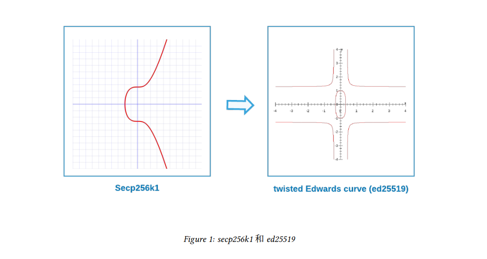
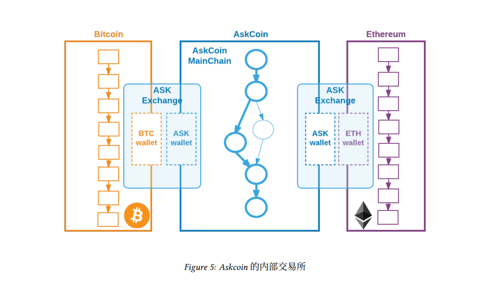
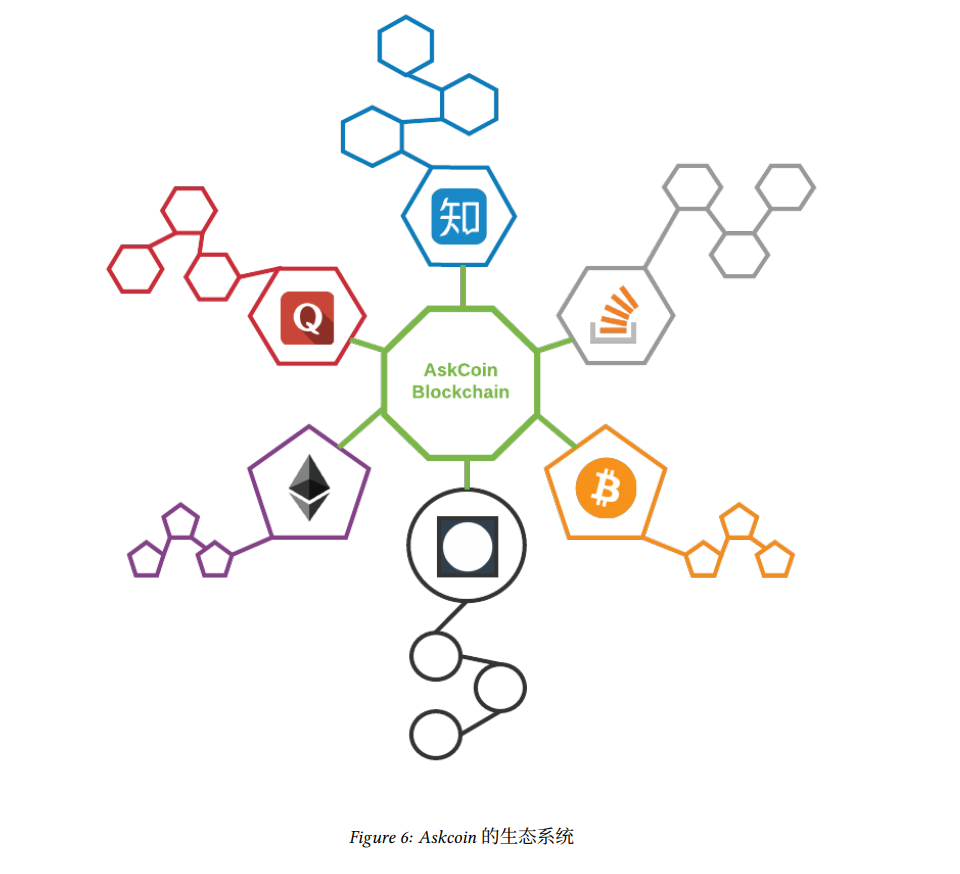

# Askcoin 白皮书

基于DAG的区块链系统和全新的知识支付方式!

[TOC]

## 摘要

Askcoin 是基于 DAG 技术的底层区块链系统，它为知识和现金之间的转换提供了最为便捷的通道。在整个的生态设计中，以问答系统为例，知乎、Quora、stackoverflow、春雨医生等等都是 Askcoin 区块链系统的应用，在这些应用间使用ASK做为统一的代币。你在stackoverflow上回答问题赚来的ASK币可以转给你的朋友，让她/他在知乎上问其感兴趣的问题。

## 1 概述

> “人们的努力的成功，不仅取决于他们自己所使用的货币，也仰赖于他人所使用的货币的效果。 ”
> F.A. 哈耶克

自从中本聪于2009年革命性地发明了[比特币[1]](比特币/比特币白皮书.md)至今已经过去了8年。在这8 年 ，区块链技术得到了长足的发展和不断的进步。以比特币为代表的数字加密货币逐渐被人们所了解和接受，成为去中心化的数字资产和价值存储。比特币被人们称为数字黄金。而另一方面，天才少年 Vitalik Buterin和技术极客 Gavin Wood 于 2013 年创建的[以太坊](../Ethereum/以太坊白皮书.md)项目[2]也获得了巨大的成功。越来越多的基于以太坊智能合约的去中心化应用广受人们关注。而这一切都是基于区块链技术的推动。

根据coninmarkcap.com网站的统计数据，全世界目前有超过700种数字加密货币和100多种数字资产。全部市场价值合计超过1000多亿美元。数字加密货币和资产几乎已经遍布当今世界的任意一个角落。而数字加密货币的基石，区块链技术，也必将影响每一个人类的衣食住行，并对人类社会的当前以及未来的所有行业产生冲击。

金钱永不休眠，技术的发展也不会停歇。针对区块链技术本身的发展也是这样。简单来说，区块链的核心技术可以从四个方面概括：[分布式共识算法](../../核心技术/共识算法/区块链共识机制简要介绍.md)，[点对点网络](../../核心技术/P2P网络/P2P技术详解1.md)，[分布式数据存储](../../核心技术/组网拓扑/分布式算法简要介绍.md)，以及基于区块的链式的数据结构。其中最核心的就是这种链式的数据结构。所有的交易打包在区块中，这些区块按照先后顺序链接在一起，并且无法篡改。这种无法篡改的链表就像历史一样一往无前，永不回头。区块链这三个字就来源这个数据结构。

但这种数据结构最大的问题在于，随着这种链式结构的不断增长，历史交易数据会不断累积，需要支持的交易量和用户数量也在不停增高，对于效率和可伸缩性的需求也会变得越来越大。人们开始设想能否改变这种单链式的数据结构，来解决这种与日剧增的需求。Askcoin给出的解决方案是使用基于[DAG[3]](../核心技术/组网拓扑/DAG网络.md)的数据结构。DAG（Directed Acyclic Graph）代表有向无环图。使用DAG方式的数据结构来代替比特币的单链式的数据结构，在这种模式下，交易不再通过单向链表的方式连接在一起，而是通过有向无环图的方式连接。

基于DAG的设计并不是Askcoin的首创，早在2015年，Sergio Demian Lerner（RSK的首席科学家）就提出了一个名为DagCoin[4]的概念性项目，发表在bitcointalk论坛上。随后IOTA[5]团队开发了Tangle项目，试图使用DAG数据结构加马尔科夫蒙特卡洛（MCMC）方法的方式来解决双花。而俄罗斯技术极客Anton Churyumov创建的雪球项目[6]（Byteball）更是使人眼前一亮，提出了主链（mainchian）的概念。同时，IPLD项目[7]提出了一些名为默克尔图和默克尔DAG的数据结构。Askcoin试图站在这些前辈探索者和实践者的肩膀上，成为又一个使用DAG技术为基础的区块链项目。

区块链不仅仅是一场技术革命，其本身所蕴含的共享、透明、开放和去中心化的精神内涵已经远远超越了技术本身的范畴。比特币撬动了金融巨头们对全球支付网络的垄断地位；以太坊为典型代表的新型ICO投资模式刷新了人们对传统风险投资和股权众筹模式的认知。而在社交媒体领域，基于区块链技术的Steem项目[8]使得用户对于自己产生的内容具有了主权，并根据股则获得奖励。Askcoin与Steem类似，但并不针对内容的产生，二是专注于知识的变现。它为知识和现金之间的转换提供了最为便捷的通道，使任何人都可以通过自己的只是来快速的获得报酬。

另外，在技术层面，Askcoin并没有像Steem那样基于传统的区块链技术，而是才用了DAG技术。我们认为一个基于DAG技术的新型的区块链平台将为知识变现带来全新的支付方式。同时，Askcoin将不会从任何现有的开源项目的源码中分叉出自己的项目。Askcoin会建立出一个全新的系统，我们会使用Java编程语言从零开始打造Askcoin平台。Askcoin的代码会在合适的时间点开源，公开透明的允许人们浏览、审视、下载和修改，并鼓励更多的开源和区块链技术爱好者参与进来，使得Askcoin能得益并回馈于整个开源和数字加密货币社区。

## 2 加密算法与ASK地址

Askcoin使用椭圆曲线加密算法（ECC）来作为公钥密码算法。椭圆曲线算法被广泛应用于数字加密货币领域。例如比特币和以太坊都使用secp256k1签名算法[9]，而Askcoin选择使用ed25519签名算法[10]。Askcoin的地址通过ECC算法生成的公私钥对推衍而生成。具体使用了比特币的BIP173协议[11]中提出的编码算法。该算法是一个针对原有比特币base58[12]地址编码算法基础上的一个改进版本。

### 2.1 数字签名加密算法

Askcoin选择ed25519算法相对于secp256k1更加高效，同时安全性也非常高。目前也被广泛应用很多加密数字货币项目中，著名的项目例如Zcash、公正通（Factom）、新经币（NEM）等等，以太坊的创始人Vitalik也曾在博客中公开表示，以太坊计划在新版本中切换ed25519。ed25519的好处是在不损失安全级别的情况下，显著提升运算效率，其效率是secp256k1的很多倍。以ed25519的论文中的实验为例，该算法完成一次签名需要87548个CPU循环，一个4核2.4GHz的CPU每秒可以完成109000次签名。密钥的生成也非常高效。而ed25519的安全级别和secp256k1的级别相同，都是128位的安全级别。

Askcoin选择Twisted Edwards曲线[13]来配合使用ed25519算法。
Twisted Edwards曲线的公式定义如下：

Twisted Edwards曲线的点(x1,y1),(x2,y2)的坐标公式如下：

### 2.2 ASK地址

Askcoin地址采用比特币BIP173协议[11]中提出的Bech32/Base32[14]编码方法进行编码。Bech32编码方法是由比特币核心开发者Pieter Wuille和Greg Maxwell提出的新一代比特币地址编码方式。Bech32相比base
58[12]效率更高，功能更强大。ASKcoin将在Bech32的基础上，开发出一个专门的版本以供Askcoin使用。
Bech32的优点包括：

- 大小写不敏感，更易于读写
- 转换算法更加高效
- 只比Base58多占17%的空间
- checksum校验算法更加优化
- 对二维码支持的更好

## 3 架构设计

Askcoin所使用的DAG技术是新一代的区块链技术，有别于比特币和以太坊中使用传统的区块链技术。使用DAG这种基于图的数据就够相对于传统的数据结构将帮助Askcoin更好的解决水平扩容、交易延伸性等问题。基于DAG的区块链设计并非为Askcoin所独创，在Askcoin之前，有IOTA项目和字节雪球（byteball）项目采用了DAG技术并进行了有益的尝试。尤其是字节雪球项目，在IOTA的DAG的基础上，具有开拓意义的提出了主链（mainchain）的概念，并通过见证人的方式实现了主链选择算法，从而解决了DAG的双花问题。Askcoin将沿着字节雪球的道路继续向前发展，提出自己的主链选择算法。DAG代表有向无环图。经典的有向无环图的拓扑结构如下图所示：

### 3.1 主链选择

在DAG中，没有区块的概念，所以也没有出块时间的概念。基于DAG的技术，Askcoin不需要向比特币那样等待10分钟左右的出块时间，也不需要像以太坊那样等待15到16秒。基于DAG的区块链网络是即使确认的。同时基于DAG技术，由于交易不需要打包到区块中，所以也不存在所谓区块扩容的问题。目前比特币的区块容量是1M，实际情况约能容纳2000多个交易。而以太坊区块大约能容纳200多个交易。比特币社区因为扩容问题带来的争议而严重影响了客户体验，使得比特币的发展陷入了一个瓶颈。同时以太坊试图以分片（shading）的方式解决扩容的问题，但分片的方式将增加跨区智能合约的事物复杂度，对如何实现分片和分片环境下只能合约的开发都带来很多新的挑战，是否可以解决问题还有待时间去验证。而基于DAG的设计因为没有区块的概念，其扩容完全不受区块的限制，所以其可伸缩性只取决于网络带宽，CPU处理速度（例如数字签名加密算法的处理速度）和存储容量的限制。

由于DAG这种基于图的数据结构并不像传统区块链那样基于链的数据结构那样具有严格的顺序，所以会产生双花[15]的问题。因此基于DAG的区块链平台必须解决双花问题。字节雪球提出了主链（mainchain）的概念，通过见证人机制来解决双花问题。Askcoin也将沿用这种机制，实现自己的主链选择算法，通过Askcoin Hub（Askcoin自己的见证人机制）来解决双花问题。

### 3.2 Askcoin Hub

Askcoin Hub是Ascoin网络的核心，其作用是维护Askcoin网络的共识，确保主链的一致性，验证交易的有效性并抵抗双花攻击。Askcoin Hub在Askcoin网络中起到见证人（witness）的角色，其工作原理类似于字节雪球中的见证人节点。Askcoin网络依靠ASKcoin Hub使得主链的状态始终保持一直。Askcoin网络上的每一笔交易，不论是直接的还是间接的，最终都会连接到主链。每个交易通过其到主链的距离会建立一个先后的顺序。如果有两个交易试图花费相同的输出（Askcoin基于UTXO模型），那么先接入主链的交易会被接受，而后接入主链的交易会被拒绝，从而解决了双花问题。

Askcoin Hub通过收取一定的交易费来维护自身的运行。该方法类似于比特币网络中矿工节点的挖矿奖励，通过经济激励的模式来鼓励节点的运行。同时通过收取一定的交易费用，也使Askcoin网络中每笔发起的交易都具有一定的成本，可以遏制节点通过制造大量交易来攻击网络。Askcoin Hub由ASKcoin网络运营者和Askcoin应用运营者共同建立和维护，从而建立一个去中心化的Askcoin共识网络。

Askcoin客户端和ASKcoin钱包通过连接公共的Hub列表来接入Askcoin网络。

### 3.3 最终性

理论上来说，传统的POW网络如比特币，是不具备最终性（finality）的。即使你的交易已经得到了100个确认，理论上只要你拥有足够多的算力，依旧可以推翻这个交易[16][17]，从而改变交易的最终性。当然比特币由于其背后巨量算力的支持，这种行为通常被人们认为在实践上是不具备可行性，同时人们认为即使存在算力分布的某种集中性，出于自利的理由，集合全网算力75%以上的攻击行为开销过大，从而忽略比特币网络其实在理论上不具备最终性这个事实。而以太坊则计划在未来版本中由[POW](../../核心技术/共识算法/POW.md)方式过渡到POW+[POS](../../核心技术/共识算法/POS.md)的方式，提出了[Casper协议](../../核心技术/共识算法/Casper.md)来解决这一问题。与传统的区块链网络相比，基于DAG技术的Askcoin天然就具备最终性。当交易接入DAG网络与主链建立连接后，不论是直接的还是间接的连接，只要连接建立则交易的最终性立刻得到确认。这种最终性一经确认则无法被推翻。

## 4 代币

Askcoin平台的代币被命名为ASK。ASK被用来支付交易费，以及提问者支付给回答者回答问题所应得的报酬。ASK是所有接入Askcoin平台的应用之间的通用代币。从而实现不同问答平台间的价值转换。

ASK的代币总量为1000000000个。全部的ASK都将在创世交易中一次生成，并且代币发行总量将永远固定为10亿不变。这10亿枚ASK中6亿枚ASK发放于ICO投资者，剩余中的3亿枚ASK留作项目后续发展资金。另1亿枚分发于Askcoin公司股东和天使投资者。

## 5 内部交易所

Askcoin平台在未来将建立平台内部的交易市场。实现ASK和BTC和ETH的直接兑换。用户可以使用Askcoin手机客户端方便的交易和兑换ASK代币。从技术角度来说，Askcoin平台在实现上会采取[侧链（sidechain）](../../核心技术/侧链技术/BTC-Relay与RootStock侧链技术对比.md)技术，会成为比特币和以太坊的侧链。

内部交易市场会成为Askcoin平台的一项创新，用户可以通过Askcoin客户端买卖ASK代币，并可以使用ASK自由兑换BTC和ETH，这就类似一个精简版的B网（bittrex.com）或者P网（poloniex.com）的交易所功能。ASK内部交易市场计划既不采用传统的中心化解决方案实现，也不采用类似cosmos[18]和polkadot[19]等项目提出的跨链平台的方案。而是通过让ASK成为BTC、ETH网络的侧链实现直接跨链交易的功能。Askcoin认为采用侧链的实现方案更加适合Askcoin的业务场景，实现ASK和BTC以及ETH的内部可转换将会是Askcoin平台的一项便捷功能。

Askcoin网络将使用侧链技术连接到比特币网络和以太坊网络。而Askcoin Hub将成为比特币网络和以太坊网络的轻客户端，并通过使用类似PBFT/Paxos/Raft这种基于信任网络的共识协议来提交比特币网络和以太坊网络的区块头，从而连接到比特币网络和以太网网络。

## 6 Askcoin 交易类型

Askcoin平台是问答类应用的通用支付平台。系统专注于解决知识和ASK代币（或者称为知识现金）之间的转换，为知识和现金之间的转换提供最为便捷的通道。系统设计了三种交易类型来支持Askcoin的业务场景。分别为：ASK，ANSWER和PAY。

### 6.1 ASK交易

ASK 交易提出问题，并提供提问者所愿意支付的报酬(以ASK代币计价)。当问题获得解答时，问 题提问者需要手工发起 PAY 交易来完成ASK代币的支付。由于需要提问者发起支付，所以需要在ASK交易中包括相应的质押机制来保证当问题获得解答时，回答者能获得相应的报酬。具体的问 答规则由 Askcoin 平台的上层应用解决，Askcoin平台只在ASK交易中提供相应质押机制来支持 Askcoin 应用的上层业务。支付和质押的ASK代币由 Askcoin Hub 锁定，当经过某种可定义的时 间周期后，提问者没有获得任何有效回答后，那么支付和质押的ASK代币被退回给提问人。交易本身会由Askcoin Hub收取一定的交易手续费。

ASK 交易的内容包括:

1. 针对问题所愿意支付的ASK代币数量
2. 交易手续费
3. 质押的ASK代币数量
4. 过期时间 ( 过长和过短的时间将被拒绝)
5. 提问内容的 Hash
6. 应用的信息
7. 提问者的ASK地址与签名

### 6.2 ANSWER 交易

ANSWER 交易代表对ASK交易的应答。ANSWER 交易的内容包括:

1. ASK交易的 Hash
2. 交易手续费
3. 应答内容的 Hash
4. 应用的信息
5. 回答人的ASK地址和签名

### 6.3 PAY 交易

当提问者获得解答后，提问人需要发起 PAY 交易来支付ASK交易。支付的接受方可以是单人也可以是多人。提问人可以把报酬分配给多个回答者。提问人如果觉得没有合适的答案，或者不愿意支付给任何人。提问人可以选择支付给 Askcoin Hub 一定的费用。从而取回其质押在 Askcoin Hub 上的ASK代币。
PAY 交易的内容包括:

1. ASK交易的 hash
2. 交易手续费
3. 针对每个支付地址所支付的详细情况(如果和ASK交易存在差额，多余的费用会直接被 Askcoin Hub 收取)
4. 应用的信息
5. 提问人的ASK地址和签名

## 7 Askcoin 的生态系统

Askcoin 平台的目标是为问答类型的系统实现通用支付平台，在整个的生态系统的设计中，知乎、ora、stackoverow、春雨医生等等都是 Askcoin 区块链系统的上层应用。同时为了帮助应用平 台更好的接入 Askcoin 平台，ASKcoin 会首先实现一个针对区块链技术的问答和知识分享应用 (区块链技术社区)。该应用以 Askcoin 平台为基础，使用ASK代币作为支付手段。以此为典型案例向大众展示应用区块链技术的新的知识变现手段，以吸引更多的应用接入到 Askcoin 平台上来。

同时 Askcoin 会发布官方的 Askcoin 钱包(包括安卓平台和 iOS 平台)，钱包既能完成基础的转账功能同时也是集成了问答功能的ASK区块链技术社区客戶端。使用者可以在社区上提出∕解答区块链技术问题，并完成ASK代币的支付和转账。同时钱包还集成了以ASK为中心的内部交易所， 用戶可以方便的进行ASK和 BTC、ETH 等数字货币的交易和转换。
Askcoin 的生态系统如下图所示:

## 参考文献

- [1] Satoshi Nakamoto. 比特币白皮书. <https://bitcoin.org/bitcoin.pdf>, Oct 2008.
- [2] Vitalik Buterin and Ethereum Wiki. 以 太 坊 白 皮 书. <https://github.comethereum/wiki/wiki/White-Paper>.
- [3] Wikipedia.DAG有向无环图. <https://en.wikipedia.org/wiki/Directed_acyclic_graph>.
- [4] Sergio Demian Lerner. DagCoin 白皮书. <https://bitslog.files.wordpress.com/2015/09/dagcoin-v41.pdf>, September 2015.
- [5] Serguei Popov for Jinn Labs. IOTA 白皮书. <https://iota.org/IOTA_Whitepaper.pdf>, April 2016.
- [6] Anton Churyumov. Byteball 白皮书. <https://byteball.org/Byteball.pdf>, September 2016.
- [7] IPLD. IPLD 官网. <https://ipld.io/>.
- [8] Daniel Larimer, Ned Sco , Valentine Zavgorodnev, Benjamin Johnson, James Calfee, and Michael Vandeberg. Steem 白皮书. <https://steem.io/SteemWhitePaper.pdf>.
- [9] 比特币 Wiki. Secp256k1. <https://en.bitcoin.it/wiki/Secp256k1>.
- [10] Daniel J. Bernstein, Niels Duif, Tanja Lange, Peter Schwabe, and Bo-Yin Yang. 高性能高安全性的签名. <https://ed25519.cr.yp.to/ed25519-20110926.pdf>, September 2011.
- [11] Pieter Wuille and Greg Maxwell. BIP-173: Base32 address 编码协议. <https://github.com/bitcoin/bips/blob/master/bip-0173.mediawiki>.
- [12] Bitcoin Wiki. Base58Check 编码. <https://en.bitcoin.it/wiki/Base58Check_encoding>.
- [13] Daniel J. Bernstein, Peter Birkner, Marc Joye, Tanja Lange, and Christiane Peters. Twisted Edwards 曲线. <http://eprint.iacr.org/2008/013.pdf>, March 2008.
- [14] Wikipedia. Base32. <https://en.wikipedia.org/wiki/Base32>.
- [15] 比特币 Wiki. 双花. <https://en.bitcoin.it/wiki/Double-spending>.
- [16] 比特币 Wiki. 链重组. <https://en.bitcoin.it/wiki/Chain_Reorganization>.
- [17] Jameson Lopp.  e Challenges of Block Chain Indexing. <https://medium.com/@lopp/the-challenges-of-block-chain-indexing-30527cf4bfbd>.
- [18] Jae Kwon and Ethan Buchman. Cosmos 白皮书. <https://cosmos.network/whitepaper>.
- [19] Gavin Wood. Polkadot 白 皮 书. <https://github.com/polkadot-io/polkadotpaper/raw/master/PolkaDotPaper.pdf>, Oct 2016.
