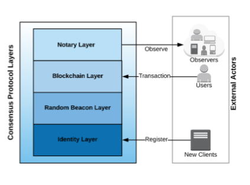
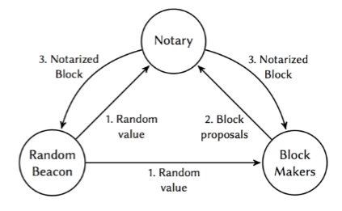
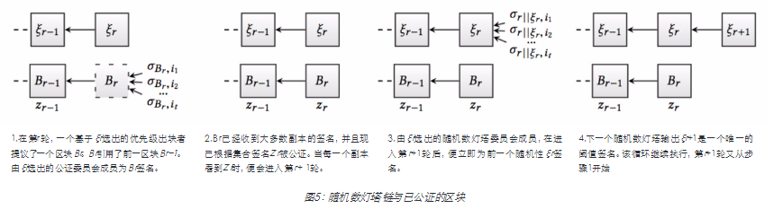
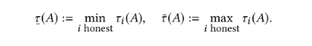
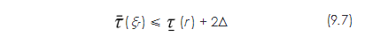
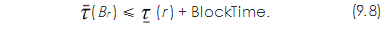
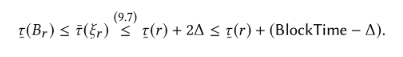

# Dfinity技术概论系类-共识系统

Rev.1
Timo Hanke,Mahnush Movahedi and Dominic Williams
翻译：龙心小台
校对：咕噜，Larry

[TOC]

## 摘要

Dfinity区块链计算机提供了安全、高效和灵活的共识机制。尽管最初被定义为许可制参与模式，但共识机制本身可以与任何抵御 女巫（Sybil）攻击的方法（例如PoW工作量证明或PoS权益证
明）相结合来创建一个开放的参与模式。Dfinity最大的优势体现在最富有挑战性的PoS权益证明情况中。

Dfinity的核心包含一个去中心化的随机数灯塔，作为可验证随机函数（VRF），会随着时间的推移产生一个输出流。灯塔背后的新技术依赖于具有唯一确定性、非交互式、分布式密钥生成
（DKG）友好的阈值签名方案。这种方案的唯一已知例子是基于配对的，并且来源于BLS [3,10]。

Dfinity区块链构建于Dfinity灯塔之上，并使用该灯塔作为领导者选择和领导者排名的随机性来源。基于提议区块的领导者的排名，链被赋予权重，在互相竞争的多条链中，该权重将决定
哪条链胜出。 通过一种公证环节，Dfinity区块链被进一步强化，该环节极大地缩短了达成最终共识的时间，消除了“无厉害关系”问题和“自私挖矿攻击”问题。

通过由随机数灯塔驱动的仲裁组的连续选择机制，Dfinity的共识算法得以实现高可扩展性。在实践中，Dfinity可以达到几秒的出块时间，并且只需两次确认便可达成交易的最终性。该系统能从容处理包括网络割裂在内的暂时网络不同步问题, 并且如果在同步的情况下，它能够被证明是安全的。

## 1.前言

DFINITY是一个去中心化的网络设计，其协议生成一个可靠的“虚拟区块链计算机”运行在对等网络之上，可以安装软件，并且可以在智能合约的防篡改模式下运行。目标是使虚拟计算机快速完成计算（通过使用较短出块时间，且只需少量区块作为“确认 ”），提 供 可 预 测 的 性 能（ 保 持 确 认 之 间 的 时 间 近 似 恒 定 ），以及随着服务需求的增加，计算与存储能力可以随之无限扩展（通过使用我们其他论文中讨论的新型验证机制和分片系统）。这些协议必须足够安全以抵御小于某个关键比例的节点的恶意控制，必须产生密码随机性（这是高级去中心化应用程序所要求的），并且随着其数量增长到数百万个节点，也必须保持去中心化的性质。

Dfinity将在一系列技术概论中被介绍，每一篇概论都强调了Dfinity的一项自主创新，如共识骨干、智能合约语言、虚拟机、并发合约执行模型、守护进程合约、对等网络和安全广播、治理机
制和扩展技术。 本文将重点讨论共识机制和密码随机性。

Dfinity在其协议的核心内置了一个公正的“可验随机函数”（VRF）。VRF不仅推动了共识，而且还将成为分片、验证塔等扩展技术的基础。此外，由共识层产生的VRF可用于应用层，即用于智能合约与虚拟机。如此一来，共识骨干就与许多其他课题交织在了一起。

## 2.介绍

Dfinity的共识机制有四个层次，如图1所示。第一层提供经注册的和可抵御女巫攻击的客户端身份（ID）。第二层是一个去中心化的随机数灯塔。在第三层的是由随机数灯塔驱动的区块链，随机数灯塔通过概率机制进行领导者排名。在第四层是一个去中心化的公证机制，提供时间戳与发布担保，并最终对近乎即时最终性负责。Dfinity的共识层与共识机制的其他关键方面可归纳为以下几个主要类别。

图1：Dfinity的共识机制层。1.ID层：提供所有客户端的注册表。2.随机数灯塔层：
为包括应用程序（智能合约）在内的所有更高层提供随机性来源（VRF）。3.区块链
层：通过由随机数灯塔驱动的概率插槽协议，从已验证的交易构建区块链。4.公证
层：为客户端和外部观察者提供快速的最终性保证。

- 第一层：ID与注册

Dfinity网络中的活跃参与者称为客户端。Dfinity中的所有客户端都是经注册的，即具有永久的匿名身份。客户端注册比典型的基于工作量证明机制的区块链有优势，在工作量证明区块链中，将不同的块连接到同一个矿工身上是不可能的。例如，如果注册要求安全保证金，那么作恶的客户端将丧失其全部保证金，而矿工在典型的工作量证明区块链中只会在作恶期间损失出块奖励。因此，对注册身份后的作恶行为的惩罚，可能会远大于对未注册身份时的作恶行为的惩罚。这点尤为重要，因为这样区块链就可承载超过其原生代币总价值的外部价值，而不受限于原生代币的体量。此外，Dfinity通过提供协议来注册新客户端以支持开放会员资格，该协议通过带有锁定期的权益保证金注册新客户端。这是第一层的责任。

- 第二层：随机数灯塔

第二层中的随机数灯塔是由注册客户端共同生成的公正的可验随机函数（VRF）。直到即将被每个人都可以使用之前，VRF的每个随机输出都是不可预测的。这是Dfinity系统的一个关键技术，它依赖于具有唯一性和非交互性的阈值签名方案。BLS签名方案是唯一可以提供这些特性的实用方案
1，而Dfinity具有特别优化的内置BLS实现[2,11]。使用阈值机制创造随机性解决了关键的“最后一个参与者”问题。 任何去中心化协议在没有阈值机制的情况下产生公共随机性都会遇到这样的问题：即该协议中的最后一个参与者知道下一个随机值并可决定中止协议。

- 第三层：区块链与分叉决议

第三层部署了“概率插槽协议”（PSP）。该协议针对每一个区块高度对客户端进行排序，此排序由该区块高度时随机数灯塔的公正输出决定。然后将权重按照提议者排序等级分配给区块提案，使得来自列表顶部客户端的区块得到较高权重。分叉问题通过支持拥有“最重的”累积区块权重的链条得到解决-与传统的工作量证明共识基于最高累积工作量非常相似。PSP协议的第一个优点是，排名是即时可用的，这使得可预测的、恒定的出块时间成为可能。第二个优点是总有一个排名最高的客户端，这允许了均匀同质的网络带宽利用。相反，客户端之间的竞争则会偏向于爆发式使用。

- 第四层：公证与近乎即时的最终性

一个特定交易的最终性意味着一个系统范围内的共识，即一个特定的交易已经被不可逆转地执行。尽管大多数分布式系统需要快速的交易最终性，但现有的区块链技术并无法提供。Dfinity在其第四层部署了新的区块公证技术来加速最终性的达成。公证是由注册客户端共同创建的某个区块下的一个阈值签名。只有经过公证的区块才可以包含在链中。在所有提交给客户端进行公证的区块候选者中，客户端只为排名最高者提供公证，该排名是基于由随机数灯塔驱动的公开的可验证算法进行的。

需要强调的一点是，公证不是共识，因为由于不利的时机，在一个给定的高度上可能会有一个以上的区块被公证。这是明确可以容忍的，并且这是与其他每个区块都使用完整拜占庭协议的权益证明提议的重要区别。Dfinity之所以能达到高速与极短出块时间，恰恰是因为其公证并非完全共识。然而，公证可被看作是乐观共识，因为通常只有一个区块会得到公证。是否只有一个区块被公证可以在一个后续区块加上一个中继时间之后被检测到（参见定理9.3）。因此，只要广播网络工作正常，在经过两次公证的确认加上一个网络遍历时间之后，一个交易在Dfinity共识中便达成了最终性。

我们要强调的是，Dfinity的公正不是主要的有效性保证，而是一个时间戳上发布证明。公正步骤使得作恶者无法秘密建立并维系一串互相连接的、经过公正的区块。出于这个原因，Dfinity不会收到“自私挖矿攻击”[4]和“无厉害关系”问题影响。

**阈值接力和网络可扩展性**
Dfinity的共识是为了在数百万客户端的网络上运行而设计的。为了在这个范围内实现可扩展性，随机数灯塔和公证协议被设计为可以被安全有效地委派给一个委员会。委员会是所有注册客户端的随机抽样子集，它们部署了一个阈值机制（为了安全，而且是非交互的（为了效率）。

在Dfinity中，活跃的委员会是定期更换的。在代表所有客户端临时执行协议之后，该委员会将执行过程传递给另一个预先配置好的委员会。我们在Dfinity中称此技术为“阈值接力”。

**一致性与可用性**
值得注意的是，Dfinity可以隐式检测到网络分化，并且进行保守处理。这是随机抽样选取委员会造成的后果。如果网络分化成大小几乎相同的两半，则这将自动使随机数灯 塔 在 几 个 区 块 内 暂 停 ，从 而 两 边 都 无 法 继 续 。一 旦 网 络 重 新 连接，随机数灯塔将自动恢复。如果网络分化的一部分明显大于半个网络，则该协议可能会继续在该部分中运行，但是将在所有其他部分中暂停。

网络分化不仅在通信中断时发生。另一个重要的甚至更现实的情况是，当Dfinity客户端有多个实现时，他们由于代码出错而无法达成一致。Dfinity可以从容地处理这种情况。如果有两个客户端都被均匀地广泛使用，而且他们开始不一致，那么这两个客户端都将被暂停。如果有多个均匀分布的客户端，并且其中一个开始与所有其他客户端不一致，那么网络可能会继续，而只有被孤立的客户端才会暂停。这正是在该给定情况下所需的行为。其他区块链不能很好地处理这种情况，而这种事件的发生对他们构成了真正的威胁。原因是这些链条过于强调可用性而非一致性。

文章结构。第3节介绍了协议的高层概览。第4节详细说明了我们的系统、通信与威胁模型，并介绍了相关的符号。第5-7节详细描述了概率插槽协议和随机数灯塔协议。第8.1节介绍了阈值接力技术，该技术允许协议由预先配置的委员会安全地执行，而非由所有副本执行。第8.2节描述了允许成员随时间推移加入和退出协议的开放参与模式。最后，第9节提供了Dfinity协议的安全性和正确性证明。

## 3.共识协议的高层概览

- **角色** Dfinity的对等网络由通过广播网络连接的客户端组成，他们可以通过这个网络向所有人发送消息。客户履行三个主动 功 能 ：（ a ）参 与 去 中 心 化 的 随 机 数 灯 塔 ，（ b ）参 与 去 中 心 化 的公证，（c）提议区块。客户端还会观察区块，并建立自己眼中的最终链。
- **委员会和阈值接力** 为了提高可扩展性，随机数灯塔与公证由一个委员会管理。在一个小规模网络中，委员会可以是所有客户端的集合。在一个大规模网络中，委员会比所有客户端的集合小，并且在每一轮（即每个区块）都会更改。一轮中的随机数灯塔输出根据第8.1节中描述的阈值接力技术选择下一轮的委员会。委员会规模是根据失败概率计算来配置的（见第4.2.4节）。
- **区块排名** 如果我们抽象出随机数灯塔与公证的去中心化方面，那么共识协议便如图2所示。该协议按轮次进行，使得轮次与链中位置（称为高度）之间存在一对一的对应关系。在第r轮开始时，随机数灯塔产生一个新的可验证的随机值并将其广播到网 络 中（ 图 2 ，步 骤 1 ）。第  轮 的 随 机 数 灯 塔 输 出 ，由 ξ r 表 示 ，确 定了所有注册客户端的优先级。任何客户端都可提议一个区块，但是客户端的优先级越高意味着该区块得到公证的机会就越高，并且下一轮的出块者将会建立在该区块之上。
- **公证** 一旦一个客户端看到一个有效的ξr，它就会将从用户处收集的交易集中到一个候选区块中，并将其发送给公证人（图2,步骤2）。公证人等待一个特定的恒定时间（出块时间）来接收提议的区块。然后，公证人运行基于随机数灯塔的排序机制，选择排名最高的区块，并对其进行签名和广播（图2，步骤3）。一旦客户端收到一个已公证区块，他们就会用它来扩大他们的区块链副本，从而在各自的视图中结束第r轮。最后，随机数灯塔广播ξ r + 1，标 志 着 新 一 轮 的开始 。
- **去中心化随机数灯塔** 随机数灯塔协议是完全去中心化的，由委员会的所有客户端一起运行。然而，从外部看（即只看产生的输出和输出的时间），灯塔表现得像一个值得信赖的第三方。我们强调了委员会不需要为灯塔产生的每个输出运行拜占庭协议。


图2：系统组成的高级概述。1.第r轮中的随机数灯塔产生随机输出ξr。2.由ξr确定
性地选择出的出块者为第r轮提议出块。3.去中心化的公证人公证了优先出块者的
区块。4.当看到来自第r轮的已公证区块时，随机数灯塔前进到第r + 1轮。

相反，由于我们的阀值签名方案的唯一性。对每个灯塔的输出会自动达成一致。这解释了随机数灯塔如何能以如此高的速度运行，从而使Dfinity区块链可以实现如此低的出块时间。

- **去中心化公证** 正如随机数灯塔的情况一样，公证是完全去中心化的，并由委员会的所有客户端共同管理，其整体行为可等同于可信的第三方。然而，与随机数灯塔不同的是，公证寻求在实时输入（一个区块）上达成一致，而不是在伪随机数上。此处没有可用的“魔法”密码术，所以一个完整的拜占庭共识协议将是唯一选择。但是，Dfinity的公证机制没有这样做，而是只运行一个乐观协议，它可以在“正常运行”情况下达成共识，虽然有时每轮可能会公证一个以上的区块。如果发生这种情况，Dfinity的链条排名算法将会处理这个分叉，并且最终性可在随后的正常轮次中得以实现。乐观协议是非交互式和快速的，因此公证可以以与随机数灯塔相同的速度运行。

## 4.模型与准备工作

### 4.1 系统模型

#### 4.1.1 副本

从现在开始，我们把客户端称为副本，并把它们分别添加标记$1,2,... ∈ N$。 设U为所有副本的有限标签集合，称为总体。每个副本$i∈U$有一个公钥/私钥$(pk_i, sk_i)$。 我们假设集合${pki | i∈U}$是已知的并且被所有的i∈U同意$^2$。

#### 4.1.2 认证

每个协议消息都由发布该消息的副本签名。只有一个消息由$sk_i,i ∈ U$中的一员签名的时候，副本才会接受该消息并随之行动。

#### 4.1.3 组

在任何给定时间，一些或所有$i∈U$被排列成一个或多个子集$G_1,G_2,... ∈ U$，称为组，其中的一组，即委员会，将积极推动进展，并确保达成共识。我们假设所有组$G_j$具有相同的大小$n$。 数字$n$是一个称为组大小的系统参数。

#### 4.1.4 同步性

对于Dfinity的实际应用，我们假设一个半同步网络，我们的意思是网络遍历时间可以用一个概率分布已知的随机变量Y来模拟。然后，Dfinity协议根据Y的分布和系统的安全参数选择两个系统范围内的超时常量BlockTime和T. 在第9节的正式安全分析中，我们给出了同步情况的证明，其中Y的上限Δ是已知的。

这两个常量分别负责活跃度(BlockTime)和系统的安全性(T)。超时时钟基于本地事件被触发，即接收的消息。该协议不依赖于全球时间，也不假定副本之间有同步时钟。

该系统按轮次演化。副本基于事件进入到下一轮。不同副本间的的轮次不会同步。

### 4.2 威胁模型

#### 4.2.1 拜占庭副本

忠实地遵循该协议的副本被称为“诚实”，所有其他副本都被称为“拜占庭”。拜占庭的i∈U可能出现任意行为，例如，它可能拒绝参与协议，也可能与其他副本合谋对系统发起协同攻击。

#### 4.2.2 对抗强度

对于任何$G \subseteq U$，令$f(G)$表示$G$中的拜占庭副本。
假设1.有这样的$\beta > 2$

$$
|U| > \beta f|U| \tag{4.1}
$$

$1/\beta$被称为对抗强度。在实践中，假设1是通过经济激励与抵御Sybil攻击的一种形式来实现的。

#### 4.2.3 诚实组

设$n$是组大小。那么一个组$G$被称为诚实的。如果

$$
n > 2f(G) \tag{4.2}
$$

第5-7节中描述的协议依赖于假设2系统中使用的每个组$G$都是诚实的。

#### 4.2.4 随机样本

基于假设1，总体$U$是诚实的。系统中使用的每个组$G \subseteq U$是从$U$中抽取的大小为$n$的随机样本。给定$n$，概率$Prob[G honest]$可以如下计算：

命题4.1 令$CDF_{hg}(x,n,M,N)$表示超几何概率分布的累积分布函数，其中$N$是总体大小，$M$是成功次数，$n$是样本大小，$x$ 是每个样本允许的最大成功次数。那么

$$
Prob[Ghonest] = CDF_{hg}(\Gamma n/2 \tau - 1, n, \Gamma | U | \beta \tau, |U|) /tag{4.3}
$$

给定一个可接受的失败概率$ρ$，我们可以求解（4.3）最小组大小$n = n(β, ρ, |U|)$，

$$
Prob[Ghonest] > 1 - \rho
$$

对于每个随机样本$G \subseteq U$ 且$|G|= n$。 示例值$|U|=10^4$的结果，与赋予$ρ$和$β$不同值的结果，如下图3所示。


随着总体规模增加到无穷大，超几何分布收敛于二项分布。因此 ，当 $|U|$增加到无穷大，我们得到

命题4.2。令$CDFbinom(x,n,p)$表示二项式概率分布的累积分布函数，其中$p$是每次抽取的成功概率，$n$是样本大小，$x$是每个样本允许的最大成功次数。 那么

$$
Prob[Ghonest] ≥ CDF_{binom}(\Gamma n/2 \tau - 1, n, 1/β) \tag{4.4}
$$

给定$ρ$，我们可以求解（4.4）得到$n$，并得到最小的组大小$n(β, ρ)$ ，使 得 对 于 $|U|$的所有值，$n(β, ρ) ≥ n(β, ρ, |U|)$ 。

$ρ$和$β$取不同值的结果如图4所示。可以看出，在$ρ$所取的范围内 ，组的大小在$-log_2ρ$上近似线性。 所得到的组大小对于本文描述的协议是切实可行的。


### 4.3 密码学原语

#### 4.3.1哈希函数

假设我们有一个抗碰撞散列函数H，其摘要的比特长度为l，且其中l与安全参数κ相匹配。

#### 4.3.2伪随机数

假设我们还有一个加密安全的伪随机数发生器PRG ，它将一个种子ξ转换为一组值的序列 $PRG(ξ , i)$ ，其中i = 0, 1, . . ..

#### 4.3.3 伪随机排列

序列$PRG(ξ, i)$可用作Fisher-Yates shuffle [9，算法3.4.2P]的输入来生成U的随机排列。结果是一个双射映射{1, . . . , |U |} → U，我们用PermU(ξ)表示。

#### 4.3.4 Diffie-Hellman

我们假设恶意攻击者的计算是有界的，并且Diffie-Hellman的计算问题对于参考文献[2]中有配对的椭圆曲线是有难度的。

### 4.4 Dfinity的区块链

我们现在正式定义Dfinity中一个区块链的概念。

#### 4.4.1 区块

定义4.3.一个区块是一个特殊的创世区块或是一个元组$(p,r,z,d,o)$ ，其 中$p ∈ {0, 1}$是前一个区块的哈希引用，$r ∈ N$ 是轮次 ，$z ∈ {0, 1}*$ 是对前一个区块的公证，$d ∈ {0, 1}*$ 是数据有效负载（“ 交 易 ”和“ 状 态 ”），$o ∈ U$ 是创建者（ 或“ 所 有 者 ”）。公 证 是一个由“公证人”创建的上一个区块的签名。对于一个区块$B= (p,r,z,d,o)$， 我们定义

$$
prv B := p, nt B := z, rd B := r , dat B := d, own B := o
$$

我们强调，一个区块包含它所引用链中前一个区块的验证z。

#### 4.4.2 链

定义4.4. 链C的意思是，一组有限序列的区块 $(B_0,B_1, . . . ,B_r)$，对于所有$i$，$rd B_i = i$，对于所有$i > 0, prv B_i= H(B_i − 1)$，并且对于所有$i > 0, nt Bi 是B_i−1$的一个有效签名。第一个区块$B_0$是创世区块。 最后一个区块$B_r$被称为C的头部。我们定义

$$
lenC := r + 1, genC := B_0, headC := B_r
$$

由于链中的区块通过加密哈希链接，所以一条链是一个经过验证的数据结构。一条链完全由它的头部决定，根据

命题4.5. 生成两条链$C ≠ C'$ 且$headC = headC'$，这在计算上是不可行的的。

定义4.6. 我们把唯一定义的链C写为C(B)，且 $headC = B$。给定两个链C ，C'，如 果 C 是 C'的前缀 ，我们则写$C≤C'$。假设从现在开始，所有链都有同一个创世区块B0。

定义4.7. 对于任意区块非空集合S，我们把所有链C(B)且B∈S的最大公共前缀表示为$C(S)$。

链$C(S)$之所以被定义，是因为每个$C(S)$，$B∈S$，都包含创世区块。对于任意区块集合S，T，且$S \subseteq T$，我 们 有 $C(T) ≤ C(S)$。假设$prv S := {prv B | B ∈ S \ {B0 }} ≠ 0$。那么

$$
C(prv S) ≤ C(S) \tag{4.5}
$$

## 概率插槽协议与公正

如在第3节中所解释的，每个协议轮都会经过如下步骤，生成随机数灯塔输出（ 1 ），生成区块 提议（ 2 ），以及生成区块公证（ 3 ）。由于不止一个区块可能会被公证，只经过上述步骤本身并无法提供共识。此时便需要概率插槽协议（PSP）。

基于区块权重，PSP允许副本决定当他们提议新区块时，要选择建立在哪条链上。随着时间的推移，这导致了对链前缀的概率共识，在这种情况下，一条链的权重越大，则达成最终一致性的可能性越大。这与工作量证明的链相似，即某条链上的的工作量越大，则达成最终一致性的的可能性越大。然而，Dfinity并没有在此停留，也不依赖于这种概率性的最终性决策。PSP只是用来指导区块提议者。至于最终性，Dfinity通过使用公证协议有更快的方法。

在此部分，我们假设随机数灯塔（其后在第7节中介绍）正常工作且无失败，并为所有副本在每轮r开始时提供一个新的无偏差随机值$ξr$。图5显示了协议如何在扩展区块链和扩展随机数灯塔链之间交替，并演示了随机数灯塔、区块提议者与公证如何按部就班地前进。

然而，对于本节的阐述而言，随机数灯塔的去中心化本质与精确的内部工作原理是无关紧要的。因此，我们只需简单地把序列$ξr$ 视为已知，而不作进一步的假设 。

关于威胁模型，我们对所有组作出假设（4.2），如在假设2中所述。不过，对于公证协议的描述与理解而言，可以假设只存在一个组，它由副本U的总体组成，并且

$$
|U| > 2f(U) \tag{5.1}
$$

为了说明简单，我们采用这种观点。那么很明显，本节所述的协议可以委托给任何诚实的委员会或一序列诚实的委员会。

### 5.1  区块排名与链的权重

基于$ξr$，协议为每个$i∈U$分配一个排名，并且提议者的的排名定义了该区块的的权重，如下所示 。

定义5.1（副本排名）。第 r 轮排名的的排列定义为$πr:  =  PermU (ξr)$。第$r$轮中$i∈U$的排名定义为$πr (i)$。

定义5.2（区块排名）。区块$B$的排名定义为$rkB :=πr (own B)$，其中$r= rdB$。如果 $r kB < rk B'$，我们则说 B 比 B′有更高的的优先级。




如果一个作恶者模棱两可，那么会在同一轮出现相同排名的多个区块。

我们假设协议已经定义了一个单调递减函数$w$。特别是 ，对于Dfinity，我们将 $w$ 实例化为 $w(x) = 2_{-x}$。

定义5.3（区块权重）。 一个区块B的权重定义为$wtB:=w(rkB)$。

定义5.4 (链的权重)。 一条链$C = (B_0, . . . , B_r)$的权重定义为$wtC \sum_{h=0}^r := wtB_h$。如果$wtC >wtC'$，我们则说C比另一条链 C'重 。

### 5.2 区块提议

在每一轮，每一个副本都可以提议一个区块。 为了这样做，在第r + 1轮，副本选择最重的有效6链C及在它视野中$len C = r$（参见图6）。 然后，副本会考虑从用户处接收到的所有新交易。新提议的区块Br引用$head C$并由选定的交易构成。该副本会广播$B_r$，以获取公证委员会的公证。

### 5.3 区块公正

公证的目标是为了确保链条只是由发布于各自轮次中的区块建立起来的，而不包含之后的的区块。换句话说，公证可以防止作恶者建立一条私有的冲突链，并在以后公布。公布得太迟的区块不能再被公证，由此，区块提议的及时发布得以确保实施。所以，一次公证被视为一个时间戳，同时也是一种发布证明。

该协议保证对本轮多个提议的链头中的至少一个进行公证。它试图每一轮正好公证一个链头，但无法保证这一点。因此，公证并不意味着共识，也不需要共识。

当参与公证协议时,副本只关心能否延长至少一条有效的链, 而不关心哪条链取胜 (这是第6节最终性讨论的主题)。

定义5.5.区块B的公证是由U的大多数子集在消息B上的一个集合签名。如果一个区块已经接收到至少一个签名，我们便称它为已签名的，如果它已经接收到一个公证，则将其称为已公证的区块。一个已公证的的区块是一个与自身的公证连接在一起的区块。

如下面的Alg.1所述，每轮中的每个副本r从所有副本（包括自己）处收集所有有效的出块提议，该过程在在一段固定的时间内进行，即所谓的BlockTime。一个被提议的区块B被认为在第r轮是有效的，如果rd B = r，并且存在一个有效的区块B’，满足

(1) prv B = H (B′) 且rd B′= rd B − 1,

(2)nt B 是B′的一个公证,

(3)dat B 是有效的

在BlockTime之后，副本为其接收到的当前轮次所有最高优先级的的区块签名，并将该区块的签名消息广播给整个网络。

不止一个区块可以具有最高的优先权，但只有在出块者模棱两可的情况下才会出现。 在这种情况下，所有模棱两可的区块提议都会被签名。这不是一个问题，因为下一轮的每个诚实出块者都将只会建立在其中一个区块上。

副本在BlockTime之后收到更多区块提议，它继续为所有最高优先级的区块提议签名。当观察到当前轮次的验证时，副本则前进到下一轮。

```base
Algorithm 1 - Blook Notarization

Goal: Notarize at least one boook for the current round.
initialize chain with the genesis Blook

r <- 1
while true do
    Wait(BlookTime)
    while no notarization for round r received do
        B <- set of all valid round -r blook proposals so far
        for All B <- B with minimal rk B do
            it B not already signed then
                σ <- Sign(B)
                Broadoast(σ)
            end if
        end for
    end while
    r <- r + 1
end while
```

### 5.4 公正的属性

#### 5.4.1 活跃度

从上面的描述可以清楚地看出，算法1不能死锁-即使有作恶者存在也是如此。每一个副本继续为最高优先级的区块提议签名，直到观察到当前轮次的公证,这样便足以保证在当前轮次至少有一个区块被公证。这终将会发生，因为  (5.1)  在此成立，并且排名为这些区块提议确定好了顺序。在观察到当前这一轮的第一个公证后，副本可以安全地停止签名，因为被观察到的公证会被重新广播，并最终将到达所有诚实的副本处。因此，所有诚实的副本将前进到下一轮。

上述观点依赖于对区块提议和公证的传播假设。我们将详细分析这些内容，包括涉及到的中继策略，并在第9节中为活跃度提供正式的证明。

#### 5.4.2 诚实签名的区块

定义5.6  一个区块被称为被诚实地签名，如果它已经从一个诚实副本处接受到至少一个签名。

注 意 ，一 个 诚 实 的 副 本i只在下述情况中才会为B签 名 ，即 只 有在一个轮次中BlockTime过后的某一时间点，当B是i视野中的最高优先级的区块提议时。诚实签名区块的概念是一个理论上的概念，它是用来讨论公证协议的安全属性的。我们无法知道一个给定的签名是由一个诚实的副本还是拜占庭副本发出的。因此，签名的区块是否是一个诚实的签名区块是不可观察的。

#### 5.4.3 及时发布

定义5.7 第r轮的一个产物是及时发布的（d轮内），如果在它被广播时，至少有一个诚实的副本在轮次≤r内（在轮次≤r+d内）。

一般来说，诚实的副本会重新广播他们签名的每个区块。因此，

               只有及时发布的区块才可以被诚实地签名。                (5.2)

给定一个已签名的区块，我们不可能知道该区块是否是及时发布的，因为无法判断它的签名是否诚实。 这与我们接下来会解释的已公证区块不同。

#### 5.4.4 公正扣留

根据 (5.1)，任何副本的大多数子集包含至少一个诚实副本。因此，我们有

                只有被诚实地签名的区块才能被公证。           (5.3)

我们强调指出，作恶者可以在一个诚实签名的区块下扣留自己的签名，这可能导致一个诚实签名的区块在公众看来未被公证。 然而，作恶者可以使用自己的签名在之后的任意时间点来生成和公布公证。

#### 5.4.5 强制发布

根据 (5.3) 与 (5.2),

               只有及时发布的区块提议才能被公证。                   (5.4)

然而，尽管（5.4）成立，公证依旧可以被扣留。为了表明扣留公证是无害的，我们引入另一个理论上的概念：

定义5.8. 一个公证z是被引用的，如果存在一个已公证的区块B且nt B = z。

请注意，发布区块B意味着发布前一个区块的公证nt B，因为 ntB 包含在B中 。 因此 ，（5.4） 意味着

               只有在1轮内及时发布的公证才能被引用。             (5.5)

显然，在一条幸存的链中，所有的公证都被引用。因此，出块提议与公证的发布都被确保强制执行了。一个作恶者无法建立一条私有链，因为一条链只能在下列情况下才能存活:

- 它的所有区块都被及时发布。
- 它的所有公证都在1个轮次内被及时发布。

#### 5.4.6共识

如上所述，一条链只有在它的所有公证都在1个轮次内被及时发布才能存活。这意味着正在观察第r轮公证的副本可以将自己限制于一定的时间窗口内。在此窗口之后接收到的所有关于r轮的公证对于幸存链来说都是不相关的。这个事实对于下面第6节介绍的最终一致性算法来说至关重要。参见图7示例。

该事实有多种方式可以使共识达成。注意，对达成共识而言，在一轮中只有一个区块被公证，或只有一个单一的公证可以被引用都不是必要条件。对共识来说，在时间窗口内接收到的所有公证都（间接）引用一轮（或多轮）前的同一区块便已足够。

#### 5.4.7正常运行

定义5.9.  如果在一轮中只有一个区块得到了验证，那这一轮在正常运行。

算法1致力于通过实行BlockTime的等待时间，和通过给予最高优先级区块优先权来实现正常运行。

如果最高优先级出块者是诚实的，且BlockTime足够大，那么最高优先级区块提议将在BlockTime到期之前到达所有的诚实副本。这意味着只有一个区块可以在这一轮被验证。因此，假设BlockTime被选择正确，算法1将在每个最高优先级出块者是诚实的轮次中实现正常运行。

我们会把广播网络的内部工作，比如接力政策，纳入考虑，然后详细分析BlockTime“足够大”是什么意思（见第9节）。我们将展示如果网络的遍历时间是以Δ为界，那么在BlockTime≥3Δ时Alg.1是正确的。（推论9.16，命题9.24，命题9.27）。

请注意，每个正常运行的轮次都会产生共识。该共识出现在唯一的，在该轮次被验证了的区块上。然而，因为验证扣留的可能性的存在，正常运行是一个无法被观察到的理论概念。幸运的是 ，正 如 我 们 在 5 . 4 . 6 节 中 所 见 ，正 常 运 行 并 不 是 共 识 的 必 要 条件。

## 6 达成最终一致性

副本会用在Alg.2中描述的达成最终一致性的过程来识别出共识点。对于这个过程，仅仅观察已验证的区块就足够了。换言之，区块提议下和其下的个人签名可以被忽略。达成最终一致性的协议是被动的，并且独立于验证协议。由于它可以由任何能够访问已验证区块的人（在副本之外）来执行，我们在这一节会用观察者而非副本表述。

### 6.1 说明

算法2做出以下假设：在已经收到了第r轮 的 第一次验证之后 ，观察者会收到所有第r-1轮的能够在时间T之 前 被 引 用 的 验 证 。此假设等同于Alg.2的正确性，并且被定理9.18证明适用于所有副本。

Alg.2的大意如下：我们持续地收集所有经过验证的区块并且按照他们的轮次数将其归入不同的bucket里。令Nr 为第r轮所有已验证区块的bucket。多个bucket可以被同时填充。就比如即使当Nr +1已经不是空的了，第二个区块依旧可能会进入Nr。然 而 ，除 非 知 道 它 的 前 任 区块，不然一个区块是不能被验证的。因此，我们假定对于每一组互相引用的区块，前任区块会首先被处理。这样的结果是Nr 必须在Nr +1之前收到它的第一个区块。

通 过 我 们 最 初 的 假 设 ，对 于 每 个r 轮来说，都存在一个时刻，在那一刻我们不再为$N_r$ 接收更多已验证的，可以被引用的区块。那时我们便能使第r轮“达成最终一致”，因为我们知道$N_r$ 已经包含了所有能够在r轮后依旧存在的链端。因此，我们可以输出最长的通用前缀$C(N_r)$作为结束。


### 6.2 达成最终共识的属性

我们需要强调：在使用BlockTime和T之间是有一些显著的差异存在的。BlockTime是在协议规范中协定的，且它是协议规范的一部分。而每个观察者可以指定自己的T。公证协议只需要Block-Time ，不需要T。达成最终一致性协议只需要T，不需要Block-Time。

以下关于Alg.2的假设。 也被称为正确性假设：

            当 FINALIZE(h)正在被执行时，$N_h$ 包含所有可被引用的轮次h的区块。  (6.1)

命题6.1假设（6.1）成立。那么Alg.2中的链C是只可附加的。该断言证明我们可以认为在Alg.2中的链已达成最终一致性。

证明：在一次执行Alg.2中，令$C_h$，$C_{h+1}$，分别成为Final-ize(h)和Finalize(h+1)反馈的链。令$N_h^t$表示t时刻的集合$N_h$。显然，可以随着t增长而增长。设$t_0$，$t_1$分别为Finalize(h)，Fi-nalize(h+1)被调用的时间。由（6.1）可知，所有在$t_0$之后添加到$N_h$中的区块都不能被引用。换句话说，无论$N_{h+1}$在何时被考虑我们都有

$$
prv(N_{h+1}) \subseteq N_h^{t_0}
$$

因此

$$
C_h = C(N_h^{t_0}) <= C(prv(N_{h+1}^{t_1})) <= C(N_{h+1}^{t_1}) = C_{h+1}
$$

我们将会展示如果网络遍历时间是以Δ为界,那么当T≥2Δ，则（6.1）成立（定理9.18，命题9.25）。值得注意的是，这个结果没有对BlockTime做出任何假设。换言之，即使公证人选择了一个错误的BlockTime值，这个结果依旧成立。

在另一个版本的Alg.2中，参数T不是必须的。在第10行，另一版本即刻就可以调用Finalize（r-2），而不是在距离现在T的时间调用Finalize（r-1）。这杨同样能按照推论9.19来确保（6.1），不过它需要一个被公证人使用的BlockTime值的假设。

## 7 去中心化的随机数灯塔

去中心化的随机数灯塔协议（DRB）允许副本对可验证随机函数（VRF）达成共识，并在每一个轮次共同产生一个新的VRF的输出。我们说VRF是一个确定的、伪随机序列(ξr)r≥0的特征值。在已知所有先前的输出$ξ_0, . . . , ξ_{r-1}$的条件下，每一个输出的$ξ_r$都是不可预测的，并且每一个$ξ_r$输出的正确性都是可以被任何一个人拿来与特征值进行公证的。特别是由于其确定的、伪随机性的本质，VRF的输出是无偏差的。在我们的去中心化协议中，在至少一个诚实副本前进到第r轮之前，输出的ξr是不能被恶意攻击者所预测的。

关于威胁模型，我们对所有的组进行（4.2）中的假设，就如假设2 里提到的一样。为了简化说明，我们会先描述单个组$G, |G|=n$ 且$n > 2f(G)$，的随机数灯塔协议。然后该协议可以适应于被变动的组所执行，如下面第8.1节所述。

我们的DRB协议使用了唯一的，由组G创造的t-of-n阈值签名(见7.1小节)来作为其随机性的来源。如果$f≤t-1$，恶意攻击者是不能预测这样一个签名的输出的。如果$f≤n-t$，攻击者则不能阻止这个签名的产生。如果恶意攻击者可以通过阻止一个签名被创建来中止协议，那么任何重启或回退机制将不可避免地把偏差引入到输出序列里8。我们平等地对待这两种失败（预测和中止）。以此 ，我们要求$t∈[f+1, n-f]$ 。需要注意的是如果我们设$n=2t-1$，那么这两个条件都会相当于$f≤t-1$。DRB协议中使用的阈值签名方案被设置成使用分布式密钥生成机制（见7.1.4），该机制不依赖于被信任方。下面，我们首先介绍关于我们使用的阈值加密技术的一些重要背景资料。

### 7.1 阈值加密技术的背景介绍

#### 7.1.1 阈值签名

在（t，n）阈值签名方案中，n个参与方共同设置一个公钥（组公钥），每个参与方保留一份个人秘密（密钥份额 ）。在 此 设 置 之 后 ，n个参与方中的t个参与方是创建一个经由组公钥可验证签名（组签名）的充分且必要条件。

#### 7.1.2 非交互性

如果对于t个参与方中的每一方来说，创建组签名的过程只涉及一轮单向的沟通，那么一个阈值签名方案可以被称为非交互的。通常在非交互的方案中，每个参与方使用其个人秘密创建一个签名份额，并将此签名份额发送给一个第三方。一旦第三方收到t份有效的份额，它就可以在无需进一步交互的情况下还原组的签名。举例来说，ECDSA可以被变成一个阈值签名方案（[6]），但它并不具有非交互性。

#### 7.1.3 唯一性

如果对于每个消息和每个公钥来说，只有一个签名可以验证成功，那么这个签名方案被称为唯一的。该属性同时适用于单个签名方案和阈值签名方案。但对于阈值方案来说，它有额外的要求，即签名必须不能依赖于参与创建签名的t个参与方的子集。换句话说，在一个唯一的阈值签名方案里，不管谁签名，由此产生的组签名将永远是一样的。

“唯一性”是一个比“确定性”苛刻得多的属性。一个签名方案可以被称作确定的，如果它的签名函数不涉及随机性。请注意，“唯一性”是一个验证函数的属性，而“确定性”是一个签名函数的属性。唯一意味着确定性的存在，但反之则不成立。例如，DSA和ECDSA可以通过重新定义签名函数使它们变得确定。方法就是通过消息中的加密哈希函数，外加密钥，使函数确定地导出所谓的 “随机k值 ”，而不是随机选择这个k值 。但是，这种技术不能使DSA或ECDSA唯一，因为不能将k值暴露给验证函数。

#### 7.1.4 分布式密钥生成（DKG）

对于给定的（t，n）阈值签名方案，一个DKG协议允许n个参与方的集合共同生成该方案所需的密钥（即，组公钥和个人密钥份额），而无需一个信任方的帮助。请注意，DKG协议不仅仅是一个秘密共享协议。在秘密共享协议中，秘密份额可以用来还原组的秘密，但这只能使用一次。在所有人都知道组秘密之后，这些份额便不可重复使用。但是在一个DKG中，份额可以被无限数量的组签名重复使用，并且组密钥不需要被明确地还原。

DKG协议对于基于离散对数的密码系统来说是相对直截了当的。DKG通常应用多个可验证的秘密共享协议（VSS）的实例。如[7]中所述，Dfinity使用的是如[7]中所描述的“Joint-Feld-man” DKG。

### 7.2 BLS签名方案

在已知的签名方案中，唯一具有唯一性及非互动性阈值版本的，同时又允许一个实用、高效的DKG的，只有源自BLS的基于配对的方案 [3]。BLS由Boneh，Lynn和Shacham发明于2003年，与它相关的信息可以在[10]中找到。我们会在本文中使用原始的BLS方案。

#### 7.2.1 BLS函数

假设我们已经生成了一对密钥/公钥（sk，p-k ）, BLS提供以下功能：

- 签名（m，sk）：用密钥sk签署消息m并返回签名σ。
- 验证（m，pk，σ）：用公钥PK验证消息m的签名σ，并反馈真或假。

在幕后，BLS使用非退化的双线性配对

$$
e : G_1 × G_2 → G_T
$$

这个配对在合适的椭圆曲线点的循环子群$G_1$，$G_2$之间，并取值于一组单位$G_T$中。我们会在本文中把所有组用乘法写出来。对于每个组，我们确定一个任意的发生器:$g_1∈G_1, g_2∈G_2, g_T∈G_T$> 我们也假设一个哈希函数$H1: {0, 1}* → G1$，在 $G_1$中取值。

密钥是标量，公钥是$G_2$的要素，签名是$G_1$的要素。函数$Sign(m,sk)$用于计算$H1(m)sk$，函数$Verify(m, pk, σ)$ 用于测试$e(σ, g2)=e(H_1(m), pk)$是否成立。

#### 7.2.2 阈值BLS

我们将BLS的阈值版本称为TBLS。为BLS定义的函数Sign和Verify也也适用于TBLS中的密钥/签名份额与组密钥/签名。  我们假设在（t，n）-DKG中的所有参与方被编号1,  .  .  .  , n。  在像（7.1.4）中描述的一样运行DKG后，（t，n）-TBLS额外提供了以下函数：

(1) $Recover(i_1, . . . , i_t, σ_{i1} , . . . , σ_{it})$: 从签名份额$σij(j = 1, . . . , t)$中还原组签名σ ，其中σij是由参与方$ij ∈ \{1, . . . , n\}$ 提供的。

由于唯一性，Recover的输出不取决于来自于组的哪个t份额被用作输入。Recover为G1中的点计算“拉格朗日插值”。索引数组$i_1, . . . , i_t$ 必须两两不同， Recover函数才可成功。

### 7.3 随机性生成

随机性的生成包括：

a）一个一次性的设置，DKG在其中运行，
b）一个重复的签名过程，该过程会产出输出。

DKG是缓慢的，且需要协议，与其相反，重复签名是非互动且快速的。

#### 7.3.1 设置

在设置阈值签名方案时，我们不想依赖任何可信任的 第 三 方 。因 此 ，组G将为BLS运行DKG，从而在区块链系统的初始化阶段设置组公钥和密钥份额。阈值t是一个设置的参数。

一旦DKG成功完成，它会输出一个公开的验证矢量$V_G∈ G_2^t$，并且给每个副本$i ∈ G$留下它的密钥份额$sk_{G,i}$。验证矢量VG被提交并记录在区块链中，例如记录在创世区块中。

令$V_G  =(v_0, ..., v_{t-1})$。组公钥是$pk_G = v_0∈G_2$。与 $pk_G$对应的密钥$sk_G$不会被$G$中的任何人明确地知道，但可以通过$sk_{G,i}$被间接地使用。验证矢量VG可以用来还原与$sk_{G,i}$对应的公钥份额 $pk_{G,i} ∈G_2$，通 过“ 多 项 式 ”替 换

$$
pk_{G,i} = \prod_{k=0}^{t-1}v_k^{i^k} \in G_2
$$

因此，i生产的所有签名份额都可以与信息$V_G$和$i$进行公开验证 。组公钥$pk_G$可以用于验证Recover函数的输出。

#### 7.3.2 签名流程

回想一下，当看到第$r-1$ 轮的第一次公证，一个副本就会进入第r轮。在它的第r轮的开始，副本i∈G计算签名份额

$$
σr,i = Sign(r || ξ_{r-1}, sk_{G,i})
$$

其中$ξ_{r−1}$是第r-1轮的随机值。作为引导，我们设$ξ_0$代表一个空袖数，例如字符串“Dfinity”的哈希值。然后，副本i广播$(i,σ_{r,i})$。

如上面7.3.1所述，任何接收这些数据的副本都可以通过公共信息$V_G$验证$(i, σ_{r,i} )$。如果验证有效，那么副本会储存并且重新广播$(i, σ_{r,i} )$。只要一个副本已经收到至少t个不同的、有效的签名份额，它就会运行函数$Recover(i_1, . . . , i_t , σ_{r,i1} , . . . , σ_{r,it} )$来计算组签名$σ_{G,r}$。最后，第r轮的随机输出$ξ_r$被计算为$σ_{G,r}$的哈希值。我们强调签名流程是非交互式的。任何第三方都可以在与足够多的份额进行单方面的沟通之后完成还原。

## 8 可拓展性

### 8.1 阈值接力

出于可扩展性的原因，第5-7节中的公证和随机数灯塔协议将由多个规模为n的组去执行，而不是由U里所有的副本去执行。否则的话，随着总体副本数量的增长，消息的复杂性将没有界限。这些组，在这里又被称作“委员会“，是来自于整个总体U的大小为n的随机样本。  组的大小n是一个系统参数，该参数是根据4.24节中的失效概率分析来选择的。一个足够大的组规模确保了，在一个可接受的失效概率内，系统中使用的每个组都是诚实的（ 假 设 2 ）。

Dfinity随机采样副本并将其分组，安排这些组为阈值操作做准备，选择现任的委员会，并从一个委员会传递到下一个。这样的一整套机制被称为阈值接力。

#### 8.1.1 组的派生

设n是组的大小。该组是从随机种子ξ派生出来的，其中第j个派生组是

$$
Group(ξ,j) := PermU (PRG(ξ,j))({1, . . . , n})      \tag{8.1}
$$

在系统开始时，我们选择一个数字m和一个种子ξ来形成组

$$
G_j := Group(ξ,j),   j = 1, . . . , m        \tag{8.2}
$$

每个$G_j$运行小节7.3中所描述的DKG来创建组密钥$pk_{Gj}$，然后$pk_{Gj}$将被存储在创世区块中。

#### 8.1.2 委员会的选择

列 (ξi ) 通过定义ξ0的初始值来自举。 然后，在第r轮中，我们选择

$$
G^{(r)} := G_j, j := ξ_r \mod m     \tag{8.3}
$$

来作为第r轮的委员会。同一个委员可以被用于同一轮的公证和随机数灯塔协议。

在随机数灯塔协议中，$G_{(r)}$的成员联合生成输出$ξ_r$，然后用它来选择下一个委员会$G^{(r+1)}$。 由于活动从一个组传递到下一个组，我们把这个机制称为“阈值接力”。

### 8.2 开放的参与

去假设在协议的开始所有副本的集合就已知是不切实际的，尤其是在Dfinity的公链中。本节将阐述Dfinity的协议如何采纳一个开放参与的模型，在这个模型里，新的副本可以加入系统，现有的副本则可以离开系统。

#### 8.2.1 纪元（epochs）

我们把这些轮次分成长度为l的不重叠的纪元。l是系统参数并且是固定的。在每个纪元的第一轮产生的区块是一个注册表区块（也称为关键帧），它包含一个摘要。这个摘要记录了所有在上一个刚结束的纪元中新注册和撤销注册的副本。请注意，此摘要是上一个纪元中所有区块的一个确定性的结果，它使得关键帧的出块者没有机会去审查注册。第一个纪元的第一轮是DFINITY的创世区块，同时它也是一个关键帧。

#### 8.2.2 副本的注册

一个副本可以通过提交一个特殊交易来请求加入网络（即注册）或离开网络（即撤销注册）。该交易被提交给现有的副本，它像任何其他用户交易一样被包含在链中。一个注册交易包含新副本的公钥外加一个认可，即证明这个新副本是被允许创建的。取决于底层的抵御Sybil攻击方法，这个认可，可以是一个锁定的权益保证金证明，可以是工作量证明益智塔的答案 ，或 是 来 自 中 央 的 的 、可 信 任 的 权 威 机 构 的 证 书 。

#### 8.2.3 组的注册

在一个纪元e中，第一轮的随机数灯塔输出定义了所有在这个纪元被允许新进入系统的组的构成。一个系统参数mmax管辖着在一个纪元中能有多少个不同的组可以形成。

令r成为纪元 e的第一轮。对于每个j≤mmax来 说 ，第 j 个 候 选 组将被定义为G  =  Group(ξr,j)。G组的成员运行一个DKG来建立一个组公钥pkG。如果这个DKG成功，那么组成员为G创建一个注册交易，该交易包含元组x = (e, j, pkG )。 在x被G的绝对多数签名后，任何成员都可以提交x来加入区块链。x的签名的有效性是公开可证的，因为可以根据区块链上已有的信息进行验证，比如，活跃的副本池U和定义了这个组的随机数灯塔输出ξr。只 有 在它包含在一个纪元e中的区块里的时候，一个注册交易x才有效。如果DKG或者x未能从G那里获得绝对多数签名，或者x不包含在纪元e内的区块链中，那么G不能注册。一个恶意攻击者可以导致注册失效。比方说，如果绝对多数被定义为总数的2/3，那么一个控制着≥1/3G的恶意攻击者就可以拒绝x之下的签名。但是，由于差异，这只会发生在一些候选组之中。  例如，一个控制着小于1/3U的恶意攻击者，将会在至少一半的组里有着小于1/3的控制。

在几个固定的纪元后，组会过期并且自动撤销注册。这个固定纪元数量由一个系统参数定义。

#### 8.2.4 延迟的激活

如果一个新身份（副本或组）的注册被包括在纪元 e的链中，那么这个新注册的客户端将在纪元 e+2中激活。因 此，在 一 个 新 客户 端 的 注 册 和 其 第 一 个 活 动 之 间，总 是 有 至 少l 轮的差距。这一系列事件如图8所示。

这个差距确保了只有当所有新客户端的所有注册达成最终一致性之后，他们才允许对随机数灯塔有任何影响。 l 的最小值可以从最终链的成长性中导出。最终链的成长性于下文命题9.24中被证明。

Dfinity使用的l 值远远大于最低要求，因为我们想限制关键帧产生的速率，从而减少所谓观察“轻客户端”们的负担。

## 安全性分析

在本节中，我们会展示Dfinity协议为我们提供了一个强大而快速的分布式公共账本的抽象概念。任何账本必须满足以下两个基本属性，我们将会这从9.4节的底层属性中推导出这两个基本属性。

定义9.1（账本的属性）

a ）延续性。一个交易一旦被纳入一个诚实副本的最终链里，它将被包括在每一个诚实副本的最终链里。

b ）活跃性 。所有来自诚实方的交易在最后都会被包含在最终链中。

Dfinity和其他账本的区别在于它有近乎即时最终性。该属性由以下定义和定理形成。

定义9.2（确认次数）。如果一个交易包含在一个经过公证的区块Br中，且存在有一条拥有形式为(. . . ,  Br , . . . ,  Br +n−1)公证区块的链 ，那 么 我 们 说 这 个 交 易 有 n 个 确 认 。请注意，该定义泛指任何被副本所知的公证区块，不一定只是达成最终一致性的区块。

定理9.3（主定理）。在第r轮正常运行下，对于每笔在第r轮区块里的交易，都能在两个确认加最大网络往返时间2Δ之后达到最终一致性。

从随机观察者的角度来看，主要定理意味着：假设一个观察者看到一个交易x已经收到了两个确认，即第r轮的一个包含x的已公证区块Br ，和 另 一 个 有 着 p r v  Br +1= Br 的已公证区块Br +1。如 果 r轮经历了正常的操作，那么在2Δ时，即在观察者收到了Br+1的公证之后，  最终确认的算法（Alg.2）将确保把Br 添加到观察者的最终链上。我们在这里假设Alg.2里的T被设为2Δ。主定理的证明会在下文9.3节中。

在网络遍历时间Δ的上限是已知的条件下，我们将为同步模型提供证明。我们假设处理消息的时间被包含在了网络遍历时间中。


### 9.1 广播和处理

安全性分析必须考虑到广播网络的行为，广播网络执行一个Gossip协议。尤其是被应用于消息传递的接力政策对于我们结论的可证性是必不可少的。

副本不断接收新的协议产物，例如区块提议，区块提议下的签名提议、公证、已公证的区块或是随机数灯塔输出。一旦产物被决定是有效的，并且如果它遵循下面定义的接力政策，它会立即被传递（“gossiped”）到副本的节点那里。

定义9.4（接力政策）。所有诚实的副本传递以下产物

a）对当前轮次：有效的区块提议和区块提议下有效的签名

b）对任意一轮：公证和已公证区块。

如果一个产物已经被所有的诚实副本收到，那我们说一个产物已经使网络饱和。

我们强调使网络饱和是一个全局的条件。它只是我们安全性论证中的理论值。副本无法观察到产物是否饱和了网络。饱和网络并不构成一个可靠的广播。

产物可以不按顺序地被接收，换言之，一个签名或一个区块的公证能在这个区块之前被接收。如果产物x在它引用的产物被接收之前，就已经被接收了，那么x便不可被验证。为此，所有诚实副本首先会使任何传入的产物x列队等待，直到所有被x引用的产物都被接收了以后，x才会被处理。特别指出的是，一个诚实副本i只有在拥有了所有被x引用的产物时，它才传递产物x。因此，一个i的同级j从i那里收到x后，可以接着请求接收任何被x引用的，且j还没有拥有的那些产物。这是一个产物同步的流程。它是在后台透明地发生的，并且在j处理x之前就完成了。因此，在整篇文章中，我们自然能认为如果一个产物x已经被接收了，那么所有被x引用的产物也已经被接收了。

区块提议下的签名在后台处理中被收集。一旦多数签名可被用于某个给定的区块提议，这些签名便会被汇总为一个验证，然后它会被当作是从外部接收的一样。区块提议和验证是在后台被收集并提供给Alg.1和2的。

我们的接力政策和网络假设（见下文第9.2.1）节确保了以下特性：

      任何属于b）并由一个诚实副本处理的产物将最终使网络饱和。 （9.1）

属性（9.1）不适用于根据政策a）传递的产物。因为在广播路径的上的一个副本可能已经前进到了下一轮。在这种情况下，产物将被视作过于陈旧，就会被丢弃。假设一个诚实副本i已经处理了一个区块提议B并且认为它是有效 的 。那 么 i 必 须 拥 有prv B和一个prv B.的公证。我们强调，在这种情况下诚实副本i会重新广播这个已公证区块prvB。由（ 9 . 1 ）得出 ，这 个 行 为 可 以 确 保 ：

        如果一个区块B被诚实地签署，那么经过公证的区块prv B最终会使网络饱和。    （9.2）

属 性（ 9 . 2 ）不 适 用 于B本身或其下的个人签名，因为这些产物不属于 定 义 9 . 4 中 的 种 类 b ）。

### 9.2 时间和进度

本部分将陈述发生于不同副本中的事件的相对时间。我们对任何一轮都不做正常运作的假设，因此不得不考虑多重公证$z_r,z'r,...$在同一轮r中被创建和广播的可能性。

#### 9.2.1 导言

我们假设有一条消息被一个诚实副本在t时广播。它在t+Δ之前（即在<t+Δ时）传达到了每个诚实副本。由于处理时间不在我们分析的范围之内，我们假设所有的处理时间为零。这一点适用于创建所有的消息以及对其的验证：包括区块提议，签名，公证，随机数灯塔份额，和随机数灯塔输出。举个例子来说就是，当一个副本i在t时收到一个随机数灯塔输出ξr后 ，它 会 在 同一时间t广播对于第r轮的区块提议。或者是当一个随机数灯塔成员i在t时收到一个第r轮的公证zr后 ，i 立 刻 在 同 一 时 间 t 广 播 他 在第r+1轮的随机数灯塔份额。

定 义 9 . 5 。令 τi(A)表示副本i看到事件A的时间，其中A是以下之一：一个随机数灯塔输出ξr，一 个 区 块 提 议Br，或 一 次 验 证v。我 们设   i(r ) :=   i  (zr −1) ，其 中zr −1是i在第r-1轮收到的第一次验证。因此，  i(r ) 是副本i进入第r轮的时间。为了研究第一个或最后一个诚实副本在何时看到一个事件，我们定义：

定义9.6



举例来说就是，  $\tau (r)$是当第一个诚实副本进入第r轮的时间，$\tau (r)$是当最后一个诚实副本进入第r轮的时间。最后，我们也注意到了一个事件是可以首先被恶意攻击者看到或者构建的这一点 。所 以 我 们 定 义：

定义9.7


例如$\tau *(ξr )$是恶意攻击者可以构建随机数灯塔输出$ξ_r$ 的最早时间。

我们将在之后的推论9.16中证明该协议可以持续不断地取得进展，就是说，所有$\tau_i(r)$的值都是有限的。读者可以核实去核实一下，本节里一直到推论 10.16的陈述在$\tau_i(r)$的值是无限的情况下依旧（很容易就）成立 。

引 理 9. 8 。对 于 所 有 r 个 轮 次 我 们 有 ：

$$
\tau(r) + BlockTime <= \tau*(r+1) \tag{9.5}
$$

证明:  诚实副本只有在第r轮中存在了至少BlockTime以后，才能参与第r轮的公证zr（ 参 见 A l g . 1 ）。不 等 式（ 9 . 5 ）意 味 着 在 任何人可以看到第r轮的公证zr之 前 ，必 须 先 要 有 一 个 诚 实 副 本 。

命 题 9 . 1 0（ 最 大 进 度 ）。假 设 B l o c k T i m e ≥ Δ 。那 么 ，每 当BlockTime – Δ时，任意诚实副本的轮次数增加地最多。此外，在任何时候，两个诚实副本之间的轮次差至多是1。

证明：由（9.3）和（9.5），我们得到：

$$
\tau(r) + (BlockTime - \Delta) <= \tau *(r+1)
$$

这可推断出两个论点。

推论9.11（安全广播）。假设BlockTime≥Δ。对于所有r个轮次和第r轮中任意事件A，此处A属于定义9.4a）下，我们有：

$$
\tau(A) <= \tau(r) + (BlockTime - \Delta) \Rightarrow \tau(A) <= \tau (r) + BlockTime \tag{9.6}
$$

对此的解释是，如果一个r轮的事件在$\tau(r) + (BlockTime - \Delta)$时被广播，则可以保证这个事件能在$\tau(r) + (BlockTime - \Delta)$时使网络饱和。

证明：从$\tau (A) <= \tau(r) + (BlockTime - \Delta)$中我们总结出

$$
\tau (A) + \Delta <= BlockTime <= \tau (r+1)
$$

因此，由（9.4）得


#### 9.2.3 正常运行

引理9.12（灯塔，“缓慢”边界）。对于所有r个轮次我们有


证明：每个诚实的随机数灯塔成员i在$\tau_i(r)$时广播它$ξ_r$的随机数灯塔份额（参见第7.3.2节）。因此，任何其他诚实的副本将在    (r ) + ∆时收到ξr的所有诚实的随机数灯塔份额，并因此会在那时恢复ξr ，即


该 断 言 在 应 用（ 9 . 3 ）后 成 立 。我们现在假设本节其余部分的BlockTime≥3Δ。在Block-Time =3Δ时，事件时序如图9所示。引理9.13（区块，“缓慢”限界）。假设BlockTime≥3Δ。对于每一轮r和每个诚实的区块提议Br 我们有：



证明：由于Br是由一个诚实副本i提出，它会在当i收到ξr时立即被广播。（请注意，我们在这部分一般忽略处理时间，包括出块时间）。这意味着,因此



来自推论 9.11的断言适用于$A = B_r$。


命 题 9 . 1 4（ 正 常 运 行 ）。假 设 BlockTime ≥ 3Δ 。如 果 第 r 轮 中 的最高优先级副本是诚实的，那么第r轮处于正常运行。

证明：令i成为第r轮的最高优先级副本，并假设i是诚实的。接着，i为第r轮提议恰好一个区块Br。引理9.13意味着对于每一个诚实的公证人j我们都有  $j (Br ) ≤  j (r ) + BlockTime$。通过Alg. 1可知，副本j在等待BlockTime之后进入第r轮，接着它会签署且只会签署Br，因为Br的提议者i有最高可能的优先权。由于公证需要至少有一个诚实副本的参与，并且所有诚实副本只签署Br，Br是唯一可能会得到公证的区块。换句话说，第r轮只能以Br的公证作为结束。这样就会保证Br下的签名，网络的饱和 ，和 B r 本 身 确 实 得 到 了公 证 。

#### 9.2.4 最小进度

命题9.15（最小进度）。假设BlockTime ≥ 3Δ。假设在一个给定的轮次r中，副本i是诚实的，且有$πr (i) = d$。那么

$$
\tau(r+1) <= \tau(r) + BlockTime + (d+2) \Delta    \tag{9.9}
$$

证 明 ：设$x_0:= \tau(r) + BlockTime$。令$B_r$是i在轮次r提出的唯一的提议。根据引理9.13，所有诚实的公证人会在$x_0$时收到$B_r$。

每当$x≥x_0$  时，第r轮的有效区块提议的集合$S_x$将会被我们视作已经被至少一个诚实副本所收到了。更正式地来说，$S_x$包含了那些有效的第r轮的提议B，满足$\tau (B) ≤ x$。例如，$B_r∈S_{x0}$。我们然后定义

$$
f(x) := min{rk B | B ∈ Sx }
$$

举例来说，f (x0)≤d是因为Br的排序为d。对于$x≥x_0$，函 数f的值为非负整数并且单调递减。由于$f(x_0) ≤ d$ ，因此会存在一个时间$x_0≤x_1≤x_0+d\Delta$使得$f(x_1) = (x_1 +\Delta)$。（否则，如果对于所有$x_0 ≤x≤x_0 +d\Delta$, $f(x+\Delta)≤f(x)-1$，则$f(x_0 + (d + 1)\Delta) < 0$，矛盾出现）。我们宣称$\tau(r + 1) ≤ x_1 + 2\Delta$。  这点证明了（9.9）因为

$$
x_1 + 2\Delta ≤ x0 + (d + 2) \Delta
         = \tau (r) + BlockTime + (d + 2)\Delta
$$

如果一个与B不同的区块公证在x1+2∆之前到达了任意一个副本，那么上述声明就已经被证明了。我们假设这不是一种不失一般性的情况。请注意，在这个假设下，（9.4）适用于事件B和其下任何一个签名。

令$B ∈ S_{x1}，rkB = f(x1)$ 。由 于B ∈ Sx1，我们有$\tau(B) ≤ x1$。因 此 ，由（9.4）可知，

$$
(B) <= x_1 + \Delta
$$

$\tau(B) ≤ x1 + \Delta$ 和 $rk B = f (x1 + \Delta)$）共同意味着在时间x1 + ∆时，B在每个诚实副本的视图里都有最低的排序。另外，x1+∆ ≥      (r ) + BlockTime + ∆ ≥   (r ) + BlockTime，即x1 + ∆已经超过了每个诚实副本等待的时长BlockTime。因此，在x1 + ∆时，所有诚实副本都已经为事件B广播了一个签名。根据（9.4），所有诚实副本都在x1 + 2   ∆时接收f + 1个签名，即    (r + 1) ≤ x1 + 2∆。

以下论述无证明：在d  =  0的情况下，边界可以被增进到    (r  +  1) ≤ τ (r ) + BlockTime + ∆.。由此产生的界限对于所有d都是严格的。

从一个推论开始，通过归纳，我们最终总结出一个能够持续进展的协议：推论9.16。假设BlockTime≥3Δ。对于所有r个轮次和所有诚实副本i，τi (r )是有限的。

### 9.3 近乎即使最终性

最终一致性由Alg.1提供。本节首先将证明这个算法的正确性，然后会演示主要定理：即在正常运行下，最终一致性可以很快地被实现。

回忆前文：

- 根据接力政策，公证会到达所有其他诚实的副本那里。
- 如（9.2）所述，如果一个区块是被诚实地签署的，那么它之前的一个已被公证的区块将使网络饱和。
- 如果一个区块被诚实地签署，则nt B会在9.4b）的政策下被重新广播。

引理9.17。假设zr−1是一个在第r-1轮的被引用的公证。那么，

$$
\tau(z_{r-1}) <= \tau (r+1) \Delta
$$

证 明 ：设Br为一个被公证的区块，且有nt Br = zr −1。由 于Br 收到一个诚实的签名，我们有    (Br )≤   (r  + 1 ) 。由 于Br含zr −1，我们 有     (zr −1)≤τ (Br )。这意味着     ((zr −1) + ∆ ≤    (r +1) + ∆.。 定理9.18（最终共识的正确性）。假设T≥2Δ。对于每一个诚实的副本，在副本执行算法2中的Finalize（h）函数前，它已经为第h轮收到了所有能够被引用的公证这个断言正是正确性假设（6.1）。

### 9.4 链的属性

回想一下，在每一轮结束时，每个副本自己都有一个对于只可添加的最终链的视图（参见Alg.2）。我们考虑以下有关最终链C的状态以及内容的属性。

定义9.21（链的属性）

1. 随 着 参 数 k 增 长 而 增 长 。在 每 个 诚 实 副 本 的 第 r 轮 结 束 时，它们的最终链的长度≥r-k。
2. 一致性。如果C，C’是两个诚实方的最终链，取任一时间节点， 则C就是C’的前缀，反之亦然。
3. 质 量 与 参 数l及μ。在 一 个 诚 实 副 本 的 最 终 链 上 ，任 何l个连     续的区块中至少有μl个区块是由一个诚实副本提议的。命题9.22。持续性来自链的一致性和链的增长性。

证明：假设一个交易被包含在一个诚实副本i的最终链中，假设这个副本在第r轮的一个区块中。给出任意其他一个诚实副本j，由链的增长性可得，j的最终链终究也将到达长度r。到了那时，一致性保证了j在第r轮的区块和i的最终链上的那个区块是一样的。

命题9.23。活跃度来自于链的质量和链的增长性。

证明：一个起始于诚实副本的交易会被所有其他诚实的参与方挑选出来并被纳入他们的区块提议。10增长性保证了最终链会在最后变得很长。链的质量属性发挥其作用并保证最终会有一个区块存在于这条被一个诚实副本提议的最终链中。

#### 9.4.1链的增长性

命题9.24（链的增长性）。假设BlockTime≥3Δ。且能接受ρ的失败概率，那么链增长性在参数k = ⌈− logβ  ρ ⌉下 成 立。

证明：我们首先在假设第r轮正常运行的条件下看这条属性。在这种情况下，根据Alg.2，当第r+1轮结束并加上2Δ时，这条链的第r轮及其之前的轮次都将会达成最终一致性。就轮次数而言，根据命题9.10，包括第r+2轮的每一轮至少需要Block-Time-Δ>2Δ的时间，因此当第r+2轮结束时，我们可以让第r轮达成最终一致性，以至于最终链会拥有长度r+1。这意味着这条属性在k=1时成立。

每当r的最高优先级出块者是诚实的，轮次r就在正常运行(命题9.14)。因此，一般情况下，正常运行发生的概率至少为1−1/β.。那 么 ，在 概 率 至 少 为 1 – ( 1 /β)k的情况下，这条属性在有参数k下成立。因此，如果我们把这个概率和最小预期成功率1 – ρ等同起来并 求 解 k ，我 们 得 到k = ⌈− logβρ⌉。

#### 9.4.2 链的一致性

命题9.25（链的一致性）。假设T≥2Δ。假设两个诚实副本i, i’，在分别执行Finalize（h），Finalize（h’）时输出最终链C，C’。那么C≤C’或C’≤C。

证明：假设在不失一般性下，h ’≤ h 。当Finalize（h）正在分别被i，i ’执行时，令 Nh，N ’h为算法2的集合。由于h ’≤ h ，根据命题6.1，C ’≤ C（N ’h）。令X为第h轮所有可被引用的已公证区块的子集。请注意X是在所有诚实副本都结束他们的第h+1轮之后才被全局定义的（尽管X对任何人都不可知）。由主定理9.18（达成最终一致性的正确性）可知，我们有$X \subseteq N_h, N'h$。此外，集合X为非空集，因为只有一些第h轮的公证真正被引用 了，Finalize（h）才会被使用 。因此，C = C（ Nh）≤ C（ X ）且C ’≤ C（ N ’h）≤C（X）。C，C’是一个共同链的前缀这一点证明了这个命题。

#### 9.4.3 链的质量

第r轮中的最高优先级副本是否为恶意的这一点，是可以被建模成一个有着成功概率为f (U )/|U | 的伯努利试验Xr的。由于恶意攻击者不能使随机数灯塔出现偏差，因此有着不同r的试验Xr是相互独立的。所以，协议的执行会伴随着一个伯努利流程X1, X2, . . .这个过程模拟了恶意攻击者成功地在提议的区块上获得优先级的情况。

继Garay  et.al.  [5]之后，如果伯努利流程与其期望之间没有出现过大的偏差，我们就定义一个协议的执行为典型的。对于S个轮次的任意集合，我们定义随机变量为

$$
X(S) := \sum_{i \in S}X_i
$$

定义9.26。如果对于任意连续轮次的集合S，有|S|≥η，且满足

$$
|\frac{X(S) - E(X(S))}{E(X(S))}| < \epsilon
$$

那 么一 个 执 行 将 是 典 型 的（ε，η）。这背后的想法是：a）在所有典型的执行中，我们可以保证链的质量，b）几乎所有执行都是典型的，在小到可忽略的概率下有些执行则不是。在实践中，“可忽略的概率”是由安全参数κ来定义的 ，参 数ε，η是κ的一个函数。

命题9.27（链的质量）。假设BlockTime≥3Δ。在一个典型的（ε，η）执行中，链的质量属性在μ = (1 − 1/β)(1 −∈)且l = η时成立。

证 明 ：每 当Xr  =  0，就会有唯一的一个r的公证（命题9.14）。这公证是为了诚实提议者的区块所做的，所以这个诚实的提议是可以被保证存在于最终链上的。因此，对于一个典型的（ε，η）执 行来说，如果l ≥ η，链的质量至少为(1 − 1/β)(1 −∈)。

## 鸣谢

我们感谢 Robert Lauko, Marko Vukolic, Arthur Ger- vais, Bryan Ford, Ewa Syta, Philipp Jovanovic, Eleftherios Kokoris, Cristina Basescu and Nicolas Gailly 提供的讨论及帮助。

## 参考文献

[1] RANDAO: A DAO working as RNG of Ethereum. <https://github.com/randao/ran-dao>, 2017.

[2] J.-L. Beuchat, J. E. González-Díaz, S. Mitsunari, E. Okamoto, F. Rodríguez- Hen-ríquez, and T. Teruya. High-Speed Software Implementation of the Optimal Ate Pair-ing over Barreto-Naehrig Curves. Pairing, 6487:21–39, 2010.

[3] D. Boneh, B. Lynn, and H. Shacham. Short Signatures from the Weil Pairing. In Proceedings of the 7th International Conference on the Theory and Application of Cryptology and Information Security: Advances in Cryptology, ASIACRYPT ’01, pages 514–532, London, UK, UK, 2001. Springer-Verlag.

[4] I. Eyal and E. G. Sirer. Majority is not enough: Bitcoin mining is vulnerable. In Inter-national conference on financial cryptography and data security, pages 436–454. Springer, 2014.

[5]  J.  Garay,  A.  Kiayias,  and  N.  Leonardos.  The  Bitcoin  Backbone  Protocol  with Chains of Variable Difficulty. In Annual International Cryptology Conference, pag-es 291–323. Springer, 2017.

[6] R. Gennaro, S. Goldfeder, and A. Narayanan. Threshold-optimal DSA/ECDSA sig-natures and an application to Bitcoin wallet security. In International Con- ference on Applied Cryptography and Network Security, pages 156–174. Springer, 2016.

[7] R. Gennaro, S. Jarecki, H. Krawczyk, and T. Rabin. Advances in Cryptology — EU-ROCRYPT ’99: International Conference on the Theory and Application of Cryp- to-graphic Techniques Prague, Czech Republic, May 2–6, 1999 Proceedings, chapter Secure Distributed Key Generation for Discrete-Log Based Cryptosystems, pages 295–310. Springer Berlin Heidelberg, Berlin, Heidelberg, 1999.

[8] Y. Gilad, R. Hemo, S. Micali, G. Vlachos, and N. Zeldovich. Algorand: Scaling Byz-antine Agreements for Cryptocurrencies.

[9] D. E. Knuth. The art of computer programming. volume 1: Fundamental algo- rithms. volume 2: Seminumerical algorithms. Bull. Amer. Math. Soc, 1997.

[10] B. Libert, M. Joye, and M. Yung. Born and raised distributively: Fully distributed non-interactive adaptively-secure threshold signatures with short shares. Theo- ret-ical Computer Science, 645:1–24, 2016.

[11]  S.  Mitsunari.  Barreto-Naehrig  curve  implementation  and  BLS.  <https://github.com/dfinity/bn>, 2017.
