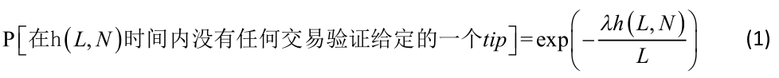
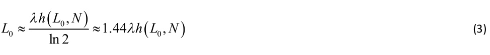
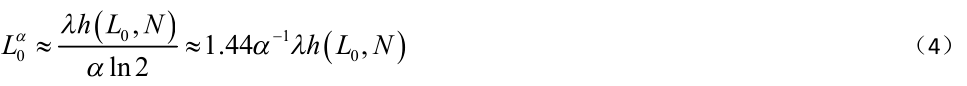
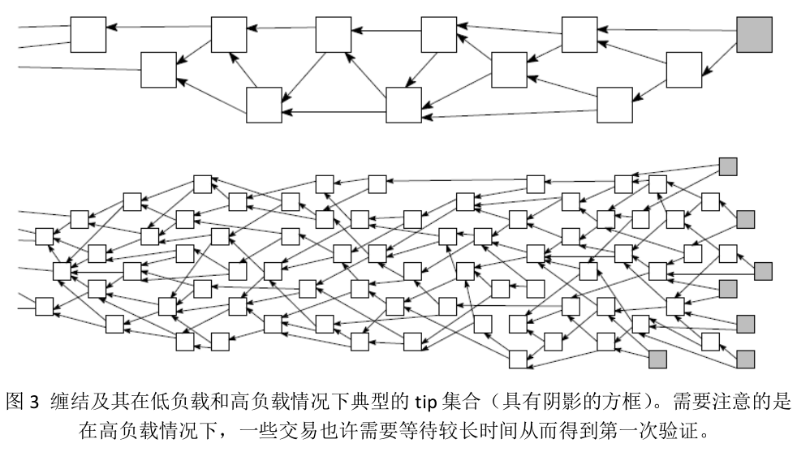
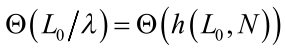
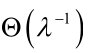
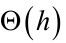
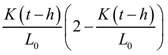
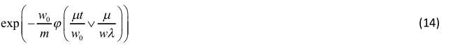

# 缠结

[TOC]

## 摘要

在本论文中我们分析了 IOTA（一种用于物联网 IOT 行业的加密货币）中所使用的主要技术。该技术作为区块链技术的下一个延续发展阶段，具有在全球范围内实现小额支付的特征。

## 1 系统的一般介绍

在过去的六年中比特币的兴起和成功证明了区块链技术的价值所在。然而，这种技术也有许多缺点，阻碍了它成为全球范围内加密货币的唯一平台。在这些缺点中，特别值得提及的就是比特币无法进行小额支付，而小额支付在迅速发展的物联网行业中的重要性不断增加。这就需要寻找一些完全不同于基于比特币和其他加密货币的区块链技术的解决方案。在本论文中，我们提出了一个称之为IOTA 的加密货币系统，可用于创建全球范围内基于现有硬件的物联网系统中的一种货币。

在一般情况下，IOTA 按如下方式运行。如前所述，不存在全局的区块链，这里是一个 DAG（有向无环图），也称之为 Tangle（缠结）。通过节点发出的所有交易构成了这个有向无环图 DAG 的集合。这个图中的边是这样形成的：当一个新的交易到达，它必须验证之前的两个交易，这些验证关系就通过有方向的边来表示，如图 1 所示（在图中，时间走向总是从左到右）。如果从交易 A 到交易 B之间至少有两个有向边的路径存在，我们就说交易 A 间接地验证了交易 B。我们假定节点检查认证的交易是否存在冲突，同时节点不会直接或者间接地认证具有冲突的交易。其想法是随着交易被越来越多的直接或者间接的交易所验证，这个交易就会被系统所接受；换句话说，要接受一个双花交易是极为困难的（或者至少在实践上是几乎不可能的）。

在随后的章节中，我们要讨论选择两笔交易予以接受纳入系统的算法，用于衡量整体交易的验证算法（第 3 节，尤其是 3.1 节），以及可能会受到的攻击情况（第 4 节）。另外，如果读者对文中的一些公式有所恐惧的话，可以直接忽略并跳转到相应章节中的“结论”部分。

此外，应该指出的是，有关有向无环图在加密货币领域中的想法已经有一些时日了，比如文献[^1],[^2],[^3],[^4]。尤其需要指出的是，文献[2]中提出了一种类似于我们的解决方案。

## 2 权重及相关概念

在这里，我们定义一个交易的自身权重及其相关概念。交易的权重与发送这笔交易的节点所投入的工作量成正比；在实践中，权重可以假定为 3 n 的一些数值，其中 n 属于可以接受的具有非空间隔的正整数。

我们所需要的一个重要符号就是一个交易的 累积权重：它被定义为这个交易的自身权重与其他直接以及间接验证这个交易的所有交易的自身权重之和。累积权重的计算方法如图 1 所示。其中方框代表交易，方框右下角较小的数字表示这个交易的自身权重，而字体较大且加粗的数字是这笔交易的累积权重。例如，交易 F 经交易 A, B, C, E 直接或者间接被验证。交易 F 的累积权重就是交易 A, B, C和 E 的各自自身权重之和，即 9 = 3 + 1 + 3 + 1 + 1。

在图 1 中没有被验证的交易（即“tips”）只有交易 A 和交易 C。若一个新的交易 X 进入系统并且对交易 A 和 C 进行了验证，那么交易 X 就是 系统中唯一的tip 了，同时系统中其他所有的交易的权重增加 3（即交易 X 的自身权重）。

为讨论验证算法，我们需要引入一些其他的变量。首先，对于缠结中的一个
顶点（比如，一笔交易），我们引入它的：

- **高度** ，定义为自创世交易至当前这个交易的所有路径中最长的长度；
- **深度** ，定义为自这个交易到某个 tip 尖端的最长路径；

比如，在图 2 中，交易 G 的高度为 1，深度为 3（因为反向路径 F, B, A）；而交易 D 的高度为 2，深度也为 2(译者注：根据论文这个版本中关于高度和深度的定义，译者认为高度为 3，深度为 2；关于高度和深度可参考作者向 Ledger 杂志投稿论文的最新定义)。接下来，我们引入积分的符号。一笔交易的积分定义为它的自身权重与所有它验证的那些交易的自身权重之和，如图 2 所示。同样的，仅有的 tips 有交易 A 和 C。交易 A 直接或者间接地验证了交易 B, D, F, G ， 因此交易 A 的积分为 1+3+1+3+1 = 9。类似地，交易 C 的积分为 1 + 1 + 1 + 3 + 1 = 7。

## 3 系统的稳定性和截断集合

记$L(t)$为 t 时刻系统中 tips 的总数。当然，大家期望随机变量$L(t)$保持稳定（更精确地说是正递归的）。直观上，$L(t)$应当围绕一个恒定的常数波动，而不是趋于无穷大（这样的话系统中会存在大量未经验证的交易）。

为了分析$L(t)$的稳定性，我们需要一些前提假设。假设λ为交易输入流的速率（泊松分布）；为简单起见，我们假定交易输入流的速率保持恒定。假设所有的设备都大概具有同等的计算能力；并假定系统总交易数为 $N$，其中 $L$ 个未经验证的情形下，一台设备要发送一笔交易所需要的平均时间为$h(L,N)$。首先我们考虑如下的一种策略，即在要发送一笔交易的时候，节点从$L$个 tips 中随机任意选择两个并验证它们。在这种策略下，可以假定不同 tips 的验证到达时间是相互独立的，那么有速率$\lambda/L$（可参考文献[^5]中的定理 5.2）。因此，

这意味着在我们的设备发起交易时，tips 总数所增加的期望值等于

（在上面的公式中，“1”对应于通过这笔交易所创建的新 tip，而第二项是被“擦去”的 tips 的期望值）。现在可以看到， $L(t)$实际上是在空间$N=\{1,2,3,...\}$上近邻之间进行转换的一个连续无规行走。如果所选择的两个交易已经被其他交易所验证，那么这个过程就接下来往左跳转一步；如果所选择的两笔交易都没有被验证，那么接下来就往右跳转一步；除此之外最后的可能性就是保持在原地。

接下来，为理解这个过程的一般行为，我们注意到公式（2）中的漂移项在L较小的时候为正数，而在L较大的时候为负（至少在 $L → ∞$ 时， $h(L,N)=o(L)$；或者只需要假设对计算和交易扩散的主要献不是来自于对 tips 的处理）。在公式（2）趋于零时，$L $得到典型值，即$L_0$，

很显然，上面所定义的$L_0$也就是 tips 的典型数量。同时，一笔交易被首次验证所需要的时间大概估计就是$L_0/\lambda$ 。

同时，注意到（至少在交易节点试图验证 tips 的情况下）对任意固定 t 时刻，在某一个阶段$s∈[t,t+h(L_0,N)]$内那些 tips 构成了一个截断集合，意味着在时间$t' > t$时发起的交易到创始交易的任何路径都必须通过这个集合。至少在某些偶然的情况下这个截断集合的大小变得非常小，这是极为重要的。我们也许可以使用这个较小的截断集合作为检查点，作为 DAG 可能的剪枝或者用做其他用途。

上述“纯随机”策略在实际中不是很好，因为这种策略不鼓励节点去验证交易：比如“较懒”的用户也许总是去验证几个较早的固定交易（因此也就对最新交易的验证不做贡献），而这种行为也不会受到惩罚。为消除这类行为，我们需要采用一种策略，以便使得新的交易偏向于验证那些具有较高积分的 tips。

如下是上述策略的一个例子。选取一个固定的参数$α∈(0,1)$，然后基于 tips的积分在最前面$αL$个 tips 中间任意选取两笔交易。与前面策略中的案例进行相同的分析，于是可以得到这个 tips 集合的典型大小为

因此，在这种情况下，求解一笔交易第一次被验证所需要的时间的期望值，就有一点复杂了。我们分两个区间进行分析，如图 3 所示。

- 低负载区：交易流足够的慢，因此即使 tips 数量相当小，也不太可能发生不同的交易验证同一个 tip 的情况。
- 高负载区：交易流足够大，因此 tips 保持较大的数量。

在低负载区域，这种情况就相对简单：在$λ^{-1}$的时间尺度上会发生第一次验证，
因为第一个（或者第一批中的一个）进入的交易将会验证我们的这些交易。

现在我们来考虑高负载区域的情况。首先，对于那些没有进入前 $αL$ 个 tips的交易，他们的等待时间将会非常长，大概需要的时间尺度为（因为对于较小的 $L$ 值来说，有一个趋向于$L_0^(α)$的偏移，同时 tip 集合的大小需要变得比$L_0^(α)$还要小，这样才能有被验证的机会）。因此，在这种情况下，一个较好的策略就是这笔交易的发送者重新发送一笔空白交易，并且指向和验证前面自己的交易，并希望这个新的交易进入前$αL$个 tip 之中。同样的，类似于上面的情况，另一个比较容易的策略就是选择，比如 5 个随机 tips（在所有的 tips 之中选择），然后对这 5 个 tips 中的最前面的 2 个 tips 进行验证。同样地，如果你的交易在时间尺度内没有被验证，一个好的办法就是发起一个新的空白交易并去验证和推广这笔交易。

我们也注意到上述验证策略可以进行进一步地改进，以便于防止垃圾信息攻击。举例来说，节点可以偏向于验证那些自身具有较大权重的 tips，从而使得攻击者的垃圾信息交易更加不容易被验证。

接下来，注意到基于高度和积分的验证策略可能会受到特定类型的攻击，见4.1 节分析。我们将在那一节中讨论更加详细的策略来防止这样的攻击。无论如何，这种最简单的 tip 选择策略（“随机验证两笔交易”）仍然是值得考虑的，因为这对于分析来说最简单，从而也许会给出系统行为方面的一些定性和定量方面的理解。

结论 ：

1. 我们区分了两个区间，低负载和高负载区间，如图 3 所示。
2. 在低负载区，通常没有多少 tips（比如说，一个或者两个），一个 tip 在时间尺度内得到第一次验证，其中 λ 是进入系统内的交易流速度。
3. 在高负载区，tips 的典型数量取决于验证策略（比如，新的交易如何选择其他的两个交易进行验证）。
4. 对于“随机验证两个 tips”策略，tips 的典型数量由公式（3）确定。可以看到这种策略在 tips 的典型数量上是理想的，但是在实际中不会选用这种策略，因为这种策略不会鼓励新的交易去验证 tips。
5. 对于“随机验证前$αL(t)$个 tips 中的两个 tips”这种策略方案（没有前面那种策略的劣势），其典型的 tips 数量由公式(4)确定。
6. 然而，我们需要更多精细的策略，这类策略将在 4.1 节中进行讨论。
7. 在高负载区，一个 tip 获得验证所需要的时间尺度为，其中 $h$ 是一个节点的平均计算/传播扩散时间。但是，如果在上述时间间隔内没有获得第一个验证，那么（对于交易发送者或者交易接收者）一个好的方法就是额外发送一笔空白交易来提高验证速度。

### 3.1 累积权重的增长有多快 ？

在低负载区，交易被验证几次后，它的累积权重将以 $λw$ 的速度增加，其中$w$是一个普通交易的平均权重，因为本质上来说所有新的交易都将间接指向我们的交易。
在高负载区，就如上述所观察到的一样，如果交易足够老并且具有较大的累积权重，那么其累积权重就会同样地以 $λw$ 的速度增加。当然，我们看到刚开始的时候交易需要等待一定的时间被验证，很显然其累积权重在初始时会以较为无规的形式增长。为了弄明白一个交易在得到几个验证之后其累积权重的变化行为，我们记 $H(t)$（为简单起见，我们自交易创建开始计时）为 $t$ 时刻该交易的累积权重期望值，并用 $K(t)$ 表示在 $t$ 时刻验证我们的这笔交易的 tips 数量的期望值。在此，我们简记为 $h:=h(L_0,N)$ 。同时，我们做一个简化假设，认为 tips 的总数大体保持恒定不变（等于$L_0$ ）。这里我们采用“随机验证两个 tips”的策略；可期望其结果大体上与“随机验证前$αL(t)$ 个 tips 中的两g个 tips”策略所得到的一样。

在 $t$ 时刻进入系统中的一笔交易通常是基于 $h(t)$ 时刻时系统的状态，来选择两笔交易进行验证。不难得到至少验证一个 tip 的概率是
。

因此我们可以写下如下的微分方程（类似于文献[^5]中的例子 6.4）：

为了能够使用方程(5)，我们首先需要计算 $K(t)$ 。如何立刻去计算 $K(t)$ 是很困难的，因为在 $t - h$ 时刻的一个 tip 也许在 $t$ 时刻已经不是一个 tip，并且，在新进入的交易验证了这样一个 tip 的情况下，那么验证原来交易的 tips 总量就会增加 1个。现在，根据（1）和（3）可以观察到关键的问题是在 $t - h$ 时刻的一个 tip 在$t$ 时刻仍然保持为 tip 的概率为 $1/2$。因此，在 $t$ 时刻，有 $K(t - h)$ 的一半的“以前”的 tips 仍然保持为 tips，而另一半已经至少被一笔交易所验证。让我们用 A表示（大概）在 $t - h$ 时刻 tips 中的 $K(t - h)/2$ 在 $t$ 时刻仍然保持为 tips 的这些交易的集合，而用 $B$ 表示另外一半已经被验证过的 tips。假定新进入的交易至少验证了集合 $B$ 中一笔交易而没有验证集合 $A$ 中任何交易的概率为$p_1$ ；同时假定同时验证了集合 $A$ 和 集合 $B$ 中的交易的概率为$p_2$ 。显然，$p_1$ 和$p_2$ 分别对应于在新交易到达时，目前“我们”的 tips 增加或者减少 1 的概率。因此，得到一些基本关系式：

仍然很难准确地求解方程（6），因此我们进一步进行简化假设。首先，我们可以看到，对于任意固定 $ε > 0$ , 在当 $K(t)$ 达到 $εL_0$ 水平之后， $K(t)$ 将会迅速增长到$L_0$ 。现在，当 $K(t)$ 相对于$L_0$ 非常小的时候，我们可以舍弃掉方程（6）右边最后一项。同时，用$K(t)-h\frac{dK(t)}{dt}$代替 $K(t-h)$ ，我们可以得到方程（6）的简化版（记住 $\frac{λh}{L_0} = ln2$):

$$
\frac{dK(t)}{dt} \approx \frac{\lambda}{1+ln2} \approx 0.59 \frac{\lambda K(t)}{L_0}) \tag{7}
$$

其中边界条件为 $K(0) = 1$ 。求解上述微分方程可以得到

$$
K(t) \approx exp(\frac{tln2}{(1+ln2)h}) \approx exp(0.41\frac{t}{h}) \tag{8}
$$

因此，对（8）式取对数，我们得到 $K(t)$ 达到 $εL_0$ 的时间大概是：

再回到方程（5）（并且，如前面一样，舍弃掉右边最后一项），我们可以得到在“调整阶段”（例如，在 $t <= t_0$ 的时候，$t_0$ 为（9）式的结果）具有如下方程：

$$
\frac{dH(t)}{dt} \approx \frac{2w\lambda}{L_0exp(\frac{ln2}{1+ln2})}K(t) \approx \frac{2w\lambda}{L_0exp(\frac{ln2}{1+ln2})}exp(\frac{tln2}{(1+ln2)h})
$$

因此，

$$
H(t) \approx \frac{2(1+ln2)w}{exp(\frac{ln2}{1+ln2})} exp(\frac{t ln2}{(1+ln2)h}) \approx 2.25w exp(0.41\frac{t}{h}) \tag{10}
$$

在此提醒读者，如前述所讨论的，在调整阶段之后，累积权重 $H(t)$ 会随着速度 $λw$ 线性增长。我们需要强调的是在（10）式中的指数增长并不意味着在调整阶段累积权重增长十分的迅速，图 4 中给出了其图像。同时，我们认为这一节中的计算在节点平均指向 $s > 1$ 笔交易的情况下，也可以很容易地进行调整。在那样的情况下，只需要在（2）中将 2 用 $s$ 代替（但是在（5）中不可以），并在（3）~（4）和（7）-（10）中把 $ln 2$ 替换为 $ln s$ 。

结论

1. 在低负载区，在我们的交易被验证过几次之后，其累积权重将以 $λw$ 的速度增长，其中 $w$ 是一笔普通交易的平均权重。
2. 在高负载区，同样的，在我们的交易被验证过几次之后，其累积权重在所谓的调整区间按照公式（10）不断加速增长，而在调整阶段完成之后，其增长速度为 $λw$ ，如图 4 所示。事实上，对于任何合理的策略，交易的累积权重经过调整阶段之后，都将以上述速度增长，因为本质上来说，所有新进入系统的交易都将间接验证我们的交易。
3. 可以想象调整阶段就是直到大部分的 tips 都间接验证我们的交易的时候。公式（9）中给出了典型的调整阶段时间。

## 4. 可能的攻击情况

让我们在下面描述一个攻击方案：

1. 攻击者付款给商家，在商家认为交易已经获得了足够大的累积权重之后，攻击者拿到了商品；
2. 接下来攻击者签发了一笔双重支付的交易；
3. 攻击者同时发送大量较小的交易（非常之多，使用它所有的计算能力），这些交易不去直接或者间接验证原始的付款交易，而是去验证那笔双重支付的交易；
4. 可以看到攻击者也许就拥有大量的女巫攻击身份，并且不对 tips 进行验证；
5. 在第 3 步中，也可以采用另外的一种方案，攻击者使用所有它的计算能力去发送一笔“大”的双重支付交易（比如，具有非常大的自身权重），并在原始付款交易之前对大量的交易进行验证；
6. 攻击者期望他的 sub-DAG 超越主体 DAG，从而使得 DAG 持续从攻击者的双重支付交易进行增长，以便使得之前合法的支付交易被抛弃掉（如 5 所示）。事实上，接下来我们可以看到这种大的双重支付交易策略可以增加攻击者成功的几率。而且，在这种数学模型的“理想”情况下，这种攻击总是可以成功的。

假定 $W^n$ 为获得权重为 $3^n$ 的双重支付交易的 nonce 的时间。我们可以假设 $W^n$ 是一个以 $μ3^{-n}$ 为参数（比如，期望值为 $μ3^{-n}$ ）的指数分布的随机变量，其中 $μ$ 表征攻击者的计算能力。

假设商家在一笔合法交易的累积权重达到至少 $w_0$ （这对应这笔原始交易经过 $t_0$ 个时间单位）之后才被接受，因此可以认为其累积权重将以线性速度 $λw$ 增长，其中 $λ$ 是系统中交易（由诚实用户发送的交易）的总体到达速率，而 $w$ 是一般交易的平均权重。记 $w_1 = λwt_0$ 为在商家接受交易时合法分支的典型总的权重。

假设 $[x]$ 是大于或等于 $x$ 的最小整数，定义，那么 $3^{n_0}>= w_1$（事实上，如果 $w_1$ 较大，$3^{n_0} \approx w_1$ ）。如果在$t_0$ 时间间隔内，攻击者设法获得了一个 nonce以使得权重至少为 $3^{n_0}$ ，那么攻击就成功了。这种成功攻击的概率是
![P[w<t0]](media/IOTA白皮书-P[wt0].png)

（至少在  很小的情况下，这是合理的假设）。然而，如果这种“立刻”攻击没有成功的话，攻击者可以继续寻找 nonce 以使得权重为 $3^n$ ，其中 $n>n_0$ ，并希望在找到 nonce 的时候，合法交易分支的总权重要小于 $3^n$ 。这种情况的概率是

也就是说，尽管$\frac{\mu}{\lambda\omega}$一般情况下应该是很小，在每一个 $n$ 值水平下，攻击成功具有恒定的概率。因此，最终总是可以攻击成功。事实上，攻击成功的典型耗时大概是$3^{\lambda\omega/\mu}$。尽管这个数量也许非常大，但是“第一次”（在时间$t_0$内）成功攻击的概率依然不会很小。因此我们得到如下的结论：我们需要对策（如前面第3 节所提到的，后面的那种策略也许不是最好的方案，因为那样不能为垃圾交易攻击提供足够的保护）。

那么现在我们来讨论当最大权重具有上限，比如说上限为 $m$ 的时候，估算攻击成功的概率。

根据上述讨论（同时根据大偏差定理[^6]的一般直觉），如果攻击者想要追上主链的话，他仅仅需要发送具有最大许可权重的交易。假设给定的一笔交易在发送后经过$t_0$时间单位后，获得累积权重为$\omega_0$ ，并假设这笔交易的调整阶段已经结束，因此其累积权重以 $\lambda\omega$ 的速度线性增长。现在，攻击者试图对这笔交易进行双花攻击；因为在第一笔交易发送的时候，他私下秘密准备了双花交易，并且开始生成其他具有权重为 $m$ 的交易来验证这笔双花交易。如果在一定的时候（在商家决定接受第一笔合法的交易之后），攻击者的 Subtangle 的权重要大于合法交易Subtangle 的权重的话，双花攻击就会成功。如果上述条件不成立的话，那么双花交易就不会被其他交易验证（因为合法的交易将获得更多的累积权重并且所有新的 tips 都会间接验证这笔交易），因此双花交易也就成为了孤立交易了。

如前所述，假定 $\mu$ 为攻击者的计算能力。假定$G_1,G_2,G_3,{\ldots}$是以$\mu/m$为参数（期望值为$m/\mu$ ）的独立同分布的指数分布变量，并记$V_k = \frac{\mu}{m}G_k, k>=1$ 。很显然，$V_1,V_2,V_3,{\ldots}$是以 1 为参数的独立同分布的指数分布的变量。

假设在$t_0$ 时刻商家决定接受交易（记住这时这笔交易的累积权重为$w_0$）。让我们来估算一下攻击者成功完成双花攻击的概率。记$M(\theta) = (1-\theta)^{-1}$是以 1 为参数的指数分布的随机变量的生成函数的矩（参考文献[^7]中 7.7节）。对于$\alpha \in (0, 1)$，于是有如下公式成立（除了一般教科书[^6]之外，同时可参考文献[^7]中 8.5 节的引
理 5.2，尽管其中并没有解释为什么不等式是那样的，事实上是一个近似等式）:

$$P[\sum_{k=1}^nV_k <= \alpha n] \approx exp(-n\psi(\alpha)) \text{(11)}$$

其中$\psi(\alpha) = - ln\alpha + \alpha - 1$是对$lnM(-\theta)$的拉格朗日变换。请注意，作为一个一般事实，对于任意$\alpha \in (0,1), \psi(\alpha) > 0$是成立的（想象指数随机变量 Exp(1)的期望值等于 1）。

假定$\frac{\mu t_0}{w_0} < 1$（否则，攻击者的 Subtangle 最终超过合法交易的概率就接近于1）。现在，为了在$t_0$时刻超过$w_0$，攻击者需要在$t_0$时间单位内至少发送具有$w_0/m$笔权重为 $m$ 的交易。因此，通过公式（11），我们可以得到双花交易在$t_0$时刻有更大累积权重的概率大概是
![P[Gk]](media/IOTA白皮书-P[Gk].png)

也就是说，上述概率非常小，我们通常需要的$\frac{w_p}{m}$是相当大，并且$\phi(\frac{\mu t_0}{w_0})$不能很小。

类似地，双花交易在$t >= t_0$时具有更大的累积权重的概率大概是

注意到，通常我们有$\frac{\mu t_0}{w_0} >= \frac{\mu}{w\lambda}$（因为在调整阶段，累积权重增长的速度小于 $\lambda w$）。
无论如何，可以得到成功进行双花的概率大概为

其中$a \bigvee b := max(a, b)$。比如，假设$m=w=1,\mu = 2,\lambda=3$（因此攻击者的计算能力只是比网络中其他算力稍微小一点点）。假设在时间 12 的时候，交易获得累积权重为 32。那么，$\frac{\mu t_0}{w_0} \bigvee \frac{\mu}{\lambda w} = \frac{3}{4}, \phi(\frac{3}{8})\approx0.03768$，公式（14）给出的上限大概是 0.29.然而，我们假设 $\mu=1$（并保持其他参数不变），那么$\frac{\mu t_0}{w_0} \bigvee \frac{\mu}{\lambda w} = \frac{3}{8}, \phi(\frac{3}{8})\approx0.03558$，公式（14）得到大约是 0.00001135，确实有很大的变化。

通过上述讨论，我们观察到很重要的一点就是，为了系统的安全，必须确保$\lambda w > \mu$ ，（否则，公式（14）的估算就没有什么用）；比如，系统中诚实交易的输入相对于攻击者的计算能力要足够的大。这也意味着在 IOTA 的早期，需要额外的安全措施（比如检查点的方式）。

同时，对于如何决定两个相互冲突的交易中哪一笔是合理的交易的策略来说，在使用累积权重的时候我们必须十分小心谨慎。这是因为可能受制于在 4.1 节中所描述的类似的攻击（攻击者也许会提前准备好双花交易，构建一个Subchain/Subtangle 来指向验证这笔双花交易，然后在商家接受交易之后将这个Subtangle 广播出去）。然而，在下一节中我们将提出一个更好的方法来处理两笔相互冲突的交易：运行 tip 选择算法，然后看这两笔交易中哪一笔交易（间接）被选取的 tip 所验证。

### 4.1 寄生链攻击

考虑图 6 中的如下攻击：攻击者秘密创建一个链/Subtangle，并偶尔指向验证主网络，从而获得更多的积分（注意好的 tips 的积分大概是主网络中所有自身权重之和，而攻击者的 tips 还包含寄生链中所有的自身权重）。同时，对于单独创建这个链的攻击者来说，他有足够强大的计算机，网络延迟不是问题，因此攻击者能够获得到寄生 tips 具有更高高度的寄生链。最后，只要诚实节点所使用的选择策略是在已有的 tips 中进行一些简单选择的话，攻击者的 tips 数量在攻击的时候可以任意增加。

为防御这种攻击，我们基于主 tangle 中具有更多活跃的哈希算力的事实，因此相对于攻击者来说，可以使得更多的交易获得更多的累积权重。算法的核心思想是使用 MCMC（马尔科夫蒙特卡洛）算法来选择两个 tips。

假设某一笔交易当前的累积权重为$H_x$，为简单起见，假定所有自身权重等于 1；因此 tip 的累积权重总是 1，而其他交易的累积权重至少是 2。
具体算法描述如下：

1. 考虑累积权重在 $L$和（假定） $2L$之间的所有交易（其中 $L$ 是很大的一个数，数值待定）；
2. 独立选择放置$N$ 个交易（$N$ 不是很大，比如说为 10）；
3. 那些交易将进行离散时间无规行走到 tips（比如，当且仅当 $y$能够验证 $x$，就可以从 $x$ 转到$y$）；
4. 两步行走能到达开始设定的 tip 的话，这就意味着这是我们要进行验证的两个tips；
5. 无规行走转移概率按如下方式进行定义：如果 $y$验证 $x$（我们记做$y \rightarrow x$ ），那么转移概率$P_{xy}$是正比于$exp(-\alpha(H_x - H_y))$，也就是

其中$\alpha > 0$是一个待选取的参数（可以从$\alpha=1$开始）。需要注意的是这个算法是局域性的，我们不需要遍历到创始交易来计算所有的东西。

为了说明这个算法如我们所想象的那样工作，首先考虑那些“懒惰的 tips”（那些故意认证一些较早的交易以避免进行交易的验证），如图 6 所示。注意到，即使某个交易被这样的一个 tip 所验证，也不太可能使得懒惰的 tip 被选中，因为从公式（15）可见累积权重差异非常大。

接下来，考虑如下的攻击：攻击者秘密地构建一条链（“寄生链”），其中包含一笔交易用来从他的一个账户清空转移到他控制的另一个账户中（如图 6 中左边的红色圆点）。在某一个时刻，攻击者在主 tangle 中发起另一笔交易（如图 6中另一个红色圆点），并等待直到商家接受它。寄生链偶尔验证指向主 tangle（因此得名），从而使得它具有很好的高度和积分（甚至比主 tangle 还要好），尽管其累积权重并不是特别大。同时注意到寄生链在商家的交易之后不能够再验证指向主 tangle了。而且，攻击者也可以试图在他攻击的时候人为地任意增加他的 tips，如图 6 所示。攻击者的想法和目标是要使得其他交易来验证和指向寄生链，从而使得“好的”tangle 被孤立掉。

现在可以很容易地看到为什么马尔科夫蒙特卡洛选择算法具有很高的概率不去选择攻击者的 tips 中的任何一个。这个算法也同样不会去选择那些“懒惰”的 tips，其原因基本上是一样的：寄生链上的交易相比于那些他们指向的主 tangle上的交易的累积权重要小得多。因此，无规行走不是很可能跳转到寄生链（除非从寄生链开始，但是这也是很不可能的，因为主 tangle 包含更多的交易）。

同样，转移概率也不一定如（15）那样所定义的一成不变。除了指数函数外，我们还可以选择其他衰减更快的函数，比如$f(s) = s^{-3}$。

### 4.2 分裂攻击

针对 MCMC 算法的如下攻击策略由 Aviv Zohar 提出。在高负载区，攻击者可以试图将 tangle 分裂成两个分支，并在这两个分支中均保持自己的余额，从而两个分支继续增长。为避免这种情况，诚实的节点会同时指向两个分支（有效地合并两个分支），攻击者则必须在分裂开始的时候放入至少两个相互冲突的交易。然后，他/她就希望大概网络中各一半的交易贡献给两个分支，从而可以“补偿”无规涨落，即使他所拥有的只有相对较小的计算能力。这样，攻击者就可以在两个分支中都可以使用这笔资金。

为了抵抗这种攻击，我们需要使用一些“高门槛”的规则（类似于比特币中选择最长的链）来使得同时维持两个分支上的余额是十分困难的。比如，假定一个分支具有总的权重（或者是其他我们可以使用的计量方式）为 537，而另一个分支的总权重与此十分接近，比如说为 528。如果在这种情况下，一个诚实的节点选择第一分支的概率就非常接近于 1/2，这样很可能攻击者也可以在两个分支中都保持账户余额。然而，如果诚实节点偏向于第一分支的概率比 1/2 要大很多的话，那么攻击者就很难维持两个分支的余额，因为经过不可避免的无规涨落，网络会迅速选择其中的一个分支，而抛弃掉另一个分支。很显然，为了使得 MCMC算法具有这样的行为，我们需要选择一个迅速衰减函数 $f$，并且在一个相对较大深度的节点开始进行无规行走（这样就可以极大可能性地在网络分裂之前启动无规行走）。这种情况下，无规行走就会有很大概率选择“较重”的分支，即使两个分支的权重差很小。

当然，也可以考虑其他改进的 tip 选择算法。比如说，如果一个节点看到两个大的 Subtangles，那么就选择其中自身权重之和较大的一个分支，然后进行上述的 MCMC 算法。

而且，如下思路也许值得考虑： 设想在（15）中的转移概率不仅仅与$H_x - H_y$相关，而且还依赖于$H_x$，这样接下来的马尔可科夫链在无规行走的时候进入较深的 tangle 中（避免进入较弱的分支）就近乎是确定性的，而当接近于 tips 的时候，无规行走就更分散一些（因此也就有足够的随机性来选择两笔交易进行验证）。

结论 ：

1. 在攻击者试图超越网络进行双花交易时，我们考虑了几种攻击策略。
2. “大权重”攻击意味着，为了进行双花，攻击者试图发起一笔大权重双花交易，从而超过合法的 Subtangle。这种攻击在交易的自身权重不设上限的情况下，对于网络的确是一个威胁。因此，为了解决这个问题，我们可以限制交易的自身权重上限，或者将自身权重设为常数。
3. 当交易自身权重最大值为 $m$ 的时候，攻击者最好的策略是发起和生成的每笔交易都具有最大权重值，并且指向验证双花交易。如果交易输入流中的诚实交易相比攻击者的计算能力要足够大的时候，那么双花交易具有更多的累积权重的概率可以通过公式（14）来进行估计（同时也可以参考（14）下面的例子）。
4. 构建“寄生链”的攻击可以使得基于高度和积分的验证策略无效，因为攻击者可以得到比合法 tangle 更高的积分。与此相反，4.1 节中描述的马尔科夫蒙特卡洛 tip 选择算法可以抵抗这种攻击。
5. 此外，上述方法还可以抵抗“懒惰节点”，也就是那些仅仅验证很早之前的交易，而避免进行必要的计算来验证 tangle。

### 4.3 抵抗量子计算

众所周知（今天仍然只是假设），足够大的量子计算机在解决那些只能通过猜测结果并重复进行检验的问题时具有极高的效率。为生成一个比特币区块而寻找 nonce 就是这类问题中的一个很好的例子。在目前，平均来说必须查找$2^68$ 个nonces 从而找到一个合适的哈希值来生成区块。众所周知（例如文献[^8]）量子计算机在解决上述类似的问题时的复杂度为$\bigodot(\sqrt{N})$，而对于常规经典计算机其复杂度则是$\bigodot(N)$。因此量子计算机在比特币挖矿方面相比常规的矿机具有$\sqrt{2^68}=2^34=170$亿倍的效率。同时，请注意，如果区块链在面对哈希运算能力增加的时候不能够同时增加挖矿难度的话，那么这就将导致大量孤快的增加。

基于相同的原因，我们可以看到上述所描述的“大权重”攻击在量子计算机上同样具有更高的效率。然而，前面所讲的权重上限设置（如第 4 节所建议的）因为如下的理由，可以有效地抵抗量子计算机的攻击。在 IOTA 系统中，为发送交易而需要寻找合适的哈希时，其寻找的 nonces 空间并不是很大，大概最大仅仅是$3^8$。因此对于一个“理想”的量子计算机来说，其效率的提高也就在$3^4=81$倍这个数量级，这相对来说是可以接受的（记住$\bigodot(\sqrt{N})$也许意味着大概是$10\sqrt{N}$）。而且，在 IOTA 的算法中，发送交易的时候，寻找 nonce 所需要的时间不比其他任务所需要的时间多很多，而后面提到的那部分任务相对来说是更容易抵抗量子计算机的。

因此，上述讨论表明 Tangle 相对于（比特币）区块链来说提供了更好的抵抗量子计算机的技术。

## 参考文献

[^1]: people on nxtforum.org (2014) DAG, a generalized blockchain.h<ttps://nxtforum.org/proof-of-stake-algorithm/dag-a-generalized-blockchain/(registration at nxtforum.org required)>

[^2]: Sergio Demian Lerner (2015) DagCoin: a cryptocurrency without blocks. <https://bitslog.wordpress.com/2015/09/11/dagcoin/>

[^3]: Yonatan Sompolinsky, Aviv Zohar (2013) Accelerating Bitcoin's Transaction Processing. Fast Money Grows on Trees, Not Chains. <https://eprint.iacr.org/2013/881.pdf>

[^4]: Yoad Lewenberg, Yonatan Sompolinsky, Aviv Zohar (2015) Breaking free from chains: "Secure chainless" protocols for Bitcoin. <https://dl.dropboxusercontent.com/u/7426164/Bitcoin/> Bitcoin meetup Chainless.pptx

[^5]: Sheldon M. Ross (2012) Introduction to Probability Models. 10th ed.

[^6]: Amir Dembo, Ofer Zeitouni (2010) Large Deviations Techniques and Applications. Springer.

[^7]: Sheldon M. Ross (2009) A First Course in Probability. 8th ed.

[^8]: Gilles Brassard, Peter Hyer, Alain Tapp (1998) Quantum cryptanalysis of hash and claw-free functions. Lecture Notes in Computer Science 1380, 163-169.
