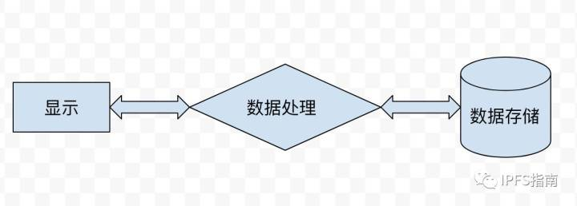

# 什么是IPFS
[TOC]

原文链接
- [什么是IPFS-1](https://zhuanlan.zhihu.com/p/32615963)
- [什么是IPFS-2](https://zhuanlan.zhihu.com/p/32633235)

## 1 什么是IPFS

星际文件系统(InterPlanetary File System). IPFS 是一个分布式的web, 点到点超媒体协议. 可以让我们的互联网速度更快, 更加安全, 并且更加开放. **IPFS协议的目标是取代传统的互联网协议HTTP**。

## 2 为什么有IPFS

众所周知, 互联网是建立在HTTP协议上的. HTTP协议是个伟大的发明, 让我们的互联网得以快速发展.但是互联网发展到了今天HTTP逐渐出来了不足.

**HTTP的中心化是低效的, 并且成本很高**

使用HTTP协议每次需要从中心化的服务器下载完整的文件(网页, 视频, 图片等), 速度慢, 效率低. 如果改用P2P的方式下载, 可以节省近60%的带宽. P2P将文件分割为小的块, 从多个服务器同时下载, 速度非常快.

**Web文件经常被删除**

回想一下是不是经常你收藏的某个页面, 在使用的时候浏览器返回404(无法找到页面), http的页面平均生存周期大约只有100天. Web文件经常被删除(由于存储成本太高), 无法永久保存. IPFS提供了文件的历史版本回溯功能(就像git版本控制工具一样), 可以很容易的查看文件的历史版本, 数据可以得到永久保存

**中心化限制了web的成长**

我们的现有互联网是一个高度中心化的网络. 互联网是人类的伟大发明, 也是科技创新的加速器. 各种管制将对这互联网的功能造成威胁, 例如: 互联网封锁, 管制, 监控等等. 这些都源于互联网的中心化.而分布式的IPFS可以克服这些web的缺点.

**互联网应用高度依赖主干网**

主干网受制于诸多因素的影响, 战争, 自然灾害, 互联网管制, 中心化服务器宕机等等, 都可能是我们的互联网应用中断服务. IPFS可以是互联网应用极大的降低互联网应用对主干网的依赖. 

## 3 IPFS的目标

IPFS不仅仅是为了加速web. 而是为了最终取代HTTP协议, 使互联网更加美好

## 4 IPFS包含哪些内容

**IPFS是一个协议，类似http协议**

- 定义了基于内容的寻址文件系统
- 内容分发
- 使用的技术分布式哈希、p2p传输、版本管理系统

**IPFS是一个文件系统**

- 有文件夹和文件
- 可挂载文件系统

**IPFS是一个web协议**

- 可以像http那样查看互联网页面
- 未来浏览器可以直接支持 ipfs:/ 或者 fs:/ 协议 

**IPFS是模块化的协议**

- 连接层：通过其他任何网络协议连接
- 路由层：寻找定位文件所在位置
- 数据块交换：采用BitTorrent技术

**IPFS是一个p2p系统**

- 世界范围内的p2p文件传输网络
- 分布式网络结构
- 没有单点失效问题

**IPFS天生是一个CDN**

- 文件添加到IPFS网络，将会在全世界进行CDN加速
- bittorrent的带宽管理

**IPFS拥有命名服务**

- IPNS：基于SFS（自认证系统）命名体系
- 可以和现有域名系统绑定

## IPFS的的”宏伟”目标是取代HTTP, 那么先来看看IPFS是如何工作的?

1. IPFS为每一个文件分配一个独一无二的哈希值(文件指纹: 根据文件的内容进行创建), 即使是两个文件内容只有1个比特的不相同, 其哈希值也是不相同的.所以IPFS是基于文件内容进行寻址, 而不像传统的HTTP协议一样基于域名寻址.
2. IPFS在整个网络范围内去掉重复的文件, 并且为文件建立版本管理, 也就是说每一个文件的变更历史都将被记录(这一点类似版本控制工具git, svn等), 可以很容易个回到文件的历史版本查看数据.
3. 当查询文件的时候, IPFS网络根据文件的哈希值(全网唯一)进行查找. 由于每个文件的哈希值全网唯一, 查询将很容易进行.
4. 如果仅仅使用哈希值来区分文件的话, 会给传播造成困难, 因为哈希值不容易记忆, 就像ip地址一样不容易记忆, 于是人类发明的域名. IPFS利用IPNS将哈希值映射为容易记的名字
5. 每个节点除了存储自己需要的数据, 还存储了一张哈希表, 用来记录文件存储所在的位置. 用来进行文件的查询下载.

## IPFS是如何来解决HTTP这些缺点的?

### 1 下载速度快, 不再依赖主干网, 中心化服务器

整个IPFS系统是一个分布式的文件存储系统, 那么在下载相关数据的时候, 将从多个节点同时下载, 相比于HTTP从中心服务器的下载速度要快很多, 大家都用过P2P下载(比如: 迅雷, BitTorrent), IPFS下载过程跟这个类似.

### 2 存储空间变得非常便宜

由于IPFS使用的是区块链技术, 利用 Filecoin(为了的文章中会将如何获取filecoin, 也就是挖矿)来激励矿工分享自己的硬盘, 并且IFPS从全网去掉了冗余存储(从整个网络空间考虑, 这将大大节省网络存储空间), 将来的IPFS存储将会变得非常便宜(与我们现在的云盘, 各种中心化的CND相比较).

### 3 安全

中心化服务器目前很难抵挡DDoS攻击, 当大量的访问请求从四面八方涌来, 中心化的服务器几乎会在一瞬间瘫痪, 做过运维的同学应该深有感触, 比如每年双11, 不能睡觉的除了阿里, 腾讯的技术同学, 还有整个银行业的小朋友. 巨大的访问量随时可能造成服务器宕机. IPFS天生就拥有抵挡这种攻击的能力. 因为所有的访问将会被分散到不同的节点. 甚至攻击者自己也是节点之一. 某种程度上讲, IPFS甚至能抵挡量子计算的攻击.

###  4 开放

众所周知, 比特币是一种去中心化, 匿名的数据货币, 这些特性使得比特币无法被管制, 交易无法篡改. IPFS同样, 由于是建立在去中心化的分布式网络上的, 所以IFPS很难被中心化管理, 限制. 互联网将更加开放.

## IPFS都可以用来做什么?

如果你认为仅仅是CDN, 永久的web?

Are you kidding me ?

IPFS可是要

--改变世界的...

--变世界的...

--世界的...

--界的...

--的... 

我们来看看IPFS都可以用来干啥：

1. 在 /ipfs 和 /ipns 下面挂载全球文件系统：就是说我们所有的文件都可以存到上面.
2. 挂载个人同步的文件夹, 可以自动进行版本管理, 自动备份. 也就意味着未来我们将拥有无限空间的网盘, 不用担心数据丢失, 不用担心隐私泄露(非对称加密). 是不是想到了什么? 现在比较流行的某度 (曾经把大家自动备份的照片全部共享了, 各种艳照啊)和企鹅网盘, 国外的dropbox, 跟IPFS云盘相比, 都将变得微不足道 。
3. 作为加密文件和数据共享系统。IPFS天生视乎就具备这样的能力, 文件加密, 数据共享, 都是小菜一碟.
4. 作为带版本控制的软件包管理系统.
5. 作为虚拟机的根文件系统
6. 作为利用管理程序, 把IPFS作为虚拟机的引导文件系统：在线操作系统
7. 作为数据库：应用可以直接操作IPFS的Merkle DAG数据结构, 并且可以使用IPFS的版本控制, 缓存. 试想一下我们的数据库直接存在IPFS的文件系统是什么体验? 自动备份, 永不丢失, 安全加密, 无限空间, 高速连接, 想想就美好. 科技改变生活, 未来会有多美好....
8. 作为加密通讯平台，谁都别想窃听消息通信了
9. 作为加密CDN, 作为web的CDN, CDN功能全包了.
10. 永久web, 不存在不能访问的链接, 跟 404 说 byebye.

上面的应用场景是 IPFS的创始人 Juan Benet 在IPFS论文里面直接提到的. 有兴趣的同学可以去IPFS白皮书里面看一下。

实际上IPFS能做不仅仅限于这些场景. 我们所有的计算机系统几乎都是这种结构

IPFS为我们解决的是最后那一个部分：数据存储。它能够极大的降低数据存储的成本,提升数据下载速度。

> 世界发展的规律告诉我们, 凡是符合”共享的, 提升效率的”，一定是未来的趋势。
> 
> 从人类诞生之初, 我们的世界运转就围绕“共享”这个核心运行！！！
> 
> 为什么？ 因为共享是我们已发现最有效的提升资源配置、提升效率的方式之一，它已经植根于我们的基因当中了。
> 
> 记得有人写了本书叫做《共享经济》，作者是罗宾·蔡斯， 还有互联网腾飞的这几年， 各种把共享经济挂载嘴边的那些人（包括我自己）,都在讨论这个概念。
> 
> 然鹅事实上共享经济从人类诞生就开始了：
> 
> 国家就是一个最大的共享体， 我们要共享国防， 共享安全，共享一切。。。
> 城市是组成国家的共享体单位， 你的生存， 你的工作，无不是共享， 你乘坐的地铁，飞机，公交。你使用的自来水，电力等等， 哪一样不是共享的呢
> 所以“共享”是我们人类与生俱来的生存方式， 并不是互联网的东西， 互联网探讨的共享经济只不过是这几年集中出现的一种创业方式而已。

## IPFS和Filecoin的哲学思考: 

IPFS和filecoin的诞生极大提高了我们数据存储的共享，这就是价值。如果这是潮流，那将是不可逆的。

跟BTC不一样，BTC带来的问题是 POW 对计算资源的高度依赖和对能源的巨大耗费。

BTC的价值如何确定：

   1. 用马克思经济学来解释BTC的价值是耗费的能源+计算成本+无差别的人类劳动
   2. 用西方经济学来解释：BTC的价值是供需平衡
   3. 用时下互联网流行说法解释是：IP。BTC创造了自己的IP，就像黄金一样。一个巨大的IP。

可是BTC没有从根本上提升我们的效率，从BTC的创始宣言（中本聪BTC白皮书）里面可以看到BTC诞生的原因：源于公平，却无关乎效率（或者可以说BTC共享了货币？关于这一点还没有认真深入思考，也许以后会单独写文章，也欢迎大家交流）

IPFS（Filecoin）采用POW机制不同于BTC，不需要消耗巨大的能源和依赖计算资源。从这种意义上来讲IPFS系统从根本上提升人类的效率，是真正的共享经济，把我们对存储资源利用方式往前迈了一大步，这也是小编对IFPS的信心的来源。

