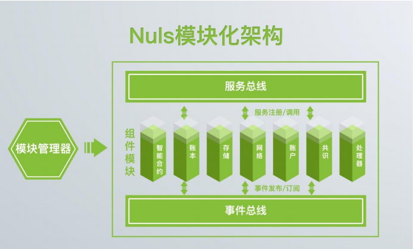
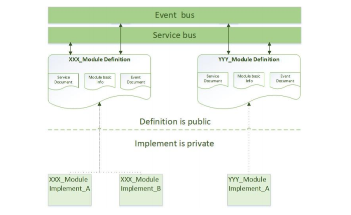
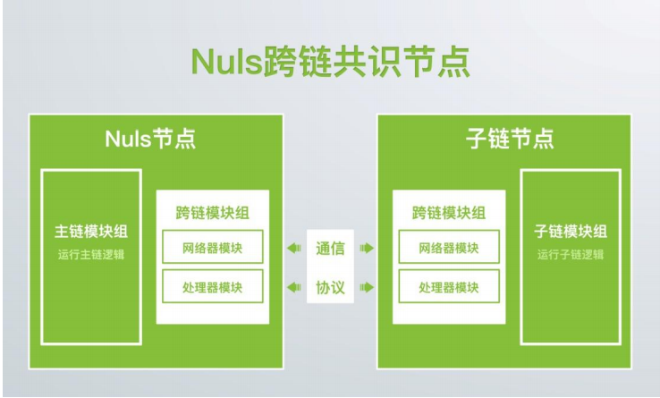
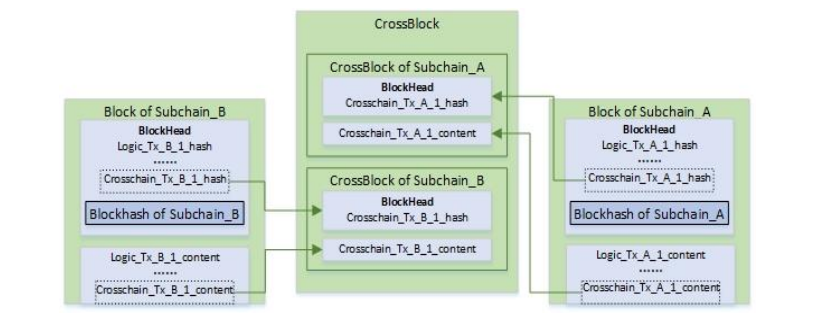
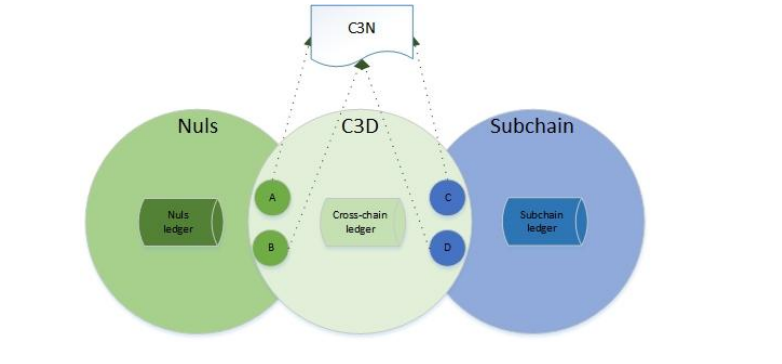

# NULS黄皮书

[TOC]

## 一、 前言

NULS 是一个可定制的区块链基础设施，是全球性区块链开源社区项目。NULS 由微内
核和功能模块组成，以弱化主链的全新思维，通过事件和服务的剥离，实现高度模块化的底
层架构，提供智能合约、多链并行、跨链共识等运行机制，降低开发和使用的成本，推动区
块链商业应用进程。
本文介绍 NULS 底层链的技术设计和实现，适合技术工作者阅读。如果你只是想了解
NULS,请阅读 NULS 白皮书: <https://NULS.io/pdf/NULS_whitepaper_zh_V1.0.pdf>

## 二、 NULS 技术设计目标

### (一) 定义一套区块链开发标准

NULS 定义了一套区块链开发标准，包含但不限于：模块标准、服务标准、数据/协议
标准、进程/线程标准、完备事件驱动模型开发标准。

### (二) 使区块链技术更简单

区块链是加密技术、P2P 网络等多种技术的结合，开发者和企业使用区块链技术门槛
较高。NULS 重新架构区块链底层实现，把区块链分成不同模块，模块间隐藏实现细节，使
用事件和服务交互，模块和应用开发者只需关注每个模块的服务接口和事件数据结构,NULS
开源社区将维护服务接口和事件数据的完整开发文档，来自全球各行业的开发者更容易参
与。

### (三) 高可定制、高扩展性

NULS 从逻辑、模块、链三个层面实现高可定制和高扩展性。智能合约、模块化标准、
跨链协议分别实现这三个层面的高可定制和高扩展性。

### (四) 可持续改进

模块化架构设计将账本、账户、共识、网络、智能合约等模块内部实现隐藏，每个模块
都可以独立升级而不影响其他模块。

## 三、 NULS 技术总览

### (一) 完备的开发标准

#### 1. 统一数据格式

NULS 系统节点之间、模块之间使用事件作为数据传输的载体，每种事件都有唯一的识
别码，识别码包含模块编号和模块内部事件编号。

#### 2. 标准模块定义

NULS 系统提供了模块的完整定义，内置模块和扩展模块都应该遵循 NULS 模块定义，
模块开发遵循定义与实现分离的原则。

#### 3. 进程&线程标准

NULS 系统中所有进程和线程需接受内核管理。

### (二) 模块化

#### 1. 定义与实现分离

NULS 模块设计将模块分为定义和实现两个部分，只公开模块定义，隐藏模块实现，模
块实现根据技术更新和需求变动而升级或替换。

#### 2. 模块交互

NULS 系统中使用事件通知和服务调用两种方式实现被动和主动模块交互。

### (三) 事件驱动

NULS 内置 Event-bus 模块定义了发布/订阅(publish/subscribe)模型，并定义了处理
器链(handlerchain),模块开发者只需订阅自己关心的事件并实现处理器(handler)就可以处
理事件。

### (四) 多密码算法支持

NULS 以 Provider 模式支持多种算法，子链和扩展模块中可以自定义密码算法，NULS
系统默认使用 ECC/Hash/AES 算法。

### (五) 多链

多链并行解决不同业务、不同形态链的功能支持，同时提高性能；跨链共识实现数据审
计和价值流通。

## 四、 POC 共识机制

### (一) 角色

| 名称   | 职责                                          | 权益                                     |
| ------ | --------------------------------------------- | ---------------------------------------- |
| 代理人 | 提供硬件 创建代理节点 锁定押金 接收委托人委托 | 收获出块奖励 收获代理佣金 收获交易手续费 |
| 委托人 | 锁定押金 委托代理人出块 缴纳出块奖励佣金      | 收获出块奖励 收获交易手续费              |

### (二) 奖金种类

| 名称       | 来源                       | 所得人         |
| ---------- | -------------------------- | -------------- |
| 出块奖励   | 每年创建 5,000,000NULS     | 代理人、委托人 |
| 代理佣金   | 委托人出块奖励中的一定比例 | 代理人         |
| 交易手续费 | NULS链上交易缴纳           | 代理人、委托人 |

### (三) 规则说明

1. 所有代理节点轮流出块，每轮出块顺序随机计算。
2. 委托人在代理节点共识时赎回押金。若赎回押金后代理节点，代理押金大于等于 b*d%，代理节点继续共识；若赎回押金后代理节点代理代币小于 b*d%,则自动退出共识，且进入等待受托状态。
3. 代理节点主动退出共识，则其代理的所有押金锁定 24 小时。
4. 代理人创建代理接点时，可以只接收制定账户的委托，也可接受所有账户的委托。
5. 红牌。节点尝试双花、尝试分叉等攻击行为计为红牌，代理人押金锁定 30天，该节点代理的代币锁定 3 天，该账户不允许再次创建代理节点。
6. 黄牌。每次代理节点未在规定时间内出块则计一次黄牌。

### (四) 参数

| 名称                   | 参数名 | 说明                                                                                                   | 拟订值    |
| ---------------------- | ------ | ------------------------------------------------------------------------------------------------------ | --------- |
| 代理人押金下限         | a      | 代理人创建代理节点时所需抵押NULS 最少数量 a                                                            | a=20,000  |
| 代理人受托押金下限     | b      | 代理节点受托金额超过 b 才能参与共识，不计算代理人自身押金                                              | b=200,000 |
| 代理人受托押金上限     | c      | 当代理节点受托押金大于 c 时,该节点不再能接受更多委托，（最后一笔受托金额可以超过）不计算代理人自身押金 | c=500,000 |
| 代理人强制退出共识比例 | d      | 当代理节点正在共识时，其受托金额可能减少，当金额减少至 b*d%时，该代理节点退出共识                      | d=80      |
| 委托人押金下限         | e      | 委托人委托代理人参与共识需锁定押金下限 e                                                               | e=2,000   |
| 代理人佣金比例         | f%-g%  | 代理人设定代理佣金上限和下限                                                                           | f>=0 g=20 |
| 块内交易手续费         | fee    | 共识数据块中所有交易手续费总和                                                                         |           |
| 单条交易手续费         | tx_fee |                                                                                                        | 0.01NULS  |
| 本轮共识节点数         | Rnc    |                                                                                                        |           |
| 出块时间间隔           | bti    |                                                                                                        |           |
| 每年时间               | spy    |                                                                                                        |           |
| 某个代理节点押金总数   | cmc    | 某个节点代理人自身押金+该节点受托押金总和                                                              |           |
| 信用系数               | cr     |                                                                                                        |           |

### (五) 共识奖励计算

#### 1. 节点每轮奖励总和

$$
coinbase = fee + 5000000 * \frac{rnc * bti}{spy} * \frac{cmc * max(0, cr)}{\sum_1^{rnc}cmc * max(0, cr)}
$$

#### 2. 代理节点奖励(不包含佣金)


#### 3. 代理人实际奖励


#### 4. 委托人实际奖励


### (六) 信用系数

#### 1. 参数

| 名称                | 参数名 | 说明                                                     | 拟订值 |
| ------------------- | ------ | -------------------------------------------------------- | ------ |
| 信用系数计算轮次    | R      | 只计算最近 R 轮内的数据统计延迟两轮计算                  | R=100  |
| 近 R 轮节点出块数量 | N      |                                                          |
| 黄牌数量            | Y      |                                                          |
| 节点黄牌出现轮次    | yr     | 当前轮次为 RC, 节点在第 Z 轮获得黄牌,则 yr=R-min(RC-Z,R) |        |
| 黄牌系数            | mn     |                                                          | Mn=4   |

#### 2. 信用系数计算公式

$$
cr = \frac{N}{X} - \frac{mn \sum_1^Yyr}{R*R}
$$

## 五、 模块化架构

### (一) 简介

商业应用千变万化、技术升级日新月异，NULS 社区承认技术升级和商业应用逻辑不可预测的事实，吸纳了 Linux 内核设计的模块化思想，开发了 NULS 微内核。NULS 设计遵循“一切皆为模块”的原则，用模块化支持技术更新和应用适配。



NULS 由微内核和功能模块两个部分组成。

NULS 把传统区块链拆分成多个模块：智能合约、账本、账户、存储、网络、共识、事件总线、缓存等。每个模块都能够在以后的技术升级或者定制化中被升级或者替换。

模块管理器负责管理模块，模块间使用服务总线和事件总线交互。服务总线负责管理每个模块的服务句柄，事件总线负责处理模块事件的发布和订阅。

### (二) NULS 微内核


NULS 系统由去中心化节点组成，NULS 节点由 NULS 内核(NULSKernel)组织所有模块协同工作，NULS 内核负责四个方面的工作：模块管理、任务管理、服务管理、配置管理。

### (三) 模块管理(ModuleManager)

NULS 由模块管理器管理负责管理 NULS 节点的所有模块的生命周期。

#### 1. 模块生命周期


模块的生命周期包含：Uninited, Initing, Inited ,Starting, Running, Stopping,Stopped, Destroying, Destroyed，各状态的名字代表了其含义。

### (四) 任务管理(TaskManager)

NULS 规范中定义了进程(NULSProcess)和线程(NULSThread)两种类型任务（Task）。NULS 内核使用任务管理器(TaskManager)管理所有任务。

#### 1. 进程(NULSProcess)

NULS 把进程定义为 ModuleProcess，每个模块都有一个自己的主进程，主进程由ModuleManager 加载模块时创建，创建过程都在 ModuleManager 内核中自动完成，不用手动创建，扩展模块开发者并不需要关心这些细节，只需要按照模块定义开发模块。

#### 2. 线程(NULSThread)

NULS 把线程定义为 NULSThread，一个模块可能会同时做几种不同的工作(work)，每个模块需要为每个工作创建一个 NULSThread，每个 NULSThread 有一个所属模块的编号、线程名称和执行入口。NULS 开发规范不允许开发者创建匿名线程(这将在后续的开发规范中说明，NULS 社区会审核所有代码)，NULS 模块开发者必须按照如下方式创建线程：

```txt
/**
* @param moduleId
* @param threadName
* @param runnable
*/
createAndRunThread(short moduleId, String threadName, Runnable runnable)
```

### 3. 进程和线程的启动

下图描述了一个模块启动过程中进程与线程的创建过程：


- 模块状态：Inited;
- ModuleManager 使用 ProcessFactory 创建一个进程；
- ProcessFactory 创建一个进程，并把进程信息注册到 TaskManager；
- TaskManager 记录进程信息；
- ProcessFactory 把进程返回给 ModuleManager；
- ModuleManager 调用模块的 start 方法启动模块；
- 模块需要启动 n 项工作，所以使用 ThreadFactory 创建 n 个线程；
- ThreadFactory 创建 n 个线程并把线程信息注册到 TaskManager；
- TaskManager 记录线程信息；
- ThreadFactory 把 n 个线程返回给模块；
- 模块在每个线程中开始 1 项工作；
- 模块状态：Running。

### (五) 服务管理(ServiceManager)

NULS 系统由各个模块组成，每个模块都以接口的方式对外提供服务，NULS 使用服务管理器(ServiceManager)管理所有服务(对于习惯于 Windows 开发者,你可以简单理解为ServiceManager 就是一个 Windows DLL 的注册表，一旦 DLL 注册在注册表中，开发者就通过该“注册表”获取该 DLL 服务句柄，然后参照该 DLL 提供商的文档调用服务)，在NULS 系统中所有扩展模块开发者都是服务提供商，模块开发者在提供新模块的同时需要提供服务的详细服务接口文档。

服务管理器为模块开发者提供服务注册方法(registerService),所有模块加载时需要调用服务注册方法注册模块提供的所有服务对象(ServiceManager 属于内部实现，模块开发者实际调用的是模块基类 aseNULSModule 的注册服务接口)。

NULS 社区会整理所有服务接口文档，供开发者使用。

### (六) NULS 模块

#### 1. 模块定义

NULS 为模块提供了标准定义，一个完整的模块定义包含 4 个部分：基本信息，模块服务，模块事件，模块配置。模块开发者需要提供模块说明书来阐明模块定义。

#### 2. 模块说明书

模块开发者需要提供模块说明书来定义一个模块，模块说明书必须详细说明该模块发布的事件、提供的服务接口、数据结构、模块配置。NULS 设计中每个模块不关心其他模块的底层实现，模块之间使用服务和事件交互，所以在新模块发布时模块说明书特别重要，模块说明书是社区测试模块的依据，是其他开发者使用该模块的开发指南，也是社区决定是否发布该模块的重要因素。


#### 3. 基本信息

NULS 每个模块的基本信息包含：编号、名称、版本、描述。

每个模块在模块库中有唯一的编号和名称，模块编号和名称会在进程/线程管理、事件发布/订阅、服务注册/查询中使用。

#### 4. 模块服务

NULS 每个模块都可以接口形式定义自己的服务，也可以调用其他模块的服务。NULS内核中 ServiceManager 会统一管理所有服务对象(服务句柄)，模块启动时注册本模块的服务。其他模块就可以调用该参照模块服务文档根据逻辑需要调用本模块服务。

### (七) 模块实现

模块实现与定义分离，同一个功能模块可能有多种实现方式，单个模块可以实现独立升级和替换。


#### 1. 模块引导类(bootstrap)

NULS 节点启动时根据配置文件 modules.ini 自动加载默认启动的模块，NULS 节点运行时也可以调用 ModuleManager 的 LoadModule 方法动态加载模块，模块的加载过程由模块开发者实现，NULS 为模块提供了统一基类 ModuleBootstrap，所有模块引导类应该继承该基类，接受内核管理。ModuleBootstrap 定义如下：

1) Init 方法初始化模块。
加载配置、创建缓存、创建本模块消息队列等。
2) start 方法启动任务。
启动模块内部任务；在服务管理器中注册本模块服务；订阅本模块关注的事件，该过程
包含注册针对于每个事件的处理器和过滤器。
3) stop 方法停止任务。
取消本模块对事件的订阅，注销模块内部服务，停止本模块所有内部任务。
4) destroy 销毁模块。
销毁本模块创建的缓存。

### (八) 模块配置

NULS 模块配置文件 modules.ini，每个配置节(config section)配置一个模块的全部配置项，bootstrap 配置模块引导类。NULS 模块初始化时调用 ConfigLoader 获取本模块的配置。

```txt
[Network]
bootstrap=NetworkModuleBootstrap
network.server.port=8632
network.external.port=8003
network.magic=936152748
[Consensus]
......
```

### (九) NULS 扩展模块开发流程

NULS 为扩展模块开发规定了开发流程，包含模块开发、测试、提交、审核、发布，后续在开发者官网公布详细流程。

## 六、 事件驱动(EventDriven)

NULS 使用模块化带来的高扩展性支持各种区块链应用场景，来自全球各行各业的开发者将在 NULS 的基础之上开发应用或者底层模块(例如，对于私有链，开发者会采用直连网络而不是 P2P 网络，增大单个区块的大小或者缩短出块时间以提高性能；金融行业可能需要把账户模块替换为行业标准 Ca 进行身份认证)，不同的模块由不同的开发者完成，应用模块开发者可能并不熟悉区块链的实现原理，底层模块开发者可能并不熟悉其他模块的实现方式(例如，P2P 网络专家并不关心加密算法的实现)。因此，我们必须建立一套简单的沟通方式，事件驱动就是简单的沟通方式之一。

NULS 是一个事件驱动的系统(如收到一笔转账交易或收到一个 DApp 即时聊天软件信息都是一个事件，各模块针对不同的事件完成逻辑处理)，NULS 事件总线使用 disruptor框架实现发布/订阅事件模型，每个模块都可以发布(publish)自己的事件，也可以订阅(subscribe)其他模块的事件。

根据场景不同，NULS 把事件(Event)分成两种类型：本地事件(LocalEvent)和网络事件(NetworkEvent)。

### (一) 本地事件

本地事件用于节点内部不同模块间异步通信，此类事件不经过网络传播，直接发送到本地事件分发器，通知其他模块处理其业务逻辑。

### (二) 网络事件

网络事件用于不同节点间异步通信，此类事件发送到网络中其他节点，数据结构由模块内部解释，每个模块不需要了解其他模块内部的数据结构。

下图展示逻辑事件和底层事件的区别：


### (三) 事件总线(Event-bus)


模块开发者定义模块时发布模块说明书，模块说明书详细描述本模块可能发布的事件，其他模块开发者如果需要订阅该模块的事件，需要先开发处理该事件的处理器(handler),然后把处理器注册到事件总线，为了提高灵活性和可扩展性，我们定义了过滤器链(FilterChain)，如果处理器只处理该类事件的部分消息，可以通过过滤器(Filter)实现。

NULS 事件总线的分发器(Disparcher)使用 disruptor 实现，disruptor 本身单线程工作，为了提高效率，disruptor 只负责调度，不处理逻辑，当一个事件发布时，分发器会把每个每个订阅者的处理器调度到一个单独的线程中运行。

### (四) 数据结构

NULS 事件可以在节点之间或节点内部模块之间实现发布/订阅，数据协议栈建立在 tcp协议之上，从下往上依次是网络层(NULSNetwork Layer)、事件层(NULSEvent Layer)、逻辑层(Logic Layer)。


1. **逻辑层**：定义各个上层模块的业务逻辑，扩展模块开发者只需专注于定义自己模块的业务数据。
2. **事件层**：在业务数据前面添加 4 个字节事件数据头(NULSEventHeader)，事件数据头包含模块编号和事件编号。每一种事件拥有独特的事件数据头，事件模块将按照事件数据头实现发布/订阅模型。
3. **网络层**：在事件层数据前面添加 10 个字节的网络数据头(NULSMessageHeader)，包含魔法参数，数据长度，奇偶校验位，数据加密类型。


| | 名称 | 长度 | 介绍 |
|-|-----|-----|----|
| MessageHeader |  MagicNumber   |  4 bytes    |  用以划分跨链网段，不同网段的的数据包将被网络层的过滤器过滤  |
| MessageHeader |  DataLengh    |  4 bytes    |  MessageBody 的数据长度，小端序  |
| MessageHeader |  Xor    |  1 bytes    |  MessageBody 数据的奇偶校验位，校验失败的数据将被网络层的过滤器过滤  |
| MessageHeader |  EncryptType     |  1 bytes    |  加密方式，用以支持网络层数据加密扩展  |
| Event Header |  ModuleID     |  2 bytes    |  模块编号  |
| Event Header |  EventType     |  2 bytes    |  模块内部事件编号  |

## 七、 多链

### (一) 简介

NULS 支持子链注册接入，主链与子链使用跨链共识验证区块和交易；NULS 代币和子链其他代币可以在 NULS 主链和子链之间流通；子链向主链报备区块头，主链审计子链的区块。

### (二) 跨链共识

#### 1. 跨链共识域（C3D：cross chain consensus domain）

主链部分节点与子链部分节点组成跨链共识域，跨链共识域内节点对跨链交易达成共识，将跨链数据协议转换后分享跨链数据到其他对等节点。


#### 2. 跨链共识节点（C3N：cross chain consensus node）

加入跨链共识域的节点额外加载跨链共识所需的模块，如网络模块、跨链协议处理器模块等。



#### 3. 跨链交易账本

由跨链共识节点运行，记录所有链所有跨链交易。子链的跨链共识模块需要实现协议转换器，负责子链交易数据和跨链交易数据的格式的转换。跨链交易分两种，对于需要 NULS提供数据完整性的技术审计私有链/联盟链，交易就是子链区块头；对于资产交易，跨链交易账本存储交易的全部内容。



#### 4. 交易确认



主链节点 A、B 和子链节点 C、D 组成跨链 C3N。当子链有新块产生，C、D 搜集新块内的跨链交易组成跨链区块广播到 C3N，C 节点和 D 节点相互验证区块所有交易的合法性和完整性；当 A、B 节点接收到跨链区块时，向广播者之外的节点验证区块合法性(例如：当 A 节点收到 D 节点的广播时，向 C 节点验证数据)。

### (三) 私有链数据审计

对于机构而言，数据保密性和安全性极其重要，而区块链的公开透明特性却让机构有所顾虑。NULS 通过数据隔离和跨链审计的方式，让子链的业务数据保密性和安全性得到保障，解决数据透明与商业保密的平衡问题。
NULS 提供了一套审计私有链数据完整性的方案，子链把每个区块头封装到主链的一笔交易中，主链使用多级摘要的技术审计子链的交易数据完整性，既保证了企业的机密性，也为企业提供了向公众证明数据完整性的技术手段。

私有链通过跨链共识向主链报备区块头，主链为子链保留完整数据摘要，主链为子链数据提供了完整性自证明的服务，所以每个子链区块头的记录需要收取一定的 Token 作为服务费用。


## 八、 NULS 内置模块

| 名称       | 代号               | 编号 | 模块引导类             |
| ---------- | ------------------ | ---- | ---------------------- |
| 存储       | db                 | 2    | MybatisDBModuleImpl    |
| 缓存       | cache              | 3    | EhCacheModuleImpl      |
| 网络       | network            | 4    | NetworkModuleImpl      |
| 账户       | account            | 5    | AccountModuleImpl      |
| 事件总线   | event-bus          | 6    | EventBusModuleImpl     |
| 共识       | consensus          | 7    | PocConsensusModuleImpl |
| 账本       | ledger             | 8    | UtxoLedgerModuleImpl   |
| RPC服务    | rpc                | 9    | RpcServerModuleImpl    |
| 智能合约   | Smart-contract     | 10   | NULSVMImpl             |
| 跨链子帐本 | cross-chain-ledger | 11   | CrossChainLedger       |

### (一) 存储模块

#### 1. 基本信息

| 名称 | db |
| -- | -- |
| 编号 | 2 |
| 描述 | db 模块提供数据的持久化功能，所有的数据持久化操作都在 db 模块中实现，db 模块通过接口的方式给各个业务模块提供持久化数据的操作功能。|

#### 2. 服务

| 服务名称 | DataService              |
| -------- | ------------------------ |
| 功能     | 数据的基本操作：增删改查 |

| 接口名称 | 功能                     |
| -------- | ------------------------ |
| save     | 保存数据                 |
| update   | 更新数据                 |
| get      | 根据标识查询数据         |
| delete   | 删除数据                 |
| getList  | 根据条件过滤查询数据列表 |
| getCount | 根据条件获取数据条数     |

### (二) 缓存模块

#### 1. 基本信息

| 名称 | cache                                                                                                            |
| ---- | ---------------------------------------------------------------------------------------------------------------- |
| 编号 | 3                                                                                                                |
| 描述 | 为整个 NULS 项目提供基础的缓存功能，包括缓存的创建，缓存数据的增删改查功能。每个模块可以根据自己的需要定义缓存。 |

#### 2. 服务

| 服务名称 | CacheService                       |
| -------- | ---------------------------------- |
| 功能     | 缓存的创建，缓存数据的增删改查功能 |

| 接口名称          | 功能                   |
| ----------------- | ---------------------- |
| createCache       | 创建缓存               |
| removeCache       | 清除缓存               |
| clearCache        | 清空缓存               |
| getCacheTitleList | 获取所有缓存名称       |
| putElement        | 缓存数据               |
| getElement        | 获取缓存数据           |
| getElementList    | 获取缓存数据列表       |
| removeElement     | 清除单个数据           |
| containsKey       | 是否包含一个缓存键     |
| keySet            | 获取一个缓存下的所有键 |

### (三) 网络模块

#### 1. 基本信息

| 名称 | network                                                                                                                                                         |
| ---- | --------------------------------------------------------------------------------------------------------------------------------------------------------------- |
| 编号 | 4                                                                                                                                                               |
| 描述 | 为 NULS 区块链提供网络通信服务。NULS 内置网路模块能够实现节点域管理，节点组管理，节点管理。将网络数据拆包成事件发送至事件总线，将事件封装成网络消息发送至网络。 |

#### 2. 服务

| 服务名称 | NetworkService                 |
| -------- | ------------------------------ |
| 功能     | 节点管理，节点组管理，消息发送 |

| 接口名称            | 功能                 |
| ------------------- | -------------------- |
| addNode             | 添加指定节点         |
| removeNode          | 移除指定节点         |
| addNodeToGroup      | 添加节点到指定节点组 |
| removeNodeFromGroup | 从节点组移除节点     |
| addGroup            | 添加节点组           |
| removeGroup         | 移除节点组           |
| sendToAllNode       | 发送消息到所有节点   |
| sendToNode          | 发送消息给指定节点   |
| sendToGroup         | 发送消息给指定节点组 |

#### 3. 事件

| 事件            | 编号   | 功能说明                           |
| --------------- | ------ | ---------------------------------- |
| GetVersionEvent | 0x0100 | 查询对等节点版本信息               |
| VersionEvent    | 0x0200 | 返回本节点版本信息                 |
| PingEvent       | 0x0300 | 心跳询问                           |
| PongEvent       | 0x0400 | 心跳回复                           |
| ByeEvent        | 0x0500 | 主动断开连接通知                   |
| GetNodeEvent    | 0x0600 | 向已连接的对等节点询问更多其他节点 |
| NodeEvent       | 0x0700 | 返回已知的对等节点列表             |

### (四) 账户模块

#### 1. 基本信息

| 名称 | account                                                                                                                                          |
| ---- | ------------------------------------------------------------------------------------------------------------------------------------------------ |
| 编号 | 5                                                                                                                                                |
| 描述 | NULS 区块链的账户体系。NULS 的账户为主链与子链共享，主链与子链均可创建账户。Account 模块提供了账户的基本操作，包括创建、导出、导入、密码设置等。 |

#### 2. 服务

| 服务名称 | AccountService                                       |
| -------- | ---------------------------------------------------- |
| 功能     | 创建账户、导出、导入、设置密码、设置别名、签名交易等 |

| 接口名称          | 功能                 |
| ----------------- | -------------------- |
| createAccount     | 创建账户，可批量创建 |
| getAccount        | 获取本地指定账户     |
| getAccountList    | 获取本地账户列表     |
| getAddress        | 根据公钥获取地址     |
| getPrivateKey     | 根据地址获取私钥     |
| getDefalutAccount | 获取本地默认账户     |
| setDefaultAccount | 切换默认地址         |
| encryptAccount    | 加密账户             |
| changePassword    | 更换密码             |
| isEncrypted       | 账户是否加密         |
| unlockAccounts    | 解锁账户             |
| signData          | 签名                 |
| verifySign        | 验证签名             |
| setAlias          | 设置别名             |
| exportAccount     | 导出账户             |
| importAccount     | 导入账户             |

### (五) 事件总线模块

#### 1. 基本信息

| 名称                                                                                                                                                      | event-bus |
| --------------------------------------------------------------------------------------------------------------------------------------------------------- | --------- |
| 编号                                                                                                                                                      | 6         |
| 描述 NULS 基于事件驱动，节点之间所有数据传输和节点内部各个模块通信数据都封装在事件内部，event-bus 模块负责事件的发送、接收、过滤、分发、发布/订阅等功能。 |

#### 2. 服务

| 服务名称 | EventBusService                      |
| -------- | ------------------------------------ |
| 功能     | 负责事件接收、过滤、分发、订阅等功能 |

| 接口名           | 功能                     |
| ---------------- | ------------------------ |
| subscribeEvent   | 订阅事件、注册处理器     |
| unsubscribeEvent | 取消订阅事件、注销处理器 |
| publishEvent     | 发布事件                 |

#### 3. 事件

| 事件              | 编号   | 功能说明                                                                   |
| ----------------- | ------ | -------------------------------------------------------------------------- |
| CommonDigestEvent | 0x0100 | 通用摘要事件：用于广播事件摘要，当节点收到事件摘要后，决定是否拉取完整事件 |
| GetEventBodyEvent | 0x0200 | 获取事件数据事件：获取整个事件数据的事件                                   |

### (六) 共识模块

#### 1. 基本信息

| 名称 | consensus                                                                                                                                  |
| ---- | ------------------------------------------------------------------------------------------------------------------------------------------ |
| 编号 | 7                                                                                                                                          |
| 描述 | consensus 模块负责维护节点的共识机制，包括区块打包、区块验证、共识奖励计算、共识奖励分配、共识状态维护、交易手续费计算、作恶节点惩罚功能。 |

#### 2. 服务

| 服务名称 | ConsensusService                       |
| -------- | -------------------------------------- |
| 功能     | 共识相关的操作，负责节点的共识状态维护 |

| 接口名称                | 功能             |
| ----------------------- | ---------------- |
| getTxFee                | 计算交易手续费   |
| startConsensus          | 开始共识         |
| stopConsensus           | 停止共识         |
| getConsensusAccountList | 获取共识成员列表 |
| getConsensusInfo        | 获取共识信息     |

| 服务名称 | BlockService       |
| -------- | ------------------ |
| 功能     | 所有区块相关的操作 |

| 接口名称          | 功能             |
| ----------------- | ---------------- |
| getGengsisBlock   | 获取创世块       |
| getLocalHeight    | 获取本地区块高度 |
| getLocalBestBlock | 获取本地最新块   |
| getBlockHeader    | 获取区块头       |
| getBlock          | 获取完整区块     |
| saveBlock         | 保存区块         |
| rollbackBlock     | 回滚区块         |

#### 3. 事件

| 事件                | 编号   | 功能说明                                                   |
| ------------------- | ------ | ---------------------------------------------------------- |
| GetSmallBlockEvent  | 0x0100 | 获取小区块事件：从对等节点处获取小区块（包含全部交易摘要） |
| SmallBlockEvent     | 0x0200 | 小区快事件：发送小区块时的承载事件                         |
| GetBlockEvent       | 0x0300 | 获取区块事件：从对等节点处获取一个区块                     |
| BlockEvent          | 0x0400 | 完整区块了事件：发送整个区块使用的承载事件                 |
| GetBlockHeaderEvent | 0x0500 | 获取区块头事件：从对等节点处获取一个区块头                 |
| BlockHeaderEvent    | 0x0600 | 区块头事件：发送区块头使用的承载事件                       |
| GetTxGroupEvent     | 0x0700 | 获取交易组事件：从对等节点处获取多个交易                   |
| TxGroupEvent        | 0x0800 | 交易组事件：发送多个交易时使用的承载事件                   |

### (七) 账本模块

#### 1. 基本信息

| 名称 | ledger                                                                                                                                                                            |
| ---- | --------------------------------------------------------------------------------------------------------------------------------------------------------------------------------- |
| 编号 | 8                                                                                                                                                                                 |
| 描述 | ledger 模块是所有区块中交易的账本，提供所有交易的操作，定义了所有和 NULS 代币相关的基础操作，其他模块有 NULS 交易时直接通过 ledger来实现，ledger 还提供了所有交易的增删改查操作。 |

#### 2. 服务

| 服务名称 | LedgerService                              |
| -------- | ------------------------------------------ |
| 功能     | 交易缓存、交易查询、交易验证、余额查询等。 |

| 接口名               | 功能                       |
| -------------------- | -------------------------- |
| verifyTx             | 验证交易                   |
| getTx                | 查询交易                   |
| getBalance           | 获取地址对应的余额         |
| queryTxListByAccount | 查询指定账户的交易         |
| queryTxListByHashs   | 根据 hash 列表查询交易列表 |

#### 3. 事件

| 事件             | 编号   | 功能说明                   |
| ---------------- | ------ | -------------------------- |
| TransactionEvent | 0x0100 | 交易事件：用于广播所有交易 |
