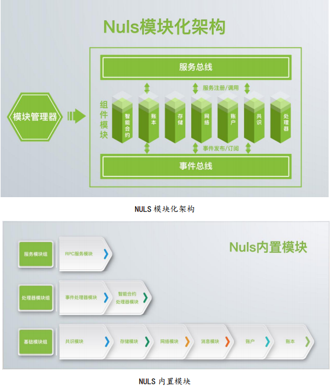
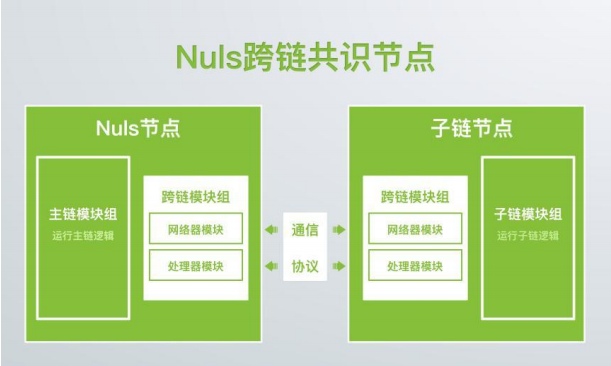

# NULS 白皮书

让信任更简单一个可定制的区块链基础设施

[TOC]

## 摘要

NULS 是一个可定制的区块链基础设施，是全球性区块链开源社区项目。NULS 由微内核和功能模块组成，以弱化主链的全新思维，通过事件和服务的剥离，实现高度模块化的底层架构，提供智能合约、多链并行、跨链共识等运行机制，降低开发和使用的成本，推动区块链商业应用进程。

## 一、区块链时代前景

在人类社会化进程中，社会以优胜劣汰的形式进步和更迭。从远古石器时代到如今的互联网、共享经济时代，每一次核心技术出现，都会极大解决当下社会中生产、经济、沟通等问题，推动社会进步。

随着社会飞速发展，科技进步，生活节奏几何倍增，信息不可靠、信用资源缺失的情况愈发严重，政府、企业、个人之间的信任体系愈发脆弱，沟通和交易成本增加。

我们认为区块链技术在这个经济快速发展的时代，以其去中心化，防篡改，高度透明等特性，会成为继 PC 互联网、移动互联网后又一个革新人类社会的技术，将会让社会各种关系的信任变得更加简单。

## 二、NULS 是什么

NULS 是全球性区块链开源社区项目，是一个由微内核和功能模块组成的可定制的区块链基础设施。NULS 制定了一套工业化区块链技术标准，遵循热插拔、模块化、平行扩展原则，提供可替代的智能合约、多链并行、共识机制、P2P网络、存储、加密、多级账户等功能模块。

我们希望通过区块链技术，帮助原有生活工作中缺乏中心化信任体系的场景，自由搭建去中心化的业务模型，从而解决社会中个体与商业体之间的信任矛盾。

基于 NULS，这个简单的基础主链，我们将提供丰富的模块化组件，如同把CPU、硬盘、内存、主板组装成电脑一样，使用者可自由选择共识、存储、合约、仲裁、账户系统，匿名策略、权限等模块，组装成为适合自己需求的子链。子链不限于公链，亦可以是私链或者联盟链。

## 三、为什么会有 NULS

我们认为区块链以其分布式存储的技术特点，公开透明、可以传递价值的特性，在未来会作为企业应用的基础而存在。然迄今为止，我们还很难发现身边的某个应用或者项目是真正基于区块链技术研发的。

造成这一现象的症结在于区块链技术使用链式结构，性能受限。链上数据庞大，同步困难，且技术更新因去中心化而面临阻碍。为了解决这些问题，并推动区块链商业应用，NULS 由此而生。

## 四、NULS 的设计使命

经过市场调研和分析，我们发现区块链发展过程中存在一些问题，区块链技术人才稀缺、研发成本高昂的状况，在短时间内都不可能缓解；越来越多的应用场景需要区块链技术的支撑；现有区块链性能受限，不同链之间无法通信；机构会倾向使用联盟链、私有链，而二者去信任不完全。NULS 可为此提供一个可靠的解决方案。

### （一）灵活易用的区块链基础设施

NULS 为开发者和用户提供完整的基于图灵完备的模块化开发。开发者和用户无需研究密码学、共识机制、存储方式等底层技术细节，使用简单快捷的可编程环境直接对接商业应用，从而降低区块链商用成本。

### （二）适配海量的区块链应用场景

在应用层面，可以预期区块链将作为机构甚至个人在工作、生活多方面的底层基础支持，NULS 通过模块化、多链并行、智能合约等运行机制，为应对未来各种各样的应用场景和区块链底层的不同需求提供支撑。

### （三）高性能驱动区块链商用落地

商业应用对性能的要求极高，NULS 致力于解决现有区块链的性能受限问题，采用平行扩展技术，通过“主链+子链”多链并行的运行机制，分离主链和子链的业务，以满足千万级 TPS 需求。

### （四）数据透明与商业保密的平衡

对于机构而言，数据保密性和安全性极其重要，而区块链的公开透明特性却让机构有所顾虑。NULS 通过数据隔离和跨链审计的方式，让子链的业务数据保密性和安全性得到保障，解决数据透明与商业保密的平衡问题。

## 五、NULS 的经济模型

NULS 系统中内置一种系统代币，代码 NULS，系统内置代币是整个系统生态的驱动剂，将用于支持应用发展、支付应用消耗费用、支持子链数字资产智能兑换、参与共识奖励、支付交易手续费等。

### （一）代币分发机制

NULS 初始发行 1 亿，其划分为四大部分，具体比例如下：

1. 空投给其他优质项目代币持有者，占比 40%，共 4000 万；
2. 团队持有，占比 20%。共 2000 万，这部分初始锁定，上线后分 20 个月线性解锁，每月解锁 5%；
3. 注入社区基金，占比 20%，共 2000 万，用于社区生态建设；
4. 商务合作， 占比 20%，共 2000 万，用于商务合作和基于 NULS 的第三方优质项目扶持。

以上第 2、3、4 部分所有钱包地址将会对外公开，接受监督。

### （二）网络维护

每年保持大约 500 万 NULS 的通胀用于奖励网络维护者。

### （三）NULS 价值体现

1、NULS 代币作为交易手续费。

2、注册子链，需要 NULS 进行抵押（抵押的 NULS 只能用于子链的运行消耗）。

3、子链运行持续消耗 NULS 代币。

为打造一个健康的 NULS 生态，所有基于 NULS 的运转，需要支付一定的NULS 代币，包括但不限于主链为子链的数据证明、代币的交易等。为了平衡支付的代币始终在一个合理的区间，不会随着 NULS 代币的增值而超出合理范围，系统会根据社区投票来调整基准费率。

4、子链基础货币与 NULS 的智能兑换。

主链的基础货币为 NULS，接入 NULS 的所有子链，可以支持自己的基础代币，把基础代币看作是 NULS 的智能资产；子链亦可发行合约代币，称之为 IOU资产。NULS 底层系统为智能资产提供与 NULS 代币的兑换功能。
子链若要发行智能资产，需要抵押一定数量的 NULS，初始比例由发行商自己设定。智能资产一旦发行，立即生成一个 NULS 资金池和智能资产资金池，任何持有 NULS 或者智能资产的用户，可以随时按照最新的市场调节的比例进行兑换。

子链的智能资产价值得到提升，对应的 NULS 资金池会沉淀更多的 NULS，这样 NULS 的价值会随着优质的子链智能资产增加而升值。

## 六、NULS 技术设计

### （一）共识机制——POC

NULS 的模块化设计，支持共识机制在内的所有核心功能模块的替换与插拔。NULS 主链默认采用信用共识机制 POC(Proof-Of-Credit)。节点信用达标的情况下，锁定一定保证金即可加入共识，共识节点重新排序后每轮轮流出块，退出共识时保证金解锁。

#### 1、共识进入与退出机制

任何人都可以随时加入 NULS 的共识之中，只要满足条件，遵守规则，即可持续获得 NULS 代币奖励。POC 的加入分为硬性指标和软性指标。硬性指标指的是信用分值必须达到一定标准线，排除掉一部分曾经作恶的节点。软性指标指的是必须冻结一定量的 NULS 代币作为保证金，为杜绝节点的泛滥，同时让整个系统更加公平，保证金的数量除了有一个最低值的限制外，任何人可自由选择保证金的数量，保证金的数量会和最终的奖励挂钩。

##### 1.1黄牌警告

由于节点硬件配置或者网络原因，造成的共识期间掉线、死机等无法出块的，不属于违规情况，但对整个系统会造成一定影响，所以对这类情况，系统有一个轻度的警告机制：冻结保证金 72 小时，且会影响信用的评定。

##### 1.2红牌警告

对于一些双花、尝试分叉系统、不遵守系统规则的恶意人为破坏情况，NULS系统坚决抵制，所有节点都可以检测到这类情况的发生；一旦有恶意节点确实试图挑战系统，那么对应的保证金将会被锁定 1 个月，且再次信用评级，将永远达不到共识门槛。

#### 2、信用评级

在 NULS 系统里，信用是账户在系统中的诚信系数，所有账户的信用会在区间[-1,1]内，通过信用评级算法公式自动计算。

信用评估公式：

信用基数=能力系数+责任系数

能力系数：根据历史出块数量计算

责任系数：根据违规情况和出块正确性计算

#### 3、共识奖励

为了整个 NULS 系统的平衡与公平，共识奖励根据所有共识节点所提交保证金与共识节点信用综合计算。

共识奖励计算公式：

$$
coinbase = fee + 5000000 \times rnc \times \frac{bti}{spy} \times \frac{cmc \times max(0,cr)}{\sum_1^{rnc}cmc \times max(0,cr)}
$$

- fee：本块手续费
- rnc：本轮共识节点数
- bti：出块间隔时间（秒）
- spy：一年总时间（秒）
- cmc：共识抵押代币数
- cr：信用基数

#### 4、子链共识机制

接入 NULS 的子链分为两种类型，第一种是通过 NULS 系统的标准接口协议接入，第二种是通过 NULS 的程序部署接入。

NULS 是一套通用的区块链底层基础设施，在其主链上不运行任何应用业务，所有应用业务由子链运行。通过 NULS 的系统，能快速的部署基于 NULS 的子链，且可灵活定制子链的各种运行参数，包括是否支持基础代币、加密算法、共识机制、存储机制等。

NULS 定义了标准共识模块，以提供接口兼容不同的共识机制。NULS 社区会陆续开发 POW、DPOS、POS、PBFT、POOL 验证池等共识机制，以供用户自由选择。

### （二）模块化架构

商业应用千变万化、技术升级日新月异，NULS 社区承认技术升级和商业应用逻辑不可预测的事实，吸纳了 Linux 内核设计的模块化思想，开发了 NULS微内核。NULS 设计遵循“一切皆为模块”的原则，用模块化支持技术更新和应用适配。

#### 1、NULS 模块&模块管理器

NULS 模块提供了标准定义“NULSModule”，所有 NULS 的模块都遵循NULSModule 模块定义。

NULS 模块管理器负责管理所有模块，定义了模块加载/卸载、服务注册等规范，凡是遵循 NULSModule 规范的扩展模块都可以通过模块管理器加载到NULS 节点运行。模块加载时模块管理器会注册该模块所有服务，NULS 模块可以提供对外服务也可以调用其他模块的服务，NULS 模块可以触发事件也可以订阅其他模块的事件。

NULS 的每个模块会根据技术升级和应用需求而升级或替换，从技术层面看，NULS 是一个具有很长生命周期和超强适应性的操作系统级软件。

### （三）多链并行

NULS 支持子链注册接入，主链与子链使用跨链共识验证区块和交易；NULS代币可以在 NULS 主链和子链之间流通；子链向主链报备区块头，主链审计子链的区块。

#### 1、跨链共识域（C3D：cross chain consensus domain）

主链部分节点与子链部分节点组成跨链共识域，跨链共识域内节点对跨链交易达成共识，然后分享跨链数据到其他对等节点。

#### 2、跨链共识节点（C3N：cross chain consensus node）

加入跨链共识域的节点需额外加载跨链共识所需的模块，如网络模块、跨链协议处理器模块等。

#### 3、安全性

跨链共识主链和子链最少节点限制，防止跨链共识域中心化。

跨链节点动态调整，不允许单个跨链节点连续广播跨链信息。

### （四）NULS 智能合约

NULS 内置 NULSVM 作为智能合约模块，从模块结构上看，NULS 智能合约模块处于对外服务模块（如 RPC 模块）和底层设施模块（如网络模块、存储模块、账户模块等）之间，存储模块、基本加密算法、账户模块、网络模块等其他模块为智能合约提供底层支撑。

智能合约由上层应用定义、由解释器解释、由存储模块存储、由 NULSVM模块运算。NULS 智能合约解释器将支持多种高级编程语言。应用开发者可以使用自己熟悉的语言设计 NULS 智能合约。

## 七、NULS 开源社区

NULS 是一个由社区驱动的、全球性开源软件项目，社区生态是开源项目的生命力所在。NULS 社区将以提供完善的开发文档，成熟的开发工具；组织多样化的开发大赛；扶持优秀应用；奖励项目贡献者等方式，促进 NULS 生态的发展。

NULS 已成立社区基金会，初始由 NULS 团队注入 20,000,000NULS 进入社区基金，用于支持和推动项目发展。NULS社区基金会是NULS FOUNDATIONPTE. LTD.(201729333G)的简称， 注册于新加坡，致力于支持 NULS 开源项目的开发和建设，促进开源生态的安全、和谐、发展。

## 八、NULS 发展路线图

### （一）凝结阶段：冰川——稳固基础（未来 1-2 年）

#### 1、技术

完善技术设计文档，完成基础模块代码开发，并上线主链，持续完善智能合约，多链并行，跨链共识等早期功能，完善主链周边生态，包括区块链浏览器，轻钱包，移动端钱包，智能合约虚拟机，编译器，开发工具，多语言适配等。

#### 2、生态

建立并发展和完善开源社区，启动和推进更多应用接入。

### （二）融合阶段：海洋——循环流动（未来 3-5 年）

#### 1、技术

完成更多共识模块的植入，实现网络、存储等模块的自我进化（支持 EB 级数据量存储），形成对接各行业应用的标准技术方案体系；探索区块链与大数据、人工智能等其他领域结合的新生态系统。

#### 2、生态

形成一个成熟的开源社区，大规模建立应用子链。

### （三）升华阶段：风云——无所不在（未来 5 年以后）

#### 1、技术

建立一个区块链、大数据和人工智能融合发展的技术平台，为工业、农业和商业的生产和经营需求提供全方位解决方案。

#### 2、生态

形成一个区块链、大数据和人工智能融合发展的开源社区，提供全面的价值对接和协作平台。

## 九、小结

NULS 秉承“让信任更简单”的使命，致力于成为继桌面操作系统、智能手机操作系统之后，又一个改变人类生活的价值互联操作系统，打造 “后互联网生态”，推动人类经济和人类社会的发展和进步。