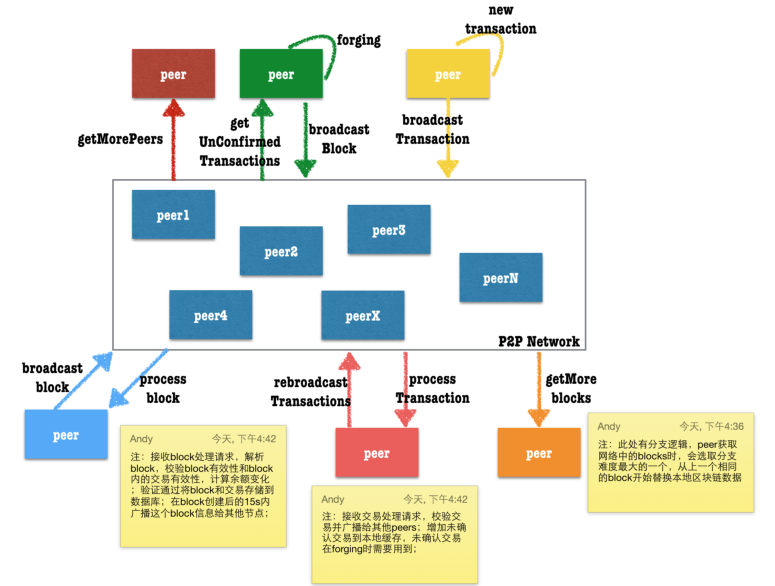
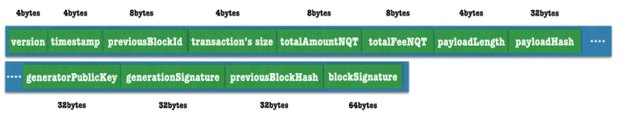
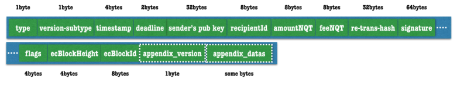

# NXT白皮书

[TOC]

## 前言

本文主要是Nxt白皮书1)的中文翻译。阅读本文请先阅读比特币原理。Nxt被称作第二代货币，因此Nxt是由比特币发展而来的。它的主要理念-分布式交易继承自比特币，又在安全确认机制上做了创新，由pow机制进化为pof机制。

## 摘要

比特币已经证明了点对点的（对等的）电子货币系统的可行性，并且可以在不需要信托或是中央印钞厂（金融机构）的情况下完成支付过程。但是比特币的一些缺点也使得其成为电子经济的基础变得困难。为了使得整个经济系统能够建立在对等的基础上，必须要做到以下几点：

1. 快速的处理数以千计的交易量
2. 提供一种产生收入的方法
3. 有可行的方法来增加新特征
4. 能够在可移动设备上运行

而Nxt则满足了以上所有要求，同时还消除了Bitcoin的POW机制所需要的算力设备军备竞赛。Nxt是基于100%的股权证明之上并且需要一种原始的分配方式。但是（很多人）对于这种创始区块的具体分配方式充满了疑惑，他们会问到“怎么解决由于Nxt对73个大股东的不公平分配而导致的骗局指控？BCNext这样做出回应：”这个问题是没办法解决的。即使我们有一百万个股东，剩下的70亿人仍然会觉得这不公平，物欲横流的世界永远都不会公平（有钱的地方就会有不公平）[1]。” 关于Nxt最根本的革新就是透明锻造(Transparent Forging)，这是Nxt最核心的改造（创新），使其每小时能处理上千次的交易量。

## 什么是Nxt

Nxt2)被认为是第二代的密码币。随着一些山寨货币的出现，它们仅改变了哈希机理、区块之间的时间、启动难度等等，而Nxt则带来了很多很多的变化，原因如下：

1. 数字列表项目数字列表项目.它并不像litecoin、peercoin以及其他的一些山寨币，这些山寨币的代码均基于bitcoin的源代码。而Nxt且拥有自己的算法,是用全新代码编写的。
2. 数字列表项目它提供了内在的特征，比如去中心化的点对点对换、彩色币、信息/聊天、去中心化的DNS(主机域名）以及即时交易等选项。我们会在以后的文章中讲述这些特征。
3. 数字列表项目它是100%的股权证明（proof of stake)，而其它绝大部分的币种都是基于工作量机理证明(proof of work)的。相比其它币种，这有效地去除了内在的安全风险，因为目前51%攻击或者其它内在的脆弱性都会导致这些PoW币种灭亡。而且另外要说的一点是，该协议对能源消耗是友好的，因此PoS不需要大量的哈希计算。
4. 数字列表项目它发布于几周之前，不像其它币种，发布之前已经运行了很多时间。73位参与者负责1,000,000,000个Nxt币的分发，这些币是通过向源块中注入bitcoin（由他们自己捐助，共21个bitcoin币）来产生的。这是该PoS系统运行的要求，目前分发工作已经在进行中。Nxt已经列在了coinmarketcap3) 上，大家可以通过论坛以及临时（中心化的）的交易平台dgex4)nxtchg5)peercover6)来进行交易。

### 比特币存在的问题

比特币存在以下一些问题，仅仅列出问题，具体和比特币相关的信息请提前阅读。

1. 数字列表项目区块链大小膨胀过快，前4年的区块链大小总计4GB，而一年后，这个数字已经是13GB了。
2. 比特币的交易量峰值已经达到了上限的1/7了，交易量上升将会导致交易无法及时得到处理；
3. 交易确认时间平均8-13分钟，确认时间过长；
4. 中心化疑虑加重，两个最大的矿池占网络总计算能力已经达到了60%，将会垄断60%区块的产生；
5. 工作量机制保证了交易的安全性的同时，也产生了资源浪费；每日在网络进行无意义的hash计算已经消耗了太多的资源
6. 生成区块会造成比特币的膨胀，按照算法和当前计算能力，2140年左右所有的比特币才会生成完毕；

## Nxt核心技术

### 股权证明(Proof of Stake)

POS指的是一种对货币所有权的证明；

在Nxt的POS模型里，安全性是由持币者保证的。由POS带来的好处不会产生在POW中的集权化趋势，并且数据显示，Nxt从诞生开始保持了非常好的分布式状态。在网络中贡献block的独立用户数正在非常快速的增长并且保持了一个较大的数字，前5名top持币者贡献了35%的blocks。

Nxt构建的系统，将每一枚钱币(coin)都看做是一台微小的挖矿机。账户中拥有的coin币数量越多，那么它有越大的几率获得生成一个block的机会。创建block的收益就是在block内部的交易费用。创建block不会产生新的coin。Nxt的重新分配发生在创建block的交易费中。透明锻造(term forging)替代了挖矿（mining）。

随后的block生成基于前一个block的可证实的，独立的，不可预测的信息。创建一系列的blocks，这些block都可以回溯到创世块。block生成时间被设定为60s。但是可能结果的多样性导致了block的平均产生时间为80s，偶尔也会发生非常长时间的间隔。

安全性一直是POS系统关心的问题，下面是POS算法的基本概念：

- 累计的难度值被作为一个参数存储在每一个block中，下一个block的难度值会从前一个block中衍生出来；为了防止不一致的情况发生，网络会选取整个block chain的最大的累计难度值。
- 为了防止一个人在不同的账号间转移股权以达到增加获取block创造机会的行为发生，新转入的币(tokens)必须停留至少1440个块的时间才允许参与block生成系统。达到这一标准的货币才能为账号的有效股权，这个值会决定获得锻造的几率；
- 为了防止攻击者总是从创世模块生成新的block chain，网络仅允许chain重组从当前高度的前720块开始。任何提交的block高度低于这个值的都会被拒绝；
- 由于被单一账号控制blockchain的几率及其低，一旦交易被一个block确认后又生成了至少10个block，此时交易被认为是安全确认的。

### 货币

Nxt的总货币数是10亿个，每一个Nxt币还被分成了108个小的货币（NQT），NQT作为Nxt币的最小单位；

所有的货币都是在创世块中直接产生的，而产生创世块的账号是，NXT-MRCC-2YLS-8M54-3CMAJ，这个账号的余额也被设置成负10亿个。在创世账号中的负货币值也带来几个有趣的影响：

- 创世账号无法发起任何交易，也无法支付交易费，因为账号余额是负数，因此这个账号的password也是对外公开的(注意，最后一个.也是密码一部分）：It was a bright cold day in April, and the clocks were striking thirteen.
- 任何送到这个账号上的Nxt货币都会被消灭，因为这个账号的负余额会使得转入货币和余额之间相互抵消，因此而销毁的Nxt货币已经达到了数千个；
- 转移给这个账号的Nxt资产也会被销毁；

### 网络节点

网络节点是指在网络上贡献交易和区块数据的任何设备；任何运行Nxt服务的设备都可以看做是一个节点；

网络节点可以分为两种，带hallmark签名的和普通节点；hallmark节点是指带有一个加密签名的节点，这个加密签名是使用一个账号的私钥生成的。这个签名可以被解码分析出绑定到这个节点的账号的id和余额等信息；带有hallmark签名的节点可以看做是账号绑定的，因此这种节点会更安全；绑定到节点的余额越多，可信度就越高；可能一个攻击者想通过绑定账号的hallmark节点获取信任实施攻击，但是获取信任的代价阻止了这种行为的发生；

Nxt网络中的任何节点都有处理和广播交易、区块数据的能力。从其他节点接收的区块信息会被校验有效性；为了防止无效数据的传播，生成无效数据的节点会被临时拉黑一段时间；

为了预防DDOS攻击，每个节点接收其他节点的请求被限制在30个每秒；

### 区块

和其他的电子货币一样，Nxt所有的交易账目信息都保存在一系列的区块中，被称作区块链（blockchain）。这个账本提供了交易的永久记录，以及交易发生的先后顺序；在Nxt网络中，区块链存在于每一个节点内，任何一个节点上的解锁账号（提交过私钥）在第一笔入账交易发生后的第1440个区块生成以后，就具有了生成区块的能力。满足这些条件的账号也成为活跃账号。

Nxt的每个区块都包含最多255个交易信息，最前面有一个192个字节长度的头信息，这个信息包含了辨识这个区块的一些参数。每个交易最多由160个字节(旧的纯coin交易，目前已经扩展了至少16个字节，如果有附件，交易长度会更长）组成。每个区块的最大长度是32KB。所有区块都包含下列信息：

- 区块版本，区块高度值，区块的ID
- 区块创建时间，单位是秒，距离创世块创建到现在的秒数；
- 创建区块的账户ID和账户的公钥；
- 上一个区块的ID和Hash值，本区块含有的交易个数
- 交易产生的NXT币的总数和费用总数；
- 区块中所有交易的数据，包括交易ID
- 区块有效数据长度和有效数据的hash值
- 区块生成签名
- 整个区块的签名
- base target值和累计难度值；

#### 区块生成

三个关键参数决定了哪个账号有资格进行区块生成，哪个账号获得了生成区块的权利，哪个区块被选中成为最终区块以避免冲突: 基础目标值，目标值和累计难度值；

**基础目标值(base target)**
为了赢得锻造（生成区块）的权利，Nxt账号通过生成一个比给定基础目标值小的哈希值来完成这个工作。这个基础目标值随着区块的生成差异化非常大，它从前一个区块的基础目标值乘以本区块生成距离上一区块的时间（秒）衍生而来。

**目标值（target value）**
每一个账号都会根据账号的有效股权来计算这个值，它的公式是：
$T=T_b \cdot S \cdot B_e$这里，

- T表示新的目标值
- $T_b$表示基础目标值
- $S$是距离上一个区块生成的时间（单位：秒）
- $B_e$是账户的有效股权值

根据上面的公式，我们可以得出，目标值随着时间的推移会越来越大。最大的目标值是：1.53722867 x 1017, 最小值是上一个区块的基础目标值的一半；对于所有的账户来说，能够影响目标值大小的只有用户的有效股权。

**累计难度值**
累计难度值也是从基础目标值衍生而来，利用公式$D_{cb} = D_{pb} + 2^{64}/T_b$这里，

- $D_{cb}$表示当前区块的难度值
- $D_{pb}$表示上一个区块的难度值
- $T_b$表示基础目标值

**锻造算法**
每个在区块链上的区块都包含生成签名字段。要参加区块生成进程，活跃账号必须使用自己的公钥对前一个区块重新计算生成签名。生成的64字节的签名随后使用SHA256算法再次进行计算，最后生成的hash值的前8个字节的数据作为这个账号的hit值。

这个hit值将会与当前的目标值进行比较，如果hit<目标值，那么下一个区块才可以被生成。按照上面的计算目标值的公式，目标值随着时间的增加会越来越大。即使有很少的活跃账户在网络上，那么随着时间的增加目标值会变得非常巨大，因此最终会有一个账户进行区块生成。这个必然结果导致了你可以通过计算任何账号的目标值和hit值来估算它需要多久的时间才能生成区块。

最后一点非常有意义。因为任何节点都可以查询任何活跃账户的余额信息，所以循环计算所有账户的hit值是有可能的。这就意味着可以有根据的预测哪个账号将成为下一个区块的锻造者。这引发了一个可能的无序攻击，通过将余额转入下一个生成者来达到攻击目的，这也是为什余额转入需要经历1440次确认之后才能变成有效余额的原因。有趣的是，下一个区块的基础目标值是无法有根据的预测的，所以预测之后的区块生成者的随机性会变得异常大。

一旦一个账户赢得了区块生成权，它最多绑定255个交易到区块中，填充所有区块必要信息生产区块。这个区块随后广播到p2p网络中作为候选区块；

网络中接收区块的节点会校验这个区块的有效载荷值，生成账户，区块所有的签名信息。在有多个区块生成的情况下，节点会选取累计难度值最大的区块作为最终区块，因为区块数据是在节点间共享的，因此通过检查区块的难度值，无效的分支将会被移除。

**余额出租**
由于账户的有效余额影响了账户的锻造能力，出租账户的锻造能力给其他账户，但是不失去对Nxt币的控制权是可行的。发起一个账户控制类型的交易，账户出租者会暂时失去有效锻造量，而接收出租能力的账户会在有效锻造能力值上增加相应的大小；接收方会在租约到期时失去这些额外的锻造余额，这些余额会被退还给之前的出租方。

拥有出租余额的账户会更容易锻造区块，从而赚取更多的费用。但是这些费用不会平均分配给每个出租者。系统允许不受系统信任的锻造池的存在，这些锻造池可以向参与者付出回报。

### 帐号

脑钱包（brain wallet）成为Nxt全新设计的一部分：所有账号都在网络上保存，每个账号的账号地址和私钥都是由账号的密码通过SHA256和Curve25519的组合计算而来；

每个账户都可以通过一个64位的数字表示，这个数字通过里德-所罗门码RS7)生成的账户地址最多可以探测到4个错误，自动更正最多两个错误。这个特性可以组织因为错误拼写了交易另一方的地址，导致Nxt货币，资产等损失的发生。账户地址都会增加NXT-的前缀，以便非常容易的和其他货币的地址区分开。

由私钥决定的里德-所罗门编码的账户地址生成的过程如下：

- 密码通过SHA256算法生成的HASH值作为账户的私钥；
- 私钥通过Curve25519算法生成账户的公钥；
- 公钥通过SHA256算法来生成账户ID；
- 前64位的账户ID是可见的账户号码；
- 里德所罗门编码了这个可见账户号码，再增加前缀NXT-最终生成了账户地址；

当账户通过密码第一次访问时，它的公钥还是不安全的。当第一笔交易发生后，256位的公钥信息将会被存储到区块中，这也确保了账户的安全。公钥的地址空间2256大于账户号码的地址空间264，所以账户号码和密码之间不存在一对一的关系，冲突也有可能发生。这些冲突通过下面的方式发现和解决：一个使用指定密码登陆的账户已经被一个256位的公钥锁定，任何其他的公钥/私钥都不会被允许登录到这个账号。

#### 账户余额财产

对于每一个NXT账户来说，有很多不同的余额资产。每一类都有不同的目的,部分还在交易确认和处理时被校验。

- 有效账户余额被用来计算账户的锻造能力。所谓的有效余额就是账户余额已经停留了超过1440个区块，另外，账户租借允许账户将有效余额租借给其他的账户；
- 保障余额（guaranteed balance）是指账户中财产经过1440个区块之后的额度，有效余额不同的是，保障余额无法分配给其他账户；
- 基础余额（basic balance）指至少被确认过一次的交易额；
- 锻造余额展示的时成功锻造区块收到的奖励费用总数；
- 未确认余额（unconfirmed balance）指的是账户中的余额减去尚未确认交易中的余额；

#### wallet.dat

比特币和相关货币经常会用到一个加密的文件，这个文件被成为钱包（wallet），用来存储用来接受比特币的地址信息。Nxt的核心设计并未模仿这个做法，但也没有排除这个特性。像OffSpring客户端、在线钱包服务nxtblocks.info展示的那样，通过客户端对钱包系统的二次开发，Nxt账户的地址也可以存在一个加密的离线文件中。

### 交易

交易指的是Nxt账户修改状态或变更余额。每个交易只能执行一个功能，一旦一笔交易被一个新增的区块纳入，那么这个交易便持久存储在整个网络中了。

#### 交易费用

交易费用是Nxt货币回流到网络的主要机制。任何一个交易都至少需要1Nxt货币的费用。唯一的例外是在资产交易所发行一种资产时，需要1000Nxt的手续费；当一个账户锻造一个区块时，区块包含的所有的交易的总费用就作为锻造回报发放给锻造区块的账户；

为了防止交易数量超过区块的32KB的上限限制，锻造账户会从高到低选择交易放入区块；交易费用高的会被优先选择；

#### 交易确认

所有未被有效网络区块纳入的交易都处于未确认状态；新创建的区块被保存在P2P网络中，而网络节点上的账户创建了这些区块。一旦一个交易被纳入一个新区块，那么这个交易就被认为确认了一次。随着新的区块在区块链上的创建，每增加一个新的区块，交易就被多确认了一次；

如果一个交易在截止日期前还未被任何区块确认，那么它将被从交易池中移除；

#### 交易截止日期

每个交易都包含一个截止日期参数，这个参数是距离这个交易被提交到网络时的分钟数；默认截止日期是1440（24小时）分钟，已经被广播到网络但是还未被区块纳入的交易是未确认交易；

如果一直到过期时间交易都没有被确认，这个交易将被移除；

交易可能被保持未确认状态，比如交易无效，或交易格式错误，或由于有更高的交易费的交易被优先处理等原因。将来，采用多重签名的交易可能会优于单一过期时间的交易；

#### 交易类型

下列五种主要类型和子类型在Nxt系统中被支持：

- 支付（用户发送Nxt货币）普通支付
- 消息
- 彩色货币
- 数字货物
- 账户管理

详情参考NXT客户端的交易创建；

#### 交易创建流程

详细的交易创建流程如下：

1. 发送方填写交易的详细信息；创建交易时必须选择一种交易类型，还有其他几个参数也是必填的：
    - 发送方私钥
    - 指定的交易费用
    - 交易截止日期
    - 一个可选的相关交易

2. 所有输入的交易参数都会被校验；例如必填的参数不能为空，交易费至少是1Nxt；交易截止日期至少距离现在大于1分钟；如果相关交易被指定，那么只有相关交易处理完毕后，此交易才能被处理；

3. 如果参数检查都通过了：
    1. 根据私钥生成发送方账户的公钥；
    2. 获取创建的账户信息，交易参数也将被进一步的检查：
        1. 发送方的余额不能为0；
        2. 发送方的未确认余额不能小于发送费用和发送货币的和；
4. 如果发送方账户资产充足：
    1. 按照交易类型和子类型创建交易；所有指定的参数都包含在交易数据中，随着交易对象的创建，一个唯一的交易主键ID也会被创建。
    2. 交易会被用发送方账户私钥签名；
    3. 编码后的交易数据会被发送给账户连接的一些活跃节点处理；
    4. 交易会被广播给所有的节点；
    5. 服务器会返回一个交易创建的结果：
        1. 如果创建成功，返回交易ID；
        2. 一旦任何参数检查不通过则返回错误信息；

## 密码图谱基础

Nxt的密钥交换是基于Curve25519算法的，Curve25519通过使用非常快速、高效、高安全性的椭圆曲线数字签名：迪菲－赫尔曼函数8)实现私钥生成。这个算法最初由Daniel J. Bernstein在2006年实现。

Nxt的消息签名使用了EC-KCDSA9)(Elliptic-Curve Korean ertificate-based Digital Signature Algorithm)算法，这个算法在1998年成为IEEE P1363a的一部分。

这两个算法被选中是考虑了它们生成一个32字节的密钥的平均耗时和安全性；

### 加密算法

如果Alice要发送一个编码消息给Bob，那么Alice需要：

1. 计算一个共享私钥
    1. shared_secret=Curve25519(Alice_private_key, Bob_public_key)
2. 计算出N个种子
    1. seed_n=SHA256(seed_{n-1}), seed=SHA256(shared_secret)
3. 计算出N个密钥
    1. key_n=SHA256(Inv(seed_n)), 其中，Inv(X)是X所有bit位的倒转；
4. 编码消息
    1. ciphertext[n] = plaintext[n] XOR key_n

收到消息的Bob解码消息：

1. 计算一个共享密钥
    1. shared_secret = Curve25519(Bob_private_key, Alice_public_key)
2. 计算N个种子，这个步骤和Alice的步骤相同：
    1. seed_n=SHA256(seed_{n-1}), seed=SHA256(shared_secret)
3. 计算N个密钥，这个步骤和Alice相同
    1. keyn=SHA256(Inv(seed_n)), 其中，Inv(X)是X所有bit位的倒转；
4. 解码消息
    1. plaintext[n] = ciphertext[n] XOR key_n

备注：如果一部分的明文消息被猜中，如果Alice和Bob一直使用相同的密钥对，后续的消息很可能也会被解码。所以，建议每次交流的时候都生成不同的密钥对以提高安全性；

## 股权攻击

### 零成本攻击(Nothing at Stake)

在一个零成本攻击中，锻造者试图在block的每个分支上都继续创建block，因为这个行为几乎对攻击者毫无成本；另外，忽略任何一个分支都可能会导致丢失区块奖励，一旦某一个分支因为最大的累计难度成为正式的区块链；

现在这类攻击只是在理论上可能发生，并不实际；Nxt网络不会经历长的block分支，低区块收益也无法提供非常强的利益刺激；进一步讲，为了很小的利益而影响网络的安全和信任是得不偿失的。

作为Nxt发展路线图中的一部分，一个叫做“经济集合”概念的特性可以针对这种攻击提供保护，它通过强制要求交易创建时包含一个之前block的hash值以及分组节点到集群来探测网络中非正常的行为并给予处罚（暂时失去锻造能力)

### 历史攻击(History Attacks)

在一个历史攻击中，某个人获得了一大笔货币，并出售，然后试图从交易前创建一个成功的分支替换区块链数据；如果失败了，对攻击者不会有任何损失，因为货币已经成功出售了；如果攻击成功，那么攻击者又拿回了他们已经出售的货币。这种攻击的一个极端例子就是攻击者需要获取账户的私钥，然后从创世块开始构建一个成功分支；

在Nxt中，一般的历史攻击都会失败，因为所有可以用来锻造的股权都需要停留区块达到1440个；另外，有效余额在账户生成每个区块时都会是区块校验的一部分。极端攻击形式也会失败，因为Nxt的区块链不允许超过720个高度的重组。这就限制了攻击者，从时间框架上无法实现成功的攻击；

## 参考资料

1. <https://wiki.nxtcrypto.org/wiki/Whitepaper:Nxt>
2. <http://wiki.nxtcrypto.org/wiki/Nxt_Wiki>
3. <http://coinmarketcap.com/>
4. <http://www.dgex.com/>
5. <http://nxtchg.com/>
6. <http://peercover.com/>
7. <http://zh.wikipedia.org/wiki/%E9%87%8C%E5%BE%B7-%E6%89%80%E7%BD%97%E9%97%A8%E7%A0%81>
8. <http://zh.wikipedia.org/wiki/%E8%BF%AA%E8%8F%B2%EF%BC%8D%E8%B5%AB%E5%B0%94%E6%9B%BC%E5%AF%86%E9%92%A5%E4%BA%A4%E6%8D%A2>
9. <http://grouper.ieee.org/groups/1363/P1363a/contributions/kcdsa1363.pdf>
10. <http://wiki.nxtcrypto.org/wiki/FAQ/zh-hans>