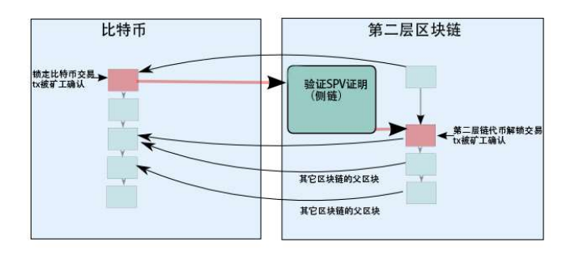
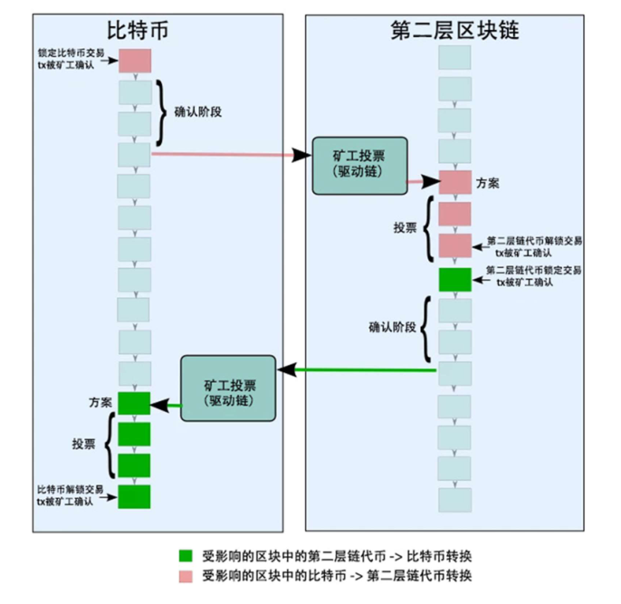

# 侧链，驱动链和根链的双向锚定设计

[TOC]

## 什么是双向锚定

双向锚定（2WP）允许比特币从比特币区块链转移到第二层区块链，并且反之亦然。“转移”其实是一个错觉：比特币是不能被转移的，但可以暂时性地将比特币在比特币区块链上锁定，同时等量的等价代币在第二层区块链上被释放。当等量等价的代币在第二层区块链上被锁定时，则比特币区块链上的原始比特币就可以被释放。这就是双向锚定的本质。这一本质存在一个问题，理论上第二层区块链已经清算完毕，但如何保证实际执行是一个问题。因此，任何双向锚定系统必须做的承诺都基于假设双向锚定的参与者是诚实的。最重要的一个假设是，第一层区块链是抗审查的，并且大多数比特币矿工是诚实的。另外一个假设是主要的保管锁定的比特币的第三方也是诚实的。如果这些假设不成立，那么比特币和等量等价的第二层区块链代币可能被同时释放，这就导致了恶意的双花。任何一个双向锚定系统必须选出一个实施方案，以保证参与的各方承诺的诚实性是在经济上和法律上有根据。这涉及到那些由关键性参与方发起的攻击的成本分析，和攻击因果关系分析。双向锚定方案的安全性取决于其激励体制是否能够强化系统中关键性的参与方对系统做出的承诺。

## 什么不是双向锚定

质押托管合同（BEC）是比特股上创建的一种方法，这种方法可以让比特币（或法定货币）在一个智能支付平台上创建和平台本身不同的代币（如 bts）进行交易。这种方法也适应于其他平台。这种方法可以在平台上锁定发行者的当地货币或比特币来发行债券，一般来说锁定的货币或比特币价值要超过他们创建的债券价值，或等值，然后他们就可以创建债券白条在平台上销售。平台监控比特币的实时价格可以实现发行的债券总量的动态调整。显然，这种方法不是双向锚定，因为这种方法创建了新的“比特币”，并且没有等量的比特币在比特币区块链上被锁定。质押托管合同（BEC）的安全性通常是弱于双向锚定（2WP）的，因为用户必须信任没有对应利益关系的记账方，他们可能没有获得高额的奖励，但用户却必须信任他们是诚实的。并且，因为本地代币市场价格的波动性，让持有债券的参与方几乎只有很少甚至没有经济利益。

## 任何双向锚定系统只是一个投票系统

当第二层区块链最终没有清算，我们可以将任何双向锚定系统简化，并且看出双向锚定系统就相当于有一组保管人投票来决定锁定比特币和发送已经锁定的比特币。投票可以以数字签名、哈希算力（工作量证明 PoW）、存储空间（存储空间证明 Proof of space），或者加密数字货币权益（股权证明 POS），或者其他任何已有区块链的共识系统。我们可以调整每一个参与方的投票权，调整可投票的参与方数量，调整某个参与方在某种情况下是否被允许投票，可以设定多个允许投票条件，等等，但我们无法改变这个系统的投票本身。

## 双向锚定设计

我们目前已经有的最常见的双向锚定设计是：侧链，驱动链和多重签名监管和混合设计。为了简化说明，我们将从比特币区块链转移到第二层区块链的代币称为第二层链代币（secoins）

### 单一保管人

双向锚定的一种可实现形式是建立一个交易所担保托管锁定比特币和执行监管解锁等量第二层链代币。在第二层区块链代币没有被锁定前需要锁定比特币，可以由交易所手动执行，也可以通过软件协议来执行操作。这个操作过程可用下图来描述：

### 多重签名联邦

双向锚定的一个更好的实现方式是建立由一组公证人控制的多重签名，其中大部分公证人被批准执行资金解锁。这种设置方式要比由单个组织来控制资金更合理，但控制权依然有可能中心化。为了实现真正的去中心化，需要仔细选择公证人，让他们分布在不同的司法管辖范围，不同的地理位置，并且每一个人都要拥有良好的声誉和足够好的保密性。他们不能太少，也不能太多。这个操作过程可用下图来描述：

### 侧链

为了不让更多第三方参与双向锚定，每个区块链可以通过协议来实现强制执行的共识。一个区块链系统性能能够理解其它区块链的共识系统，能够实现在获得其它区块链系统提供的锁定交易证明之后，自动释放比特币。可以用下图来描述：

然而，当使用比特币的侧链时存在几个问题：

- 大多数公共区块链没有最终结算方案。如果第二层区块链也没有最终结算方案，那么比特币区块链就不能确认第二层区块链的交易是否被第二层区块链网络所接受。（例如：锁定第二层链代币（secoins））它所能得到的只是一个概率保证：越多的工作量证明被用来验证一个交易，就意味着它越有可能已经被接受。
- 即使第二层区块链有最终结算方案，如果没有区块链纠缠（见下一节）那么第二层区块链将遇到与比特币区块链相同的问题。如果存在纠缠，那么第二层区块链的出块率不能高于比特币的出块率。
- 比特币的侧链需要一个软分叉或者硬分叉来添加新的复杂操作码。Blockstream 的方案现在是不完整的，没有解决简单支付验证（SPV）证明的工作量证明（POW）的验证问题。

### 区块链纠缠

解决双向锚定缺乏最终交易确认问题的一种方式是区块链纠缠，例如在第一层区块链中锁定交易的被撤消，就等同于第二层区块链中解锁交易的撤消。有几种区块链纠缠的方式：

1. 第二层区块链的交易被嵌入到第一层区块链的交易中（例如嵌入到OP_RETURN 支付载荷中，像合约币（Counterparty））
2. 第二层区块链的区块有两个父块，一个在第二层区块链，一个在第一层区块链。第二层区块链节点验证第一层区块链里的父块是否是在比特币的最长链。
3. 第二层区块链的区块被锚定在被监管的第一层区块链的加密交易中。

前两种方式允许第二层区块链验证简单支付验证（SPV）证明，而不需要证明者提供确认区块头部信息（header），因为第二层区块链客户端也保存了一份比特币区块链的副本（第一种方式中的整个区块链，第二种方式是只保存区块头部信息）。而第三种方式并不可行。

下图显示了侧链将比特币转移到第二层区块链中而无需额外确认（以比特币尽可能快的速度）：

区块链纠缠有以下几个缺点：

- 它阻止了第二层区块链以比比特币更高的速率创建区块，因为在锚定前，区块链分支的接受情况存在不确定性。有可能出现描定的是一条短链，而不是锚定在最长链吗？
- 在比特币交易中嵌入了第二层区块链的交易时，第二层区块链的所有用户都需要处理两个链的交易。
- 区块链纠缠解决了最终结算方案的某方面问题，但没有解决第一层区块链中被锁定的比特币的监管问题。

### 驱动链

驱动链将被锁定比特币的监管权交给比特币矿工，并且允许比特币矿工们投票决定何时解锁比特币和将解锁的比特币发送到哪里。矿工使用比特币区块链投票，使用区块里的某些字段来实现投票（例如 coinbase 字段）。越多的诚实矿工参与进来投票，则安全性就越高。下图是对驱动链的描述：

### 混合型

迄今为止所提出的所有设计都是对称的：用于解锁第二层链代币的方法与解锁比特币的方法是相同的。但第一层区块链和第二层区块链有本质的不同：第一层区块链主要是在发行货币，而第二层链则不发行货币。这在安全性方面存在巨大的隐患，它表明了对称的双向锚定模型可能是不够完善的。混合双向锚定是对两边使用了不同的解锁方法，例如在第二层区块链上使用侧链而在第一层区块链网络上使用驱动链。

## 根链（RSK）案例

根链（RSK）是很特别的。根链基于这样一种基本的设计选择：必须与比特币联合挖矿。因此，我们必须分析出最佳设计。我们要考虑到：

- 哪一方控制着被锁定的比特币
- 攻击的成本是什么
- 攻击的后果是什么
- 参与的激励机制是什么

我们发现，如果几乎全体的比特币矿工都加入到联合挖矿中，当监管者是比特币矿工时，参与各方可以被激发出最高的诚实性，但只有当几乎所有矿工都参与其中。在联合挖矿的情况下，驱动链和侧链都完全依靠比特币矿工的诚实，两者的安全性是相同的。然而，侧链在比特币一侧实现起来要复杂得多，所以在比特币这一侧，根链的最佳选择是使用驱动链。而在根链这一层，我们使用侧链的方式来实现。 所以从这一点来说，根链是采用混合型设计方案，可以被称为驱动链/侧链。

当矿工参与联合挖矿的程度比较低时，“驱动链/侧链”的安全性是很低的。因此，我们建议采用这样一种混合模型，其中被锁定比特币的安全性是基于驱动链外加一组公证人。矿工和公证人（拥有不同的权重）共同投票决定解锁哪些比特币。公证人使用数字签名进行投票，而矿工则在他们的 coinbase 交易中写入一个特殊的标记进行投票。这是中心化和安全性之间的一种权衡。最终的根链双向锚定设计可以被称为“驱动链 +公证人/侧链”。我们会基于比特币全体矿工参与到联合挖矿的程度来动态调整投票权重。在初期，只有公证人才有投票权，使用传统的多重签名交易。在中期，当驱动链功能被加载到比特币时，公证人和矿工将一起参与投票。从长远来看，当 90%以上的矿工参与了联合挖矿时，公证人的投票权将被删除，届时只有矿工才有投票权。这个演变的过程可以用来图来描述：

在本质上，我们建议将锁定的比特币的安全性建立在矿工和一组公证人身上，但是这两者之间的投票权重会因全体矿参与联合挖矿的程度而动态调整。

在之后文章中，我们将展示驱动链+公证人的设计是如何在比特币上实现的，只需要在比特币上植入一个单一的操作码 OP_CHECK_VOTES_MULTISIG_VERIFY 。这个操作码很容易理解，编程实现也很简单，并且可以以软分叉的方式在比特币网络上部署。

关键词：比特币，英国退欧，合同，密码学，减半，投资，智能。

原文链接：<http://media.rsk.co/sidechains-drivechains-and-rsk-2-way-peg-design/?winzoom=1>

原文作者：由 rskmedia 发表

原文发表日期：2016 年 4 月 5 日

翻译：黄世亮

翻译日期：2016 年 12 月 23 日
