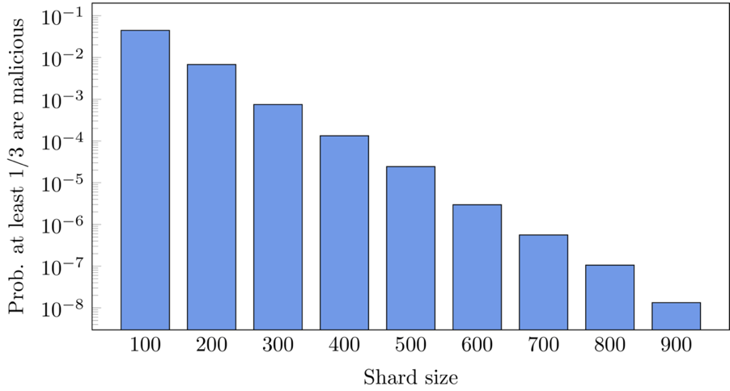

# Zilliqa设计构思-网络分片

Zilliqa是一个新的区块链平台，每秒可处理数千个交易， 因此Zilliqa有潜力与VISA和MasterCard等传统的支付方式相匹敌。 更重要的是，Zilliqa的交易吞吐量可以随网络规模增大而近似线性增长。

此篇将介绍Zilliqa可扩展性的核心思想 — — 分片（Sharding）。Zilliqa的分片含多个层面，包括网络分片、交易分片和计算分片（network sharding, transaction sharding, and computational sharding）。其中最重要的是网络分片，因为其他分片机制都建立在网络分片之上。

## 那么，到底什么是网络分片呢？

实际上，网络分片（我们将在本文中将其简称为分片）是一种将Zilliqa网络划分成一系列包含更少节点的群组的机制，这样的每个群组被称为分片（shard）。比如说，当一个网络由1000个节点构成时，我们可以将此网络划分为10个、每个由100个节点组成的分片。

Zilliqa真正可扩展性的秘诀就在于网络分片。假设我们有一个包含1000个节点的网络， Zilliqa将自动地把该网络分成10个、每个包含100个节点的分片，且所有分片可并行地处理交易。如果每个分片每秒能处理10个不同交易，则所有分片每秒可一并处理100个交易。由于分片架构能平行地处理交易，因此Zilliqa的吞吐量可随着网络规模增加而线性增长。

分片的想法当然不是新事物，事实上，它可以追溯到数据库领域，在数据库中它被用来提高性能、可扩展性和I/O带宽。然而，在区块链中分片的想法起初是由Zilliqa团队成员于2015年在合著的学术论文(最终以A Secure Sharding Protocol For Open Blockchains为题发表于CCS 2016)中提出的。

## 就是这样吗？听起来很简单噢！

虽然想法听着很简单，但在工作中实践起来却并非如此。为了理解面临的挑战，让我们首先从实现分片要解决的一些关键问题入手：

1. **对女巫攻击的防御（Sybil Resistance）**。由于Zilliqa是一个公有区块链平台，任何有连接因特网电脑的人都可以使用它。包括Zilliqa在内的任何公有区块链的运行都需要足够数量的节点，因此公有区块链难以避免恶意节点的进入。根据定义，恶意节点会试图通过操纵多个节点来破坏系统，并影响任何基于多数节点的决策过程。这就是通常所说的女巫攻击（Sybil Attacks）。

2. **创建分片**。让我们先假设女巫攻击的问题通过某种方式被解决了，并且假设网络中1000个节点被分为10个、每个包含100个节点的分片。那么哪个节点被分配到哪个分片是由谁决定的呢？这当然不能由Zilliqa团队成员所控制的一个节点或一组节点决定，因为如果Zilliqa团队变成恶意的（只是假设），那么他们可以将所有恶意节点集中在一个分片中来损害Zilliqa的安全性。顺便说一句，如果您不知道Zilliqa团队成员是谁，欢迎随时查看我们的团队组成（链接<https://www.zilliqa.com/team.html>）。

3. **分片大小**。这个问题很简单，比如说我们可以拥有一个由10个节点组成的小分片吗？答案当然是不可以！事情当然没那么简单。事实上如果分片很小，那么攻击者就会更容易控制它，而且由于这些分片运行了Zilliqa协议的某些部分（如共识），我们当然不希望由一个很小的分片（很有可能只包含恶意节点）来决定接受哪些或拒绝哪些交易。

## Zilliqa如何解决这些问题呢？

下面，我们来介绍Zilliqa解决上述问题的方法。

1. **防控女巫节点**。有几种可能的方式可使女巫攻击代价高昂或难以进行。例如，通过要求节点存入相当多的金钱（或代币）作为抵押，或要求他们执行一些计算密集型任务（也被称为工作量证明，即PoW）。Zilliqa就使用PoW。每个希望加入Zilliqa网络的新节点都必须先执行PoW，网络中的现有节点验证新节点的PoW并授权其加入网络。PoW相当于Zilliqa网络的入场券，只有拥有有效入场券的节点才能加入网络。PoW使任何真实世界的个体难以操纵很多个节点。

2. **自动创建分片**。在Zilliqa中使用PoW会自动提供一种创建分片的方法：Zilliqa首先会基于POW选举出一组目录服务委员会（directory service committee，简称DS委员会）的专门节点，并定期移出一名DS委员会老成员、增加一名新成员，这一特定间隔被称为DS周期（DS-epoch）。在此过程中，Zilliqa使用先进先出策略，新进入委员会的节点是最快解决PoW的节点，因此任何时候DS委员会的大小都是固定的。DS委员会一旦当选，便启动分片程序，网络中的所有其他节点立即执行另一个PoW，其PoW由DS委员会验证，每个节点根据提交情况和随机性，被分配到特定的分片。PoW提交的最后几位二进制数字决定了节点将被分配到哪个分片。

3. **选择合适的尺寸**。选择合适的分片大小对系统的安全至关重要。因为提交PoW是使用散列函数（hash function）生成的，因此使用PoW创建分片相当于随机无差别地抽样一个节点集。下图显示了不同分片大小中至少三分之一的成员是恶意的概率。请注意，如果分片大小为100时，此概率大约为0.04。由于我们希望拥有绝对多数的好的节点（用于之后的共识），100作为分片大小显然是不安全的。好消息是随着分片大小的增加，这一概率不断降低。从600个节点开始，概率降至百万分之一。出于这个原因，Zilliqa认为最小分片大小为600。

特定大小的分片中至少有三分之一的恶意节点的概率表。 由于我们想限制恶意节点的数量，概率越小，Zilliqa就越安全。 对于100个节点的分片大小，这一可能性相当高。 在Zilliqa中，我们选择了600的分片大小，其包含三分之一的恶意节点的概率为百万分之一。

如果你想知道我们如何算出这些概率，请阅读我们的分片论文，链接<https://dl.acm.org/citation.cfm?id=2978389>。

## 分片带来了什么？

正如本文开头所讨论的那样，网络分片为并行处理交易开辟了新航路 — — 每个分片现在都能独立处理交易并因此产生高吞吐量。事实上，每当交易到达网络时，它就被分配到一个特定的分片上。分配是由交易发送地址的前几位二进制数字决定的，这就叫做交易分片。

分片还使计算执行和智能合约运行十分高效。例如，一部分分片可以充当映射器（mapper），其他部分分片可以充当归约器（reducer），并非常有效地执行映射-归约任务（map-reduce task），这也被称为计算分片。

## 结束语

其实，分片中仍然可能存在恶意节点，因为任何恶意节点（就像一个诚实的节点）都可以做PoW并加入网络。因此至关重要的就是，尽管分片中存在恶意节点（数量有限），但分片必须能够在新的一组交易中达成共识并提出下一个区块。
