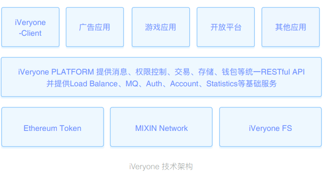

# iVeryone白皮书

**基于区块链的Facebook**
一个遵循自由市场经济规则的社交网络经济体

[TOC]

## 立项背景

Facebook是一家市值超过5000亿①美金、全球总市值排名第五的科技公司，但这是Facebook股东们的财富，与普通用户并没有任何关系。

- 20亿用户② 通过关注相互连接，形成了覆盖全球的社交网络。当用户每天在浏览好友的最新动态、阅读订阅账号的文章时，价值360亿美金③ 的广告出现在用户私有屏幕中，却没有用户因此分享到任何收益；

- 内容创作者会通过Facebook个人主页发布作品、积累粉丝，大量文学、音乐、影视、游戏等内容在社交网络孕育、传播，但Facebook只是在利用内容进行流量商业变现，并未向内容作者提供任何资金支持或回报；

- 用户的转发、分享行为，是内容的筛选器和传播渠道，使优质内容从海量信息中脱颖而出，得以被更多人能够看到。但与在Facebook中的内容创作者一样，用户的转发与分享行为所产生的价值，同样未得到体现；

如果把Facebook看成是一个经济体，所有用户都在免费为这个经济体中输入价值，但收益只归属于Facebook的股东所有。

## 项目概述

我们相信，基于区块链技术的去中心化、账目公开、不可篡改等优势，将极大降低在社会经济活动中的信任成本，进而重构一切经济组织形态, 带来金融与科技产业颠覆性的革命。但由于现实社会中实体经济产业链条长、历史悠久且利益相关者众多，区块链技术的广泛使用将会是一个极其漫长的过程。

社交网络是真实社会的网络映射，具备人类的全部社会属性；如果将内容的创建者视为生产者、内容的读者视为消费者，社交网络是一个典型的市场供求模型，也是区块链技术得以大规模应用的绝佳场景。

iVeryone定义为基于区块链的Facebook，将发行数字货币VRY。通过VRY的自由流通，使iVeryone成为一个完全遵循自由市场经济规则的网络经济体，每一个对他人有贡献的个体，都能在其中获得收益回报。

根据自由市场经济理论，在iVeryone用户会拥有一些基本权利：

1. **数字资产的所有权、支配权、收益权、隐私权** 数字资产包括：用户所创作的数字内容（如文章、音乐、图片等）、用户行为所产生的数据（用户的社交关系、浏览记录）、用户屏幕的信息显示权（决定屏幕中显示什么内容）。

2. **自由交易权** 用户可以自行决定与任何人就已有数字资产权益与货币进行交换，也可以通过契约就未来的数字资产权益与货币进行交换。在基于区块链的社交网络中，智能合约使契约最大信任障碍得以解决，因此iVeryone中能够产生出多样性的经济行为。

在iVeryone中，广告收入将分享给用户；内容创作者可以将作品定价，在被浏览的同时获得收收入，可以自行定义与传播渠道的收益分成，或依托于作品的版权进行融资。此外，用户在iVeryone中的个人主页、内容、社交关系、行为数据都属于用户的个人资产，任何应用或个人读取或使用这些数据，必须得到用户授权，用户可以对未经授权的数据使用定义收费标准。

iVeryone将传统社交网络中的所有收益都还给了用户，将使用户更加积极的参与其中，颠覆Facebook等传统社交网络的“免费增值”模式。iVeryone发行100亿枚的VRY永不增发，可用于度量iVeryone生态中的一切内容与服务，VRY的持有者将拥有iVeryone平台现在与未来的全部价值。

## Facebook的用户痛点是什么？

“计划经济”的社交网络结构，用户无偿输出价值，平台独享收益。

## iVeryone能解决什么问题？

“市场经济”的社交网络结构，让每个有贡献的个体，都能分享收益。

## 公开账本对iVeryone有什么帮助？

利用去中心化、不可篡改的属性，消除用户间达成合作的信任成本。

## iVeryone将所有数据权益还给用户意味着什么？

将社交网络的全部价值还给用户。如果Facebook这样做，那么5000亿美金市值应当属于使用Facebook的每一个人。

## 典型应用场景

### 1、在iVeryone获得“广告”收益——对展示定价、对数据定价

人们可能已经习惯在使用Facebook时，看到屏幕中出现的广告。但iVeryone认为，用户应当拥有屏幕收益权与数据收益权。

1. 广告的视觉呈现，依赖于用户手机屏幕中的展示。手机屏幕由用户付费购买，属于用户的私人财产，未经授权的视觉呈现应当向屏幕所有者付费。
2. 广告的精准投放，依赖于对用户行为数据的抓取。这些数据是由用户所创造，属于用户的私人财产，未经授权的数据使用应当向数据所有者付费。

iVeryone将遵循自由市场经济原则，保护用户数字资产一切权益。当有广告主希望向用户投放广告时，需根据用户对自己屏幕展示位的定价付费；如果进行精准投放而使用用户行为数据时，同样需要根据用户对数据的定价付费。

用户可自行决定数据的保留或删除，但无法篡改造假；iVeryone中的用户数据分为：公开数据与行为数据。公开数据如性别、年龄、个人介绍等，可被所有人读取，而行为数据将被加密存储，对应一个随机的UUID。UUID不会与用户身份ID及公开数据产生任何关联，并可随时被重置，以保护用户隐私。

当广告主进行精准投放前，需支付行为数据使用费用，将“投放条件”与用户行为数据进行对比。对比结果仅以Y/N的形式输出，例如：“是否浏览过Big.one网站——Y”。当输出值达到广告主的预设条件时，广告将出现在目标用户的屏幕中，并通过智能合约支付广告显示费用。

iVeryone中的广告主不仅仅是传统网络平台的“商家”，任何一个普通用户都可以进行精准的广告投放。用户可以通过付费，使更多人看到自己写的文章，公开咨询一个问题，找到志同道合的朋友，甚至发布一个征婚启示；而广告展现形式可以是Feed流中的一条信息、屏幕顶端的Banner、一条即时消息甚至一个语音电话。iVeryone的广告除了用来推销商品，还可以用于符合法律规则与伦理道德的一切信息推荐行为，这将极大提升VRY的应用场景，使每一位用户在社交网络的日常使用中，都能够获得广告收益。

### 2、在iVeryone获得“内容”收益——对内容定价、用版权融资

在iVeryone诞生的若干年后，人们可能会惊讶于：历史上居然曾存在不允许用户对原创作品自行定价的社交网络。

1. 内容是由作者的时间、知识和劳动力所创造的数字商品，作者理应拥有对于这些商品包括定价权在内的一切权利。
2. 通过创建智能合约，作者可以利用内容在未来一段时间的收益权进行融资，以实现短期经济回报。

在iVeryone的个人主页，每个用户都可以发布自己创作的内容，包括：文章、音乐、视频、
甚至一个应用程序或游戏。这些内容的所有权信息将被记录在区块链中，并通过智能合约定义价格。当内容被读取时，原作者将自动收到费用。

基于区块链技术账公开、不可篡改的特性，版权信息与付款信息都将清晰可查，因此iVeryone支持将一份作品的未来收益打包成一份投资标的，向特定投资者融资（基于当地法律法规，可能会对投资者人数与资质进行限制）。例如：当一首音乐被定价后，作者可将未来3年的收入打包成为一份投资标的，投资者购买后，音乐作者可以即获得收入；此后3年内当这首音乐每一次被收听，收入都将按照智能合约自动与作者和投资者进行分配，甚至作者可以与投资者通过智能合约签订分期付款或对赌协议。

我们相信，当内容作者可以依赖于内容直接获得经济收益时，会有越来越多的优秀作品在iVeryone诞生，而这将吸引更多用户加入iVeryone社交网络，以实现用户规模的良性增长。而对文化娱乐产业的投资者，通过iVeryone进行版权投资将获得公开透明、持续的投资收益，且投资权益可以转让他人。iVeryone中的一切定价、支付、投资及权益转让，都将使用VRY进行。

### 3、在iVeryone获得“转发”收益——利用社交势能变现

社交网络中的用户转发行为，天然形成了一个遍布全球的内容分发网络，对于优秀内容的扩散和筛选起到了至关重要的作用。

在iVeryone中，作者为促进内容更大范围的分享扩散，可以通过智能合约将内容付费与转发激励联系在一起，例如：将每笔内容销售收入的50%分享给转发用户，并按照以下公式分配$I=P \cdot 50% \cdot (50%)^{n+1}$（I为收入，P为内容定价，n指转发节点与付费节点的间隔数）。由于区块链账务公开的特性，每一笔交易的分配都将清晰可见，发用户仅依靠转发或分享优秀内容，便能获得可观的经济收益。

iVeryone智能合约模板，将以可视化编辑器的方式向每一位用户提供，用户可以基于自有版权内容，定义内容收益的分配公式，以形成一个多层级的分销网络。由于iVery客户端会默认开启“相同转发内容折叠显示”的展示策略，因此对相同内容，只有Feed流中最早的转发者可获得展示。这些规则会鼓励用户积极寻找优质内容、关注内容原作者、并在最短的时间内参与新内容的扩散，这也将减少盗版内容的生存空间。

社交网络分享与智能合约相结合，使用户的社交势能得以变现，并解决了传统内容发行渠道费用高、效率低、覆盖面窄等问题，是图书、音乐、游戏等内容理想的发行渠道。

### 4、其它基于区块链智能合约的应用创新

考虑到由于VRY的价值增长，可能会导致一些长时间执行的合约早期定价过高而未能及时修正，失去应有的消费者，因此iVeryone提供了一个动态常量P。P 等于最近一段时间VRY锚定美元价格的倍率，可在定价中被直接引用，例如：一首音乐播放定价为：5/P VRY。

在iVeryone社交网络经济体中，任何基于自有权益的行为都将得到支持。我们将持续完善iVeryone的底层架构并开放端口，使iVeryone生态中的所有人都能够通过开发Dapp创建新的应用场景并从中获益。此外，任何第三方应用、游戏可以接入iVeryone-SDK，在用户授权下直接调用iVeryone账号、社交关系与支付系统，规避传统渠道的高额分成，赚取更具增值空间的VRY。

## 经济系统

### 广告主

广告主对于iVeryone生态必不可少，他们通过向用户支付VRY获得广告推送的机会，是普通用户VRY主要来源之一。

### 投资人

在iVeryone中对内容版权使用VRY投资，并在内容定价传播中，持续获得收益。

### 开发者

加入iVeryone生态体系的应用、游戏开发商，将支持使用VRY进行解锁关卡、购买道具及虚拟支付。

### 用户（内容生产者）

作为内容生产者的用户，可以对自己原创内容定价，被阅读后将获得VRY。

### 用户（内容消费者）

作为内容消费者的用户，将在阅读付费内容时将支付VRY。

### 用户（传播者）

作为内容传播者的用户，当转发的付费内容被阅读时，将获得VRY。

### 交易手续费

为避免无效交易产生，保持VRY的价值持续增长，iVeryone将收取每笔交易额的1‰作为手续费并自动销毁，销毁上限为总Token的30%。

## iVeryone的系统架构

iVeryone利用区块链技术，在去中心化账本中记录社交网络中的所有用户账号信息、交易信息;通过分布式数据库存储用户所发布的文章、图片、音视频等。iVeryone还将为开发者提供开放平台，使任何开发者都可以开发基于iVeryone的Dapps，或将已有应用、游戏接入iVeryone以VRY定价，并通过持有VRY分享iVeryone的成长收益。

### 概述

iVeryone底层是一套基于Ethereum、MIXIN Network和自主研发的iVery FS的区块链解决方案，需要多个功能组件的有效协作，包括：网络通信、权限控制、交易模块、Ethereum智能合约、MIXIN Transaction、iVery FS等，并在前期实现了所有权确认、收益分配、广告系统等核心应用层业务逻辑。

### Ethereum

Ethereum是面向智能合约开源的、基于区块链的分布式计算平台。Ethereum是一种有效的分布式虚拟机，允许最终用户为交易构建智能合约。

### Mixin Network

Mixin Network 致力成为最大的移动区块链网络，安全、高吞吐量和快速确认以及跨链互联是他的重要特性。我们将成为Mixin的第一批合作伙伴，共同为用户带来最好的体验。
<https://mixin.one/>

### 支付系统

VRY是符合Ethereum ERC20规范的Token，在移动端的应用开发中，我们使用Mixin的钱包作为安全的移动钱包解决方案。

### 存储网络

iVery FS是在IPFS基础上开发的、采用 hdfs + cdn + ipfs 相结合的分布式存储方式，充分利用现有技术保证前期用户体验，并将在之后逐步抛弃hdfs+cdn，实现去中心化。iVery FS会存放用户的个人资料数据、发布的内容以及例如音乐、图片等数据。iVery FS的认证层与iVery Platforn结合，通过权限私钥认证来提供数据存储服务。

### iVery Platform

iVery Platform 是在Ethereum、MIXIN Network 和 iVery FS技术的基础上，实现的一套包括消息、权限控制、交易、存储、钱包等的统一平台和接口服务。

### 消息

每个帐户可以发送结构化的消息给其他的帐户，并且可以定义脚本来处理他们接收到的消息。 用户离线时可以委托节点进行代为存储离线消息，我们还将把该功能扩展应用于推送通知。iVery Platform 给每个帐户提供了只有自己的消息处理脚本能访问的私有数据库。 消息处理脚本同样可以给其他帐户发送消息。

### 权限控制

iVery Platform 的权限控制系统用来控制数据的读取权限，其允许用户将自己的数据哈希对他
人的公有密钥附加一个引用，有了这个引用其他人就可用自己的私有密钥来对数据进行访问。

### 所有权确认

利用区块链共识机制确认数字资产最早拥有者。

### 可视化智能合约

可视化智能合约是iVeryone团队实现的一个Dapp，我们开发了一套符合ERC20标准的合约生成工具，用户可以通过可视化界面和预制模板，方便的创建适用于自己应用场景的合约方案，以实现在iVery中的渠道分成、版权融资等。

### 数据定价

用户的个人资料和行为信息会以脱敏加密形式记录在iVery FS里，除了用户和其授权的对象，其他人无法获取。但是在互联网大数据时代，基于大数据计算结果的应用，很多时候是用户自身需要的产品，iVery Platform给第三方应用提供了基于黑盒的用户资料与行为信息匹配接口，第三方应用经过用户授权后，可以向用户付费并使用预设的数据标准与用户数据特征进行匹配，获取匹配结果值。

### 广告投放

iVery实现的广告系统是基于iVery Platform的广告投放Dapp，为广告主寻找到精准的投放用户，同时向用户付费展示广告。同时我们也欢迎第三方大数据公司接入iVery Platform，通过VRY计价，为用户提供更多选择和服务。

### 开放平台

用户在iVery存储、产生的所有数据都是用户的私人财产，除了iVery的开发团队外，任何开发者都可以通过接入开发基于区块链的相关应用或插件，或将已有的应用或服务接入iVeryone生态体系。

## iVeryone的软件设计

我们会选择应用程序与iVeryone底层并行开发的策略，预计将在2018年Q1-Q2完成应用程序iVery的开发（安卓、iOS、Web版），接入VRY数字货币以实现iVeryone所描述的一些基础理念，如广告收益、渠道收益、内容定价、内容投资等，面向用户开放注册。随着区块链技术与分布式存储的不断发展和完善，iVery的用户数据将进行迁移以实现完全的去中心化。

### 帐号体系

用户可以通过手机、邮箱号注册iVeryone，成功后将拥有一个iVeryone账号。iVeryone账号可用于在网络中公开传播，建力社交关系，是用户在iVeryone中的身份标识，并将用于跨应用登陆、资产管理、交易等环节。

### 数字钱包

iVery将使用由Mixin提供的全币种数字钱包，支持币币互换。

### 广告系统

用户需要通过广告系统，设置自己可接受的广告形式及广告展示单价，并对广告系统读取自己的行为数据定价。广告系统会综合历史数据，向用户建议较为合理的价格体系，避免因定价过高无法接到广告投放，或定价过低影响收益。

当广告主希望投放广告时，可向广告系统输入投放标准，如年龄、地区、性别、浏览记录、活跃度、收费标准、展示位等指标，填入支付单价的最大金额与人数，由广告系统进行筛选匹配。若投放标准中涉及用户行为数据，在筛选过程中将支付数据使用费，系统将通过基础信息确认检索范围，并按照数据使用费由低到高依次进行检索，当用户行为数据与广告投放标准达成匹配时，会自动达成广告投放，并根据职能合约完成支付。

### 个人主页

个人主页是iVeryone的核心模块，支持用户存储、发布多种类型的内容，例如：文章、图片、链接、音乐、视频、应用、游戏等，所有内容都可以用VRY定价。用户在iVery个人主页中的内容和数据，都属于用户私有资产，用户可以授权任何应用读取并管理这些资产，iVery并不是唯一选择。

### 动态

动态功能是iVery的主要内容分发通道，当用户关注的账号发布新内容时，都会出现在动态列表中，依托于“关注”达成网状结构，天然形成了一个多层级内容分发体系。动态中的付费内容会存在“付费+金额”的明显标识，点击即使用钱包中的VRY完成支付。此外动态信息流也是广告的主要投放位置之一。