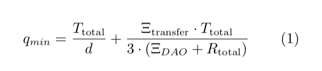
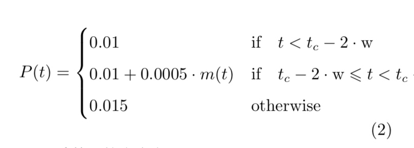
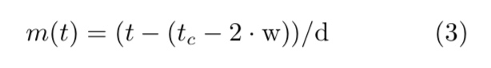
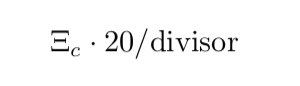
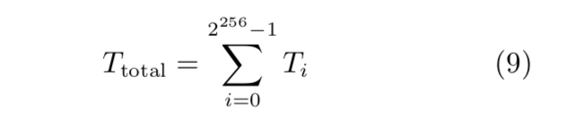
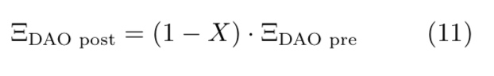
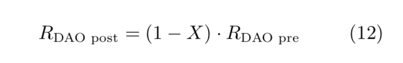
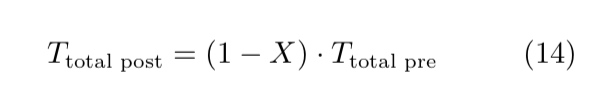

# 去中心化的自治组织来管理信任

Christoph Jentzsch Founder & CTO, Slock.it christoph.jentzsch@slock.it
译者: 张亚宁 - ethfans.org

2016年5月1日

[TOC]

## 1 序言

历史上，信用的管理始终是中心化的。一群个体(受托人)会制定一套合约并结合他们的资源形成信任，然后由一个人或者一个公司来管理， 受托人失去了直接管理他们资产的直接权利。众筹(Massolution [2015])的崛起降低了小的投资人参与大项目的门槛。众筹的资金仍然带有很高的风险，由于公司管理不善经常会未能兑现承诺或者干脆直接消失的无影无踪(Knibbs [2015], Biggs [2015])。谢谢以太坊的开发者们(Buterin [2013], Wood [2014])，它集成图灵完备语言和运行智能合约的能力，使的创建一个受托人直接管理他们资金的成为可能，同时仍然能保证众多小的受托人能一起实现同一个大的目标。我们已经在区块链上使用智能合约(Szabo [1997], Miller [1997])来形成一个DAO组织。在这个白皮书里，我们会通过一个具体的例子来详细介绍DAO管理信任的概念。

在解释了DAO概念之后，我们会讨论“多数抢劫少数攻击“并提出一种解决方案，**“DAO分离”**。 最后我们会浏览智能合约，以更细节**“DAO分离”**来结束。
智能合约的地址在: [https://github.com/slockit/DAO/](https://github.com/slockit/DAO/)。

## 2 概念

这一节会介绍DAO的基本概念和它能够做什么。

在DAO部署到以太坊区块链之后，在规定的起始筹资阶段，任何人都可以通过向DAO智能合约地址发送以太币(支持以太坊网络的数字燃料) 的方式来参与众筹。作为交换，代币会被创建用来代表是会员身份以及DAO一部分的所有权;这些代币会被分配给众筹的参与者。代币的数量是按照发送以太币的比例分配的。每一个代币的价格会随着时间而变化(见章节 5)。在众筹结束后，这些代币的所有权可以通过以太坊区块链的交易转移给其他用户。在部署合约时，一个最小的DAO众筹目标和起始众筹时间会被设定。如果最小众筹金额在众筹阶段没有被满足，每一个众筹者的以太币会被返还。在众筹阶段结束后，我们用Ξraised来表示众筹来的总资金，用Ttotal来表示创建的总的代币数量。这个DAO仅仅用来管理众筹金额。它本身没有生产产品，编写代码和开发硬件的能力。它需要一个服务提供商来完成这些和其他目标，通过签署提议的方式来临时租用他们。DAO的每一个成员都可以花费一部分众筹来的以太币来提交提议， 在项目中记作Ξtransfer。如果建议被批准，以太币会发送到另外一个表示提议项目的合约中。这样， 智能合约可以参数化，使DAO能与资助的项目相互作用和影响它。一个在DAO和资助项目之间的协议的例子可以在附录中找到(A.4)。

DAO的成员投票权重由他们掌握的代币数量来决定。代币是可分割，无差别的，可以方便的在用户之间进行转移。在合约中，成员的个人行为不能被直接确定。任何提议都需要一个时间范围tp去讨论和投票。在我们的例子中，这个时间范围是由提议的创建者设定的，对于一般的提议最少需要两周的时间。

在tp时间后， 代币的持有者会调用一个在DAO合约中的函数来验证大多数的投票是支持提议的并达到了法定人数。如果是这种情况，提议将会执行。如果不是这种情况，提议将会关闭。最小的法定人数表示投票成立的最小代币数，标记为qmin，计算方式如下:


d是最小密度因子(minQuorumDivisor)。这个参数默认值是5， 如果法定人数在超过一年仍未满足，它会加倍。

ΞDAO是DAO拥有的总的以太币数量， Rtotal是总的奖励代币，在7 节会提到(同样指 totalRewardToken 在A.3)。 ΞDAO + Rtotal 的 和等于总共众筹得来的以太币加上收到的奖励。

这意味着， 所有的提议如果要通过， 起始的20%的所有的代币的法定数字是必须的。 如果Ξtransfer和众筹的以太币加上收到的奖励相等， 至少53.33%的法定数字是必须的。

为了组织提议的垃圾化，新建提议时需要支付最小押金，如果法定数达到将返还押金，如果不足提议的押金将保留在DAO中。DAO里默认的提议押金值可以通过一个其他提议来修改。

## 3 记法

在本文中，Ξ 总是表示以wei为单位的以太币。 定义为1 Wei = 10−18 Ether (Wood [2014])。
同样地，DAO代币标记为T ，总是代表以它基本单位为单位DAO代币。定义为10−16 DAO代币。

## 4 大多数抢劫少数攻击

每一个DAO都需要去减缓的问题是，大多数抢劫少数。如果攻击者有51%的代币，在众筹期间获得或者后面购买的方式，都可以创建一个提议发送所有的金额给他们。因为他们拥有绝大多数的token，所以他们总是能通过提议。

为了防止这种现象，少数人总是能选择取回他们众筹的部分金额。可以通过将DAO一分为二来实现。在这种情况下，个人或者一群代币的所有者，非常反对某项提议，在某项提议执行前想要取回他们的资金，他们可以提交一个特殊的提议来形成一个新的DAO。少数人可以投票将他们的资金转移到这个新的DAO中，使的剩下的大多数只能花费他们自己的钱。这个想法起源于[Vitalik Buterin](../../人物/Vitalik.md) (Buterin [2015])发表的一篇博客。

这种简单的改进存在的问题是，它不能处理投 票冷淡:一些代币的拥有者或许并不会积极的参与 到DAO中，不能紧密的跟进提议。攻击者可以利用这点作为优势。即使少数人有机会取回他们的资金并且分离DAO，但是他们其中的一些人可能不能及时意识到情况而不会这样做。为了DAO安全，它需要考虑那些不活跃的代币拥有者不会丢失他们的资金。 我们建议的解决方法是， 限制每个单独的DAO对应一个单独的服务提供商。这个服务提供方控制着一个唯一的账号，通过提议可以从DAO中接受。另外，服务器提供商可以创建DAO可以发送金额的白名单地址。这给了服务提供方非常大的权力。 为了防止滥用这种权力， DAO可以投票选择新的服务提供方，或许有可能 导致前面描述的DAO一分为二的情况发生

任何一个代币的持有者可以提交一个提议去选举新的服务提供方。实际上，即使一个单独的token拥有者也能够取回他们剩余的ether份额和维持他们在未来的应得的收益(根据之前的贡献决定)，这些都会自动发送到新的DAO中。收益的定义是，从DAO众筹起，DAO从产品生产中获得的任何ether，这将会在第7节中进一步详细阐述。

选举新的服务提供方过程如下: 任何一 个token持有者可以发起一个提议来选举新的服 提供方。这个提议需要押金支付，否则攻击者可以投票修改为一个非常高的押金，来阻止任何分离。 这个提议的投票期为10天。

这比常规提议的最低期限要少4天， 是为了 允许任何人取回他们的资金，在任何潜在的恶意提议通过之前。同时没有法定额度限制，所以任 何token持有者有权力分离去他们自己的DAO。

讨论期通常会讨论新的服务提供方，进行非正 式的投票。投票的结果不会产生任何实际作用，它 只有纯粹的指导性功能。在第一轮投票之后，代币 的持有者可以进行第二轮的投票来确认结果。大多 数的人可以投票保持原有的服务提供方来避免分 离，或者相反他们可以投票新的服务提供方来将他 们的资金份额转移到新的DAO中。

## 5 代币价格

为了奖励在众筹阶段购买代币的参与者，因为他们有更少的信息，所以相对于后加入的人承受了更大的风险，他们会支付更少相对于后加入的人。
就现在描述的DAO而言，我们选择了以下的价格计算方式:


乘数m的定义如下:


这里的t是unit秒时间，tc是众筹的关闭时间 (见A.2 的closingTime)，w是一周的秒数，d是一天的秒数。
因此每一个购买者获取的代币的计算方式如下:P(t) · Ξc。这里Ξc表示支付的以太币，单位是wei。

这个结果是一个常量价格在开始的时候，至到2周后代币出售结束的时间。 在这个时间， 每个DAO代币的价格每天会按照0.005 Ξc 的速度来增长。至到众筹结束前的第四天，每个DAO代币会是一个固定的价格 0.015 Ξc。

价格的增长会导致一种情况，一个单独的参与者在初试价格购买了代币后，在预售结束后立即分离出一个DAO后悔得到更多的以太币，因为其他的参与者支付了更高的价格(Green [2016])。
为了避免这种可能性，所有比购买初始价格高的代币的以太币，会被发送到一个额外的帐户。在A.2标记为extraBalance。这个钱可以被发回到DAO中，通过一个提议，在DAO已经花费至少这个金额的钱之后。
这个规则已经实现为一个内部函数 isRecipientAllowed在 6.3 节。

## 6 合约

本节主要详述智能合约实现上述的概念。合约 使用Solidity(Reitwiessner and Wood [2015])编写。

每一个合约包含成员变量和函数，这样外部就可以通过向以太坊网络发送交易的方式来访问， 以DAO合约地址为接受者，方法ID(参数可选)为数据。在这一节我们会详细讨论变量和函数的含义。

主合约被称作’DAO’ 。 它定义了DAO的内部工作方式，它的成员变量和函数来源于’Token’和’TokenSale’。’Token’定义了DAO代币的内部工作方式，’TokenSale’定义如何使用如何使用以太币购买DAO代币。 除了这三个合约外， 还有’ManagedAccount’合约，它作为一个辅助合约用来保存分发给代币持有者的奖励， 还有’extraBalance’合约 (见第5节)。合约’SampleOffer’(A.4)是一个从服务提供方到DAO的提议的范例。

### 6.1 Token

``` Solidity
contract TokenInterface {
    mapping (address => uint256) balances;
    mapping (address => mapping (address => uint256)) allowed;
    uint256 public totalSupply;
    function balanceOf(address _owner) constant returns (uint256 balance);
    function transfer(address _to, uint256 _amount) returns (bool success);
    function transferFrom(address _from, address _to, uint256 _amount) returns (bool success);
    function approve(address _spender, uint256 _amount) returns (bool success);
    function allowance(address _owner, address _spender) constant returns (uint256 remaining);
    event Transfer(address indexed _from, address indexed _to, uint256 _amount);
    event Approval(address indexed _owner, address indexed _spender, uint256 _amount);
}

```

以上是’Token’合约的接口。 这些合约的接口起到文档的作用，可以概述合约中的函数和变量。全部的实现可以在附录中找到(A.1)。 这个合约展示了一种标准代币: <https://github.com/ethereum/wiki/wiki/> Standardized_Contract_APIs， 合约<https://github.com/ConsenSys/Tokens/blob/master/Token_Contracts/contracts/Standard_Token.sol> 是其他合约创建的基础。

- map类型的balances存储了DAO成员的代币，以address做索引。所有继承实现了TokenInterface的合约，都可以直接修改map的内容，但是只有4个方法可以这样做: buyTokenProxy, transfer , transferFrom 和splitDAO。

- map类型的allowed用做记录预定的地址，这些地址允许以其他人的名义发送代币。

- integer类型的totalSupply是现存的DAO代币的总数量。public 关键字创建一个同名函数，它用来返回变量的值，所以被称为公开变量。

- 函数balanceOf返回特定地址的余额。

- 函数transfer用作请求者发送代币给其他地址。

- 函数transferFrom用作代表某人来发送以太币，并且先前已经使用approve函数批准。

- 函数approve用做DAO代币的所有者，指定一个特定的spender来转移指定 value 的金额从他们帐户，使用transferFrom函数。如果想检测某个地址是否被允许代表某人使用DAO代币，可以使用函数allowance，它会返回允许spender是否可 以花费的代币。这有点类似于写支票。

- 事件Transfer用来通知轻客户端balances的变化。

- 事件Approval用来通知轻客户端allowed的变化。

### 6.2 TokenSale

``` Solidity

contract TokenSaleInterface {
    uint public closingTime;
    uint public minValue;
    bool public isFunded;
    address public privateSale;
    ManagedAccount extraBalance;
    mapping (address => uint256) weiGiven;
    function TokenSale(uint _minValue, uint _closingTime);
    function buyTokenProxy(address _tokenHolder) returns (bool success);
    function refund();
    function divisor() returns (uint divisor);
    event FundingToDate(uint value);
    event SoldToken(address indexed to, uint amount);
    event Refund(address indexed to, uint value);
}

```

以上是TokenSale合约(A.2)的接口。

- integer类型的closingTime是代币预售期结束的(unix)时间戳。

- integer类型的minValue是DAO众筹时需要接受的值，单位是wei。

- boolean类型的isFunded是ture如果DAO已经满足最低众筹目标，否则false。

- 地址类型privateSale用作DAO的分离 - 如果设置为0，表示为公开出售，否则只有存储在privateSale里的地址才能购买代币。

- 管理帐号(A.5)extraBalance用来保存，在众筹期间，代币价格上涨之后的多出的以太币。任何 以高于初始价格的支付的以太币会到这个账户。

- map类型的weiGiven用来保存每一个在众筹 期间的参与者的众筹金额，它只有一个用途，即如 果代币预售没有到达募集目标时，将以太币返回给参与者。

- 结构体TokenSale初始化了代币预售期使用的参数， 包括minValue, closingTime, privateSale，这些值会在DAO合约(A.3)中设置，且只会在DAO部署的时候运行一次。

- 函数buyTokenProxy为每个wei的发送， 创建 了一个DAO代币的最小面额。价格计算方式为:这里Ξc是以wei单位的金额用以购买代币，除数divisor的大小取决于时间，这在5节中有介绍。

- 参数tokenHolder定义了新挖到的代币的接受者。函数refund可以被任何一个参与者调用，如果预售失败未满足众筹目标，它会讲参与者的以太币返还。

- 函数divisor用以计算，函数buyTokenProxy在预售期间，代币的价格。

- 事件FundingToDate, SoldToken和Refund用来通知轻客户端众筹的状态。

### 6.3 DAO

``` Solidity

contract DAOInterface {
    Proposal[] public proposals;
    uint minQuorumDivisor;
    uint lastTimeMinQuorumMet;
    uint public rewards;
    address[] public allowedRecipients;
    mapping (address => uint) public rewardToken;
    uint public totalRewardToken;
    ManagedAccount public rewardAccount;
    mapping (address => uint) public paidOut;
    mapping (address => uint) public blocked;
    uint public proposalDeposit;
    DAO_Creator public daoCreator;
    struct Proposal {
        address recipient;
        uint amount;
        string description;
        uint votingDeadline;
        bool open;
        bool proposalPassed;
        bytes32 proposalHash;
        uint proposalDeposit;
        bool newServiceProvider;
        SplitData[] splitData;
        uint yea;
        uint nay;
        mapping (address => bool) votedYes;
        mapping (address => bool) votedNo;
        address creator;
    }
    struct SplitData {
        uint splitBalance;
        uint totalSupply;
        uint rewardToken;
        DAO newDAO;
    }
    modifier onlyTokenholders {}
    function DAO(
        address _defaultServiceProvider,
        DAO_Creator _daoCreator,
        uint _minValue,
        uint _closingTime,
        address _privateSale
    )
    function () returns (bool success);
    function payDAO() returns(bool);
    function receiveEther() returns(bool);
    function newProposal(
        address _recipient,
        uint _amount,
        string _description,
        bytes _transactionData,
        uint _debatingPeriod,
        bool _newServiceProvider
    ) onlyTokenholders returns (uint _proposalID);
    function checkProposalCode(
        uint _proposalID,
        address _recipient,
        uint _amount,
        bytes _transactionData
    ) constant returns (bool _codeChecksOut);
    function vote(
        uint _proposalID,
        bool _supportsProposal
    ) onlyTokenholders returns (uint _voteID);
    function executeProposal(
        uint _proposalID,
        bytes _transactionData
    ) returns (bool _success);
    function splitDAO(
        uint _proposalID,
        address _newServiceProvider
    ) returns (bool _success);
    function addAllowedAddress(address _recipient) external returns (bool _success);
    function changeProposalDeposit(uint _proposalDeposit) external;
    function getMyReward() returns(bool _success);
    function withdrawRewardFor(address _account) returns(bool _success);
    function transferWithoutReward(address _to, uint256 _amount) returns (bool success);
    function transferFromWithoutReward(
        address _from,
        address _to,
        uint256 _amount
    ) returns (bool success);
    function halveMinQuorum() returns (bool _success);
    function numberOfProposals() constant returns (uint _numberOfProposals);
    function isBlocked(address _account) returns (bool);
    event ProposalAdded(
        uint indexed proposalID,
        address recipient,
        uint amount,
        bool newServiceProvider,
        string description
    );
    event Voted(uint indexed proposalID, bool position, address indexed voter);
    event ProposalTallied(uint indexed proposalID, bool result, uint quorum);
    event NewServiceProvider(address indexed _newServiceProvider);
    event AllowedRecipientAdded(address indexed _recipient);
}

```

原始合约是以**“DAO”**: <http://chriseth.github.io/browser-solidity/?gist=192371538cf5e43e6dab> 为基础， 在<https://blog.ethereum.org/2015/12/04> 有描述。主要的增加了分离机制和一些跟它相关的内容。现在我们可以定义将成员变量和函数定义一次。

- 数组proposals保存了所有的提议。

- 整型minQuorumDivisor用于计算需要提议通 过的法定数。它被设置为5，如果法定数超过一年 没有达到，这个数字会加倍。

- 整型lastTimeMinQuorumMet保存了法定数满 足的最后时间变化。

- 整型rewards计算所有发送给DAO的奖励。在 支付到rewardAccount之后，它会被重置为0.

- 地址类型serviceProvider， 由DAO的创建 者设置，它定义了服务提供方。

- 列表类型的allowedRecipients一般被当做白名单。DAO只能发送交易给它自己serviceProvider,rewardAccount,extraBalance以及白名单里的地址。只有serviceProvider (服务提供方) 能向白名单里增加地址。

- map类型的rewardToken记录了，由DAO产品 产生的奖励所在的地址。这些地址只能DAO的地址。

- 整型totalRewardToken记录的现存的奖励代 币数量。

- 变量rewardAccount是ManagedAccount类型的，在A.5中讨论过。它用来管理分发给DAO代币 持有者的奖励以及发送奖励给代币持有者。

- map类型的paidOut用于记录一个代币持有者 已经取回多少wei从rewardAccount中。

- map类型的blocked用来保存DAO 代币里已 经参与投票的地址，这样只有在投票完成后，这些 钱才能被转让。这些地址指向提议的ID。

- 整型proposalDeposit指定了任何提议需要支 付的最小押金，但是不包括变更服务提供方。
- 合约daoCreator用于创建一个新的DAO和这 个DAO同样的代码，用于DAO分离的情况。

- 一个提议需要以下参数:
  - **recipient** 这个地址是，如果提议被接受，转移以wei为单位的amount的目的地址。
  - **amount** 如果提议被接受，需要转移多少wei的金额到recipient。
  - **description** 该提议的纯文本描述。
  - **votingDeadline** 一个unix时间戳，标记投票的结 束时间。
  - **open** 布尔值，如果投票已经被记入是false，否者 是true。
  - **proposalPassed** 布尔值，是否满足法定人数并 多数人同意提议。
  - **proposalHash** 一个用来验证提议的哈希值。等于sha3(_recipient, _amount, transactionData)。
  - **proposalDeposit** 在提交一个提议时，创建者必 须要发送的最低押金 (单位wei)。 它来自 在调用newProposal的msg.value;它的目的 是防止垃圾提议。默认设置为20个以太币， 但是提议的创建者可以发送更多押金。 对 于Slock.it，在GUI页面，提议会按照押金数 量来排列显示，所以如果一个提议被认为很 重要的话，提议的创建者可以支付更多的押 金来宣传它的提议。如果满足法定人数，这 笔押金会全部返回给提议的创建者，如果没 有满足押金，这笔钱会保留在DAO中。
  - **newServiceProvider** 布尔值，如果提议用来指定新的服务提供方则为true。
  - **splitData** 这些数据用来分隔DAO。如果他们需 要一个新的服务提方，这些数据从提议中收集。
  - **yea** 赞成提议的代币数。
  - **nay** 反对提议的代币数。
  - **votedYes** 一个简单的mapping用来检查一个代币 持有者是否已经投赞成票。
  - **votedNo** 一个简单的mapping用来检查一个代币 持有者是否已经投反对票。

  <!-- TODO: @guyikang #A 补充完整DAO参数详解 -->

### 6.4 Managed Account

``` Solidity

contract ManagedAccountInterface {
   address public owner;
   uint public accumulatedInput;
  function payOut(address _recipient, uint _amount) returns (bool);
     event PayOut(address _recipient, uint _amount);
 }

```

这个合约用来管理奖励和extraBalance (如5节解释)。它有两个成员变量:

- 地址变量owner，是拥有提取账户金额权限的 唯一地址(在我们的案例中是DAO)，也可以使 用payOut函数发送以太币到其他账户。

- 整型accumulatedInput，表示当前发送到这 个合约的总的以太币数量(以wei为单位)。

- 当合约收到一笔无数据的交易(单纯的价值转 移)时，回调函数被调用。这个函数没有直接的参 数。当它被调用，它会计算收到的以太数量，然后 将它存储到accumulatedInput。

- 函数payOut只能被owner (在我们的场景下指DAO)执行。它有两个参数:接受者和数量。它用来发送:recipient和amount。它用来发送以wei为单位的金额amount到接受者recipient，在DAO合约中被getMyReward调用。

## 7 Reward Tokens

在这节我们会描述奖励代币如何在合约中工作的。多数的内容已经被解释过，但是这里为了清 晰起见会重述。
奖励代币用来区分在各种拥有奖励代币 的DAO中发送给rewardAccount的金额。奖励代币 只是在DAO分割时被转移的部分，他们从来不被 任何一方拥有，不论是原DAO还是已经产生奖励 代币的原DAO的分隔出的DAO。

奖励代币会产生，当DAO发生任何消耗以太币的交易时 (除发送以太币到rewardAccount)。 当DAO产品发送以太币返回到DAO时 (比如当一个Slock发送1%的交易费到DAO中)， 这笔费用会和DAO拥有的其他的比特币保存在一起，但是rewards只是计算所有作为奖励收到 的以太币。DAO会使用这些奖励去发起新的提 议或者均等的分发给代币持有者 (使用提议 并被DAO代币持有者投票)。 然后DAO的代币持有者就可以要求他们为贡献原有的DAO (处 理奖励代币) 所获的以太币。 为此， DAO会 发送积累的奖励到rewardAccount， 它会保存 在ManagedAccount合约中。然后只有DAO代币的 持有者才可以通过调用getMyReward函数来获取他 们的代币。 这些支付被map类型的paidOut记录， 它用来记录DAO保存奖励代币和代币持有者是否 获得他们的奖励份额，以及有哪些DAO的代币持 有者已经获得了他们应得的奖励份额。这个过程保 证了代币持有者，花费他们的众筹金额在建立产品 的时候会获得奖励，确保他们即使在DAO分隔出 去后依然能从这些产品中获得奖励。

## 8 Split

在这一节，我们将正式地描述在分割过程中的一些参数和它们的行为。

DAO代币总量totalSupply被定义如下:


Ti是地址i(余额balances[i])所拥有的DAO代 币数量。注意2256是以太坊系统中可能存在的地址 的总量。类似地，奖励代币的数量Rtotal被定义如 下:


对于每一个获得获得通过的将以太币从DAO发送 出去的提议，等同于被支出数量的奖励币被创建出
来。 假设在分割期间，一部分DAO代币，假设数
量为X ，改变了服务提供商，并离开了DAO。新创建的DAO收到X · ΞDAO pre，原DAO剩余以太币的 一部分。

ΞDAO pre是 原DAO在 分 隔 前 的 以 太 币 总 额，
ΞDAO post是原DAO在分隔后的以太币总额。
一部分的奖励代币以相似的方式被转移到新 的DAO中。


RDAO是DAO拥有的奖励代币的数量(在第一次分隔前，100%的所有奖励代币都属于DAO)。

新的DAO拥有的奖励代币的数量由RnewDAO表示。 在分隔过程中，奖励代币的总量Rtotal保持不变， 没有任何奖励代币被销毁。
原DAO中用于确认新服务提供商的代币会被销毁。因此:

这个过程允许DAO代币持有者在任何时间，不丢 失任何未来奖励的情况下，获取他们的以太币。他 们有资格，在即使他们选择离开DAO时，也可以获取以太币。

## 9 Updates

虽然被指定到某一特定以太坊区块链地址的 合约代码不能被改变， 但是可能仍然需要一位 成员或者整个DAO以改变合约。 正如上面介绍 的， 每位成员都可以分割DAO， 并将自己的资 金转移到一个新的DAO。他们可以将资金从自己 分割出的DAO转移到另一个具有全新智能合约的 新DAO。但是，为了整个DAO更新代码，某位成 员可以创建一个新的具备所有必须特性的DAO合 约，并部署到区块链上，提议把原有DAO中的所 有以太币转移到这个合约中。如果提议被接受，整 个DAO转移到这个新合约。为了在新的合约中使 用相同的DAO代币，成员可以使用批准函数，给 与新DAO转移代币的权利。 在这个新的合约中， 这一权利只有在受限的函数中可用，只有代币的所 有者才能赎回代币。这一过程允许DAO在以太坊 区块链上维持静态不可更改的代码，同时如果有需 要，仍然可以升级DAO。

## 10 Acknowledgements

我要感谢Stephan Tual和Simon Jentzsch富 有成效的讨论和修正， 也要感谢Gavin Wood和Christian Reitwiessner帮助检查合约和开 发我们写合约所用到的Solidity编程语言。

特别感谢Yoichi Hirai和Lefteris Karapetsas检查、改进文中的智能合约。

我也要感谢Griff Green检查和编辑这篇白皮 书。

最后，我要感谢我们的社区给予的反馈、修正和鼓励。
