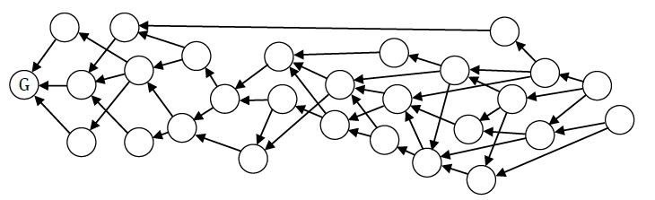

# 字节雪球(byteball)

[TOC]

## 摘要

Byteball(字节雪球)是一个去中心化的系统，允许任意数据的防篡改存储，包括可转移价值的数据，例如货币，产权，债务，股份等。这些存储单元彼此链接，每个存储单元包括一个或多个早期存储单元的散列值，既用于证实早期的单元又用于确立它们的偏序关系。链接单元之间形成DAG（定向非循环图）。没有管理或协调新单元进入数据库的单一中心实体，允许每个人添加新的单元，只要他签署并支付的费用等于添加数据字节的大小。其他后来用户通过自己单元内的散列值来确认早期单元，并收取费用。随着新单元的添加，每个早期单元，包括其中的散列值，直接或间接的接收越来越多后来单元的确认。

被称为“bytes(字节币)”的内部货币，用于支付将数据添加到去中心化数据库中的费用。其他货币或资产也可以通过任何人自由发行，来代表产权，债务，股票等。用户彼此可以同时发送bytes和其他货币，以支付商品/服务或交换货币种类，转移价值的交易将作为存储单元添加到数据库。如果两笔交易尝试使用相同的输出（double –spend 双重支付）并且它们之间没有偏序关系，则两笔交易都被允许进入数据库，但只有在全序（Total order）中较早的一笔交易被认为是有效的。全序通过选择一条单链建立在DAG（主链）上，吸引由被称为见证人的已知用户签署的单元。在主链上较早包含散列值的单元被认为在全序上较早。用户通过在每个存储单元中命名用户信任的证人来挑选见证人。见证人是具有现实世界身份的信誉良好的用户，这样命名他们的用户期望他们永远不要尝试双重支付(double-spend)。只要大多数见证人表现得如预期的那样，所有的双重支付尝试会被及时检测到并且被标记。作为见证人 – 在用户的单元之后积累汇总被创作的单元，当用户单元的总次序被认为是最终不可更改时，存在确定性（非概率）的标准。

用户将其资金存储在可能需要多个签名的地址上（multisig  多重签名技术）。 支出还可能需要满足其他条件，包括通过查找由其他用户（oracle）发布到数据库的特定数据来评估的条件。

用户可以发布新资产并定义以管理其可转移性规则。规则可以包括支出限制，例如每个转移的要求由资产的发行者联合签署，这是金融机构遵守现行条例的一种方式。 用户还可以发行其未传输至数据库的资产，因此对第三方是不可见的。相反，有关传输的信息在用户之间私下交换，并且只有这笔交易的散列值和支出证明（以防止双重支付）被发布到数据库。

## 1.介绍

在乔治·奥威尔的《1984》(政治讽刺小说)中，主角温斯顿·史密斯在真理部记录司作为编辑，从事篡改历史的工作，使历史符合不断变化的英格兰社会主义(故事中主角所在国家的政党)的路线，并删除涉及到的非人——已经“蒸发”的人，即不仅被国家杀害，而且甚至在历史或记忆中也被否认存在[1]。我们在这里提出的是不可重写的数据存储。 它是一个分布式去中心化的数据库，其中记录既不能修改也不能完全删除。

比特币[2]是第一个引入防篡改记录的系统，专门用于跟踪被称为比特币的电子货币单元的所有权。在比特币中，货币的所有转移都被表示为由当前币的所有者数字签名的交易，交易被捆绑成块，然后块被链接到由工作量证明机制（PoW）担保的链（区块链）上，确保大量计算资源投入链的建设当中。因此 ，任何企图重写链中任何内容的行为，将需要消耗比已消耗计算资源更大的计算资源。

比特币出现后不久，它逐渐让人们意识到这不仅仅是一个去信任化的P2P电子货币。 它的技术成为解决其他问题所需要的新思路来源。同时，比特币的不足和局限性也同样变得清晰。 Byteball旨在推广比特币，以成为任何数据的防篡改存储，而不仅仅是单一电子货币的转移，并消除阻碍比特币更广泛采用和增长的一些最紧迫的缺陷。

**区块** 在比特币中，交易被捆绑成块，然后块被链接到单链中。由于块是线性链接的，他们的时间间隔和大小使得节点之间的近同步性(near-synchrony)最优化，所以节点可以彼此共享一个新的块，比通常生成新块的速度快的多。这确保了节点最可能将相同的区块视为最后一个块，并且被孤立的可能性最小化。随着比特币的增长，块变得越来越笨拙。它们或者被限制大小，在这种情况下增长也同样被限制，或者它们传播到网络的所有节点花费时间过长，这样的话对于哪个块是最后一个，就存在更大的不确定性，并且更多的资源被浪费在扩展将被孤立的链上。在Byteball中，没有块，交易是他们自己的块，他们不需要连接到单链。相反，交易可以链接到多个先前的交易，并且整套交易不是链而是DAG（定向非循环图）。基于DAG的设计最近备受关注[3-5]。

**成本** 比特币交易是安全的，因为重做创建于交易之后的块中包含的所有PoW是非常昂贵的。但这也意味着，有必要对建立强大到足以抵御任何攻击者的合理PoW进行支付。 这笔款项用于支付建造PoW所需的电力。此处需要注意的是，这些钱从比特币生态系统流出到能源公司 - 意味着比特币持有者作为一个整体的社区，其资本正在失血。在Byteball中，没有PoW，而是使用另一种基于“在比特币之前就已知的旧想法”的共识算法。

**终结(finality)** 比特币的交易终结是概率性的。对于你何时能说一个交易永远不会被逆转，没有严格和直观的标准。相反，你只能认为，随着更多的块被添加，交易被逆转的概率呈指数衰减。虽然这个概念对于那些精通数学的人来说是很清楚的，但是对于一个习惯在金钱所有权问题上期待黑白分明(a black-or-white picture)的普通人来说，这可能会是一次困难的销售。事情进一步复杂化，交易的终结也取决于其数量。如果金额很小，你可以合理地确信没有人会试图对你进行双重支付。然而，如果股权金额大于区块奖励（在写作时为12.5 BTC），您可能推测，付款人可以临时租用哈希算力(hashpower)来挖掘不包含支付给您的交易的另一区块链。因此，在确定高价值交易是最终交易之前，您必须等待更多确认。在Byteball中，一个交易何时被认为是最终的，有一个确定性的标准，无论它有多么的大。

**汇率** 比特币价格的非常不稳定是已知的。更大的问题是，这个价格不仅是波动的，它还不受任何约束。 股票和商品价格也很不稳定，但它们背后是有着一定基础原则的。股价主要是公司盈利，收入，债务资本比率等的函数。商品价格除其他因素外，还取决于与不同供应商的生产成本。 例如，如果石油价格长期低于一些供应商的生产成本，这些供应商最终将关闭，减少生产，并导致价格上涨。这存在着一个负反馈回路。 在比特币中，没有基础原则，没有负反馈。 一个比特币500美元的价格不比5万美元或5美元更合理。如果比特币价格从现在的位置发生变动，这一变动不会创造任何推动价格回升的经济力量。它只是处于狂热状态。在Byteball中，基本货币字节币(bytes)用于支付将数据添加到Byteball数据库中的费用。您添加1Kb的数据需要支付1,000字节币。它是衡量此数据库中存储效用的度量，并且实际用户将对什么是它的合理价格有他们的主张。如果字节币的价格高于你认为合理的价格，你会发现存储更少字节币的方法，因此你需要买更少的字节币，需求减少，价格下降。这是负反馈，常见的所有商品/服务的需求都是由需求驱动，而不是投机。除了用字节币支付外，人们也可以发行其他资产并将其用作支付手段。这些资产可能代表例如以法定货币或自然单位为表示的债务（例如千瓦时-电功计量单位或油桶-石油计量单位）。这些资产的价格自然与基本货币或商品有关。

**隐私性** 所有的Bitcoin交易和所有的地址余额在区块链上都可见。 虽然有办法混淆一个人的交易和余额，但这不是人们从一种货币中所期望看到的。 Byteball中的字节币（基本货币）同样可见，但有第二种货币（blackbytes，黑字节币），是明显较难追溯的。

**合规性** 比特币被设计成一种人们对金钱有绝对控制权的匿名货币。 这个目标已经实现; 然而，这使得比特币不符合现有的法规，因此不适合在金融业使用。而在Byteball中，可以如比特币一般用任何规则发行资产来控制其可转移性，从没有任何限制，对每笔交易都需要由发行人签署（例如银行）或限制为有限的白名单用户。

## 2.数据库结构

当用户想要向数据库添加数据时，他创建一个新的存储单元并将其广播给他的对等节点。存储单元（除了别的以外）还包括：

- 要存储的数据。一个单元可以包括多个数据包，称之为信息。 有许多不同类型的信息，且各有自己的结构。 其中一种信息类型是支付，用于向对等节点发送bytes(字节币)或其他资产。

- 创建单元的一个或多个用户的签名。 用户由其地址标识。 个人用户可以（并且鼓励）拥有多个地址，就像比特币。最简单的情况，地址源于公钥，再次类似于比特币。

- 引用由其哈希值标识的一个或多个先前的单元（父母单元）。

引用父母单元是建立单元的次序（目前为止只有部分次序）和推广区块链结构。由于我们不局限于连续块之间的单亲 - 单子关系，所以我们不必争取近同步(性)，并且可以安全地承受大的延迟和高吞吐量：每个单元只会有更多的父母单元和更多的子单元。如果我们沿着父子链在历史上前进，当同一单元被多个后来的单元引用时，我们将观察到许多分叉，并且当同一单元引用多个较早单元时，许多单元逐渐融合（开发者已经习惯看到这个动态）。这种结构在图论中称为有向无环图（DAG）。 单元是顶点，父子链是图的边缘。


图1，连接成一个DAG存储单元。箭头是从子单元到父母单元，G是创始单元

在新的单元极少到来这种特殊情况下，DAG将看起来几乎就像一个链，偶尔分叉而又快速融合。

类似于让每个新块确认先前所有块（以及其中的交易）的区块链中，DAG中的每个新子单元确认其父母单元，父母单元的所有父母单元，父母单元的父母单元的父母单元等。如果有人尝试编辑一个单元，他也必须改变它的哈希值。 不可避免地，这将破坏所有引用此单元哈希值的子单元，因为子节点的签名和哈希值取决于父哈希值。因此，不能在窃取其私钥或是不与其所有子单元达成合作的情况下修改单元。 子单元们不能在没有与子单元合作的情况下修改他们的单元（原单元的孙子单元），等等这些。 一旦一个单元被广播到网络中，并且其他用户开始在它上面构建它们的单元（将其称为父单元），编辑这个单元所需的二次修改就如雪球一样增长。这就是为什么我们称之为Byteball（我们的雪花是数据中的字节）。

与“发布一个块是一个罕见的事件，且只有特权阶层的用户在实践中从事这项活动”的区块链不同，在Byteball中，单元发布之后，立即开始累积确认，并且确认可以来自另一个新单元被任何人发布的任何时候。这里没有普通用户和矿工这样的两层系统。相反，用户互相帮助：通过添加一个新单元，发布者也确认了所有以前的单元。

如果尝试修改过去的交易，与需要大量计算工作的比特币不同，尝试修改Byteball中过去的记录需要与大量且越来越多的其他用户协调，其中大多数是匿名的陌生人。因此，过去记录的不变性是基于与如此大量的陌生人协调的复杂性，这些人难以达成一致，对合作没有兴趣，并且每一个人都可以否决修订。

通过引用其父单元，一个单元将包括其父单元。它不包括父母单元的全部内容;相反，它的内容取决于父母单元哈希值的信息。同样，单位间接依赖于并因此包括父母的父母，其父母等，并且每个单元最终包括创世单元。

有一个协议规则，一个单元不能引用多余的父母单元 – 换言之，这些父母单元是一个父母单元包括另一个。 例如，如果单元B引用单元A，则单元C不能同时引用单元A和B. A已经以某种方式包含在B中。此规则去除了，不能向DAG中添加任何新的有效连通性的不必要链接。

## 3.天然货币：Bytes

接下来，为了防止无用信息刷屏数据库，我们需要引入一些摩擦力。 入口的屏障应大致反映用户的存储效用和网络的存储成本。 对于这两者而言最简单的测量方法是测量存储单元的大小。因此，要将数据存储在去中心化的全球数据库中，您必须以内部货币（称为字节币）来做为支付费用，您支付的金额与你打算存储的数据大小相对等（包括所有标头，签名等）。就如同首次推出时等于一磅银的英镑，货币的名称反映了它的价值。

为了使激励措施与网络的利益保持一致，在大大小小的计算规则中存在一个例外。为了计算单元大小，假定单元就恰好具有两个父单元，不论真实数字。因此，两个父单元的哈希值的大小总是包含在单元大小中。此例外确保用户不会为了尽量降低成本，而尝试只包含一个父单元，因为无论包含多少父母单元，这成本都是相同的。

为了使DAG尽可能地精确，我们鼓励用户尽可能多地包含父母单元（如前所述，这不会对应付的大小产生负面影响），并且尽可能地通过那些最初作为父单元将其包含的单元费用的支付部分成为最近的父母单元。我们稍后将定义什么是“最初”。

字节币不仅可用于支付存储费用（也称为佣金），还可以发送给其他用户支付商品或服务或换取其他资产。为了发送付款，用户需创建包括诸如以下（从现在开始，我们使用JSON来描述数据结构）的支付信息的新单元：

```bash
{
    inputs: [
        {
            uint: "hase of input unit",
            message_index: 2, //index of message where this utxo was created
            output_index: 0   // index of output where this utxo was created
        },
        ...
    ],
    outputs: [
        {
            address: "RECEIVER ADDRESS",
            amount: 15000    // in bytes
        },
        ...
    ]
}
```

该信息包含：

- 输出数组：一个或多个接受字节币和金额的地址；

- 输入数组：一个或多个先前输出用于转移基金的引用，这些是过去被发送到作者地址且还未被使用的输出。

输入总和应等于输出加佣金的总和（输入金额从先前的输出读取，在支出时没有明确说明）。该单元用作者的私钥签名。

循环中的字节总数为1015，这个数是常量。所有字节币都在创始单元发出，然后从用户转移到用户。费用由帮助维护网络健康的用户收取（更多细节过后补充），所以他们保持流通。之所以选择1015是因为在JavaScript中它代表最大的整数，数量只能是整数。货币的较大单位通过标准的前缀得出：1千字节（Kb）是1000字节，1兆字节（Mb）是1百万字节等等。

## 4.双花(双重支付)

如果用户尝试使用两次相同的输出，有两种可能的情况：

1. 在尝试使用相同输出的两个单元有序，即一个单元（直接或间接）中包括另一个单元，并且在它之后。在这种情况下，我们显然可以安全地拒绝后面的单元。

2. 他们之间无序关系，在这种情况下，我们都接受。我们建立单位之间的总序后，当他们隐藏在足够深的新单位里（见下文我们如何怎么做）。在总序较早出现的一方视为有效，另一方视为无效。

有一个简化定义总序的协议规则。我们要求，如果相同的地址发布超过一个单元，则它应当（直接或间接地）在每个后续单元中包含其所有先前单元，即来自相同地址的连续单元之间应当有序。换句话说，从同一作者的所有单元应连续。

如果有人违反这一规定并发布两个单元，使得它们无序（非序列单元），则这两个单元被视为双重支付，即使它们没有尝试使用相同的输出。这种非系列单元如上面情况2所述处理。


图2 双花(双重支付) 它们之间无序

如果用户遵循这个规则，但仍尝试两次花费相同的输出，则双重支付变得明确有序，并且我们可以安全地拒绝后一种情况，如上面情况1所示。因此，同时不是非序列的双支出容易被过滤掉。

这个规则其实很自然。当用户组成一个新的单元时，他选择最近的其他单元作为其单元的母单元。通过把他们列在他的母名单上，他向外宣布他的图片，这意味着他已经看到了这些单元。因此，他看到了母单元里的所有母单元，母单元的母单元等等，直到创世块。这个巨大的集合应该显然包括他自己已经产生的一切，并且他自己可见。
用户通过不包含一个单元（甚至是间接地通过父母单元）来否认他看到的这个单元。如果用户通过不包含他自己以前的单元来否认已经看到的这个单元，我们会说这很奇怪，这事有蹊跷。我们不鼓励这种行为。

## 5. 主链

我们的DAG是一个特殊的DAG。在正常使用中，人们通常将他们的新单元链接到略小的最近单元上，这意味着DAG仅在一个方向上增长。人们可以把它画成一条里面带有许多交错线的粗线。该属性表明我们可以在DAG中沿着“子-父链”选择单个链，然后将所有单元关联到此链。所有的单元要么将直接位于这条我们称之为主链的链上，要么沿着DAG的边缘从相对少量的跃点到达。它就像一条连接着侧面道路的高速公路。

构建主链的方法之一是开发一种算法，在既定单元的所有父母单元中，选择一个作为“最佳父母单元”。选择算法应该仅基于所讨论的单元可用的知识，即选择算法应仅基于所讨论的单元可用的知识，即单元本身和其所有祖先中包含的数据。从DAG的任意顶端（无子单元）开始，然后沿着最佳父单元链接沿着历史向后进行。以这种方式移动，我们构建主链并最终到达创世单元。注意，从一个特定单元建立的主链不会因为新单元的增加而改变。这是因为，我们移动的每一步都是从子单元到父单元，而现存的单元永远不会获得新的父母单元。

如果我们从另一个顶端开始，我们将构建另一条主链。这里值得注意的是，如果这两条主链在历史返程中曾相互交叉，那么它们将在相交点之后沿着相同的路径行进。
在最坏的情况下，主链将仅在创始区相交。然而，考虑到单元生产的过程在用户之间不协调，人们期望可以找到一类主链，其聚集的位置离顶端不太远。


图3，由不同的无子单元建立的主链相交，然后沿着相同的路径行进。在两个双重支付中，具有较低主链指数（5）的一条赢得胜利，而另一条（具有MCI = 6）被认为无效。

一旦我们有一条主链，就可以在两个矛盾的、无序的单元之间建立总序。首先让我们索引直接位于主链上的单元。创世单元的索引值为0，下一个    MC单元是创世元的子单元，其索引值为1，因此，沿着MC向前行进，我们为位于MC上的单元分配索引。对于不在MC上的单元，我们可以找到其中首先包括（直接或间接）该单元的MC索引。以这样的方式，我们可以给每一个单元指定一个MC指数（MCI）。

然后，在两个非序列中，具有较低MCI的那一个被认为是较早并且有效的序列，另一个则无效。如果两个非序列恰巧具有相同的MCI，根据tiebreaker规则，具有较低散列值的单元（如基本64编码中所表示的）是有效的。请注意，我们保留所有版本的双重支付，包括最终损失的那些。DagCoin [3]是第一个发表的作品，建议存储所有冲突的交易并且决定哪一个被视为有效。

由一个特定的单元建立的MC指数告诉我们这个单元的作者对过去事件顺序的看法，即他对历史的观点。该顺序意味着要考虑哪个非序列单元有效，如上所述。注意，我们通过选择给定单元的所有父母中的最佳父母单元，并在他们的MC之间进行选择：所讨论的单元的MC指数将是最佳父单元通过一个链接向前延伸的MC。

识别许多（甚至所有）可能由攻击者创建的父母单元，并记住最佳父母单元的选择本质上是历史版本的选择，我们应该要求从我们的最佳父母单元选择算法，该算法喜欢从子单元的角度来看“真实”的历史。因此，我们需要设计一个“现实测试”，我们的算法将对所有候选MCs运行，以选择得分最佳的一个。