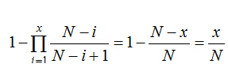

# 侧链白皮书：用楔入式侧链实现区块链的创新
[TOC]

## 摘要
自2009年比特币系统的推出以来，它带来了众多计算机科学和电子现金方面的创新，人们对去中心化加密货币的潜力有了极大的兴趣。但与此同时，对已达成共识的比特币系统关键部分实施变更，则必须非常保守地来处理。这导致与其他互联网协议相比，比特币系统更难于适应新需求和采纳新创新。

我们提出了一种新技术——“**楔入式侧链**“——实现比特币和其他帐簿资产在多个区块链间的转移。这使用户能用他们已有的资产来使用新的和创新的加密货币系统。通过复用比特币系统的货币，这些系统相互之间的交互操作，以及与比特币之间的交互操作，可以更容易地进行，避免出现与新货币相关的流动性短缺和市场波动。由于侧链是独立的系统，技术和经济上的创新不会被其他因素妨碍。尽管比特币系统和楔入式侧链间有双向转移的能力，但它们是隔离的：即使出现侧链中加密被破解（或恶意设计）的情况，所有的损害都只限于侧链本身。

本文将阐述“楔入式侧链”及其实施要求，以及为了能从将来区块链间的互联中充分受益所需的工作。

## 1. 前言
1983年，**David Chaum**将数字现金作为一个研究课题首次提出，通过设置一个可信的**中央服务器**，来防止双重花费[Cha83]。为降低这个中央可信方带给个人的隐私风险，并确保资产的可置换性，Chaum引入了**[盲签名](../核心技术/加密技术/盲签名.md)**——提供一种加密方法，来防止与中央服务器的签名（这个签名代表钱币）进行关联，同时还能让中央服务器进行双花防范。对中央服务器的需求，是数字现金的致命弱点（阿喀琉斯之踵）[Gri99]。虽然有可能通过将中央服务器的签名替换为含几个签名者的门限签名，来分散单点故障，但区分和辨识签名者的可审计性变得很重要。在这种方法下，系统仍然易出故障，因为每个签名者都可能会出问题，或者是一个接一个地被人为制造出问题。

2009年1月，中本聪发布了第一个广泛使用的点对点无信任电子现金系统，用基于工作量证明的共识机制来替代中央服务器的签名，用经济上的激励实现协同工作。比特币通过聚合成区块的方法来跟踪支付，每个区块关联有一个区块眉（**blockheader**），用密码学方法来指代（承诺）：区块的内容、时间戳、前一个区块眉。到前一区块眉的“指代”（**commitment**）构成了区块链，或者说是提供了一个明确交易次序的链。（译者注：在密码学中，commitment指的对原始数据用加密算法进行处理，生成的摘要可以在不泄露原文的情况下可以有效地代指原始数据。有些文章将commitment译为“承诺”或“秘诺”，本文中译为了“指代”）

我们注意到，比特币系统的区块眉可以看作是动态成员多方签名(或称**DMMS**)的一个实例，我们认为它作为群签名的一种新类型，有独立的价值。尽管截止目前的文献中尚未提及，比特币系统提供了这种签名的第一个实施方案。一个“动态成员多方签名”（DMMS）是由一组数量不固定的签名者所形成的数字签名。比特币系统的区块眉是DMMS，因为其工作量证明机制具有让任何人无需登记即可献力的特征。此外，贡献量不是让每个参与方提供一个门限签名，而是通过计算力来衡量，这可以允放使用匿名成员身份，并且不会有女巫攻击(**Sybil attack**)的风险（一个参与方多次加入，获取在签名中不相称的输入份额）。基于这个原因，DMMS也被描述为是拜占庭将军问题的一个解决方案。

由于区块是链接在一起的，比特币系统的DMMS是累积的：任何一个区块眉的链（或链的片断）都是第一个块的DMMS，其计算强度等于组成它的全部DMMS之和。中本的关键革新就是如上所述的，使用了基于计算力的DMMS签名，而不是基于知识的签名。由于签名者是证明其计算工作，而不是典型数字签名中的证明其私密知识，我们称这样的签名者为“**矿工**”。为了获取区块链历史的稳定共识，系统提供了经济激励，只有当矿工们构建了可共享的有效历史记录，他们获取的钱币形式的交易费和奖励才会有价值，这激励他们诚实地工作。因为比特币的累积DMMS强度与所有矿工们贡献的计算力成正比，算力占少数的一方想改变链是行不通的。如果他们试图修改受DMMS保护的帐簿，他们就会落后，并且一直无法追上达成共识的区块链的进度。

由于矿工们并没有形成一个可辨识的集体，他们对决定交易有效性的规则没有自由裁量权。因此，比特币的规则必须在它的历史初期就要确定，除非每个网络参与者达成一致，否则新的有效交易类型无法添加进来。即使能达成这样的一致，变更的部署实施也很困难，因为这需要所有参与者都要用相同方式落实和执行新的规则，还要考虑到边缘情况以及其他因素导致的意外的影响。

正因如此，比特币系统的目标相对简单：它是一个支持**单一原生数字资产**传输的区块链，不能与其他任何资产相兑换。

这可以简化很多具体实现，不过这样的简化正面临着现实世界需求的挑战。尤其是，目前的创新主要围绕在以下几个方面：

1. 在可**扩展性**和**去中心化**间的取舍。例如，更大的区块可以支持更高的交易速率，代价是加大了验证方的工作量——中心化的风险。

  同样，在**安全性**和**成本**之间也存在取舍。比特币历史记录中用同等级别的不可逆性存储了每一笔交易。这种方式的维护代价很高，对低价值和低风险的交易来说也未必合适（例如，所有参与方已经商定了一个共同的法律机构来处理欺诈行为）。

  由于不同交易的价值和风险状况有很大的不同，这样的取舍应当针对每笔交易来应用。然而比特币系统的构建仅支持以**一个标准**来应对所有问题。

2. 在区块链的**功能**上存在更多的取舍。例如，是让比特币的脚本更强大来支持简明和有用的合约，还是减少功能以便于审计。

3. 一些**非货币的资产**也可以在区块链上交易，例如欠条、其它合约和智能财产。

4. 存在**一元化育成**的风险:比特币系统由许多密码学组件构成，其中的任何一个组件出问题，都会导致整体价值的损失。如果有可能，不要用同一套算法来保护每个比特币会更谨慎些。

5. **新技术**可能会带来比特币系统创建初期没有想到的**新功能**。例如，用加密累加器、环签名或Chaumian盲签名来增强隐私保护和抗审查性。

6. 即使有这样做的迫切需求，但没有对比特币系统安全升级的途径，这意味着任何更改都需要所有参与者协同执行才能生效。比特币的开发者们之间达成了一个共识，对比特币系统的变更必须**缓慢**、谨慎，且仅当社区有明确同意时才进行。

实际上，由于功能必须被广泛认可后才能采纳，这限制了参与者的个人自由和对其钱币的自主性。小的团体无法实现诸如专用脚本扩展这样的功能，因为他们缺少广泛的共识。

早期针对比特币系统中这些问题的解决方案是可替代的区块链的开发，又称竞争链(**altchains**)，除针对上述关注点有所修改外，共用了比特币系统的代码库。然而，靠创建一个独立的但本质类似的系统来实现技术变更，是存在问题的。

- 问题之一是，**基础架构碎片化**：由于每个竞争链都使用自己的技术堆叠，经常会有重复性或遗失的工作。因此，由于竞争链的实现，可能并未扫除比特币系统中安全特定领域知识的障碍，安全问题常常跨竞争链被复制，而它们的修复也不解决这些问题。必须消耗大量资源或是建立专家评价评审新的分布式加密系统，如果没这样做，安全隐患常常无法察觉，直到漏洞被利用。结果是，我们看到了一种动荡的、无法前航的发展环境，大部分显现出来的项目可能在技术上是最不健全的。打个比方，想象一下在互联网上，每个网站使用自已的TCP实现将自定义的检验和数据包拼接算法广播给最终用户。这不会是一个能生存的环境，这也不是竞争链能生存的环境。

- 问题之二是，这样的竞争链和比特币系统一样，通常有自己的带有浮动价格的原生加密货币，或称**竞争币**。为了使用竞争链，用户需要通过一个市场来获取这种货币，这将使他们直接面对新货币带来的**高风险**和波动。此外，因为有独立解决初始分配和估值问题的需求，与此同时还要在不良的网络效应与拥挤的市场中竞争，这既阻碍了技术创新，又助长了市场的博弈。这危及的不仅仅是这些系统的直接参与者，还危及到整个加密货币行业。如果这一领域被公众认为风险过高，对加密货币的**采纳**可能会受阻，或者有可能完全被遗弃（自愿或立法上）。这表明我们希望有一个环境来让可互操作的**竞争链**能易于创建和使用，但不要产生不必要的市场和开发碎片。在本文中，我们认为这些看似矛盾的目标有可能同时实现。核心考察点是 “**Bitcoin**” 这一区块链在概念上是独立于“bitcoin”这一资产：如果我们能在技术上支持区块链间资产的移动，可以通过简单地复用现有比特币的方式，开发出用户可能会采纳的新系统。

我们称这种可互操作的区块链为“**楔入式侧链**”。 我们将在第三节中给出精确的定义，这里先列出以下“楔入式侧链”所需具备的属性。

1. 在侧链间移动的资产应当能够被当前持有者移回，但除此之外的任何人则不行（包括前持有者）。
2. 资产的移动应当无交易对手风险；也就是说，不诚实的一方无法阻止转移的发生。
3. 资产转移应当是元操作（原子操作），即，要么完全完成，要么根本不发生。不应存在会导致资产损失或允许欺诈产生的失败模式。
4. 侧链应当设有防火墙：一个会使某条链发生资产铸造（或偷盗）的缺陷（bug），不应导致任何其他链出现资产的铸造或偷盗。
5. 区块链重组时应当处理干净，即使在资产转移的期间也要如此；任何破坏应当只发生在它所处的侧链上。总的来说，理想情况下，侧链应当完全独立，自其他链上的全部所需数据由用户提供来。侧链的验证者应当只有在侧链本身的显式共识规则有要求时，才需要跟踪其他链。
6. 不应要求用户去跟踪他们未主动使用的侧链。

早期“转移”钱币的解决方案是用一个可公开识别的方式来销毁比特币，让新的区块链能检测到，以允许铸造新币［Bac13b］。这解决了部分上面提到的问题，但由于这种方法只允许单向转移，因此还不足以满足我们的目的。

我们提出的方案是由资产转移的交易本身提供所有者证明来**转移**资产，避免让节点有跟踪发送方链的需求。从上层实现角度，当资产从一个区块链向另一个链移动时，我们在第一个区块链上创建交易锁定资产，然后在第二个区块链上创建一笔交易，该交易的输入中包含一个锁定已正确完成的密码学证明。这些输入用某种资产类型来标记，比如创生出资产的区块链的创世哈希(genesis hash)。

第一个区块链我们称之为**父链**，每二个则简单称为**侧链**。在某些模型中，两条链可对称地来处理，因此这一术语应当看成是相对的。从概念上讲，我们打算将资产从（初始）父链转移到一条侧链，可能会再转移到别的侧链，最终还能转回至父链，并保全初始资产。一般我们把父链看成是比特币系统，侧链是其他区块链中的某一个。当然，侧链的币(coin)也可以在侧链间传递，并非只能与比特币系统进行往来；不过，由于任何一个最初从比特币系统移动的币都可以移回去，所以不管变成什么样，它仍是个比特币。

这让我们解决了前面章节提到的碎片化问题，对只想专注于技术创新的开发者来说是个好消息。

此外，由于侧链是从父链中转移现有资产而不是另铸新资产，侧链不会引起未经授权的铸币，维护资产的安全和稀缺性依靠父链来实现。

更进一步说，参与者不必再担心他们的持有物会被一个实验性竞争链锁往，因为侧链币能够用等额的父链币来赎回。这提供了一个退出机制，减少因软件无人维护而造成的损失。

另一方面，由于侧链还是一个独立于比特币系统的区块链，它们可以自由地尝试新的交易设计、信任模型、经济模型、资产发行语义，或加密特性。我们将在第5节中进一步探讨一些侧链的可能性。

这一基础架构的额外好处是对比特币系统本身进行改变不再那么迫切：与其策划一个需要各方均达成一致并一起实施的分叉，不如用侧链来创建一个新的“改变了的比特币系统”。从中期看，如果广泛认可新系统有进步，最终会明显看到，相对于比特币父链，更多的人会使用这个新系统。由于父链的规则没有任何修改，任何人都可以根据自己的时间去切换，不会有任何因共识失败所带来的风险。从长期看，如果父链被认为，或当父链需要改变时，侧链的成功将给父链的更改提供了所需的信心。

## 2. 设计原理
“**无需信任**”指的不依赖外部的可信方也可完成正确的操作的特性，一般是能够让所有参与方自己验证信息是否正确。例如，密码学签名系统中，“无需信任”是一个隐式的必要条件（如果攻击者能伪造签名，那么这个签名系统将被视为被完全破解）。虽然分布式系统中一般不需如此，但比特币在系统的大部分中提供了“无信任”操作。

“**楔入式侧链**”的一个主要目标是在比特币系统模型之上最小化附加的信任。难点是币在侧链间的安全转移：接收链必须能得知发送链的币已被正确锁定。在比特币的领导下，我们提议用**DMMS**来解决这一问题。尽管有可能利用一个简单基于信任的方案，引入固定数量签名者来验证币的锁定（参见附录A），但有很多重要理由让我们避免这种单点故障的引入：
- 信任个人签名者，并不仅仅意味期待他们做事诚实，他们还必须永远不出漏洞、永远不会泄露关键的秘密、永远不会被挟持、永远不会停止参与网络。
- 由于数字签名是长期存在的，对任何信任的要求也必须如此。经验告诉我们，即使时间跨度只有几个月，信任需求也是一种危险的期待，更何况我们所期望的金融系统所能持续的时间长达几个世代。
- 在比特币系统消除了单点故障前，数字货币一直没有什么吸引力，社区强烈反对引入这种弱点。2007年以来的金融事件更加强了社区的不信任；对金融系统和其他公共机构的公共信任也同样处于历史的低点。
 

## 3. 双向楔入
楔入式侧链的技术基础称作双向楔入。本节我们将解释它是如何工作的，先给出一些定义。

### 3.1 定义
- 币(**coin**)，或资产，是一种可以用密码学方法辨识控制者的数字财产。
- 区块，是一个描述资产控制发生变化的交易的集合。
- 区块链，是一个有序次的区块的集合，所有用户必须（或最终）对该集合达成共识。这确定了资产控制的历史，提供了一个计算上无法伪造的交易时序。
- 重组，或称reorg，发生在客户端本地，当先前已接受的链被一个有更多工作量证明的竞争链取代时，分叉上失败一方的区块要从共识历史中移除。
- 侧链，是验证来自其他区块链数据的区块链。
- 双向楔入，指的是让币以一个固定或确定性的汇率在侧链间转出和转入的机制。
- 楔入式侧链，是一条资产可以从其他链导入并返还的侧链；即，一条支持双向楔入资产的侧链。
- 简单支付验证证明（或称SPV证明），是一种动态成员多方签名（DMMS），发生于一条类比特币系统工作量证明(proof-of-work)区块链上。

本质上，SPV证明是由一个展示工作量证明的（a）区块眉列表，和一个（b）表明某一输出发生在列表中的某一个区块的密码学证明所组成。

这使验证者可以检查是否有一定数量的工作已经认可了某个输出的存在。当有其他证明(proof)展示了一条工作量更多的链，且生成该输出区块未包含于其中时，其他证明会使这一证明失效。

使用SPV证明来确定交易历史，隐含着要信任最长的区块链也是最长的正确区块链，在比特币系统中，这是由一个被称为SPV的客户端实现的。由于诚实的哈希算力不会为一个无效链去工作，只有当超过50%的哈希算力合谋时，才会始终欺骗SPV客户端（除非客户端处于长期的女巫攻击之下，使其无法看到实际的最长链）。

还可以这样做，通过获取每个区块眉来指代区块链上未花费输出的集合，任何拥有SPV证明的人不需要“中继”（relay）每个区块也能确定链的状态。（在比特币系统中，完全验证者第一次开始跟踪区块链时需要做这种中继。）

正如我们将在附录Ｂ中讨论的那样，通过在比特币系统的区块结构中包含一些额外数据，我们可以生成比区块眉完整列表更小的证明(proofs)，从而提高可扩展性。尽管如此，这样的证明还是比普通的比特币交易要大得多。幸好对于大多数资产转移来说，这并不是必要的：每条链的持币人可以用附录Ｃ描述的方法直接使用元互换（原子交换）操作［Nol13］进行汇兑。

### 3.2 对称式双向楔入
我们可以利用这些想法将一个侧链SPV楔入至另一个侧链。这包含以下工作：为了将父链币转移为侧链币，父链币被发送到父链上的一个特殊输出中，该输出只能由侧链上拥有的一个SPV证明来解锁。为了在两条链上进行同步，我们需要定义两个等待周期：

1. 侧链间转移的确认期，是指币在转移至侧链之前，在父链上必须被锁定的期间。此确认期目的是生成足够多的工作量，让下一个等待期内的拒绝服务攻击变得更困难。典型的确认期的量级可以是一或两天。

  当父链上生成了特殊输出后，用户等待确认期结束，然后在侧链上生成一个引用该输出的交易，提供出一个它已被创建并在父链上被足够工作量覆盖的SPV证明，

  确认期是一个依侧链而定的安全参数，要在跨链交易速度和安全性间做权衡。

2. 接下来，用户必须等待一个竞赛期。这个期间，新转移过来的币不能在侧链上花费。竞赛期的目的是防止重组时出现双花，在重组期间转走先前锁定的币。在这个延迟期内的任何时刻，如果有一个新的工作证明发布出来，对应的有着更多累计工作量的链中没有包含那个生成锁定输出的区块，那么该转换将被追溯为失效。我们称此为重组证明。

  只要有可能，所有侧链上的用户都会有动力来制发重组证明，因为对不良证明的承认会稀释所有币的价值。

  典型的竞赛期也是一或两天的量级。为了避免这些延迟，用户很可能用元互换（原子交换）(在附录Ｃ中有描述)进行大多数交易，只要有流动性的市场可用。

  当币在父链上被锁定时，该币可以在侧链内自由转移，不需要与父链进一步交互。不过，它仍保留着父链币的身份，仅能转回到它所来的那一条链上。

  当用户想把币从侧链上转回父链时，与原先转移所用的方法相同：在侧链上将币发送至一个SPV锁定的输出，产生一个充分的SPV证明来表明该输出已完成，使用这个证明来解锁父链上先前被锁定的那个等面值的输出。整个转移过程如图1所示。

 

  图1：双向楔入协议示例

  由于楔入式侧链可能会从很多链中搬运资产，且无法对这些链的安全性做出假定，因此，不同资产不可相互兑换是非常重要的（除非是一个显示声明的交易）。否则，恶意用户可以通过创建一条资产毫无价值的无价值链进行偷盗，将这样一种资产移到一个侧链，再把它和别的东西去兑换。为了应对这种情况，侧链必须有效地将不同父链中的资产处置为不同的资产类型。

  总之，我们提议让父链和侧链相互做数据的SPV验证。由于不能指望父链客户端能看到每条侧链，为了证明所有权，用户必须从侧链导入工作量的证明到父链。在对称式双向楔入中，反向的操作也是如此。

  为了让比特币系统成为父链，需要有一个能识别和验证SPV证明的脚本扩展。最起码的要求是，这种证明需要做得足够小，以便能放进比特币系统一个交易之中。不过，这只是一个软分叉，对于不使用新功能的交易不会产生影响。

### 3.3 非对称式双向楔入
上节以“对称式双向楔入”作为标题，是因为从父链向侧链的转移机制与反方向的机制是相同：都拥有SPV安全性。

另一种方案是非对称式双向楔入：这种方式下，侧链上的用户对父链能完全验证，由于所有的验证者都知道父链的状态，从父链向侧链的转移不需要SPV证明。另一方面，由于父链并不知道有侧链，所以转回到父链时需要有SPV证明。

这对安全性有所促进，现在，即使一个51%攻击者也没法错误地将币从父链转移到侧链。不过，相应的代价是迫使侧链的验证者去跟踪父链，同时也意味着发生在父链上的重组也可能导致侧链上的重组。在这里，我们不详细探讨这种可能性，因为围绕重组的议题会导致复杂度显著扩大。

## 4. 缺陷
侧链给加密货币领域中的很多问题提供了解决方案，为比特币系统的革新带来数不清的机会，但同时，侧链本身也并非没有缺陷。本节我们将审查一些潜在问题，并附以解决方案或变通方案。

### 4.1 复杂度
侧链在以下几个层面引入了额外的复杂度。
- 在网络层面，我们有了许多独立的、非同步的区块链，支持相互间转移。它们必须支持可被后期重组证明宣布失效的交易脚本。我们还需要软件自动检测不正当行为，以及生成并发布相关的证明。
- 在资产层面，简单的“一条链，一种资产"准则不复存在了;单条链可以支持任意多的资产，甚至包括该链首次被创建时还不存在的资产。这些资产的每一个都要标记上该资产的来源链，以确保资产的转移可以被正确地解析。

仅让区块链基础架构能处理高级功能是不够的：管理钱包的用户界面也需要重新考虑。目前，在竞争币的世界中，每条链都有自己的钱包，用以支持该链上币的交易。需要改写这些钱包以便支持多个链(可能带有不同的功能集)和链间资产的转移。当然，如果令用户界面过于复杂，完全可以选择不使用某些功能。

### 4.2 欺骗性转帐
理论上，任意深度的重组都是有可能的，这让攻击者能制造一个比发送链的竞赛期时间长的重组、在发送链撤消该半侧的转帐前，将币在侧链间完全转移。结果将使接收链上币的数目与发送链上可赎回的锁定输出的数量不对等。如果允许攻击者将币转移回初始链，他将增加他自己币的数量，让该侧链上其他用户付出损失。

在讨论如何处理这一问题前，我们注意到，通过简单地延长转移的竞赛期就可以使这种风险变得任意小。那好，可以用两条链的相对哈希算力生成一个函数来决定竞赛期的持续时间：接收链可以仅在见到一个等同于该链1天工作量的SPV证明时才解锁币，这一证明可能相当于发送链上几天的工作量证明。类似这样的安全参数是特定于侧链的属性，可以针对每个侧链的应用进行优化。

不管这种事件有多不可能发生，很重要的一点是，不能因侧链的责任造成灾难性故障。可以创建一个SPV证明见证这一事件，并且侧链可以接受这种证明。可以设计侧链，选下面的多种方式之一来作应对：
- 不做应对。这样做的结果是，该侧链是一个 “部分准备金(银行)", 存储来自其他链上资产。对于微量数额，如果人们认为少于丢失的侧链币，或是有承保人承诺偿付丢失的资产，这一方式可以被接受。然而，超出一定的阈值后，很可能发生从该侧链提现的“银行挤兑"，最终要有人担下损失。间接损害可能包括对侧链信心的普遍丧失，父链的代价则是要处理一个突如其来的交易高峰。
- 楔入及所有相关的交易可以被回退。然而，由于币往往会散发出去，交易历史会交织在一起，即使是刚经历很短的时间就回退，后果也可能是毁灭性的。这还限制了资产的可置换性，接收者将倾向于选择历史“清白"的币(没有近期楔入的)。我们预计这种可置换性的缺失可能会导致灾难性后果。
- 所有币的数量可以被缩减，同时汇率维持不变。与新用户相比，在攻击发生前将币转移到侧链的用户会比较不利。这等同于降低侧链币兑换的汇率。

在这些应对基础上也可以加以变化：例如，临时降低汇率，使那些在该侧链“挤兑"的人得不偿失。

### 4.3 挖矿中心化的风险
一个重要的顾虑是，引入带有矿工费的侧链是否会给矿工资源带来压力，产生比特币系统(挖矿)中心化的风险。

由于矿工们收到的报酬，来自于其所工作的各链的区块补贴及交易费，出于经济利益，他们会根据难度变化和市场价值变动，切换到价值上差不多的不同区块链，为之提供多方成员动态签名(DMMSes)。

我们的答复是，一些区块链已稍稍改进了区块眉的定义，使其中包含一个比特币系统DMMS，因而，矿工能把提交给比特币系统的DMMS同样用于一个或多个其他区块链——这称为合并挖矿。因为合并挖矿允许将工作量复用到多个区块链上，矿工可以从每个他们提供了DMMSes的区块链上索取报酬。

由于矿工们要为更多的区块链提交工作，跟踪和验证全部这些链需要更多的资源。只为区块链的某一子集提交工作的矿工得到的报酬，比为所有可能的区块链都提交工作的矿工少。小规模的矿工可能无法支付为每个区块链挖矿的全部成本，因而与较大的有组织的矿工相比，会处于劣势，后者能从更大的区块链集合中索取更多的报酬。

不过，我们注意到，矿工们可以将其所工作的任何区块链子集上的验证和交易选择委派出去。选择委托机构能使矿工免除几乎所有对额外资源的需求，或者能为仍处于验证过程的区块链提交工作。然而，这种委派的代价是区块链上验证和交易选择的中心化，即便工作量生成本身仍是分布式的。不过，矿工们也可以选择不为仍处于验证过程的区块链工作，用自愿放弃一些报酬来提高验证过程的去中心化。

### 4.4 软分叉风险
比特币系统中，软分叉是对比特币协议的一个补充，通过在设计上严格缩减合法交易或区块的集合来实现向后兼容。软分叉的实现只需挖矿算力中的绝大多参与即可，不需要所有的完全节点都参与。不过，对于软分叉出来的功能，除非所有完全节点都升级，否则参与者的安全性仅是SPV级。软分叉已经被使用过很多次，用于部署新功能和修复比特币系统中的安全问题(参见[And12b])。

按本文所述方法实现的双向楔入仅有SPV安全性，因此，对矿工诚实性的短期依赖度高于比特币系统(参考4.2节中所述的攻击)。不过，如果双方系统的所有完全节点都相互检查，并用一个软分叉规则要求相互的合法性，那么，双向楔入的安全性可以提升至完全等同于比特币系统的水平。

这种方式的负面影响是，失去了对任何有软分叉需要的侧链的隔离。由于隔离是使用楔入式侧链的目标之一，除非某一侧链已经几乎被普遍使用，这种结果将是不受欢迎的。不过，假设没有楔入式侧链，接下来的备选方案是直接对比特币系统硬分叉来部署单个的变更。这会更唐突，无法提供真实的机制证明新功能成熟，还需要冒比特币系统共识上的风险。

## 5 应用
抛开技术基础，本节我们探讨侧链的面向用户的应用，这些应用可以有效地扩展比特币系统做它目前还不能做到的事。

### 5.1 竞争链实验
第一个应用，前面已经提及多次，就是简单地创建一条竞争链，该链上币的稀缺性由比特币系统来提供。通过利用一条不用全新货币，而是承载比特币的侧链，避免了初始分配、市场脆弱性、以及新用户接纳障碍等棘手问题，新用户不需要再去找寻值得依赖的市场，或投资于挖矿硬件以获取竞争币资产。

#### 5.1.1 技术实验
由于侧链在技术上仍是完全独立的链，它们能改变比特币系统中诸如区块结构或交易链等功能。下面例举一些这样的功能：
- 通过修复不期望有的交易可锻性——在比特币系统中只能被部分修复[Wui14]——可以更安全地执行与链上未确认交易相关的协议。交易可锻性是比特币系统中的一个问题，会让随便一个用户以某种方式微调交易数据，尽管交易的实际内容并未发生改变，但依赖于它们的后续交易会遭到破坏。概率性支付[Cal12]就是一例可被交易可锻性破坏的协议。
- 提高支付者的隐私性，例如Monero(XMR)中使用的环签名方案，可以减少特定方的交易被审查的系统风险，保护加密货币的可置换性。Maxwell、poelstra[MP14, Poe14b]和Back[Bac13a]对此提出的改进能容许更高的隐私性。目前，可以用Menora币来使用环签名方案，但比特币不能使用;侧链将会避免这种排它性。
- 在比特币系统中提出过的脚本扩展(例如，对彩色币[jl213]的有效支持)。由于这样的扩展仅仅对小范围的用户有用，但使所有用户都要因此而应对提高了的复杂度和不易察觉的交互影响造成的风险，因而这些扩展在比特币系统中没被接受。
  其他建议的扩展包括对新的密码学原语的支持。例如，兰波特(Lamport)签名，虽然大，但安全性可以对抗量子计算机。
- 多种用不兼容的方式扩展比特币系统的想法在[Max14]和http://www.bitcoin.ninja. 中有说明。

由于这些变革影响的只是币的转移，而不是币的铸造，没必要为它们准备一种独立的货币。使用侧链，用户可以安全地、临时性地尝试这些变革。这促进了对侧链的采纳，与使用一种完全独立的竞争币相比，采用侧链时，参与者的风险更小。

#### 5.1.2 经济实验
比特币系统的奖励机制是把新币分配给矿工。这实际上使货币膨胀，不过，它会按一个阶梯式时间表随时间推移而逐步下降。用这种通胀来补贴挖矿是对交易费的一个成功补充，用以保障网络安全。

在侧链上获取区块奖励的另一种机制是滞期费，这是由Freicoin(http://freico.in)首创的用于数字货币的一个想法。在滞留型(demurring)加密货币中，所有未花费的输出将随时间推移而减值，减少的价值被矿工重新采集。这在保证货币供给稳定的同时，还能给矿工奖励。与通货膨胀相比，这或许能更好地与用户利益保持一致，因为滞期费的损失是统一制定并即时发生，不会像通胀那样;它还缓解了因长期未使用的“丢失"币以当前价起死回生可能给经济带来的冲击，在比特币系统中这是一种能意识到的风险。滞期费建立了提高货币流通速度和降低利率的激励机制，这被(例如Freicoin的拥护者和其他西尔维奥·格塞尔利息论的支持者[Ges16])认为对社会有益。在楔入式侧链中，可以用已有价值的货币将滞期费支付给矿工。

其他与经济相关的变革，包括所需的矿工费、交易可逆性、当输出达到一定的币龄就简单地将其删除、或者是将通胀率/滞期费率楔入至侧链外的事件。所有这些变革都很难安全地来进行，不过，由于侧链易于创建并降低了风险，这给变革提供了必要的可行环境。

### 5.2 资产发行
在这一点上，大多数情况下，我们认为侧链不需要自己的原生货币：所有侧链上的币最初都被锁定，直到来自其他某条侧链的资产转入将其激活。不过，侧链也可以制造自已的代币，或是带有自己语义的资产发行。它们可以被转移给其他侧链来换取其他的资产和货币，整个过程不需要对中心方有信任，即使将来赎回时对可信方有需求。

资产发行链有很多应用，包括传统的金融工具，如股票、债券、凭证和白条等。这使得外部协议可以将所有权及转帐记录跟踪等授权给发行所有者股份的那条侧链。发行资产链还可支持更多的创新工具，如智能财产。

这些技术还可在补充性货币[Lie01]中使用。补充性货币的例子包括：社区货币，设计目的是优先推动当地企业;企业易货协会，支持教育或老年护理之类的社会方案;限定用途的代币，在组织机构内部使用，比如大型多人游戏、客户忠诚度计划、在线社区。

一个合适的脚本扩展系统和一个资产可识的交易，能从良好审计的组件中，创建出有用的交易，比如将一个出价和报价合并为一个汇兑交易，能为资产交换以及无信任期权(FT13)这样的复杂合同创建完全无信任的点对点市场。这些合同可能会有所帮助，例如减少比特币本身的波动性。

## 6 发展方向
### 6.1 哈希算力攻击抗性
本文的主旨围绕使用SPV证明的双向楔入，它可被一个51%的多数方所伪造，不过也可以区块化，需要大量的哈希算力以便在传输的竞赛期构建一个足够长的证明(后面这一点上要有所权衡——比如，假设33%的哈希算力能使区块出一个证明，那么，要想成功使用一个假证明则需有67%的算力，依次类推。)

侧链中值得探讨的其他一些想法有：
- 保证合同。将侧链的交易费扣留，不支付给矿工，直到他们的哈希算力至少相当于比特币系统的，比方说是，66%的算力。加密货币实现这类合同很容易，只要它们最初就设计成这样，用于提高区块转移的成本。
- 时移交易费。矿工们的部分交易费要在将来的某个区块中才能收到(或分散到许多区块)，使他们有动力来维持链的运作。

这可以激励矿工，使其简单地收到“带外"(out-of-band)交易费(译者注：在传送过程中，不通过常规方式，无需排队(in-band)优先传送给用户，以便及时处理的方式称为out-of-band)，避免需要等待将来才能给的链内奖励。该方案的变体是让矿工收到一个令牌(token)，允许其将来挖一个低难度值的区块;这个效果是一样的，只不过更直接地激励其接收者来挖这条链。
- 滞期费。区块补贴可以通过滞期费形式支付给矿工，以激励诚实挖矿。由于可被转入到比特币系统或其他侧链的数量只能与转出的数量相同，这种基金的重分配将限定在其所发生的侧链之内。
- 补贴。侧链也可以发行自己独立的原生货币作为奖励，有效地形成一种竞争币。然后，这些币将有一个自由浮动的价值，结果是无法解决与竞争币相关的波动性和市场碎片等问题。
- 合签SPV证明。引入一个必须在合法SPV证明中签字的签名者，对假证明进行监察。这导致要在中心化和抗高算力攻击的安全性间直接做出权衡。在这方面有很大的权衡余地：可以仅在高价值的转移中才需要签名者;仅当侧链的哈希算力过小，只相当于比特币的一个百分比时才需要他们;等等。在附录A中包含有对此类权衡的实用性的进一步讨论。
- SNARKs。密码学学术上的一个令人振奋的近期进展是SNARKs[BSCG+13]的发明。SNARKs是空间效率高，可快速验证计算工作已完成的零知识密码学证明。然而，目前它们的使用是受限制的，因为对于大多数程序，用当今的计算机来生成这些证明的速度太慢，且现有的构建需要一个可信设置，这意味着系统的创建者有能力制造假证明。

关于低价值或实验性侧链的一个未来想法是，起用一个可信机构，该机构的唯一任务是为SNARK方案执行一个可信设置。这样，可以构建区块，证明对未花费输入集合的变更，不过，这是在对实现交易零知识的前提下完成的。这些区块还能对所有先前的区块提交完整验证，允许只验证一个最新的区块，使新用户得到速度上的提升。通过根据一些先前定义的规则证明发送链的合法性，这些证明还可以取代将币从一条链移至另一条链的DMMSes

## 7 致谢
我们要感谢加文·安德烈森、科琳娜·Dashjr、马蒂亚斯·Dybvik、丹尼尔·Folkinshteyn、伊恩·格里格、Shaul Kfir，midnightmagic、帕特里克·Strateman、Kat Walsh和Glenn Willen的审稿意见。

## 附录A 联合楔入
部署楔入式侧链的挑战之一是，目前比特币系统的脚本在编码SPV证明的验证规则上，还不能完全表达。需要用一种安全、兼容、并且泾渭分明的方式加入所需的表达（例如，通过用软分叉，将一个“无操作”(no-op)指令转化为一个OP_SIDECHAINPROOFVERIFY指令）。不过，构建共识并部署这样简单的新功能的难度可不小。别忘了这些困难正是楔入式侧链产生的部分起因。我们想要的是，能有一种方法，为比特币系统尝试未来的脚本功能，同时无需在所有地方部署。幸运的是，通过采纳一些用低信任设计目标换取的附加的安全性假设，可以在完全无许可的方式下进行初始部署。

关键的考察点是，任何对比特币系统脚本的增强，都可由一个相互间不信任的工作人员组成可信联盟来评估脚本，通过签发一个普通的多重签名脚本来接受。也就是说，这些工作人员充当了协议的适配器，评估那些我们想让比特币系统来做，但因缺乏脚本支持而做不了的相同规则。借助这种方法，我们能够实现一种联合的楔入。
这种方法与创建一个多重签名链下(off-chain)交易系统非常相似，不过，所需的服务器至服务器的共识处理，借助简单地察看问及的区块链来实现。结果是有了一个确定性的、可审计性高的处理流程，简化了对工作人员的选择和监督。 由于相似性，很多用于提高链下支付系统安全性和可信度的技术，也可以在联合楔入中部署。例如：工作人员地理位置上可以是分散的，通过托管币，或是托管创建成本高的抗协迫的假名身份来进行担保，在有远程证明的防篡改硬件上来实现，诸如此类[Tod 13]。对于小规模的应用，系统中币的所有者自己就可以充当工作人员，从而避免了第三方信任。

一旦带有联合楔入的侧链投入使用，比特币系统脚本附加的SPV验证，可被视为仅仅是一个减少系统中所需信任的安全性升级。现有的侧链可以将币简单地迁移至新的验证系统。这种方法还开启了额外的安全选项：挖矿提供的DMMS对小型系统不是很安全，对大型的系统，联合验证会更危险。侧链可以自适应地并行使用这两种方法，或是根据显见的哈希速率来切换。

考虑一个在工作人员联合体中5取3的侧链实现与比特币系统双向楔入的例子。联合体有secp256k1公共点（公钥）P1、P2、P3、P4和P5以及一个赎回模板，这些对侧链中所有参与者均可见。要将币发送到一个脚本公钥（ScriptPubKey）SPK时，想让币在一个使用联合楔入的侧链上可用的用户，可以依照下面的密钥推导方案，计算跨链P2SH［And12a］地址：
算法1 生成跨链地址

	输入：一个将从其他链接收币的目标脚本公钥SPK
	输入： 一个工作机关公共点的列表 {Pi}ni=1
	输入：一个赎回脚本模板，表述工作机关的需求
	输出：一个P2SH地址
		
	输出：用于本实例的临时数（Nonce）
		1: nonce ß random_128bit()
		2: for i ß [1;n] do
		3: Tweaki ßHMAC-SHA256(key = Pi, data = nonce||SPK)
		4: if Tweaki >= secp256k1_order then
		5: Go back to start.
		6: end if
		7: PCCi = Pi+G×Tweaki
		8: end for
		9: address ß P2SH_Multisig(template;keys = PCC))

这个推导方案基于BIP32中使用的同态技术[Ｍax11]，允许第三方导出公开的不可链接的地址。与一个支付到合同（pay-to-contract）交易（GH12）的基础构建相同。产生地址后，可以将币支付到其上，通过将临时数、脚本公钥和一个SPV证明提供给工作人员，使其可以在区块链上找到这一支付，用户随后可以在侧链上收到支付过来的币。为了帮助侧链上的第三方验证，这些数值可以包含于该侧链本身。由于币的转移是通过支付给一个标准的P2SH地址实现的，且可以支付给任何脚本公钥，所有支持支付到多重签名地址的比特币系统服务将立即能支付给，或从使用联合侧链的用户处收到支付。

联合楔入方法需要对信任有所让步，不过不需要比特币系统作改变——仅参与者需要同意使用该方法，并且只有参与者承担使用它的代价或风险。此外，如果有人想阻止其他人使用侧链，他们是做不到的：如果联合楔入在一个封闭的社区私人使用，可以让它的使用无法被检测并且无法被审查。这种方法可以允许快速部署和实验，还将允许在对比特币系统协议采用任何更改前，使社区从楔入式侧链中获得信心。

## 附录B 高效SPV证明
为了将币从一个侧链转移回比特币系统，我们需要嵌入侧链币已锁定于比特币区块链的证明。这些证明应包含(a)一个输出已经在侧链中被创建的记录，以及(b)一个证明足够的工作量已加于该输出之上的DMMS。因为比特币系统的区块链是共享的，并被所有的参与者验证，这些证明必须不能给网络强加大量负担。输出可以很容易地紧凑记录，但让DMMS做到并非是显而易见的事。

紧凑型SPV安全。SPV证明的置信度可以通过将一个攻击者和诚实网络模拟为随机处理过程[MLJ14]来证明。这些随机过程有一个实用的统计特征：由于每个哈希值必须小于目标值才能合法，用一半的时间将得到小于目标值一半的值;用1/3的时间将得到小于目标值1/3的值;用1/4的时间将得到小于目标值1/4的值;依此类推。当哈希值本身不再改变计作一个区块所需的工作量时，低于必要量(lower-than-necessary)的哈希值的存在实际上是链上做了过多工作的统计上的证据。，我们可以利用这一事实证明仅用几个区块眉就可以达到等同的工作量[Fri14]。因而，极大地压缩区块眉列表并提供仍能证明有相同的工作量是有可能的。我们称这样一个压缩的列表为紧凑型SPV证明或压缩的DMMS。

然而，制造一个欺骗性紧凑型SPV证明与一个非紧凑型SPV证明在预期上所需的工作量是相同的，造假者成功的可能性不再随被证明的工作量而指数衰减：机会上较弱的攻击者会有更高的可能性“偶然"成功;即，早期就发现低哈希值。为了说明这一点，假设攻击者有10%的网络哈希算力，并尝试在网络能产生同样多的证明之前，创建一个1000个区块的SPV证明。按照[Nak09]中的公式，我们看到他成功的可能性为：

作为对比，同样的攻击者在相同时间里生成一个单一区块，且该区块的价值相当于证明1000个区块的工作量的可能性大致为10%，这是一个相当高的数字。

对这一问题的详细分析及其可能的解决方案超出了本文的范围。现在我们将介绍一种紧凑型SPV证明的实现，同时提供一些潜在解决方案，在阻止此类攻击的同时，仍保持证明的压缩效果显著。

需要注意的是，我们假定了一个常量难度值。我们观察到比特币系统中的难度值，虽然不是常量，但变化得足够慢以抗拒已知的攻击(Bah13)。因此，我们预期根据难度调整进行校正是可以做到的。

实现。紧凑型SPV证明的灵感来自于跳跃表(skiplist)[Pug90]，一个概率性数据结构，无需再平衡即可提供对数复杂度的检索(这很有用，因为对于一种仅追加式结构，比如区块链，是无法进行再平衡的)。

我们需要比特币系统有一个改变，让每个区块眉不是仅指代它之前的一个区块眉，而是可以指明它的每一个前代。为了提高空间使用效率，这些指代可以存储于一个梅克尔树中：通过在每一个区块只包含一个根哈希值，我们就可得到一个对树中的每个元素的指代。其次，提取SPV证明时，允许证明者使用这些指代来跳转回某一区块，链上回指的链接不再只有一个，假使该区块眉实际证明的工作超过了仅那些跟从直接前驱链接所证明的总目标工作量。结果是一个短的DMMS证明了与原始区块链一样多的工作量。

这能小多少呢?假设我们尝试为一个高度为N的完整区块链生成SPV证明。为简单起见，假定该链的难度值是一个常量;即，每个区块的目标值是相同的。考虑在x个区块内找出一个可完全跳回到创世块的足够大的证明的概率;也就是说，在区块N-x和区块N之间(找到)。这等于1减去我们找不到时的概率，或写成

在跳过链上剩余区块前需要向回扫描的区块数预期为

因此，如果我们想用一次跳跃来跳过整个剩余链，我们预期只需检索半程即可;用同样的方法，我们只需检索1/4即可跳过这半程，1/8即可跳过这1/4的路程。结果是预期的总证明长度是该链原始长度的对数。

对于一个100万区块的链，对整条链预期的证明大小仅为log2 1000000 ≈ 20个区块眉。这使DMMS的大小下降为10千字节左右的范围。

然而，正如上面所观察到的情况，如果攻击者能在仅实际开采了对外展示的区块眉时就可生成紧凑性证明，那么他就能在证明总工作量时以一个不能被忽略的概率也做到这一点。攻击者可以利用这样一个策略，生成无效区块，这些区块每个反向链接点指向最近的区块。当提取一个紧凑型证明时，攻击者只需每次都跟从最高权重的链接即可。

我们可以调整方案，用以下几种方法之一来防止这种情况发生：
- 通过限制最大的跳跃尺寸，我们可以回归到比特币系统的性能，令攻击可能发生的概率随被证明的工作量大小呈指数衰减。利用一个常量(与最大跳跃大小成正比)因子，使预期的证明小于完整区块眉列表的大小。
- 通过使用一个随着工作量证明数量而增加的最大跳跃尺寸，有可能用攻击成功概率次指数衰减的代价换得次线性证明的尺寸。这能更大地节省空间，同时还令攻击者的成功概率低到足以忽略不计。
- 交互处理或一个切选机制(cut-and-choose)可以使紧凑性证明在安全性上只有少量削减。例如，要求证明者展示随机数指定的区块眉(以及它们在区块链中的连接)，使用证明的一部分作为随机数种子。当仅用一个常量因子增加证明的尺寸时，这降低了攻击的可能性。

如果预期每条侧链会有很多交易，我们可以在父链中维护一个跟踪侧链末端的特殊输出。这一输出通过独立的SPV证明(可以是用上面提到的方法之一压缩的)来移动，使父链在任何时间都可以察知侧链的末端。

接下来，需要有一个总是以该末端为结束点的转移证明，可以只用一个输出查询即可验证。这保证了验证者验证的转移证明中没有“缺失的链接"，因而这些证明可以维持对数尺寸而不会使伪造的风险增加。

这使父链上的总开销与侧链的数量及长度成正比;没有这一输出，总开销还与链间的转移数量成正比。

这种讨论是没有穷尽的;优化这些取舍以及正规化安全保障超出了本文的范围，也超出了当前进行中的工作的主题。

## 附录C 元互换(原子交换)
一旦某侧链可运转，就有可能让用户无需使用楔入，自动在链间兑换币。实际上，现今用竞争币也可以做到，尽管独立的价格使其难于规划。这一功能很重要，因为正如我们所看到的，直接使用楔入需要相当大的交易(相应地带有高交易费)和长等待期。相比之下，元互换只需在每个网络上使用两笔交易即可完成，每个交易的大小与普通支付到地址(pay-to-address)的交易差不多。

有一个归功于Tier Nolanr[Nol13]的方案，工作原理如下。

假设我们有两个成员方，A和B，在不同的区块链上持有币。假设他们在对方的链上分别有地址pkA和pkB，A有一个秘密数a。那么，A可以用下面的方法将币与B进行兑换：
1. 在其中一条链上，A创建一笔交易，将币移动到一个输出O1，该输出的赎回条件限制为：(a)出示a以及B的签名，或(b)A和B双方的签名。A先不广播该交易。
  A创建第二笔交易，将币从O1返还回A，带有48小时的时间锁定。A将此交易传递给B，让B来签名。
  一旦B签名了这笔锁定的退款交易，A就可以安全地广播移动币至O1的那笔交易，A执行此操作。
2. 类似地，B创建一笔交易，将币移至另一条链的一个输出O2上，该输出仅能在(a)出示a和A的签名，或(b)A和B双方的签名，时被赎回。B先不广播该交易。
  B创建第二笔交易，将币从O2返还给B，带有一个24小时的时间锁定。B将该交易传递给A，让A来签名。
  一旦A签名了这笔锁定的退款交易，B可以安全地广播移动币到O2的那笔交易，B执行此操作。
3. 由于A知道a，A能够花费O2中的币，A执行此操作，取得B的币的所有权。
  当A执行此操作后，a被暴露出来，B就可以花费O1中的币，B执行此操作，取得A的币的所有权。

## 参考文献
1. [AJK05] J. Aspnes, C. Jackson, and A. Krishnamurthy, Exposing computationally-challenged Byzantine impostors, Tech. Report ALEU/DCS/TR-1332, Yale University, 2005, http://www.cs.yale.edu/homes/aspnes/papers/tr1332.pdf.
2. [And12a] G. Andresen, BIP16: Pay to script hash, Bitcoin Improvement Proposal, 2012, https://github.com/bitcoin/bips/blob/master/bip-0016.mediawiki.
3. [And12b] , BIP34: Block v2, height in coinbase, Bitcoin Improvement Proposal, 2012, https://github.com/bitcoin/bips/blob/master/bip-0034.mediawiki.
4. [Bac02] A. Back, Hashcash — a denial of service counter-measure, 2002, http://hashcash.org/papers/hashcash.pdf.
5. [Bac13a] , bitcoins with homomorphic value (validatable but encrypted), 2013, BitcoinTalk post, https://bitcointalk.org/index.php?topic=305791.0.
6. [Bac13b] , Re: [Bitcoin-development] is there a way to do bitcoin-staging?, 2013, Mailing list post, http://sourceforge.net/p/bitcoin/mailman/message/31519067/.
7. [Bah13] L. Bahack, Theoretical Bitcoin attacks with less than half of the computational power (draft), arXiv preprint arXiv:1312.7013 (2013).
8. [BSCG+13] E. Ben-Sasson, A. Chiesa, D. Genkin, E. Tromer, and M. Virza, SNARKs for C: Verifying program executions succinctly and in zero knowledge, Cryptology ePrint Archive, Report 2013/507, 2013, http://eprint.iacr.org/2013/507.
9. [Cal12] M. Caldwell, Sustainable nanopayment idea: Probabilistic payments, 2012, BitcoinTalk post, https://bitcointalk.org/index.php?topic=62558.0.
10. [Cha83] D. Chaum, Blind signatures for untraceable payments, Advances in Cryptology Proceedings of Crypto 82 (1983), no. 3, 199–203.
11. [Fri14] M. Friedenbach, [Bitcoin-development] compact SPV proofs via block header commitments, 2014, Mailing list post, http://sourceforge.net/p/bitcoin/mailman/message/32111357/.
12. [FT13] M. Friedenbach and J. Timón, Freimarkets: extending bitcoin protocol with user-specified bearer instruments, peer-to-peer exchange, off-chain accounting, auctions, derivatives and transitive transactions, 2013, http://freico.in/docs/freimarkets-v0.0.1.pdf.
13. [Ges16] Silvio Gesell, The natural economic order, Peter Owen Ltd. 1958., London, 1916, https://archive.org/details/TheNaturalEconomicOrder.
14. [GH12] I. Gerhardt and T. Hanke, Homomorphic payment addresses and the pay-to-contract protocol, CoRR abs/1212.3257 (2012).
15. [Gri99] Ian Grigg, Email correspondence, 1999, http://cryptome.org/jya/digicrash.htm.
16. [jl213] jl2012, OP_CHECKCOLORVERIFY: soft-fork for native color coin support, 2013, BitcoinTalk post, https://bitcointalk.org/index.php?topic=253385.0.
17. [Lam79] L. Lamport, Constructing digital signatures from a one-way function, Tech. Report SRI-CSL-98, SRI International Computer Science Laboratory, October 1979.
18. [Lie01] B. Lietear, The future of money, Random House, London, January 2001.
19. [Max11] G. Maxwell, Deterministic wallets, 2011, BitcoinTalk post, https://bitcointalk.org/index.php?topic=19137.0.
20. [Max14] , User:gmaxwell/alt ideas, https://en.bitcoin.it/wiki/User: Gmaxwell/alt_ideas. Retrieved on 2014-10-09., 2014.
21. [Mer88] R.C. Merkle, A digital signature based on a conventional encryption function, Lecture Notes in Computer Science, vol. 293, 1988, p. 369.
22. [Mil12] A. Miller, The high-value-hash highway, 2012, BitcoinTalk post, https://bitcointalk.org/index.php?topic=98986.0.
23. [MLJ14] A. Miller and J. J. LaViola Jr, Anonymous Byzantine consensus from moderately-hard puzzles: A model for Bitcoin, Tech. Report CS-TR-14-01, UCF, April 2014.
24. [Mou13] Y. M. Mouton, Increasing anonymity in Bitcoin … (possible alternative to Zerocoin?), 2013, BitcoinTalk post, https://bitcointalk.org/index.php?topic=290971.
25. [MP14] G. Maxwell and A. Poelstra, Output distribution obfuscation, https://download.wpsoftware.net/bitcoin/wizardry/brs-arbitrary-output-sizes.txt, 2014.
26. [Nak09] S. Nakamoto, Bitcoin: A peer-to-peer electronic cash system, 2009, https://www.bitcoin.org/bitcoin.pdf.
27. [Nol13] T. Nolan, Re: Alt chains and atomic transfers, https://bitcointalk.org/index.php?topic=193281.msg2224949#msg2224949, 2013.
28. [Poe14a] A. Poelstra, ASICs and decentralization FAQ, 2014, https://download.wpsoftware.net/bitcoin/asic-faq.pdf.
29. [Poe14b] , Is there any _true_ anonymous cryptocurrencies?, Bitcoin.SE, 2014, http://bitcoin.stackexchange.com/a/29473.
30. [Poe14c] , A treatise on altcoins, 2014, Unfinished, https://download.wpsoftware.net/bitcoin/alts.pdf.
31. [Pug90] W. Pugh, Skip lists: A probabilistic alternative to balanced trees, Communications of the ACM 33 (1990), no. 6, 668, ftp://ftp.cs.umd.edu/pub/skipLists/skiplists.pdf.
32. [Sza97] N. Szabo, The idea of smart contracts, 1997, http://szabo.best.vwh.net/idea.html.
33. [Tod13] P. Todd, Fidelity-bonded banks: decentralized, auditable, private, off-chain payments, 2013, BitcoinTalk post, https://bitcointalk.org/index.php?topic=146307.0.
34. [vS13] N. van Saberhagen, Cryptonote v 2.0, https://cryptonote.org/whitepaper.pdf, 2013.
35. [Wui14] P. Wuille, BIP62: Dealing with malleability, Bitcoin Improvement Proposal, 2014, https://github.com/bitcoin/bips/blob/master/bip-0062.mediawiki.

