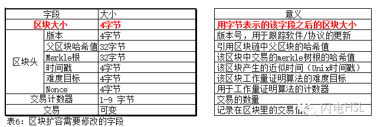

# 什么是硬分叉，什么是软分叉，什么是共识？

## 第0章 引言
 比特币是一套软件，对软件代码进行修改升级就经常会涉及到两个概念，一个叫硬分叉，一个叫软分叉。这到底是什么意思呢？社区里最常见的定义说是对共识的修改。但“共识”具体指的是什么，很难理解。我们还是多实际的修改代码层面来看下它们的定义吧。

## 第1章 比特币的交易格式和交易历史记录
在理解什么是硬分叉和软分叉之前，我们先要知道这两者要修改的东西是什么。

比特币交易在汉语中有双重意思，这是硬分叉和软分叉经常被误解的一个关键。

**比特币交易其中一个含义指的是我们发送比特币统一使用的数据结构**，这是一套规则，我们所有人发送比特币，不论你使用什么钱包软件都得遵守这一套规则。它被定义成一个数据结构，其中的每一个字段代表着什么意思。所有钱包软件都能理解这个意思。

**比特币交易的另一个含义是指使用比特币的人相互之间发送比特币的事件**。就比如我发了0.12345BTC给你，这是一次交易。所有这些发送比特币的事件，构成了比特币交易历史记录，这就是目前组成比特币完整节点的80多G的数据的主要内容。所有这些记录都可以在区块链浏览器上可以查的到，你只要在区块链浏览器上键入你的比特币地址就可以查到你所有的交易记录。

做个比喻来说明。交易格式就类似于我们去银行给别人汇款填写的那张汇款单，汇款单上明确定义了汇款人的姓名、身份证、手机号、账号、金额、收款人姓名、账号……等信息。比特币的交易格式也规定了汇款人的信息和收款人的信息，不过这些信息与人的身份信息无关，比特币交易规定的要填写的具体信息请看下一章。

## 第2章 比特币的交易格式和区块格式
比特币的交易历史记录这个概念大家都容易懂，就不展开说了，也没啥好说的。但比特币的交易格式，也就是交易的数据结构需要重点解释，否则无法理解什么叫硬分叉和软分叉。
一笔比特币交易是一个含有输入值和输出值的数据结构，该数据结构植入了将一笔资金从初始点（输入值）转移至目标地址（输出值）的代码信息。这个数据结构包含一些字段，我们详细来看下这些字段，摘自《精通比特币》第5章。
!

所有的比特币钱包的都得按照这个表格规定的方式来发送比特币，否则在比特币网络上就不会被识别，也就是无效的交易。这就像是你去银行汇款，你不按照汇款单填写，银行就不接受一样。

比特币网络会在平均10分钟内，收集各个节点发出的交易然后打成一个包，叫区块，盖上时间戳，然后添加到区块链上。

区块是什么呢？
**区块就是聚合了交易信息（也就是平均十分钟内网络上各个节点发出的比特币交易）的容器数据结构**。它由一个包含元数据的区块头和紧跟其后的构成区块主体的一长串交易组成。区块的数据结构被定义成下面这个样子。


所有的挖矿节点钱包都得按照这个表格规定的方式来打包区块，否则在比特币网络上就不会被别的完整节点识别（SPV节点不算），也就是会被认为是无效的交易。

## 第3章 硬分叉和软分叉的“官方”定义
硬分叉和软分叉在bitcoin.org上都有定义，但定义其实很模糊，为了防止我胡说（质疑bitcoin.org上的定义，确实让我诚惶诚恐。），我摘录原文：

硬分叉被定义成这样：
```
A permanent divergence in the the block chain, commonly occurs when non-upgraded nodes can’t validate blocks created by upgraded nodes that follow newer consensus rules.
https://bitcoin.org/en/glossary/hard-fork

区块链发生永久性分歧，在新共识规则发布后，部分没有升级的节点无法验证已经升级的节点生产的区块，通常硬分叉就会发生。

```


软分叉的定义是这样的：
```
A temporary fork in the block chain which commonly occurs when miners using non-upgraded nodes violate a new consensus rule their nodes don’t know about.
https://bitcoin.org/en/glossary/soft-fork

当新共识规则发布后，没有升级的节点会因为不知道新共识规则下，而生产不合法的区块，就会产生临时性分叉。

```

**社区对区块扩容是该执行硬分叉还是软分叉的争议，我猜bitcoin.org上的这两个模糊的定义应该负主要责任。**最大的责任是原文中的“consensus rules（共识规则）”定义不清晰，如果我们在去bitcoin.org上寻找“consensus rules（共识规则）”是什么意思，原文是这样的：
```
The block validation rules that full nodes follow to stay in consensus with other nodes.
https://bitcoin.org/en/glossary/consensus-rules

完整节点为了和其他节点维持共识而遵循的区块验证规则。

```

**这个对共识的定义，在逻辑上就犯了循环认证的谬误，这个定义就是说“共识就是为了维持共识的规则”。**这和许三多说的话是一样的：“有意义就是好好活。”“那什么是好好活呢？”“好好活就是做有意义的事情。”其实他根本就没有回答什么是好好活，以及什么是有意义。

另外这两个定义中把硬分叉定义为“*permanent divergence（永久性分叉）*”，和把软分叉定义为“*temporary fork（临时性分叉）*”，这种几乎是文字游戏的定义法，让社区很多人害怕硬分叉。认为硬分叉是一个非常可怕的事。

**讲真，这篇文章在我脑海里大纲成文已久，但我一直不敢写，因为我怀疑的可是圣地bitcoin.org上的定义啊。**我苦苦阅读bitcoin.org上对比特币协议升级的定义，终究没能找到让我释疑的描述。我问过国内许多大V，也没有得到一个完整的答案。最几天社区的软分叉爱好者发了大量的文章来宣传软分叉，呼吁抵制硬分叉，我阅读过后，我推理过后，在我的知识体系内，我确信他们是错的。**他们错误的根源都来自对“共识”的理解是一种虚幻式的描述，根本就不知道具体指的是什么，好像只要提到了“共识”，就是神圣不可侵犯的一样，所有的逻辑和推理到了“共识”就停止了。**

既然对软分叉和硬分叉没有一个抽象的定义，那我们先从它们到底干了什么事来分析吧。

## 第4章 比特币区块链上执行软分叉升级的具体案例
比特币区块链上最近在几个月前就执行过一次软分叉升级，使得那是BIP68/112/113正式在比特币协议里生效，被社区称为CSV软分叉。大约在2016年6月份升级完成的。这个软分叉到底改变了比特币代码的哪里呢？要回答这个问题，我们需要从比特币交易数据结构上去寻找答案。

比特币交易数据结构在CSV软分叉前后发生了什么变化？


图中的红字加粗的那个字段就是CSV软分叉主要修改的地方。在CSV软分叉之前，这个字段是“序列号（目前未被使用的交易替换功能）”如下图：


正是因为原来比特币交易数据结构中这一个字段未被使用，或者当时是模糊定义，所以才可以被使用重新定义。这种未明确定义的字段在旧版本的比特币完整节点上就不会被仔细验证，新版本的节点按照定义过的规则生产新区块，还可以被旧版本的节点验证接受。这就是软分叉的具体过程。

但这显然不是长远之计，因为这种字段就这么一个，你用了一次，哪以后就没有了。

比特币在2012年还有一次重要的升级，叫P2SH，被社区称之为多重签名软分叉。这是对比特币交易签名脚本的一次修改，使得比特币可以很方便的通过多重签名的方式来发送交易。那一次修改了什么呢？


图中的红字加粗的那个字段就是多重签名软分叉主要修改的地方。一开始中本聪定义这个字段是叫P2PKH（Pay-to-Public-Key-Hash，支付给公钥），目前这个字段可以有5种脚本。

因为多重签名软分叉之后，没有升级的节点在验证已经升级过的节点产生的区块时，它们对这种新的P2SH锁定脚本也可以通过验证，所以这也是一个软分叉。

以上两个软分叉都是对比特币交易数据结构的修改。软分叉还能变相修改比特币的交易历史。

在2010年8月15日，有一个黑客利用比特币代码的一个漏洞，在第74638高度区块上刷出一笔交易包含了1844亿个比特币。随后在半天时间内被开发人员发现，并且发布了补丁，将这笔交易的输出变为无效。但这并不是简单地将这笔交易本身定义为无效，而将一类叫“负值输出”的交易定义为无效，刚才那笔交易就是利用比特币之前没有禁止输出值为负值这个漏洞，只是定义了只要输出总金额不能高于输入总金额就可以了。在补丁（应该是中本聪发布的）修正了这个漏洞，具体修改的是什么呢？


图中的红字加粗的那个字段就是这个漏洞补丁主要修改的地方。修改之前的规则是“总量”不能高于“交易”，修改之后的规则是添加了“总量”不能是负值。这种修改未升级的节点能够验证已经升级的节点产生的区块，所以也是软分叉。

现在我们对这三个案例进行抽象化，给出一个软分叉的定义：**软分叉是指比特币交易的数据结构（这就是被广泛流传的“共识”）发生改变时，未升级的节点可以验证已经升级的节点生产出的区块，而且已经升级的节点也可以验证未升级的节点生产出的区块。**

软分叉对“共识”的修改肯定还包括对区块格式的修改，但这里的三个案例均是对交易格式的修改。

下面我们来看硬分叉案例。

## 第5章 比特币区块链上执行硬分叉的具体案例
在2013年3月12日，当时是bitcoin qt 0.8.0版本软件发布了，0.8版本采用了一种新的数据库level db。有的矿工节点升级了bitcoin qt 0.8版本，有的矿工还继续使用bitcoin qt0.7版本的软件。双方各自生产区块，但bitcoin qt 0.8采用的新数据库生产出的区块被被qt0.7版本节点拒绝掉。具体的原因是旧的数据库对超过800Kb的区块有时不接受。因此在区块高度225430比特币区块链分成了两条链，结果导致了比特币区块链产生两条链，一条是包含大于800kb区块的链，另一条是拒绝承认这些包含更大区块的链，这就发生了硬分叉。

当时是采用bitcoin qt 0.8版本的矿工放弃了他们挖的链，退回到bitcoin qt 0.7版本上继续挖矿。

这次硬分叉是一次意外，是bitcoin qt 0.8版本的软件出了bug，导致采用旧软件的节点拒绝验证新软件节点生产的区块。但硬分叉的成因就是采用旧软件版本的节点拒绝验证采用新软件版本的节点生产的区块，然后双方各自挖矿。

在2015年7月4日比特币区块链在区块高度363731发生一次硬分叉。当时是Bitcoin Core 开发者往新版本的Bitcoin Core 0.10.0添加了BIP 66。这本来是一起软分叉的修改，在比特币网络上主要矿池都使用了0.10版本的软件时，但有一个矿池BTC Nuggets没有升级，导致BTC Nuggets挖出来的两个区块其他矿工拒绝掉，然后双方就各自挖矿延续自己认为是正确的区块链，由此产生硬分叉，分成了两条链。

随后bitcoin.org发布公告，呼吁矿工升级到bitcoin core 0.10.2版本来消灭分叉。

这也是一次意外，硬分叉的成因是采用新软件版本的节点拒绝验证采用旧软件版本的节点生产的区块，然后双方各自挖矿。

到目前为止这两次硬分叉都是意外，但硬分叉的成因前一个是因为对新产生的区块格式在不同节点上产生分歧，后一个是因为对交易格式在不同节点上产生分歧。但因为是意外，社区没有讨论出足够多的资料，我也搞不清楚具体是区块或交易的哪个字段被修改而导致的分叉。

到了这里，我们可以对这两个案例进行抽象化，给出一个硬分叉的定义：**硬分叉是指比特币区块格式或交易格式（这就是广泛流传的“共识”）发生改变时，未升级的节点拒绝验证已经升级的节点生产出的区块，不过已经升级的节点可以验证未升级节点生产出的区块，然后大家各自延续自己认为正确的链，所以分成两条链。**

下面我们来看社区正在策划，但还没被激活的软分叉和硬分叉。
 
## 第6章 正在策划的区块扩容硬分叉
目前比特币社区正在策划一次硬分叉，来由是目前的区块被塞满了交易，为了能在十分钟一个区块里容纳更多的交易，就需要对区块的数据结构做修改。那我们先再来看下区块的数据结构。


目前比特币网络主要的完整节点软件是bitcoin core 0.12，这个软件规定表6里的“区块大小”这个字段最大值为1M。这就导致最后一个字段“交易”能够容纳的比特币交易数据有限，一笔交易至少是250字节，1Mb只能装下4000多笔交易，平均每秒最多只能处理7笔交易。而因为实际的交易往往会达到500字节的大小，实际上平均每秒往往只能容纳3笔交易。

所以有人就提出将这个字段的最大值调高，比如Bitcoin Classic这个软件就将这个字段的最大值调到2M，并且以后有计划取前2016个区块大小的中位数再乘一个约定好的倍数来决定下一批区块的大小上限。而Bitcoin XT则将这个值修改为20M，并且每两年翻一倍，直到上限值达到8.3G。而Bitcoin Unlimited则直接将这个字段修改为由矿池决定自己打包多大。

问题是，**使用这些修改了这个字段的软件的节点生产出的区块就会和没有升级的节点不兼容，没升级的会拒绝验证这些新节点生产的区块。这就会导致硬分叉。**

到这里，我们基本知道了，**所谓的硬分叉需要修改的“共识”就是指的是修改区块数据结构格式，或修改交易数据结构格式。**
 
## 第7章 隔离见证软分叉
还有一个对区块变相扩容的方案是隔离见证，这个方案修改的是比特币交易数据结构，我们还是来看图。


**图中红色的字段就是隔离见证主要动手的地方，这是要将这部分数据移出交易定义的数据结构，并且还要移出区块定义的数据结构。**因此交易就少了一部分数据，这样每一笔交易的体积就会小，而整个区块1M空间内就能够容纳更多的交易。

但这样移走这个字段，也会造成没有升级的节点的拒绝验证这些升级的节点生产的区块。但是有办法让他们不拒绝，但代码写起来就非常非常复杂，反正这个代码写了一年多了，到现在还没有搞出来。代码越复杂，势必潜在的漏洞就越多，想想Bip 66都由软分叉导致了硬分叉，而这个隔离见证更复杂。

到这里，再一次验证了，**所谓的软分叉需要修改的“共识”就是指修改区块数据结构格式，或修改交易数据结构格式。**

## 第8章 软分叉和硬分叉要修改的“共识”都是对数据结构的修改
现在我们可以对软分叉和硬分叉到底要做什么工作做个总结，特别是软分叉和硬分叉之间到底有什么区别，以免得被那些定义不准确的“共识”弄晕了。

**软分叉修改的“共识”具体是指修改了比特币交易数据结构，或修改了比特币区块数据结构。**

**硬分叉修改的“共识”具体是指修改了比特币交易数据结构，或修改了比特币区块数据结构。**

**在具体修改的对象层面上，软分叉和硬分叉是完全没有区别的，就目前止我们看到的所有的已经发生的，和计划发生的分叉都是这样子，它们都修改或试图修改交易数据结构，或区块数据结构。**

**目前发生的，或计划发生的硬分叉和软分叉都绝对不会去修改交易历史记录。**哪怕是2010年8月15日发生的刷出天量币的漏洞，那一次修改的也是交易数据结构，但附带的作用就是将一个区块里的交易作废了，因为那笔交易在新交易数据结构的定义下是非法的。

所以说软分叉和硬分叉在修改“共识”层面上本质上是没有区别的。

那软分叉和硬分叉的区别在哪呢？ 

## 第9章 软分叉和硬分叉主要区别是新旧节点相互兼容性
区别是对新旧节点的兼容方面。**软分叉修改数据结构后，新节点生产的交易和区块能够被旧节点验证并接受，硬分叉就不能。**

正因为硬分叉修改数据结构后，新节点生产的区块会被旧节点拒绝掉，如果旧节点拒绝升级软件而坚持按照旧数据结构继续挖矿，那比特币就会产生两条链。

而软分叉因为没有升级的节点能接受新节点生产的新数据，所以不会出现两条链。但**软分叉为了做到新节点和旧节点生产的数据完全兼容，那是非常难的，因为本质上是不一样的数据结构大家要相互认，一旦出现有节点拒绝验证不一样的交易或区块，那就会变成硬分叉**。这也就是Bip 66软分叉最终变成硬分叉的原因。

从第4章我们看到具体的软分叉的修改办法是将原来定义好的字段进行重新定义，如多重签名软分叉。或者是对原本是留在的字段做定义，如CSV软分叉。

**但是现在从交易的数据结构来看，所有的字段都已经被占用，并且准确而详细地定义了，如果你还要再做软分叉，那就只能将部分字段原有的定义擦除掉，再重新定义。**这样就会导致原有的功能可能会丧失，如果这个功能是不可或缺的，那就会导致硬分叉，新旧节点相互拒绝。所以软分叉要特别小心。这也就是隔离见证的做法。隔离见证是直接将某个字段删除掉，但为了保证新旧节点之间的相互兼容，那个是废了牛劲了。

便硬分叉则不考虑没有升级的节点会不会拒绝已经升级的节点生产的数据和代码的情况，情况要简单许多。

让我们来看看这种为了实现软分叉和硬分叉要做的兼容性有什么区别。

软分叉和硬分叉要实现新旧节点生产的新旧数据涉及到的主要变化量一共有六个：
```
1. 没有升级的旧节点；
2. 升级了的新节点；
3. 旧节点发生的旧交易格式的交易；
4. 新节点发生的新交易格式的交易；
5. 旧节点生产出的只含旧区块格式的旧区块；
6. 新节点生产出的含新区块格式的新区块。
```

实际上还要考虑更复杂的其他因素，包括完整节点；SPV节点；新旧节点算力占比；SPV挖矿节点；未确认交易和多个确认交易；CSV交易；RBF交易……。所有这些都是兼容性要考虑的因素。但为了简化，我这里只考虑上面6个主要变化量，我们先来列个表。


**软分叉需要保证完美的兼容性就要求达到以下两种情况：**
```
1.升级过的节点接受没有升级的节点生产的交易和区块（向后兼容）；
2.没有升级的节点接受升级过的节点生产的交易和区块（向前兼容）。
```

**硬分叉需要保证的兼容性只需要达到上面的第1种情况，也就是新节点需要从0高度区块开始验证整个区块链就可以了。**

我们打个比方来说明这两种兼容性吧：

向后兼容其实是我们最好理解的，就是我们使用word 2013可以打开word 2010版的文件。向前兼容的意思是旧版本软件要无条件接受自己所不能理解的新版本软件生产的数据。就像是你用word 2010去打开word2013版的文件。这种难度不知道有多高啊，旧版软件怎么会知道还没有定义过的数据呢？它唯一能做的就是忽略这些新功能。

而硬分叉是不考虑这么复杂的兼容性的，首先是拒绝向前兼容。硬分叉就不会理会没有升级的节点拒绝验证升级过的节点生产的区块这会事，你受验证不验证，你不升级我就不跟你玩了。
 
## 第10章 对比软分叉和硬分叉的优缺点
软分叉可以保证不想升级的人不去升级，这种不想升级的需求在现实生活中其实是很常见的。

硬分叉必须要求所有旧节点进行升级，否则旧节点就无法识别新节点生产的交易和区块，导致区块链分成两条链。

**软分叉的升级空间有限，因为目前的比特币交易数据结构和区块数据结构所有字段都已经详细定义好了，你想保证向前兼容，就不可能增加新的字段，否则旧节点就会拒绝你。**所以软分叉的升级空间补束缚在对现有字段的重新定义。就包括软分叉就无法重新定义区块数据结构里的“区块大小”这个字段，也就是软分叉永远实现不了对1M区块的突破。而且这种极端复杂的兼容性稍微出点错，就会新旧节点不兼容，即导致硬分叉。这个事情已经发生过一次了。

**硬分叉的升级空间则要大很多**，因为硬分叉只要考虑能够接受以前旧节点生产的交易和区块就可以了，硬分叉不需要考虑旧节点是否会接受新节点生产的交易和区块。那硬分叉就可以对交易数据结构和区块数据结构更大胆的修改。

最后，**比特币交易数据结构和区块数据结构都有一个字段叫“版本号”，意义是“明确这笔交易或区块参照的规则”**。这意味着中本聪是希望使用硬分叉来修改这些规则，就是说如果我们要修改规则，那就重新定义版本号。但软分叉在不修改“版本号”的前提下，却修改了规则。

## 第11章 结束语
“共识”这个词忽悠了太多的人了。其实在“不破坏共识”包装下的软分叉，本质上和硬分叉是一样要修改相同的对象的，而且更可怕的代价是向前兼容，即要求不升级的软件去忽视升级过的软件生产的数据和代码，冒这种风险得来的好处仅仅是懒得升级软件。我想任何理智的人都是不愿意接受这种风险收益比的。

