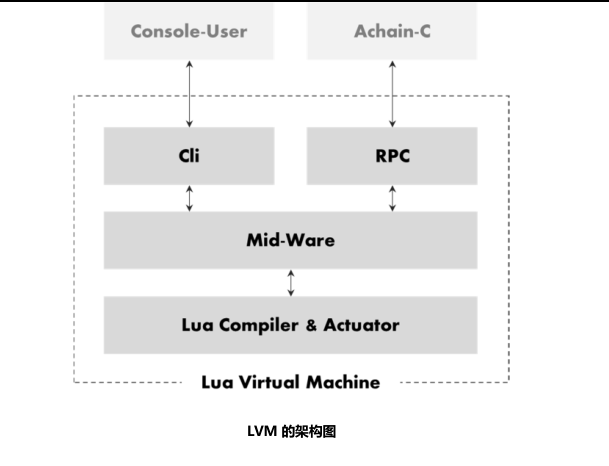
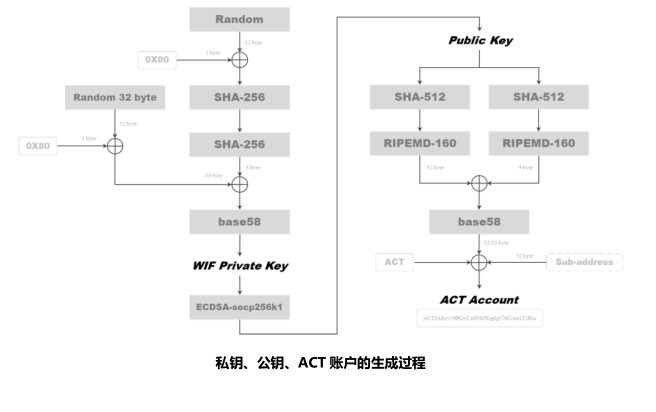
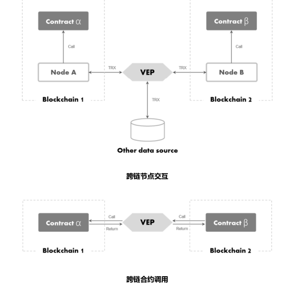
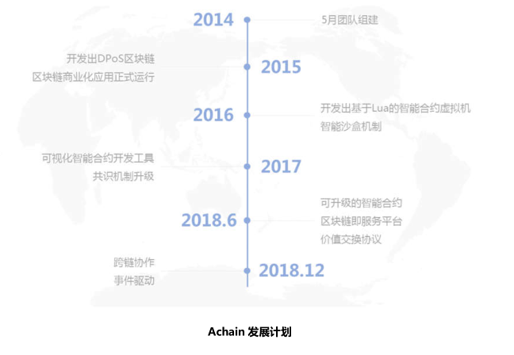
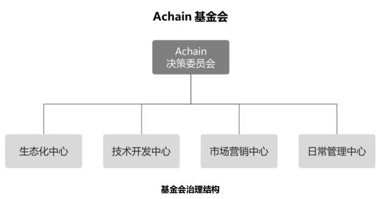
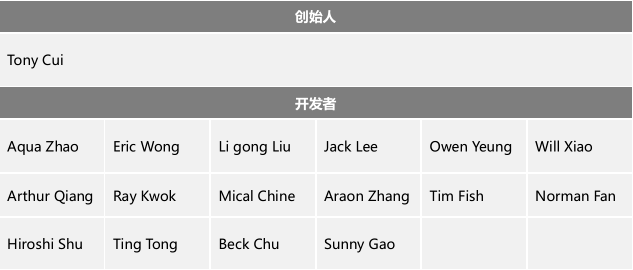

# Achain区块链白皮书

> 创造一个无边界的区块链世界

[TOC]

## 摘要

Achain Blockchain （以下简称 Achain）致力于打造一个无边界的区块链世界。区块链自 21 世纪初期发展起来，是目前全世界认为最有潜力、最具想象力的一种技术革新。在人类的发展史上共经历过三次工业革命，第一次以蒸汽机的发明为标志，让机器代替了手工劳动；第二次以电能的突破、应用和内燃机的发明为标志，直接推动人类进入电气化时代；第三次以电子计算机、核能、空间技术、生物工程的发明和应用为标志，不仅推动人类社会的巨大变革，更深刻地影响了人类的生活和思维方式。每一次工业革命都带来生产力的巨大提升，而作为生产要素之一的生产关系，改变并没有那么巨大，依旧是自上而下、金字塔层级的中心化组织。组织的业务越复杂，层级越多，效率提升就越困难。区块链是去中心化、去信任化的网络，可以实现点对点价值交换，被人们称之为价值互联网。Achain 认为区块链技术最有可能改进当前的生产关系。在 Achain 的帮助下，我们可以创造这样一个世界——一个人和人直接相连，去信任化的，在社区或者社会共识下，相互协作、点对点相互交换、价值驱动的世界。

Achain 将分三阶段来实现上述目标。首先，我们利用模块化的设计方法构建安全稳定的区块链网络，这一阶段即可实现智能合约及数字资产，同时我们将引入智能沙盒——一个可以智能化测试和监测合约运行的环境，沙盒可确保即将正式运行在链上的合约足够安全，避免类似 DAO 事件的发生。接下来，我们利用区块链分叉来满足不同的商业诉求，如保险、电子文档、数字货币、溯源追踪、个人信用记录等。这一阶段将实现一个不断进化、容易使用、低成本的、适度定制化的区块链网络。最后，通过价值互换协议（Value ExchangeProtocol，以下简称 VEP），我们将这些已经分叉的、仍然活跃的网络连接在一起，甚至与其他网络（可能是非区块链的）打通数据交互，构建出一个相互连接、多维度数据相互关联的网络世界。利用多维度数据，如个人信用、资产、生产和消费数据，可以更好地将社区共识、个体行为、价值交换有机地整合在一起。Token 承载生态中的价值，Achain 将它命名为 ACT，持有 ACT 将获得合约发布、网络分叉等区块链基础服务。为构建上述生态，Achain 在设计上把安全性、稳定性、可扩展性放在首位。Achain 作为一个公有链，我们选取了更实用、占用资源更少的委托权益证明（Delegated Proof ofStake，以下简称 DPOS）共识机制，并在其基础上创新出基于结果的委托权益证明（ResultDelegated Proof of Stake，以下简称 RDPOS）共识机制，在同样安全的情况下，RDPOS更有利于提升整个网络的交易性能，结合对网络其他参数的整体优化，理论上可达到甚至超过 1000TPS（transaction per second）。

## 1 Achain 的背景及意义

### 1.1 信息网络的发展历程

1969 年 10 月 29 日，阿帕网加州大学洛杉矶分校（UCLA）第一节点与斯坦福研究院（SRI）第二节点连通，标志着人类开启了互联网时代。以互联网为代表的信息技术，在其蓬勃发展的近 50 年时间里，不仅主导了第三次工业革命，更成就了如 Amazon、Google、Facebook、Alibaba 等伟大的互联网企业，让人们又一次看到技术改变世界的力量。

2008 年 10 月 31 日，中本聪发布了比特币白皮书——《一种点对点的电子现金系统》，宣告了价值传输网络的到来。比特币有许多值得称赞的设计，如：防篡改，数据备份，参与者相对匿名，无其他信任方等。但其本身的交易性能和工作量证明（Proof of Work，简称 POW）共识机制也逐渐暴露出问题。区块链技术从比特币衍生而来，近些年，人们主要围绕区块链的交易性能、共识算法、安全匿名进行创新，如：石墨烯、闪电
网络对交易性能的提升；权益证明（Proof of Stake，简称 POS）、委托权益证明（DPOS）、实用拜占庭容错（Practical Byzantine Fault Tolerance，简称 PBFT）对共识算法的丰富和改进；零知识证明（Zero-knowledge Proof，简称 ZKP）、混币提升交易安全等。

### 1.2 区块链是大势所趋

为什么会出现区块链，我们真的需要吗？Achain 作为区块链早期的参与者和见证者，认为这一创新不可逆转更不会昙花一现，原因有两个。

其一，人们需要真实、有价值的信息、够降低信任成本。计算机和互联网让信息分享更加便宜、更加便捷，利用信息透明，优化价值链，提升协作效率。但是，无法杜绝的虚假信息、违约行为也让人头疼不已，基于互联网的传播和复制也极为容易，人们为信任所投入的成本已经越来越大，必然阻碍效率的进一步提升。

其二，人们需要一个将共识、行为和价值激励相互连接的生产关系网。相比工业革命带来生产力巨大飞跃，生产关系的改变就不那么巨大。人类的生产活动以组织为中心开展，依旧是自上而下、金字塔层级的中心化结构。组织业务越复杂，层级越多，要实现客观公正的利益分配就越难，因此，效率提升也就难上加难。

区块链将分布式存储、加密技术、P2P 网络等技术融为一体，有去中心化、去信任化的技术优势，被人们称之为价值互联网。区块链最有可能解决人与人之间的信任问题，并缔造出新的生产关系网络——点对点价值交换。

### 1.3 仍需解决的问题

比特币自 2008 年诞生以来，以此为原型衍生出区块链技术，无数技术爱好者参与贡献，发展方向百花齐放。有专注于去中心化平台的以太坊（Ethereum）、发展数字货币为主的比特币（Bitcoin）、莱特币（Lite Coin），以信息存档为方向的公证通（Factom），为保护用户隐私目的的 Zcash 和 Dash，专注于去中心交易所的比特股（Bitshare），甚至是R3CEV 力推的分布式账本平台 Corda。

尽管行业发展生机勃勃，但区块链无论从技术创新还是商业应用，还面临很多挑战。

1. 智能合约仍存在安全隐患，黑客可利用漏洞盗取用户的数字资产；
2. 以不同应用目标而建立的区块链平台，彼此之间存在兼容性问题。尽管人们已经发现并尝试特定链之间的信息交互，但这种局部的解决方案还不足以支撑整个区块链生态发展；
3. 区块链缺少和现实物理世界的交互，让许多应用创新不得不流于形式，如商品溯源；
4. 目前，区块链应用仍有较高的技术门槛，导致大规模商用的成本太高；
5. 存在性能瓶颈，目前分布式系统的性能还难以赶超中心式系统，或者说，分布式系统还难以实现大规模商用。

### 1.4 为什么需要 Achain

Achain 在设计上把安全性、稳定性、可扩展性放在第一位。通过引入模块化的虚拟机、智能沙盒、价值交换和分叉机制，从而创造出一个不断进化、容易使用、低成本的、适度定制化的区块链网络。此外，Achain 通过对出块间隔、区块容量、共识算法的优化，理论上可达到 1000TPS 的可用性能。Achain 相信，通过技术创新将能够解决人与人之间的信任、也能缔造一个新的生产关系网络，更好地将社区共识、个体行为、价值交换有机地融为一体。

## 2 Achain 的设计理念

### 2.1 稳定性

稳定性是确保 Achain 可用的必要条件。区块链自带去中心化特征，去中心化网络通常较复杂并充满不确定性。因此，我们借助模块化设计工具对区块链进行抽象和简化，通过单独构建模块化虚拟机——Lua Virtual Machine（以下简称 LVM）运行智能合约，这样的设计可带来两个好处。一是优化 LVM 性能直接提升合约执行效率，减少系统耦合带来的干扰因素；二是弱化区块链网络与智能合约运行状态的相关性，即便合约执行出现问题，或虚拟机运行异常，区块链网络的稳定性依然能够保证。

### 2.2 安全性

PoW 曾对比特币网络的安全贡献功不可没，但由于日益增长的挖矿需求和算力难度提升，几乎所有权利都集中到矿工和矿池手中。通过专业合作，他们事实上已经成了高度中心化的“中央服务器”。如果联合超过 51%的算力，理论上就能够控制大多数比特币交易，如我们熟知的 DOS（Denial of Service）攻击。此外，高昂的电力消耗也同样让人诟病。相对于 PoW 模式来说，PoS 模式仍在发展，这些发展方向主要立足于安全和应用。PoS 模式比 PoW 模式在安全上有很大优势，但前提是吸引到足够的持有者来进行 PoS 挖矿，才能充分的发挥出安全的优势。DPoS是PoS的改进，而Achain创新出更具商业普适意义的RDPoS共识机制。与 DPoS 同等安全的情况下，理论上可提高出块响应，增加网络的稳定和安全。除此之外，Achain 创新性地提出智能沙盒机制。任何人发布的合约，首先要在智能沙盒中试运行，Achain 会对其进行全路径自动化测试，并持续监控其运行状态，若健康程度恶化，或发现漏洞。网络自行判断将其终止，避免问题合约对区块链生态造成破坏。

### 2.3 可扩展性

可扩展性的提出，为了解决区块链彼此不兼容的信息孤岛问题。首先，我们认为升级、分叉是网络进化的有效途径之一，分叉后形成一个主链和若干子链。主链和子链从技术角度看完全对等，只是基于社区共识给它们设置不同的标识。每一条子链可根据不同的商业应用做适度化定制，通过在子链之间构建 VEP，其工作方式类似于网关，子链之间通过 VEP 可交互信息和交换价值。通过这样的协作可形成多应用的区块链生态。不仅如此，非区块链的线上数据也将纳入 Achain 生态，辅以智能合约，可对现实世界中的事件做出响应。

### 2.4 易用性

Achain 通过两方面来实现易用性。一是提供区块链即服务平台（Blockchain as a Service，简称 BaaS）来降低企业及个人的使用门槛。通过网络分叉、数据定制、智能合约发布和升级、资产交易监控等并辅以可视化功能，让区块链应用变得简单易用。二是 Achain提供多种语言支持，从 Lua、C++到 Java，让不同平台的开发者都可以便捷地开发。

## 3 Achain 实现方案

### 3.1 合约和 LVM 的实现

传统智能合约，仅限链上数据的输入和输出，这样只能支持一些简单的应用场景。正因如此，Achain 重新定义了智能合约，除链上数据外，还允许链上和链下的数据进行交互，并支持对链上、链下数据状态的变化做出事件响应。现实世界中的商业应用大多非常复杂，这种复杂体现在数据结构和逻辑规则上。为了实现上述目标，Achain 在顶层设计上做了两方面准备。一是将潜在的应用抽象，提取通用需求，提前设计好 API 接口和数据结构。二是选取一种图灵完备语言，尽可能去逼近真实物理世界中的规则。

Lua 是一种图灵完备的编程语言，编译器和字节码虚拟机为在区块链中做了针对性设计和优化。因此，Achain 使用 Lua 作为 Achain 区块链上智能合约编程的首选语言，它支持静态编译成字节码并在区块链网络中按需执行。

合约在区块链网络中的生命周期可分为五个阶段:

1. 创建 Lua 源码；
2. 编译器将源码编译为 gpc 字节码；
3. 用 gpc 字节码注册临时合约并向合约充值；
4. 调用合约 API；
5. 升级或销毁合约；

上述生命周期中，合约的注册、调用、升级需要消耗 Token。一方面执行合约必须占用计算机资源、区块链容量和网络流量，需要对资源提供者做出奖励；另一方面也是利用经济学手段提高网络攻击的门槛从而降低风险。

为了更加稳定地执行合约，我们构建独立 LVM 模块，其结构如下：

LVM 包含四个模块。合约通过用户控制台（Console-User），以命令行的形式进行编写。Cli（Command Line Interface）是合约命令行的处理模块，负责接收，并将输入传递到中间层，还负责将底层处理完的结果反馈给控制台。RPC（Remote Procedure Call）模块负责接收来自区块链网络的 Lua 执行请求，并将请求发送到中间层，待合约执行完成之后将结果返回给区块链网络。中间层（Mid-Ware）负责将 Cli 和 RPC 传来的命令和请求同步传递给底层的Lua编译器和执行器进行编译，执行。并将编译执行结果返回给Cli或RPC。Lua 编译执行器（Lua Compiler & Actuator）负责编译，运行 Lua 执行环境，接收和执行Lua 脚本，并将执行结果反馈给中间层。

一个活跃的区块链网络，合约调用非常频繁，为确保合约能够稳定而高效地运行。LVM有两个设计原则：一是尽可能缩短进程启动和关闭时间；二是任何操作在不同节点不同时间每次调用的结果必须一致。除 Lua 外，LVM 还将支持 C#，Java，solidity（以太坊的合约编辑语言）等高级语言的编写，使不同平台的开发者都能够参与进来。

### 3.2 共识机制

由于分布式的特点，区块链需要共识机制才能正常运转。目前广泛应用的共识算法主要有 : 工作量证明（PoW：Proof of Work）， 股权证明(PoS：Proof of Stake)，实用拜占庭容错算法（PBFT：Practical Byzantine Fault Tolerance），委任权益证明（DPoS：Delegated Proof of Stake）。从安全实用考虑，Achain 选取 DPoS，并在其基础上改进得到 RDPoS 共识机制。

RDPoS 不仅继承了 DPoS 的优点——不需要消耗额外算力即可实现产块后的权益分配，它还能会根据网络的交易状态动态决定由代理或全体节点验证智能合约的执行结果。

Achain 作为公有链，形成社区共识离不开经济手段——Token 的支持。持有 Token不仅可获得合约发布、网络分叉等区块链基础服务，还能参与投票，成为代理节点提供服务获得 Token 奖励。Achain 把这种 Token 命名为 ACT，每一个 ACT 持有者称之为权益人，根据 ACT 持有数量分配相应的投票权重。代理节点由权益人投票选出。票数最多的前99 个代理依次轮流验证交易，顺序由所有代理节点共同决定，并保证无法被篡改。代理正常工作可以获收益，反之工作异常或不工作，则会受到惩罚。

从理论上看，RDPoS 相比 DPoS 可进一步提升网络交易能力。比如：对于某些执行时间较长、或内部状态空间占用较大的智能合约。代理仅打包结果交易的 Hash 值， 而由所有节点自行验证该 Hash 值 。在满足智能合约被快速验证的同时，也减少了整个网络的拥塞。此外，我们在共识算法上做了一些优化，避免代理节点固定不变，避免逐渐衍变为中心化的网络。

### 3.3 账户模型

在区块链网络中，账户地址是为了安全交换而设计出来的方案，其中的账户、公钥、私钥生成过程存在如下关系：私钥—>公钥—>账户地址，这三者都使用了安全散列算法（Secure Hash Algorithm，简称 SHA），可确保足够的安全。散列是信息的提炼，通常其输出要比输入小得多，且为一个固定长度。以目前的技术手段，加密性强的散列一定是不可逆的。即通过用户的账户地址，无法推导出用户的私钥信息。私钥、公钥、账户的具体的生成过程见如下流程：

按照账户地址的字节长度，可分为两类账户，主账户和子账户。

主账户长度为 35~36 个字符，子账户长度为 67~68 个字符。子账户是在主账户后加上 32 个随机字符生成的，只要子账户前 35~36 个字符完全一致，可认为它们都从属于同一个主账户。这样的账户结构，可扩展其交易性能。即从属同一个主账户的子账户可以在同一时段内并行交易，而不用担心“双花”问题。另外，子账户的设计可以节省账户开销和管理，这一设计主要用于交易所的账户设立和分配。

Achain 使用了 Account 模型而非比特币的 UTXO 模型（Unspent Transaction Output）。尽管 UTXO 设计非常巧妙，支持多笔交易并行，且账户隐私保护相对较好。但是，比特币的账户设计是面向交易的特定设计，要基于 UTXO 实现智能合约是非常困难的。
而 Achain 生态中的智能合约，往往需要条件、状态来触发资产交易，因此 Achain 最终选择了 Account 模型。

### 3.4 分叉网络

引用以太坊基金会董事会成员——Taylor Gerring 的话，区块链硬分叉可以让网络更有韧性。Achain 提出适宜分叉的网络，基于两点考虑。一是保持健壮的生命力，二是满足不同的应用场景。首先，区块链网络是众多参与者按照某些共识组建起来的一个社区，共识上的分裂使得硬分叉发生，而这种分叉有时好有时差。通过人们的筛选、淘汰，最终将留下一批有价值的区块链网络，这一点非常符合自组织世界中物种和环境不断自我进化的规律。其次，区块链目前还处于发展初期，相比数字货币而言，其他应用还需要进一步探索。围绕区块链，目前已有许多创新，如闪电网络、零知识验证、侧链技术、隔离见证等等。从这些创新上可以总结一个规律——即不同交易性能、不同共识方式、不同智能合约、不同技术特点，组合起来就是为满足某一类特定需求。因此，通过分叉实现不同的网络，满足多样化需求是可行的。但多样化会带来其他问题，下一节我们将描述如何解决。

Achain 将作为整个分叉网络的起点，也可称其为主链。主链可以分叉出与之平行的子链，子链也可继续分叉，所有链地位平等。分叉发生时，VEP 将记录并广播这一子链的注册信息，如创世块信息、子链 ID、种子节点、数字资产、服务识别号等。如果分叉继续发生，这些注册信息将再次被 VEP 更新并同步到整个网络中。当链与链之间需要交互时，通过注册信息即可以服务发现的方式建立连接，并在 VEP 框架下实现信息交互和价值交换。VEP类似于互联网的 DNS 服务，负责注册信息、更新信息、提供访问服务。

为了让上述目标成为可能，Achain 搭建了 BaaS 平台，利用可视界面和多语言支持，大幅降低开发者门槛。任何人都可通过分叉建立自己的应用，从而更好地激励社区开发者的创新动力。社区活跃度提升，ACT 价值增长，社区吸引力增加，更多的开发者和使用者参与。正反馈效应将让 Achain 生态越来越好。

### 3.5 价值互换协议（Value Exchange Protocol）

VEP 是不同区块链网络之间连接的标准协议。如前所属，一个网络能够承载的应用有限，彼此连接起来形成更大的网络，可产生的价值叠加就越大。我们先了解单个网络节点是如何相互信任的。区块链网络最大的优点在于能够提供可靠的信息查询，这种可靠性体现在分布式账本和分布式共识。区块链网络是众多参与者按照某些共识组建起来的一个社区，节点在共识和激励的作用下形成了相互信任关系。推而广之，把一个区块链网络当作节点，多个区块链网络之间形成连接，也需要这样一个共识机制。因为不同网络的平等性、可信度、利益诉求让网络协作变得困难，再加上网络中总有坏节点。因此，协作前预先设定的规则尤为重要。这就如同人类社会中跨组织协作需要有法律，契约和道德的约束。

VEP 为如何协作制定了准则。它登记每个链的注册信息，并提供服务给受信列表中的链进行查询和连接请求。VEP 支持跨链节点交互和跨链合约调用两大应用场景。前者利用存储在节点的数据或外部数据的状态变化，间接地让合约之间产生交互，并可能产生新的信息。例如：按照合同约定到期未偿还贷款，将会影响到个人信用。贷款记录可以存储在区块链 A，而信用数据则可以存储在区块链 B，个人身份信息可能来自外部的公用数据库。后者则是合约之间相互调用，一个最简单的例子就是两个链的 Token 互换，并让总价值保持不变。

VEP 中包含以下内容：

- 链的注册信息，网络身份、服务识别号、种子节点信息等，类似于 DNS（Domain Name Server）中记录的信息；
- 跨链验证协议；
- 数据通信协议；
- 资产交换协议；
- 奖罚机制；

### 3.6 事件驱动

依托于 VEP，Achain 可实现链与链之间的信息交互和价值交换，甚至将现实物理世界中的 IOT（Internet of Things）、AI（Artificial Intelligence）、企业或公共服务数据库等非区块链数据源也纳入到生态中，做到实时的事件驱动（Event-Driven）。

实现事件响应的 5 个步骤：

- 场景识别、分类并设定响应标准；
- 开启监听服务，获取数据；
- 计算和响应判定；
- 执行，通过 VEP 调取数据，执行合约；
- 反馈执行结果；

## 4 Achain 的应用

### 4.1 应用 1——供应链金融

供应链金融是金融机构（通常指银行）围绕核心企业，管理上下游中小企业的资金流和物流，通过整合信息，将风险控制在最低的金融服务，它是近年来发展迅速的行业之一。由于参与方众多，各类信息分散保存在各个环节，供应商的货物信息存储在供应商的仓储信息中，发货信息掌握在物流公司手里，资金信息分布在银行系统内，流转信息则由核心企业掌握，各参与方信息不对称，协作所需的信息不透明，导致有效的供应链信用体系难以建立。由于建立信用的代价过高，金融机构基于风险控制不得不谨慎行事，往往错失一些优质项目。

Achain 可以帮助企业、金融机构重构信用体系，建立更高效率的供应链金融。

以核心企业为背书，通过 Achain 建立仓储、物流、数字票据和企业征信区块链平台。可实现供应链上下游企业、金融机构共同见证的货物、仓储、物流和应收账款信息。数字票据的发行、确认、流转、拆分、承兑由供应链的各个参与方通过合约触发，触发条件可依据于仓储、物流区块链、以及核心企业数据库中的数据状态的变化，触发规则按照参与各方的契约编写而成，遵守或违背规则的行为都将记录到征信区块链，且不能篡改。

Achain 利用 BaaS、智能沙盒等技术优势，企业可实现快速部署。通过低成本地快速分叉建立不用的区块链网络，利用 VEP 建立连接协议，通过整合数据实现事件驱动。所有参与方都可共同验证数据的真实性，从而保证供应链中资金传递的顺畅，协作效率提升。

### 4.2 应用 2——商品溯源

零售行业天然具有交易数据碎片化、交易节点多样化、交易网络复杂化的特点。人们通过在线商城或者线下超市购买商品，其包装都会标注产地信息、生产日期、生产商。但我们很难判断这些信息的真实性。由于造假的利润空间很大，高价值商品，如钻石、皮包、护肤品等存在假货的可能性更高。造假不仅损害消费者利益，损害商家的信誉和品牌形象，社会也不得不消耗资金、人力来行使法律监督和法律制裁。对于商品溯源，目前存在几个痛点：一是商品溯源不仅需要追溯到生产环节、还需要流通环节。这势必增加更多主体共同背书，跨组织协作的难度可想而知；二是无论生产商还是物流商，所使用的系统必然是中心化的，存在信息孤岛问题；三是中心化系统都存在个体作恶的风险。

针对以上三个痛点，Achain 提出对应的解决方案——区块链+物联网。

借助物联网，生产和物流环节的数据可通过智能设备实时采集，并通过 VEP 接入到Achain 存储在溯源网络中。区块链独有的数据存储结构和分布式账本技术，确保上链数据不可篡改。同时，非对称加密、相对匿名可确保企业核心信息不泄露。消费者需要查询商品信息时，只要知道商品编码和生产批次，即可追溯到商品的全部信息。

区块链可以解决溯源痛点，同时也不用担心泄露企业隐私。对生产商、物流商、消费者来说，信息都是透明的。更进一步来说，消费信息和物流信息可以给生产商提供决策支持，客户在哪里，生产地如何安排成本最低，生产多少最合适。物流商也同样如此。正因为区块链的存在，信息交互更透明，社会运作更高效。

## 5 Achain 发展计划

### 5.1 Achain 阶段性规划安排

第一阶段，奇点（2014~2016）。利用模块化的设计方法构建安全稳定的区块链网络，这一阶段即可实现智能合约及数字资产，同时我们将引入智能沙盒——一个可以智能化测试和监测合约运行的环境，沙盒可确保即将正式运行在链上的合约足够安全。

第二阶段，星系（2016~2017）。通过分叉来满足不同的商业诉求，如保险、电子文档、数字货币、溯源追踪、个人信用记录等。这一阶段将实现一个不断进化、容易使用、低成本的、适度定制化的区块链网络。

第三阶段，宇宙（2017~2018）。通过价值互换协议（VEP），将诸多分叉连接，甚至与其他网络（可能是非区块链的）打通数据交互，构建出一个相互连接、多维数据相互关联的网络世界。

## 6 项目治理结构

### 6.1 Achain 基金会简介

Achain 基金会（以下简称“基金会”）致力于 Achain 的开发建设和治理透明度倡导及推进工作，促进开源生态社会的安全、和谐发展。基金会将通过制定良好的治理结构， 帮助管理开源社区项目的一般事宜和特权事项。基金会治理结构的设计目标主要考虑开源社区项目的可持续性、管理有效性及募集资金的安全性。基金会由生态化中心、技术开发中心、市场营销中心、日常管理中心组成。

### 6.2 Achain 基金会治理结构

其中，各机构的分工如下：

1. Achain决策委员会，负责重大事项的管理与决定，包括聘任或解聘执行负责人以及各中心负责人、制定重要决策等。决策委员会成员任期三年，可以连任。委员会设主席一名，由委员会成员投票决定。首届决策委员会成员将由Achain创始团队及投资人选举产生。
2. 生态化中心，负责探索Achain与行业结合应用的可能性，从而实现商业落地。重点探索领域为：互联网金融、跨境交易、大数据、人工智能等领域。生态化中心成员在社区中与社区成员交流生态化的发展和未来。
3. 技术中心由负责底层技术开发、测试、上线、审核等。技术中心成员在社区中与权益人、社区贡献者沟通项目进展，不定期举办技术交流会。
4. 市场营销中心负责技术、产品、社区、开源项的推广和宣传。
5. 日常管理中心包括财务、法务、人事、行政等管理。财务负责项目资金的使用和审核；法务负责各类文件的审核与拟定，防范可能存在的各类法律风险；行政和人事负责人员、薪酬等人事工作以及日常行政工作。

### 6.3 联系方式

- 官网：<https://www.achain.com/>
- 电子邮件：Hi@achain.com
- Achain 社区：<https://newforum.achain.com/>
- Twitter：<https://twitter.com/AchainOfficial>
- Facebook：<https://www.facebook.com/Achain-124056884987435/>
- Slack：<https://slack.achain.com/>
- 微信： Achain_secretary
- QQ：626348505

### 6.4 项目开源

- Github：<https://github.com/Achain-Dev/Achain>

## 7 技术团队

2015，崔萌创立 Achain，发展至今已经形成 17 人的核心开发团队。其中数名成员有多年区块链、数字货币行业经验。

