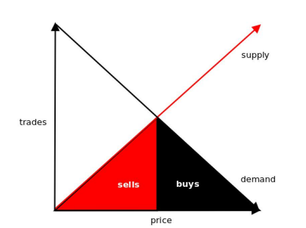

# Aeternity 区块链白皮书

去信任、去中心化、可靠预言机

2016 年 12 月 8 日

> Zackary Hess zack@aeternity.com
> Yanislav Malahov yani@aeternity.com
> Jack Pettersson jack@aeternity.com

[TOC]

## 摘要

自 2014 年以太坊诞生以来，去中心化去信任应用（智能合约）引起的兴趣便日益高涨。自然，许多人试图将现实世界的数据引入区块链来实现各类应用。我们认为将应用的状态和代码在链上储存是错误的做法，并解释了多个原因。我们将呈现一个高度可扩容的区块链架构，以及一个也可以被用来检视预言机(oracle)的共识机制。这将使得预言机变得非常高效（廉价），因为它将避免共识机制重叠使用的情况。状态通道将得到整合，从而提升隐私性和可扩容性。通道中的代币可以用完全可靠的、可以访问预言机答案的智能合约来进行传输。合约代码或状态将不会在链上储存，因此使得智能合约更容易分析、处理速度也会加快，而实际功能性并不会遭受显著损失。自创资产和预测市场这样的应用可以高效地在全球规模上进行部署。某些部分已经有使用 Erlang 语言编写的概念验证实现了。而诸如钱包和命名与身份系统这样的开发工具和应用必需品也将会一并提供。

## 1. 介绍

本文旨在对 Aeternity 区块链的架构和可能的应用进行总览。未来我们将提供更细致的论文，尤其是针对共识和治理机制的。然而需要指出的是，我们的架构是全盘的；所有的组件将以模块的形式绑定在一起进行协同工作。

本文余下的部分以 4 部分呈现。首先，我们会介绍并讨论这个架构的本质理论基础。然后，我们会讨论必备的基础性应用、其他可能的实用案例并就开发者如何使用本平台提供参考。第三，我们会呈现现有的概念验证实现，这个实现是用 Erlang 语言编写的。最后，我们会抛砖引玉，讨论未来的方向，并与其它技术进行对比。

### 1.1 前期工作

区块链自比特币始，展现出了在互联网上建构价值交换的新可能[^1]。许多前途光明的进展此后得到孕育：以太坊展现出了编写区块链架构下图灵完备智能合约的潜力[^2]；Truthcoin创建了在区块链上部署预言机(oracles)的工具[^3]，而 Gnosis 和 Augur 则展现了如何让它们变得更高效[^4]；Casey Detrio 展现了如何在区块链上部署市场[^5]；Namecoin 展现了如何将域名命名服务器以分布式部署[^6]；公证通则向人们展现了如何用区块链存储哈希的形式作为任意数据的存在证明[^7]。

这些技术展现出极大的潜力，能向任何人提供高级别的金融和法律服务。然而，截止目前，它们都没能有效整合起来，将潜力变为现实。尤其是，目前所有的解决方案都缺失如下至少一项特性：治理机制、可扩容性、脚本安全和廉价接驳现实数据的能力[待引用]。Aeternity将在这些方面开拓技术的前沿。

## 2. Aeternity 区块链

我们认为，所谓现有智能合约平台“缺失可扩容性、脚本安全和廉价接驳现实数据数据的能力”，说到底是 3 个核心问题。首先，目前流行的【有状态】设计使得专为某个平台编写的智能合约难以分析①，而【有状态】再加上顺序交易排序使得可扩容性问题变得愈发复杂[待引用]。第二，将现实数据以去中心化、去信任且可靠的方式接驳到系统中的做法将使得许多前途光明的应用的实现变得更困难，甚至就是不可能[待引用]。第三，平台自身难以实现自我升级，难以跟上技术知识或经济知识的进步。我们相信，这 3 个问题都存在清晰的解决路径，且应当得到探索。

首先，最新的针对状态通道技术的研究发现，在许多实用案例中，并不一定要将状态在链上储存[待引用]。实际上，在许多案例中，完全可能将所有的信息都储存在状态通道中，仅使用区块链来确定信息交换后的经济性结果，并解决可能发生的争议事件。这向我们揭示了另一种区块链架构选择，即，图灵完备的智能合约仅存在于状态通道中，而非链上。这将显著提升可扩容性，因为所有的交易都变得独立，可平行处理。此外，这也意味着，合约永远不需要编写状态共享的部分，这将极大地简化它们的测试和验证工作。我们认为，这样的设计强调的是，区块链更关乎财务逻辑，而非数据存储；何况已经有许多去中心化储存解决方案可以完美地补充区块链技术了。

第二，如 Augur 这样的应用已经尝试过将现实数据以去中心化的方式接驳到区块链上了—— 其流程本质上是在智能合约内部另行建构一个共识机制[^8]，而非利用区块链本身的共识机制。这意味着较低的效率，却不能增强安全性。我们可以自然而然地推论出，我们应该通用化改造区块链的共识机制，使之既可以提供下一个内部的状态信息，也能提供外部世界的状态信息。因此，我们可以认为，区块链的共识机制决定了运行何等复杂的理论的结果可以被称作是一个预言机(oracle machine)：预言机是一种理论上比图灵机更强大的东西，它可以提供一些不一定可以被计算得出的答案，比如，“谁赢得了足球比赛 X 的胜利？”[待引用]

第三，我们可以自然推导出，共识机制也可以被用来决定系统参数。这使得它可以适应不断变化的外部条件，也可以随时引入新的前沿研究成果。

本章节的余下部分将更详细地介绍 Aeternity 区块链，首先是简单地总览账户、代币、命名系统和区块结构。然后我们将解释我们对于状态通道和智能合约的选择，再然后是对区块链的共识机制如何可以被用来创建高效的预言机、如何治理整个系统。最后，我们将从多个角度探讨可扩容性问题。

> ①在摧毁了“The DAO”的再入(re-entrance)漏洞身上，我们可以一窥分析【有状态】合约的难度。即便多位以太坊创始人和整个社区都已经对其代码进行过审计[待引用]。

### 2.1 代币，账户与区块

即便从合约开发者的角度来看是“无状态”的，Aeternity 区块链仍追踪数个预设置的状态组件。我们现在对此、以及每个区块的内容，进行解释。在 2.5 小节我们还描述了一些可能的优化方案。

#### 2.1.1 访问代币 Aeon

使用本区块链当然不是免费的，用户需要花费一种我们称为“Aeon”（译注：音同“伊恩”）的代币。Aeon 是消费任意平台资源时的支付项，也是构筑在本平台上的其它金融应用的基础。

创世区块中 Aeon 的分配受控于一个存储于以太坊上的智能合约。而此后的 aeon 创建和分配方式是挖矿。

所有的系统费用都将使用 aeon 支付，而所有的智能合约都将用 aeon 来结算。

#### 2.1.2 账户

每个账户都有一个地址和一个 aeon 余额，以及一个随着每笔交易和最新一次更新的区块高度而增加的随机数。每个账户也需要根据账户使用时间而支付一小笔费用。创建和使用账户的费用可以防止 spam，并负面激励状态膨胀。相反，删除账户存在的激励可以鼓励空间再利用。

#### 2.1.3 命名系统

在许多区块链系统中，对于用户来说，地址是不可读的，这对这些系统而言是不利的。鉴于Aaron Swartz 的工作和 Namecoin 的案例，Aeternity 将展现一个既去中心化也很安全的命名系统，且支持对人类友好的名称[9]。区块链的状态将包括[对人类友好的独一无二的字符串]与[固定大小字节数组]之间的配对图。这些名称将可以用来指定诸如 Aeternity 账户地址或Merkle 树这样的哈希。

#### 2.1.4 区块内容

每个区块都将包含如下组件：

- 前一区块的哈希
- 交易 Merkle 树
- 账户 Merkle 树
- 名称 Merkle 树
- 开放通道的 Merkle 树
- 尚未解答各自问题的预言机的 Merkle 树
- 预言机答案的 Merkle 树
- Merkle 证明的 Merkle 树
- 随机数产生器中，现在的熵

前一区块的哈希将用来维护区块链的排序。交易树包含这一区块中的所有交易。除了共识投票树，所有的树都完全处于共识之下：如果从一个区块到下一个区块，一树有变动，这一变动必须在新区块的交易树中用一笔交易体现出来，而这一更新的 Merkle 证明需要加入这一区块的 Merkle 证明树中。余下三种树的意义将在后面的章节中得到解释。

### 2.2 状态通道

区块链圈最近最为有趣的进展就是对状态通道的研究。它们的基准原则是，在大多数情况下，只有受到一笔交易影响的人需要知道这笔交易。本质上，交易各方在区块上发起一些状态，如，一份以太坊合约或一个比特币多方签名。然后他们可以互相发送已经签署的更新到这个状态上。关键在于，他们中任何一方都可以用其更新区块链上的状态，但在大多数情况中，他们不会这么做。这使得交易在信息传输并得到各方处理后立即发生，而非让各方等待，直到交易得到区块链的共识机制的验证——以及可能地，得到最终确定。

在 Aeternity 上，只有 aeon 转账这样的状态更新需要在链上进行确定，而能够转账的 aeon 必须是交易各方已经存入通道的 aeon。这将使得所有通道各自独立，显而易见的好处是，任何涉及通道的交易都可以平行处理，显著提升交易吞吐量。

区块链仅仅用作确定最终结果，或是解决可能出现的争议，可以勉强比作是一个司法系统。然而，由于区块链的行为是可预测的，对状态通道的预计结果发起争议是没有什么收益的；恶意用户有着正确行事的激励，且只在区块链上确定最终状态。所有这些加在一起，将呈数量级提升交易速度、交易量和隐私性。

#### 2.2.1 智能合约

虽然只有 aeon 转账的状态更新发生在链上，Aeternity 仍然提供了一个可以运行“智能合约” 的图灵完备虚拟机。Aeternity 上的合约必须是根据某些规则分配资金的约定，这与以太坊上类似实体的合约截然相反。这里有两个更显著的实用性区别：按照默认规则，只有相关方知道某一份合约，且只有有开放状态通道的相关方可以创建一份有效的合约。如果各方就一份合约达成一致，他们可以签署合约，然后将合约备份以备未来参考。只有在结果发生争议的时候，合约将被提交到链上，此时代码仅仅作为所提交的交易的一部分得到过储存，而非其它任何情况。如果事情到了这一步，区块链将按照合约规定分配代币，并关闭通道。

```txt
macro Gold f870e8f615b386aad5b953fe089;

Gold oracle
if 0 1000 else 0 0 end
0
```

一份简易合约，内容为黄金价格对赌。使用的语言是类似 Forth 的 Chalang，详见4.1 节。

图表 1 的例子展示的是一份非常简单的合约，其内容是对赌某一时间的黄金价格。第 1 行中，宏 Gold 储存了相关预言机的标识符，如果在 2016 年 12 月 1 日黄金价格低于 38 美金每克，这个预言机将返回值 true。第 2-4 行显示了本合约的内容：我们首先将金价预言机的标识符压入到栈内，并要求其使用预言机，这将使得预言机的答案出现在栈顶。然后我们对其进行条件分歧：如果预言机的返回值是 true，那么我们将 0 和 1000 压入栈内，指示的是 0 个 aeon 需要被毁掉，而通道的第一参与者得到 1000 个 aeon。否则，我们压入 0 和 0，第二个 0 指示的是通道的另一参与者将得到通道内的所有 aeon。最后，我们压入 0，这将是这个通道的状态的随机数。在实际操作中，随机数会在部署时就产生。

需要特别指出的是，Aeternity 上的合约不会维持任何自身状态。所有状态都由交易相关方负责维护，作为输入项在执行的时候提交。每个合约本质上都是一个纯函数，会得到一些输入，然后给出一个新的通道状态作为输出②。学术界和行业内对于在软件开发，特别是在金融应用的开发方面使用纯函数的收益早已有着广泛的论述[^10] [待引用]。

> ②需要指出的是，既然合约可以读取预言机的答案和某些环境参数，它们也就不完全是纯函数。然而，预言机的答案一旦产生就永远不会变动，因此这一点可以视作是预言机的计算富集度的结果，而非不纯。环境参数可视作“必要的恶”，且在理想情况下可以用高级语言进行合理分割。

```txt
: hashlock
swap
hash
== ;
```

图表 2，一个简单的哈希锁

```txt
macro Commitment a9d7e8023f80ac8928334;

Commitment hashlock call
if 0 100 else 0 50 end
1
```

图表 3，使用哈希锁以去信任的方式通过中间人发送代币。

##### a)合约互动与多步骤合约

即便所有的合约都是无状态的，且互相独立地执行，合约互动和有状态性仍然可以通过哈希锁来实现[待引用]。图表 2 展示了一个简单的哈希锁。第 1 行中，我们定义一个被称为“哈希锁”的函数，并预计栈内会包含哈希 h 和秘密 s。第 2 行对两者进行互换，旨在在调用第 4行的 hash(v)和 h 相等运算符之前，哈希第 3 行的秘密。如果秘密是哈希的预映射，则返回值 true。此函数可以用作，使得(predicate)代码分支在不同合约中的执行基于同一秘密值的存在与否。

作为一个简易的实用案例，哈希锁使得并不共享状态通道的用户可以以去信任的方式互相发送 aeon，只要他们之间存在一条通道路径。举例而言，如果 Alice 和 Bob 之间有一个通道，而 Bob 和 Carol 之间有一个通道，那么 Alice 和 Carol 可以通过 Bob 进行交易。他们通过创建两份图表 3 所示的合约的备份来实现这一点，每个通道得到一个备份。第 1 行的提交(Commitment)是 Alice 选择的一个秘密的哈希。第 3 行我们将其压入栈内，并调用哈希锁函数。if 语句的哪一个分支会得到执行取决于哈希锁的返回值。一旦这些合约都得到所有相关方的签署，Alice 就会公布这个秘密，使得 Bob 和 Carol 可以用它来获得他们各自应得的 aeon。

```txt
macro Commitment a9d7e8023f80ac8928334

Commitment hashlock call
if State33 else State33 end
call
```

图表 4，使用哈希锁来进行通道间多方竞赛的简化示例。

哈希锁也可以用来，比如，进行通道间多方竞赛，见图表 4.所有人都与竞赛管理员之间创建通道，管理员向每一个通道都公布同一份合约。假设我们在竞赛 State32 中，由函数 State32定义，而我们希望以去信任的方式同时更新所有的通道到 State33.当竞赛管理员公布秘密的时候，所有通道都会同时更新。

##### b)可测量的执行

合约的执行会按照类似以太坊“gas”的方式得到测量，但 Aeternity 使用两种不同的资源来进行测量，一为时间，一为空间。这两者的使用都由需求执行的那一方用 aeon 付费。

这看起来并不理想，因为有可能一开始是另一方导致需要用区块链来解决争议。然而，只要通道内的资金并非全部是用来对赌的，那么这个问题就可以在合约代码中变得无效化，因为后者有能力将资金从一方完全再分配到另一方。实际上，一般来说最好避免使用一个通道中的所有资金来交易，因为这会负面激励失败方，令其在关闭通道的时候不予合作。

#### 2.2.2 示例

让我们将前述概念落地。在实际操作中，如果 Alice 和 Bob 希望使用 Aeternity 上的状态通道进行交易，他们会经历如下流程：

1) Alice 和 Bob 签署了一份交易，这笔交易明确了他们各自向通道内存入了多少资金，并将其公布到链上。
2) 一旦区块链开启了通道，他们俩都可以创建新的通道状态，将其互相发送并签署。通道状态可以是通道内资金的一次再分配，或是一份决定再分配内容的合约。每一个通道状态都有不断增加的随机数，并由双方签署，所以如果发生争议，最后一个有效的状态可以被提交到链上，然后由区块链来执行。
3) 通道可以如下两种方式之一关闭：

    - 如果 Alice 和 Bob 决定，他们已经交易完毕，且同意他们各自的最终余额，他们可以签署一笔交易，指明此事实，并将其提交到区块链上，后者将关闭此通道，并相应地再分配通道内的资金。
    - 如果 Alice 拒绝签署最终交易，无论原因是什么，Bob 都可以提交两者都签署过的最新的一个状态，并提请通道按此状态关闭。这将开启一个倒计时。如果 Alice 认为 Bob 不诚实，她有机会在倒计时完毕前，公布一个双方都签署过的、但随机数值更高的状态。否则，通道将在倒计时完毕时关闭。

### 2.3 共识机制

既然大多数计算都发生在通道中，而非链上，我们将使用一个慢最终性的共识机制。这使得共识的取得在经济上更可承受。共识机制将使用少量工作量证明机制，因而可能的分叉事件发生的数量将会很低，且可以匹配所有人的存储空间。使用哪个分叉的决策将极大地受到预测市场的结果影响，预测市场将告诉我们什么决策是最好的。对我们的共识机制进行提议和分析已经超出了本文的范畴，将在稍后发布的一篇补充性文章中完成。

预览：共识机制在 Aeternity 中的角色有些与众不同。除了就新的区块进行共识，共识机制还负责对预言机答案和系统参数的值达成共识。尤其是，共识机制可以自我改变。然而，还需要指出的是，这并不是完美无缺的方案。举例而言，如果使用了一个简易的工作量证明机制，对矿工行贿然后腐化预言机的行为将可以比较廉价地达成。因此，Aeternity 将使用一种更新的权益证明算法，再加上一小部分工作量证明机制作为补充，并尽量权衡而取其二者的精华。除此之外，新的 aeon 代币的发行也仰赖工作量证明机制。

#### 2.3.1 预言机

无论编写为文本或代码，绝大部分合约最关键的功能就是根据环境来得出值，如不同商品的价格或是某一事件是否发生。一个缺乏此能力的智能合约系统本质上是一个封闭的系统，且可以被看作是没有什么用处的。这是一个基本得到公认的事实，且已经有数个项目试图将外部数据以去中心化的方式带入区块链[^8]。然而，要决定一个被提供的事实是否是真相，这本质上需要在共识机制之上另行实现一种新的共识机制。让两种共识机制互相重叠地运行，和独立运行这两种共识机制一样地昂贵。此外，这并不能增强安全性，因为安全性稍弱的那一个仍会遭到攻击，并产生“错误”的值。因此，我们提出将两种共识机制合二为一，本质上对我们用来决定系统状态的那个共识机制进行复用，即，也用这个机制来决定外部世界的状态。

这一切的运作方式如下：任何一个 aeon 持有人都可以通过提交一个[是/否]问题的答案来启动一个预言机。此时，他们还需要明确这个问题可以得到解答的时间表，这既可以是马上回答，或是未来的某个时刻。启动预言机的用户需要按照时间表的长度存入等比例的 aeon，只要用户此后提供一个被接受为真相的答案，这些代币将会退换，否则将会被毁。区块链会为这个预言机产生一个独一无二的标识符，一旦答案准备就绪，这个标识符也可以用来寻回答案。

到了提供问题答案的时候，启动预言机的用户可以免费提供一个答案。一旦预言机的启动者提供了答案，或超过了特定的时间，任何用户都可以提交与之相反的答案，当然他们都需要存入同等数额的 aeon。如果在时间表结束后没有与之矛盾的答案提交，预言机启动者提供的答案将被接受为真相，而存款返还。如果任何矛盾答案被提交，那么用于新区块的共识机制将会被用来回答预言机。后者这种情况更为昂贵，但我们知道我们可以拿走（销毁）至少两笔存款其中的一笔，这个做法就是经济上可行的。

### 2.4 治理

过去，区块链系统的治理一直是一个老大难问题。无论何时需要进行系统升级，就必须硬分叉，然后所有价值持有人都会进行大讨论。如果在一个系统中，用户的经济激励和决策者并不一致，或者没有明确升级路径，那么即便是修正源代码中一个任意设置的变量这样一个简单的事情都很难实现，就像我们在比特币的区块大小辩论上看到的那样。我们还曾见证和经历过更加复杂的治理决策，如修补 The DAO 中的一个智能合约漏洞——这需要系统开发者快速进行干预。

这些系统的首要问题显而易见——协议升级或变动的决策流程没有得到清晰定义，且缺乏透明度。Aeternity 的治理系统是共识机制的一部分。它将使用预测市场，以期尽可能地高效而透明。

此外，共识机制本身会被一系列决定系统如何运行的变量进行定义，且随着每个新的区块发生轻微的升级——从交易或询问预言机的操作花费几何，到修改诸如区块时间这样的基础参数值。

通过关于定义协议的变量的预测市场，用户可以学习如何高效地改进协议。通过关于潜在硬分叉的预测市场，我们可以帮助整个社区就使用哪个版本的软件达成共识。每个用户都可以自行选择希望优化哪一个维度，但一个简单的默认战略基准是：最大化其持有代币的价值。

### 2.5 可扩容性

#### 2.5.1 分片树(Sharding Trees)

目前我们呈现的架构是高度可扩容的。甚至有可能这样运行区块链：每个用户只追踪他们关心的那部分区块链状态，并无视其他人的数据。一个状态至少需要一份备份才能让一个新用户确定他们关心的亚状态，但我们可以通过任意多个节点将这份数据分片(shard)，而每一个节点的负载可以任意小。Merkle 树可以用来证明一个亚状态是一个状态的一部分[^11]。我们因此可以想象一个场景，特定节点专门追踪树，并因为插入和检索而得到报酬。

#### 2.5.2 轻客户端

轻客户端不需要下载所有区块。首先，用户从他们偏好的一个历史分叉中向其客户端提供一个哈希，这一方法也被称为[弱主体性] (weak subjectivity)[^12]。然后，客户端只会下载那些包含该哈希的区块的分叉。客户端只下载区块头。区块头比全区块小得多；只需要处理极少的交易。为了保持简洁，我们在 2.1.4 节讨论区块结构的时候没有提到区块头，但它们包含如下内容：

- 前一区块的哈希
- 所有状态树的根哈希

#### 2.5.3 状态通道与平行主义(parallelism)

状态通道吞吐量极大，其中的绝大多数交易永远不会在区块链上执行，甚至是记录。此外，通道不会在链上写入任何共享的状态，所以所有确实在区块链上记录的交易可以得到平行处理。鉴于今天售卖的大多数消费级的硬件都至少有 4 个处理核心，我们可以得到一个立竿见影的效果，即，交易吞吐量可以大致乘以 4. 不止如此，由于永远不会有任何复杂的同时进行的互动，将此区块链架构分片(sharding)将会是相对容易的。鉴于区块链分片仍处在实验阶段，我们特意决定在 Aeternity 的初始设计中不追求任何分片技术。然而，如果未来情况发生变化，Aeternity 将是最容易分片的区块链之一。

#### 2.5.4 给定记忆要求下的 TPS

定义协议的变量将通过共识机制不断得到更新。从最初始的默认值开始，我们可以计算初始的默认每秒交易量(TPS)。

```txt
注意，这只是一份草稿，未来可能会改变。


我们后续计算定义如下变量：

B=区块 \ 以字节计大小
F=区块数 \ 直到 \ 最终性
R=时间 \ 直到 \ 最终性，以秒计
T=以byte计交易大小

TPS = B*F/(T*R)

B=1000000字节=每区块1MB
F=24*60*2个区块每天
R/F=每区块30秒
R=24*3600秒每天
T=1000字节每笔交易

1000000*24*60*2/1000/24*3600
=1000000/1000/30
=计算得出TPS为32（足以在8年内登记的所有人类）
```

如运行一个节点，我们需要保存取得自最终性达成以来的所有区块的备份，且我们需要能记录 100 倍于此的信息，以防备攻击。预计最终性为 2 天，那么自最终性以来就会有 5760 个区块。所以记忆要求为 5760x1MBx100=576000MB=576GB.当没有攻击发生的时候，你只需要大约 5.76GB 的空间来存储区块。

## 3. 应用

Aeternity 智能合约的无状态特性使得它非常便于在 Aeternity 区块链上建设如下应用。它尤其适合高交易量的应用场景。

### 3.1 区块链基础工具

区块链基础工具是指 aeon、钱包、名称和相关概念这样的必需原生物。他们将可复用的组件模块化，这些组件可以用作应用的基础，且可以得到改进。

#### 3.1.1 身份

每个账户都会有一个指定的、独一无二的 ID.用户可以注册独一无二的名称，并将名称与一个数据结构的 Merkle 根相连。数据结构可包含一个用户的独一 ID 和其它账户信息。我们预计将使用 Schema.org 的 JSON 格式来代表诸如个人或公司这样的实体[^13]。

#### 3.1.2 钱包

钱包是一个用来与 Aeternity 发生互动的软件。钱包将掌管 aeon 私钥，并创建和签署交易。用户可以使用钱包来发送通道交易，并使用通道网络的 app.

#### 3.1.3 存在证明

是一种可以用来公布任何数据的哈希的交易类别。系统参与者可以用其 header 来证明该数据在该时间点存在。

### 3.2 状态通道应用

状态通道中的智能合约可以完美契合 web 上需要高交易吞吐能力的小微服务。

#### 3.2.1 收费 API

今天的绝大多数 API 都是公开的，任何人都可以调用，又或者调用某些 API 需要用户名-密码或特有访问代币。支付通道使得一种新型 API 变得可能，人们可以为每一次的 API 调用付费，甚至是每一次 HTTP 请求。支付以访问 API 还解决了 DDoS 问题，且使得建设高质量的、总是可用的 API 变得更便捷。需要支付的 API 响应是创建一些至今尚不可能的商业模型的基础需求，可以在未来的去中心化经济中扮演非常重要的角色。他们可以为信息的持有人提供经济激励，让他们将原本私有的数据变得公开可用。

#### 3.2.2 安全众筹

我们可以使用优先保障合约(dominant assurance contracts)来部署安全的众筹活动[待引用]。这种智能合约可以用来为公共利益项目筹资，如一座新的大桥、一所新的学校或市场。优先保障合约与 kickstarter 这样的传统保障性合约相比截然不同，因为前者使得参与策略优先。如果融资失败，所有参与者的 aeon 都可以返还，且附加上利息，所以这些参与者针对减少流动性而未获得货物的情况得到了保障。使用预言机，我们可以确保货物或服务的提供者只有在货物或服务真正提供给参与者之后才能得到支付。

#### 3.2.3 跨链原子级互换

跨链原子级互换可以让 aeon 与比特币之间实现去信任化交易[^14]、[^15]。它可以用哈希锁来实现，哈希锁可以锁定两条区块链上的同等价值。

#### 3.2.4 稳定价值资产与投资组合复制

我们可以用智能合约来让自创资产与现实资产保持几乎等值。举例而言，我们可以创建一种锚定与黄金等值的资产。自创衍生品也可以以对等或相反的对的形式创建。要让一个用户拥有一个随黄金而动的资产，另一个用户需要拥有一个与黄金呈反向运动的资产。比如，Alice可以与 Bob 创建一份合约，其中 Alice 拥有一克黄金。合约中的货币——与一克黄金等值的aeon 将流向 Alice，而余下的货币流向 Bob.合约将有一个到期日，届时黄金的价值将被测量，而合约资金相应地流向 Alice 和 Bob.

#### 3.2.5 事件合约

事件合约在某一事件发生时支付，如果该事件没有发生则不会有支付，这取决于预言机的答案。它们不仅本身就很有趣，数个不同的应用也可以将其利用起来：

a) 保险：我们可以用事件合约来部署保险。举例而言，昂贵的演唱会门票会在坏天气下变得一文不值。然而，如果预言机的答案说演唱会当天下雨了，而去现场的粉丝们可以因此获得赔偿，这笔投资因而得到了保护，而人们情感上也会更好接受。更严肃的例子：农民经常对某一季的雨量总值非常感兴趣。我们可以保障他们免受干旱导致的作物减产。
b) 爆料：事件合约也可以用来作为揭露敏感信息者的经济激励。比如，我们可以就这一事件进行对赌——“A 公司使用非法杀虫剂的信息将于 2017 年 1 月 24 日前被披露”。任何对此信息有访问权限的人都有着抢先对此下注，然后将其披露的经济激励。

#### 3.2.6 预测市场

预测市场主要是让用户就未来某个事件是否会发生进行对赌。从对赌金额我们可以预测未来的几率[^3]、[^8]、[^16]。这是在给定金额下最为精确的测定未来的方法[待引用]。一旦事件发生，市场将使用预言机进行结算。

见 2.4 部分，比如，我们可以使用预测市场来预测哪一个软件升级将比较有益，而哪一个有害。我们还可以用它来评估选举中候选人的多少承诺可以实际完成，所以谎言和无根无据的空头支票可以更轻松地被侦测出来。


图表 5，多维预测市场

a) 多维预测市场：多维预测市场允许人们预测未来可能事件之间的关联。比如，一个人可以预测如果 Alice 被选为领导人，土豆价格会下降，而如果 Bob 胜利，土豆会涨价。一个人可以得出结论，如果 Google 在接下来的 3 个月使用 A 计划，那么它会获得更多营收，而如果它用 B 计划，那营收可能会少一些。或者，如图表 5 所示，我们可以发现，如果 Alice 被选为总统，那么土豆价格很可能会变低。

#### 3.2.7 特定定价的批量交易(batch trading)市场

对于一个想要从某个市场劫走 aeon 的攻击者而言，他有两个思路。他可以利用时间上的差异，或者是利用空间上的差异。

- 如果市场有空间差异，攻击者可以随意行事。他同时在两个市场上交易，他的风险对冲掉了，他获得了利润。
- 如果市场有时间差异，攻击者可以抢先于市场。他可以仔细研究涌入市场的交易，然后在那之前或之后抢先买入或卖出。

为了让市场在空间上统一，所有人都应该使用同一个做市商。为了让市场在时间上统一，我们需要有特定定价的批量交易(batch trading)功能。做市商需要对所有人提供统一的价格，如果有人从做市商那里发现了互相矛盾的价格，那么做市商所有的顾客都应该能吸干他所有的通道。如果做市商提供公平的价格，那么他可以将等量的买家和卖家匹配起来，如图表 6所示。否则，他将遭遇图表 7 的情况，并因此承担极大的风险。



图表 6，黑线为需求曲线，红线为供应曲线。红色的卖单和红色的买单等量。垂直线是做市商选定的价格。所有人都愿意按照比那个价格更高的价格买入，或者愿意以比那个价格更低的价格卖出。


图表 7，黑色区域比红色区域大得多。做市商卖出的数量比买入的多得多，因此承担着巨大的风险。

## 4. 实现

大部分关键概念已经有基于 Erlang 语言的概念验证实现了。这包括区块链本身、合约语言、虚拟机、预言机、治理机制以及一个老版本的共识机制。我们使用 Erlang/OTP，因为它非常适合编写可以平行地响应许多请求且不至于崩溃的代码。全世界在线时间最长的服务器都是基于 Erlang 的。它已经作为商业应用存在了 30 年，足以证明它是一个可靠而稳定的产品。

### 4.1 虚拟机与合约语言

我们的虚拟机是基于堆栈的，类似 Forth 和比特币脚本语言，尽管和后者相比，它相对富集。虚拟机支持函数而非 goto，使得它的语义相对易于分析。在我们的 Github③上可以找到一整个列表的虚拟机操作码。

此外，还有一种叫做 Chalang 的、类似 Forth 的更高级语言，它可以为虚拟机编译字节码。它支持宏和变量名称，但仍维持基于堆栈的执行模型[^17]。Chalang 代码的示例也可参考我们的 Github④页面。

> ③<https://github.com/aeternity/chalang/blob/master/opcodes.md>
> ④<https://github.com/aeternity/chalang/tree/master/example>

### 4.2 通过 web 整合实现行业采纳

web 是最为流行的应用平台。我们会为 Aeternity 区块链的核心功能提供便捷好用的 web 开发工具，如 JSlibrary 和 JSON 的 API.

### 4.3 开源模块

为了能更便捷地被复用于私有区块链联盟或其他场景，软件将会被编写为基于 MIT 牌照的模块，如共识模块，因此可以适应特定需求。

### 4.4 可用性与用户体验设计

无摩擦的人类互动是我们开发工作的重中之重。更具体地说，我们会确保能清晰地设定谁来控制身份、秘钥和交易。此外，通过 web 网关提供便捷的访问会是我们未来开发的核心关注点。用户参与预测市场的新常态将是类似Tinde（r 左、右滑动）的手机软件界面和使用iframe整合进网站的简洁的 web 钱包。

## 5. 讨论

我们已经解释了如何构筑一个本质上更高效的价值传输系统。前述系统实际上是一个全球预言机，可以被用来提供全球范围内的决策服务。尤其是，所有在第 3 章节提出的应用都可以轻松而高效地建构在 Aeternity 上。

然而，我们的做法本质上是有限制的，且存在改善升级的路径。如下文所示。

### 5.1 限制与权衡

虽然我们确实相信，鉴于在其它方面得出的性能提升，我们的架构设计所作出的权衡取舍是很有道理的，但 Aeternity 并非是去中心化应用的一揽子解决方案。它更应该被视作是对现有技术的协同增效补充。你需要特别注意如下几个问题。

#### 5.1.1 链上状态

尽管收益很多，但 Aeternity 缺乏可编程状态的特性使得它不适合需要某一个定制状态处于共识之下的应用。比如，这包括 DAO（分布式自治组织），因为它们通常有定制的命名系统和不与底层资产的价值相关联的子代币。

#### 5.1.2 免费期权问题

如果 Alice 和 Bob 之间有一个通道，而 Alice 签署了一份合约，当她发送这份合约给 Bob 的时候，她实际上是给了 Bob 一个免费期权：Bob 可以选择在未来的任意时间点签署和返回这份合约（即，激活）。这一般来说可不是理想的情况。为了避免这个问题，通道合约并非立即全额激活。它们实际上按时间或空间被划分为许多小碎片。参与双方会按照碎片化的小间隙来签署这份合约，因而没有任何一方会向另一方陡然提供一大份免费期权。

举例而言，如果双方想对赌 100 个 aeon，那么他们可以以 1000 个小步骤来签署这份合约，每个步骤涉及 0.1 个 aeon.这将意味着传输大约 1000 条信息，每个方向 500 条——这是很廉价可行的，毕竟合约永远不会提交到区块链上。另一个例子是，如果有人想创设一种金融资产，该资产存在 100 天，那么他可以以 2400 个小步骤来签署，每小时一步。这意味着传输2400 条信息，每个方向 1200 条。

#### 5.1.3 流动性损失与状态通道拓扑结构

当使用 2.2.1 节展示的哈希锁来组合通道的时候，任何中间人都需要锁定高额的费用：至少两倍于将要通过他们传输的 aeon.比如，如果 Alice 和 Carol 希望通过 Bob 进行交易，Bob 将会在与 Alice 互动的时候扮演 Carol，同理反之亦然。

既然这对于 Bob 来说非常昂贵，他就很可能收取一笔费用作为补偿。如果 Alice 和 Carol 希望在互相之间进行许多笔交易，他们就会希望绕过 Bob.他们可以创建新的通道，并以去信任的方式使用哈希锁将活跃合约转移到新的通道中。

不过，既然额外开放一条通道对一方的流动性会产生负面影响，那么通过中间人的形式很可能在许多场景中更为理想，尤其是在交易相关方并不预计会在未来频繁重复交易的情况下。因此，我们可以预计会萌芽这样的一个通道拓扑结构：某些富有用户通过去信任地传输其他用户之间的交易来赚取利润。

需要指出的是，这并不会产生所谓中心故障点，因为我们完全不需要信任这些交易传输者。如果一个交易传输者在哈希锁的秘密公布之前就离线了，交易就不会成功。如果他在秘密公布之后再离线，唯一可能产生的“负面”效应就是这位传输者无法拿到自己的 aeon 了。

### 5.2 未来的工作

目前的架构存在数个可能的改善路径。

#### 5.2.1 可实用的合约语言

一个可能的、合理的未来开发方向是：实验那些更严格地遵循功能范例的高级语言。追踪一个含蓄不言明的栈一般来说容易导致错误，且显然可以说不适合于高级的、面向开发者的语言。这应该不是很难，毕竟程序已经是纯函数了（以某些环境变量为模），且可以极大地简化开发工作和对合约的正式验证。如果这得到完成，那么似乎也应该校订虚拟机，使之更紧密地与新语言耦合，使得汇编不再那么容易出错、也更少地依赖对于开发者的信任。理想情况下，从表层语言到虚拟机代码的编译将简单明了地是一次对经过同行评议的研究的直接转录，尽管可能需要作出一些实用性让步。

#### 5.2.2 多方通道

目前，Aeternity 上的所有通道都只能是由两方参与。虽然可以通过哈希锁得到事实上的多方通道，但这是很昂贵的做法。因此，我们计划研究是否能通过一个 n 个 m 的结算机制来增加对 n 方通道的支持。

## 词汇对照表

Blockchain 区块链：一种分布式的、防篡改的数据库，有着可测量的访问权限控制。数据库由一个不断增长的、通过哈希链接起来的区块链条定义，且可以有任意附加规则。

Aeon 伊恩币：一 aeon 代表一个账户单位和一份访问使用 Aeternity 区块链的权利。它可以被转移。

Transaction 交易：一条来自用户，去到区块链的信息。这是用户使用其代币来访问区块链的方式。

State Channel 状态通道：记录于区块链上的两个用户之间的一种关系。它使得用户可以互相发送 aeon、在互相之间创建去信任化的智能合约、且由区块链来确保执行和结算。

Hash 哈希：哈希将任意大小的二进制数作为输入。它给出一个固定大小的输出。同一输入总是哈希出同一输出。给定一个输出，其对应的输入却是无法计算的。

Hasklocking 哈希锁：这是我们沟通不同通道配对、创建涉及超过 2 用户的智能合约的方法。一个秘密由其哈希索引。而当秘密被公布的时候，哈希锁可以同时更新多个通道。

Governance 治理：一个充分定义的、为区块链未来协议准备的决策流程。

Oracle 预言机：这是一种将现实世界事实告知区块链的机制。使用预言机，用户可以预测区块链系统以外事件的结果。

Value-Holder 价值持有者：即持有 aeon 或其它系统内金融衍生品的用户。

Validator 验证者：即参与共识机制的用户。就 Aeternity 而言，所有价值持有者都可以参与共识机制。

## 致谢

感谢 Vlad、Matt、Paul、Dirk、Martin、Alistair、Devon 和 Ben 对本文进行校对。感谢他们以及许许多多其他人富有洞察力的讨论。

## 参考

[^1]: S. Nakamoto, “Bitcoin: A peer-to-peer electronic cash system,” 2008. [Online]. Available: <https://bitcoin.org/bitcoin.pdf>.

[^2]: V. Buterin, “Ethereum: A next-generation smart contract and decentralized application platform,” 2014. [Online]. Available: <https://github.com/ethereum/wiki/wiki/White-Paper>.

[^3]: P. Sztorc, “Market empiricism,” [Online]. Available: <http://bitcoinhivemind.com/papers/1_Purpose.pdf>.

[^4]: M. Liston and M. K¨oppelmann, “A visit to the oracle,” 2016. [Online]. Available: <https://blog.gnosis.pm>.

[^5]: C. Detrio, “Smart markets for smart contracts,” 2015. [Online]. Available: <http://cdetr.io/smartmarkets/>.

[^6]: Namecoin wiki, 2016. [Online]. Available: https: //wiki.namecoin.org/index.php?title= Welcome.

[^7]: P. Snow, B. Deery, J. Lu, et al., “Factom: Business processes secured by immutable audit trails on the blockchain,” 2014. [Online]. Available: <http://bravenewcoin.com/assets/Whitepapers/Factom-Whitepaper.pdf>.

[^8]: J. Peterson and J. Krug, “Augur: A decentralized, open-source platform for prediction markets,” 2014. [Online]. Available: <http://bravenewcoin.com/assets/Whitepapers/Augur-ADecentralized-Open-Source-Platformfor-Prediction-Markets.pdf>.

[^9]: A. Swartz, “Squaring the triangle: Secure, decentralized, human-readable names,” 2011. [Online]. Available: <http://www.aaronsw.com/weblog/squarezooko>.

[^10]: T. Hvitved, “A Survey of Formal Languages for Contracts,” in Formal Languages and Analysis of Contract-Oriented Software, 2010, pp. 29–32. [Online]. Available: <http://www.diku.dk/hjemmesider/ansatte/hvitved/publications/hvitved10flacosb.pdf>.

[^11]: R. C. Merkle, “Protocols for public key cryptosystems,” in IEEE Symposium on Security and Privacy, 1980.

[^12]: V. Buterin, “Proof of stake: How I learned to love weak subjectivity,” 2014. [Online]. Available: <https://blog.ethereum.org/2014/11/25/proof-stake-learned-love-weaksubjectivity/>.

[^13]: “Schema.org schemas,” 2016. [Online]. Available: <http://schema.org/docs/schemas.html>.

[^14]: “Atomic-cross-chain-trading,” 2016. [Online]. Available: <https://en.bitcoin.it/wiki/Atomic%5C_cross-chain%5C_trading>.

[^15]: “Interledger,” 2016. [Online]. Available: <https://interledger.org/>.

[^16]: K. J. Arrow, R. Forsythe, M. Gorham, et al., “The promise of prediction markets,” Science, 320 2008. [Online]. Available: <http://mason.gmu.edu/rhanson/PromisePredMkt.pdf>.

[^17]: Z. Hess, “Chalang,” 2016. [Online]. Available: <https://github.com/aeternity/chalang>.
