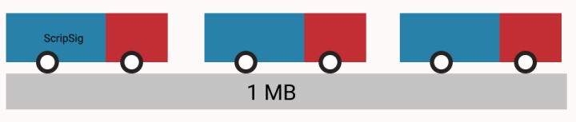
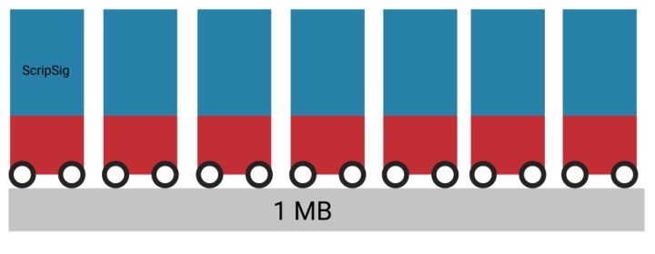
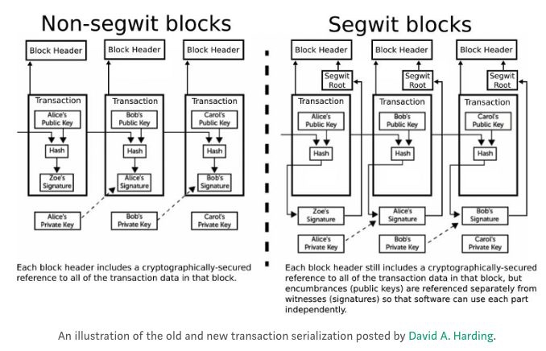

# Segwit隔离见证
原文: <https://zhuanlan.zhihu.com/p/32613487>

[TOC]

比特币如何扩容，是很多人关心的问题。隔离见证是比特币扩容的其中其中方案，此方案已经于2017年8月在比特币网络上激活。最近比特币正在朝着下一个扩容方案努力，闪电网络 Lightning Network。闪电网络的启动必须基于更多的用户使用隔离见证地址。所以科普隔离见证的知识是至关重要的。

## 1. 前言

在阅读了大量技术文献后，我整理了思绪，写下这篇浅显易懂的关于隔离见证的理解。并做了非常生动的类比，让你三分钟理解什么是隔离见证。（如果对隔离见证已经有一定概念的可以直接跳到第2节。）

### 1.1 背景介绍

中本聪之前的代码中写到，在审核统计区块大小的时候，每一个区块大小不超过1M。

我们可以找到他在Github的代码提交：[中本聪对区块大小定义的源代码 （Github commitment)](https://github.com/bitcoin/bitcoin/commit/a30b56ebe76ffff9f9cc8a6667186179413c6349)

问题来了，在尽量使用现有的区块审核逻辑情况下如何缓解现在比特币拥堵问题？至于为什么要保持1M大小的区块，这里暂时不讨论，我们可以写另外一篇文章就全节点对于整个网络的安全性的重要性来谈谈。

### 1.2 隔离见证做了什么改动？

隔离见证就是把脚本签名(scriptSig)信息从基本结构 (base block) 里拿出来，放在一个新的数据结构当中。做验证工作的节点和矿工也会验证这个新的数据结构里的脚本签名，以确保交易是有效的。

那么重点来了：当审核统计区块大小不能超过1M的时候。脚本签大小不会被计算在内。

这简直是一个数学计算上的巧思！

## 2. 图说隔离见证

下面我们来说一个非常浅显生动的例子，你瞬间就能明白了。

比如我们有一个交通法规，说一条大路上只能容许总面积是100单位面积的车辆。

每个车我们有30个单位的面积。大马路上一次只能跑3辆车。

这时候把车的**结构重新调整下**，把拖车放到了顶上。每个车的面积单位变成了14个单位. 这时候大马路上一次能跑7辆车了。

好我们现在把刚才浅显易懂的比喻换一下。**马路 = 1个区块**    **车 = 每一笔交易**

### 问题1： 脚本签名是不是和每笔交易在一起
   如图所释：车顶上的那个方块(脚本签名 ScripSig) 是属于车的一部分。验证交易的时候签名当然会被一起验证。

### 问题2：见证是不是在区块链上？

如图所释：只是改变了车的结构，而且整个车还是开在马路上。所以当然在区块链里面！

程序员能看懂的图

好了下面我们来深入的谈谈隔离见证是怎么具体用代码实现的吧：

隔离见证重新整理了每个交易内容的布局方式。把脚本签名从交易内容的结构里面拿出来，放到了最下面，并有一个指针Pointer指向它。

### 问题3 ：隔离见证技术成熟吗？

隔离见证从提出到最后激活经历了数年时间，其实早在2016年1月21日就已经部署在测试网络了。到了2017年8月份才正式激活。技术已经相当成熟，但是从全部测试完毕到激活的过程又经历了很多争议。因为矿工的意见不能统一。而现在是2018年，很多人还是不了解隔离见证，然后BCH党开始各种黑这个技术。所以我觉得有必要花时间来做些研究，写些科普的知识。我们现在其实最需要的是知识的传播。

### 问题4：为什么不直接用大区块？

隔离见证 vs 大区块

其实这两个扩容方法都是可以采取，但是有一个先后问题。先后次序会很大程度影响到比特币的整个网络。那么为什么技术上要先上隔离见证，简单说来直接增大区块容量让下载全节点不适合于普通PC电脑，网络中越少的全节点其实不利于比特币安全。我们会用另外一篇文章讨论。至于大区块什么时候实施？ 到时候家用PC，宽带等技术都更新了。大多数人都能运行全节点。那时候上大区块也是很容易的事情。

隔离见证的其中一个好处是能缓解我们交易堵塞的问题。但是最重要的是为了[闪电网络](比特币闪电网络白皮书.md)铺路。一种建立在比特币底层网络的智能合约。

### 问题5：我理解了隔离见证，也很期待闪电网络。我现在可以做什么吗？

新的交易，请用隔离见证地址。为比特币网络的拥堵缓解和未来发展贡献一份力量！

钱包地址开头为 1 的是老钱包，地址开头是 3 或者 bc1是Segwit钱包。如果更多人使用新版本钱包。那么会很好的解决网络堵塞的情况。

这里可以查阅，哪些交易所和钱包支持Segwit钱包地址。

[Segregated Witness Adoption](https://bitcoincore.org/en/segwit_adoption/)

## 结语：

比特币属于每一个人，要想让其更好的发展。我们每一个人都需要达成共识。普及区块链知识有时候比赚钱更重要！

