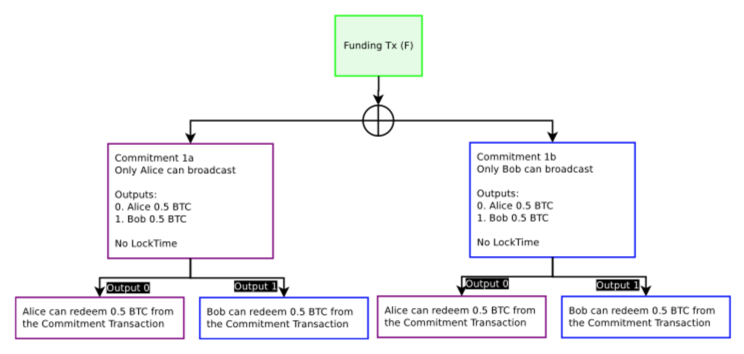
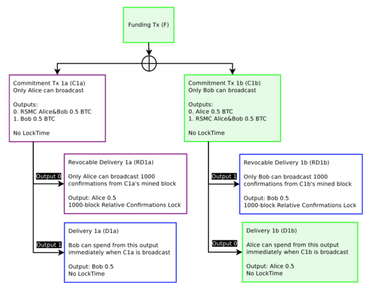

# 比特币闪电网络白皮书：可扩展的 off-chain 即时支付

## 摘要

如今比特币协议可以涵盖全球金融所有的电子支付系统的交易量，没有单一的一个第三方保 管或持有资金，或要求参加者除了有使用宽带连接的计算机之外其他的什么东西。分散式系 统表明交易是被发送到一个小额支付的渠道网络（又名支付渠道和交易渠道），其价值转移 发生在 off-blockchain 的情况下。如果比特币的交易可以在一种新的强调延展性的类型条件 下签署，这些转移可以在不受信任的双方之间通过合同沿着传送路径进行，在一系列递减时 间锁链中，如果有非合作或敌对的参与者，则采取在比特币 blockchain 上强制执行的办法。

## 1 比特币 Blockchain 可扩展性问题

比特币[1]blockchain 在拥有分布式分类账方面很有前景，但在不久将来的某个时间，会出现 blockchain 作为一个支付平台，其本身不能覆盖全球的电子商务的情况。blockchain 是一个 八卦协议，把所有国家向总帐发的更改发布给所有的参与者。国家的共识，每个人的平衡通 过这种“八卦协议”达成一致。如果在比特币网络中的每个节点必须了解在全球范围发生的 每一个交易，可能造成阻碍网络涵盖全球所有金融交易的能力。相反，若能涵盖全球所有金 融交易，并且不会使分散化和安全性受到损害，这才是我们需要的。

支付网络 Visa 在 2013 假期期间[2]，在其网络上每秒实现 47000 交易（TPS），目前实现平 均每天数亿笔交易。目前，比特币因为 1 兆字节块的限制，每秒仅支持小于 7 笔交易。如果 每次比特币交易我们平均用 300 字节，并假设块大小无限制，达到与 Visa 峰值 47000/TPS 的交易量同等数据容量意味着每十分钟每比特币区块将近 8 千兆字节数据。持续下去，每年 的数据将超过 400 万亿字节。

显然，如今在比特币网络上获得 Visa 般的能力是不可行的。在世界上没有家用电脑可以有 那样的带宽和存储。如果比特币在未来替换所有的电子支付，而不仅仅是 Visa，这将导致比 特币网络的彻底崩溃，或者在最好的情况下，只有可以支付得起的比特币节点和矿工可以使 用。这种集中化会再次打败网络分散化，使比特币安全成为具有确保总账的准确性和安全性 的能力的实体。

由于较大区块而只有更少的验证器不仅意味着更少数量的个人来确保总账精度，也导致在开 采过程中较少的实体能够验证 blockchain，这将鼓励矿工集中化。非常大的区块，例如在上 述情况下平均每 10 分钟 8 千兆字节，将意味着只有少数能够验证区块。这就产生了一个实 体会相信集中方的可能性。有特权的，值得信赖的集中方创建一个社交陷阱，由此集中方不 会在以个人（委托 - 代理问题）的利益为主，如承租人通过收取较高的费用，以减轻行事不诚实的倾向。在极端的情况下，这表现为个人给拥有客户资金的充分的监管权的集中方发 送资金。这样的安排，如今是非常常见的，产生严重的交易对手风险。防止那种集权发生的 一个先决条件需要比特币有这样一种能力，通过在家用宽带连接的单一电脑进行验证。通过 确保以较低的资金获得充分的验证，比特币节点和矿工将能够避免极端的集权和信任，确保 极低的交易费用。

摩尔定律无限期地继续是有可能的，并且在未来，能使节点具有以低成本高效益的计算多千 兆字节的区块的计算能力，但是那不是确定的。

为了实现用比特币进行每秒多于 47000 笔交易，需要脱离比特币 blockchain 本身进行交易。 如果比特币网络支持以极低的费用每秒进行近乎无限数量的小额交易会更好。许多小额支付 可以按顺序在两方之间发送，使任何大小的付款成为可能。小额支付将使服务变得非捆束， 少信任，商品化。如支付每兆字节的互联网服务。为了能够实现这些小额用例，将需要严重 降低最终被公布的全球比特币 blockchain 交易的数量。

虽然可以在一个小规模水平上进行，在网络上处理大量小额支付或者包含全球交易是绝对不 可能的。比特币若想成功，它需要这样一种信心，如果它能变得非常流行，其目前的由权力 下放所产生的优势将继续存在。为了让今天的人们相信比特币在将来能有用，比特币需要解 决区块大小集中效果；大区块自主创建值得信赖的保管人和高费用的问题。

## 2. 小额支付渠道可以解决可扩展性问题

“如果一棵树倒在森林中，没有一个人去其周围听声音，它会发出声音么？”

以上引用的问题是与没有人观测到的事件是相关的，如果没有人听到树倒，无论其是否发出 声音是没有意义的。同样，在 blockchain，如果只有两个参与者关心日常的经常性交易，是没有必要让在比特币网络的所有节点了解该交易的。相反，在 blockchain 上只有一小部分信 息是更可取的。通过推迟告诉全世界每一笔交易，在以后的日子解决他们之间的关系的方法， 使比特币用户进行许多交易不用扩展 blockchain 或与一个集中的交易对手建立信任。一个有 效的不可信结构可以通过使用时间锁作为一个全球共识的组成部分来实现。

目前的小额支付和可扩展性解决方案将交易转交给一个托管人，由一个被信任的第三方托管 来持有硬币并更新与其他各方的平衡情况。信任第三方来保存所有的人的资金可能产生交易 对手风险和交易成本。

相反，使用这些小额支付渠道的网络，比特币可以扩展到当今在现代笔记本电脑上以强大的 计算能力进行数十亿美元的交易。在一个小额支付渠道中进行大量支付使人们能够以分散的 方式发送大量的资金给另一方。这些渠道在比特币上不是一个单独的可信网络。他们是真正 的比特币交易。

小额支付渠道[3][4]在双方之间建立起关系，来更新平衡，决定在双方交易时产生的总余额 中被推迟公布到 blockchain 的部分。这使得双方之间的财务关系被不可信地推迟到以后的日 子，没有交易对方违约的风险。小额支付渠道使用真实的比特币交易，只有通过选举的方式 来决定推迟在 blockchain 中公布的部分，双方才可以保证其在 blockchain 上现有的平衡;这不是值得信赖的覆盖网络-在小额支付渠道发生的支付是真正比特币 offchain 的沟通与交换。

### 2.1 小额支付渠道不要求信托

就像树倒在树林里是否发出声音的老问题，如各方均同意该树在 2:45 倒下，那么该树确实 在下午2:45倒下。同样，如果双方均同意，渠道内现有的平衡为0.07BTC给Alice和0.03BTC 给 Bob，那么这就是真正的平衡。然而，如果没有密码，一个有趣的问题产生了：如果其中 一方不同意有关基金的当前平衡（树倒下的时间），那么双方就产生了分歧。如果没有加密 的签名，blockchain 就不知道谁拥有什么。

如果在渠道中的平衡为0.05BTC给Alice和0.05BTC给Bob，一个交易后的平衡为0.07BTC 给 Alice 和 0.03BTC 给 Bob，网络需要知道哪个平衡集是正确的。 Blockchain 交易通过使 用 blockchain 总帐作为时间系统解决了这个问题。与此同时，希望建立一个系统，该系统除 必要情况不积极地使用该时间戳系统，因为它对于网络来说是昂贵的。

相反，双方可以承诺签署一个交易，但并不公布该交易。因此，如果 Alice 和 Bob 投入资金 到 2-OF-2 多重签名地址（其要求双方同意来产生花销），他们都同意目前的平衡状态。Alice 和 Bob 可以要求从 2-OF-2 交易中退款给自己，每人 0.05 BTC。这份退款不会被公布到 blockchain。任何一方都可以这样做，但他们更可能选择坚持进行该交易，明知自己有能力 在自己希望时撤回基金。通过推迟本次交易的公布，他们可能会选择在未来某一日期改变这 种平衡。

要更新这种平衡，双方产生 2-OF-2 的多重签名地址的新支出，例如 0.07 给 Alice 和 0.03 给 Bob。如果没有适当的设计，会产生时间戳问题，不知道哪一项花费是正确的：新的支出还 是原来的退款。

在时间戳和日期上的限制，不是像在比特币 blockchain 一样复杂和有序。在小额渠道的情况 下，只有两个状态是必需的：当前的正确的平衡，和任何旧的弃用平衡。只会有一个正确的 现有平衡，可能有很多不建议使用的旧平衡。

因此，有可能在比特币中设计一种比特币脚本来判定所有旧的交易被视为无效，只有新的交 易是有效的。失效是由比特币输出脚本，并迫使对方把他们的所有资金给渠道对方。通过采 取所有基金作为一个惩罚给对方的方法，从而使所有旧的交易失效。

这种失效过程可通过渠道的共识，其中，如果双方都同意目前的分类帐状态（和建立新的状 态）过程存在，那么真正的平衡得到更新。仅在一个单一方不同意时才在 blockchain 上反映 出来。从概念上讲，这种系统不是一个独立的覆盖网络;它是在现行系统上的一个延迟的状 态，因为强制执行仍在 blockchain 上发生（尽管推迟到将来的日期和交易）。

### 2.2 渠道网络

因此，小额支付渠道只创立双方之间的关系。要求大家与其他人建立渠道不解决扩展性问题。 比特币的可扩展性可以通过小额支付渠道的一个大的网络来实现。

如果我们假定一个比特币 blockchain 渠道的大型网络，并且所有参与的比特币用户在比特币 blockchain 上具有至少一个开放渠道，在该网络内可以创建近于无限量的交易。在比特币 blockchain 上过早地公布的唯一的交易是存在不合作渠道对手的交易。

通过哈希链和时间链延迟比特币交易输出，渠道对方将无法直接窃取资金和比特币可以在无 对方窃取的情况下直接交换。此外，通过使用交错休息，在没有资金中介窃取的风险的条件 下通过多个在网络中的中介机构发送资金成为可能。

## 3 双向支付渠道

小额支付渠道允许交易状态简单推迟至稍后时间公布。该合同是以这样的方式执行，创造一 方在一定日期之前或之后公布交易的责任。如果 blockchain 是一个分散化的时间戳系统，它 可以使用时钟作为分散共识[5]的组成部分，以确定数据有效性，以及展示当前状态作为订 购事件的方法 [6]。

通过创建特定状态的公布或失效的时间表，就可以使用比特币交易脚本创建复杂的合同。已 经有前期工作的中心辐射型小额支付渠道[7] [8][9]（和值得信赖的支付渠道网络[10][11]） 监控今日建立枢纽和辐射网络的过程。然而，闪电定位网络的双向小额渠道要求在附录 A 中所述的可塑性 Softfork，使在控制中间节点出错风险时有近乎于无限的可扩展性。
通过把多个微支付渠道串联起来，有可能创建交易路径的网络。路径可以使用类似 BGP 的 系统进行路由，并且发送方可以指定一个特殊的路径给收件人。输出脚本由接收者产生的散 列密码限制。通过公开的输入散列密码，收件人的对方就能沿线拉动资金。

### 3.1 频道创建中存在的问题

为了参加本次支付网络，我们必须与其他参与者创建这个网络上的小额支付渠道。

#### 3.1.1 创建无签署的资金交易

最初的提供的资金交易的渠道创建起来是由渠道的一方或者双方输入本次交易的基金。双方 建立这项交易的输入和输出，但不签署交易。

对于这笔资金交易的输出是参加这个渠道双方的 2-OF-2 的多重签名，今后命名为 Alice 和 Bob 脚本。这两个参与者没有为资金交易交换签名，直到他们已经从 2-OF-2 得到了与原来 金额相等的退还金额。未签署交易的目的，是允许从一个尚不存在一个交易中花费。如果 Alice 和 Bob 在资金交易中交换了签名，而不能得到资金交易的公布，而且如果 Alice 和 Bob 不配合，资金可能会被永久的锁定（或由一方承担不合作的损失）。

Alice 和 Bob 双方交换输入来提供资金交易所需基金（知道哪些输入用于确定渠道的总价 值），来交换之后用来签署的钥匙。此钥匙用于资金交易的 2-OF-2 输出; 资金花费的产生 需要双方的签署，换句话说， Alice 和 Bob 必须同意从资金交易中的资金花费。

#### 3.1.2 来自未签署交易的消费

闪电网络使用的是 SIGHASH NOINPUT 交易，从 2-OF-2 输出资金交易花费，因为这对于从 尚未交换其签名的交易上花费是必须的。 SIGHASH NOINPUT，用 Softfork 实施，确保交 易能够在各方签署之前执行，因为交易需要登录才能获取没有新的 sighashflags 交易。如果 没有 SIGHASHNOINPUT，比特币交易无法在公布之前进行-就好像一个人不能在没有支付 对方的前提下得到草本。 SIGHASH NOINPUT 解决了这一问题。更多的信息和实施见附录 A。

如果没有 SIGHASH NOINPUT，不可能产生在不交换签名的情况下进行交易支出，因为花 费的资金交易需要一个交易 ID 作为子输入签名的一部分。交易 ID 的一个组成部分是父（交 易资金的来源）的签名，因此双方需要交换自己的父签名子输入才可以花费。由于一方或双 方必须知道父签名因而由它来消费，这意味着一方或双方都能够在子输入存在之前公布父签 名（融资交易）。 SIGHASHNOINPUT 通过允许子输入无需登录输入就可消费来解决这个 问题。SIGHASHNOINPUT 的操作顺序是：

1. 创建父输入（融资交易）
2. 创建子输入（承诺交易及从承诺交易的所有花费）
3. 登录子输入
4. 交换子签名
5. 签署父签名
6. 交换父签名
7. 公布 blockchain 上的父签名

一方不能够公布父签名（步骤 7），直到步骤 6 完成。双方直到步骤 6 才交换他们资金交易的签名。此外，如果步骤 6 中一方出现故障，父输入可以成为父交易或者父交易会产生双倍 的花销（这样，整个交易路径无效）。

#### 3.1.3 承诺交易：不可执行的建设

无签署（和无公布）资金交易创建后，双方签署并交换了最初的承诺交易。这些承诺交易花 费来自于 2-OF-2 的资金交易（父）输出。但是，只有资金交易在 blockchain 上公布。
由于资金交易已经进入 blockchain，输出为需要双方的协议的 2-OF-2 的多重签名交易，承 诺交易是用来表达目前的平衡。只有一个 2-OF-2 签字承诺交易在双方之间进行交换，那么 双方将确保他们能拿回自己投入 blockchain 资金交易的钱。双方不在 blockchain 公布承诺交 易到直到他们想从渠道中停止现有的平衡。他们通过公布现有的承诺交易来达到此目的。

承诺交易支付当前平衡的相应每一方。一个单纯（破碎）的实施将构建一个不公布交易，借 此有从单一的交易方到交易对方的 2-OF-2 的支出，这个单一的交易方具有两个返回当前平 衡的输出。这将创建一个初始的承诺交易，返回原方所有的资金。


**图 1：**一个真正破碎的资金交易将在本图中描述。资金交易（F），被标记为绿色，在所有其他交易签署后被公布被 blockchain 上。从资金交易支出的所有其他交易都还没有公布，以 防对方想要更新自己的平衡。只有在这个时候，资金交易才能公布在 blockchain 上。

例如，如果 Alice 和 Bob 同意用 2-OF-2 输出来创建一个价值 1.0BTC（各自贡献 0.5BTC） 的资金交易，他们创造一个有分别来自 Alice 和 Bob 两个输出的承诺交易。该承诺首先应被 签署，并且交换密钥，因此交易双方能在与资金交易进入 blockchain 的任意合适的时间来公 布承诺交易。在这一点上，资金交易签名可以安全地进行交换，因为任何一方能够通过公布 的承诺交易赎回自己的资金。

但是，这种结构在当一个人希望更新平衡时会断裂。为了更新平衡，就必须更新自己的承诺 交易的输出值（融资交易已经进入 blockchain，不能更改）。

当双方都同意一个新的承诺交易并且为了新承诺交易交换签名，任意承诺交易可以被公布。 输出从资金交易中只能被赎回一次，这些交易中只有一个将是有效的。例如，如果 Alice 和 Bob 同意渠道的平衡为 0.4 给 Alice 和 0.6 给 Bob，一个新的交易承诺将被重新创建并且任何 承诺交易可以被公布。事实上，为了被公布的任何平衡，双方都已经签署了并交换了签名， 一方将无法限制其承诺交易是否公布。


**图 2：**承诺交易可由任何一方在任何时间公布，只有一方会从单一的资金交易中成功花费。 这样不行，因为一方不想公布最新的交易。

因为任何一方都可以在任何时间公布承诺交易，其结果是，产生了新的承诺后，获得资金少 的人想公布这承诺交易，在这承诺交易产出中对他们具有更大的价值。其结果是，该渠道将 被立即关闭并且资金被盗。因此，人们不能在这种模式下建立支付渠道。

#### 3.1.4 承诺交易：指出祸源

因为任何签署的承诺交易可以被公布在 blockchain 上，并且只有一个可以成功地公布，有必 要防止旧承诺交易被公布。撤销在比特币上的几万交易是不可能的，所以另一种方法是必要 的。相反，主动撤销 blockchain 强制执行的交易，有必要以与富达债券类似的方式建立渠道， 即双方都作出承诺，违反这些承诺被强制实施处罚。如果一方违反了他们的协议，那么他们 将失去所有在渠道中的钱。

对于这种支付渠道，合同条款是：双方承诺只公布最近的交易，对旧交易的任何公布将导致 对合同的违反，所有的资金都作为惩罚送给对方。

这只有在一方能够将责任归咎于公布旧交易的情况下才可以被执行。为了做到这一点，必须 能够准确的识别是谁公布了一个旧交易。这是可以做到，如果双方拥有唯一地可鉴定的承诺 交易。双方必须签署承诺交易，而对方负责公布。因为一方由对方签署的一份交易承诺，一 方只能公布自己承诺交易的版本。

对于闪电网，一切花费从资金交易输出，承诺交易有两个半签名交易。Alice 签署一份承诺 交易，给 Bob（C1b），另一半由 Bob 签署，给 Alice（C1a）。这两个承诺的花费来自于相 同的输出（融资交易），并有不同的内容;只有一个可以在 blockchain 公布，因为交易承诺的两部分来自同一交易的资金支出。任何一方都可以通过登录包括交易对方签名自己的版 本，公布其收到的承诺交易。例如，Bob 可以公布承诺 C1b，因为他已经从 Alice 那里收到 了 C1b 的签名- 它包含了 Alice 的签名和 C1b 的自己的签名。该交易将会从 2-OF-2 资金交 易的输出要求 Alice 和 Bob 的签名有效支出。


**图 3**：紫框里代表未被公布只有 Alice 可以公布的交易。篮框里代表未被公布只有 Bob 可以 公布的交易。Alice 只能公布承诺 1A，Bob 只能公布承诺 1B。只有一个承诺交易可以从交 易资金输出中支出。错误根源已找出，但任何一方仍然可以花费并且不受惩罚。

然而，即使有这样的结构，一个人仅仅只是被分配了责任。目前尚不可能在比特币 blockchain 上执行本合同。Bob 仍然相信 Alice 不会公布旧承诺交易。在这个时候，他只能够证明，Alice 这样做已经通过半签名的交易证明。

### 3.2 创建撤销合同的渠道

为了能够真正执行合同规定的条款，有必要构建一个承诺交易（连同其支出），为此其中一 方就能够撤销交易。这个撤销是可以通过使用交易进入一个 blockchain 数据来实现的，并通 过使用该交易的成熟度来确定验证路径。

### 3.3nSequence 成熟度

Mark Freidenbach 曾提出，nSequence 可以由父交易的相对区块成熟度通过 Softfork[12] 执 行。这将允许一些基本的能力来确保在消费脚本上的某种形式的相对区块确认时间链。此外， 额 外 的 操 作 码 ， OP CHECKSEQUENCEVERIFY [13] （ 又 名 OP RELATIVECHECKLOCKTIMEVERIFY）[14]，将允许更多的能力，包括允许一个权宜的解 决方案，在更长久的解决方案提出之前用于解决交易延展性问题。本文的未来版本将包括提 出的解决方案。

概括地说，具有顺序号的比特币被发行，这些顺序号在无确认条件的内存池中被执行。原来 的行为允许交易置换，如果他们具有较高的 nSequence，可通过在内存池中与较新的交易替 换。根据交易替换规则，这不是由拒绝服务攻击风险来执行。nSequence 的预期目的是替代 未公布的交易。然而，这种较高 nSequence 的替换行为是不可执行的。人们不能得到保证， 交易的旧版本在内存池内已经被替换，一个区块包含的是最新的版本。一种以 off-chain 形 式执行交易版本的方法是通过时间承诺。

可撤销交易花费从一个独特输出中支出，在此独特的输出中，交易具有一个独特类型的输出 脚本。父交易有 2 条赎回的路径，其中第一个可以立即赎回，第二个是只有子交易达到一个 最小确认值才可赎回。子交易的 nSequence 的确定需要父交易的最小确认值。从本质上说， 这种新的 nSequence 的行为将只能确认从特定输出的支出是有效的，如果在输出和赎回交易 之间的区块的数量超过了一个特定的区块高度。

交易可以通过这些 nSequence 数字行为来赎回，通过一些特定数量的在 nSequence 中确认的 区块创建一个限制，这将导致支出只有在父交易为了一些特定数量的区块进入blockchain 之后是有效的。这就产生了一个结构，其中父交易和该输出变成粘结存款，证明没有撤消。在 一段时间内区块链上的任何人可以通过公布交易之后立即公布支出驳斥这种认证。

如果希望允许撤销交易，这个交易有 1000 个确认延迟，该输出交易结构将持有 2-OF-2 的多信号结构：

```bash
2 <Alice 1><Bob 1> 2 OP_CHECKMULTISIG
```

然而，子消费交易将包含 1000 个 nSequence 值，由于该交易需要双方签名来确认其有效性， 双方包括 1000 个 nSequence 作为签名的一部分。双方当事人可以自行决定，同意创建另一 个交易来取代没有 nSequence 的交易。

这种结构，可撤销 nSequence 成熟合同（RSMC），通过非常确定的合同条款，创建两个路 径。 该合同的条款是：

1. 所有各方签订一份合同，该合同有一个输出来执行本合同
2. 双方当事人同意在一个等待期（在我们的示例脚本中是 1000 个确认）内为一些合同集资， 有。这是可撤销的输出平衡。
3. 一方或双方当事人可以选择不公布（执行）的支出，直到将来某个日期;任何一方都可以在 等待期后随时赎回基金。
4. 如果双方都没有公布本次交易（赎回基金），他们可能会撤销上述支出，当且仅当双方都 同意通过在取代交易支付中放置一个新的支付期限。新的交易支付可以在该合同披露给世界 后立即赎回（公布在 blockchain 上）。
5. 在合同被披露但新的支出结构不赎回的情况下，之前撤销的支付条款可以由任何一方赎回 （所以执行新条款是双方中任何一方的责任）。

预签子交易可以在父交易已进入有 1000 个确认的 blockchain 之后被赎回，由于子 nSequence 取决于父交易的花费。

为了撤销这个签署的子交易，双方只是同意创建另一个子交易，该子交易的 nSequence 为 MAX_INT，它有特殊的行为，允许在任何时候支出。

只要新签署的支出进入父交易已经进入的有 1000 个确认的 blockchain 中，这个新签署的支 出将取代可撤销的花费。事实上，如果 Alice 和 Bob 同意监测 blockchain，以防其对承诺交 易进行不正确公布，当下交易一公布，他们能够立即使用替代交易进行花费。为了公布可撤 销支出（不建议的交易），其花费与替代交易相同，他们必须等待 1000 个确认。

采用这种结构，任何人都可以创建一个交易，不公布交易，再后来建立激励机制，使其在未 来不通过处罚来公布交易。这使得比特币网络上的参与者可以推迟许多在 blockchain 上的交 易。

#### 3.3.1 timestop

要减轻一个恶意的攻击者制造的信度威胁。Greg Maxwell 提出使用停止状态以减轻对 blockchain 恶意攻击：有很多方法可以解决这个问题[洪水风险]，这个问题尚未得到充分的探讨- 例如，在区块充 足时候时钟可以停止;在 Dos 攻击事件[15]发生时，把安全风险转化为更多的延迟。

这可以通过让矿工确认现有的（费用支付）内存池目前是否交易泛滥来得到缓解。他们可以 输入一个“1”值到块标题的版本号的最后一位。如果在块标题的最后一位包含一个“1”， 则该块将不计入的相对成熟高度的 nSequence 值，并且该区块被指定为一个拥挤区块。有一 不拥挤区块高度（它总是比正常块高度低）。此区块高度用于确定 nSequence 价值，这只能 算作区块成熟（确认条件）。

一名矿工可以选择区块是否拥挤。如果内存池大于一定的规模或者对于确定大小的内存池的 平均费用大于一定的值，默认代码可以自动设置拥挤区块为“1”。然而，一个矿工有完全 的决定权来改变确定自动设置为拥挤块的规则，或者可以选择是否设置为永久的拥挤。最诚 实的矿工将使用默认的行为去定义他们的矿工，而不是组织一次 51％的攻击。

例如，如果一个父交易输出由一个 nSequence 值为 10 的子交易花费，在交易生效之前我们 必须等待 10 次确认。然而，如果 timestop 已经确定，即使采用新的区块，计算的确认也应 当停止。如果 6 次确认已经完成（再需要 4 次确认交易才是有效的），并且 timestop 区块已 设置的第七区块上，该块不要求 10 次 nSequence 的确认，孩子目前仍处于第 6 区块相对确 认值。在功能上，这将被存储为某种辅助 timestop 区块高度，仅用于跟踪 timestop 值。当 timestop 位数已经设置，使用 nSequence 值的所有交易将停止计数，直到 timestop 位数恢复 未设置状态。这给当前辅助 timestop 区块高度中的交易提供了充分的时间和区块空间来进入 blockchain，它可以防止系统攻击者成功地攻击系统。

然而，这需要区块中的某种标志指定它是否是一个 timestop 区块。对于 SPV 完全兼容性（简 单付款确认;轻量级客户端），它要求在 80 字节的区块标头内，而不是在 coinbase。在区块 标头存放这一标志的可能的两个地方：区块时间和区块版本。区块时间可能不安全，由于最 后一位被一些 ASIC 的矿工用作熵源，因此可能需要一位被消耗用于 timestop 标志。另一种 选择是硬编码 timestop 激活，作为硬协商一致规则（例如，通过区块大小），但是这可能使 事情变得不太灵活。通过设置 timestop 的健全的默认规则，这些规则可以不通过一致的 soft-forks 来改变。

如果区块的版本被用作标志，上下文信息必须以某种合并开采硬币中使用的链 ID 相匹配。

#### 3.3.2 撤销承诺交易

通过结合错误来源以及可撤销交易，能够确定什么时候一方不遵守合同的条款，并不信任对 方的实施处罚。


**图 4**：资金交易 F，用绿色代表，在所有其他交易签署之后在 blockchain 上公布。所有交易 只有 Alice 可以公布的交易由紫色代表。所有只有 Bob 可以公布的交易由蓝色代表。此时， 只有交易资金在 blockchain 上公布。

创建一个新的承诺交易的目的是在利用新的承诺交易来更新新的平衡，使所有的旧的承诺交 易无效。要使旧的交易失效，要使输出成为可撤销的序列到期合同（RSMC）。要使交易无 效，将签署一个替代的交易，并且双方交换此交易，规定双方在不正确的公布旧交易的情况 下将资金交给对方。不正确的公布通过创建具有相同的网络最终平衡输出的两个不同承诺交 易来鉴定，但是给自己的支付由 RSMC 担保。

实际上，2-of-2 资金交易输出有两个承诺交易。这两个承诺交易中，只有一个可以进入到 blockchain。渠道内的每一方都有本合同的一个版本。因此，如果这是第一个承诺交易对， Alice 的承诺交易被定义为 C1a， Bob 的承诺交易被定义为 C1b。若要公布一个承诺交易， 要求的渠道关闭并结束。承诺交易的前两个输出包括目前未分配的与渠道对手不平衡的交货 交易（派息）。如果 Alice 公布 C1a，其中一个输出对 D1a 是可支配的，它发送资金给 Bob。 Bob，C1b 的是可由 D1b 支配的，它发送资金给 Alice。该交货交易（D1a/ D1b）是被立即 赎回的，并以任何方式公布交易承诺不受到阻碍。

对于每一方的承诺交易，他们证明他们正在公布他们拥有最新的承诺交易。因为他们证明， 这是当前平衡，支付给对方的平衡被认为是真实的，因为作为一种惩罚向对方支付资金对自 己是没有任何直接好处的。

将平衡支付给公布承诺交易的人是未确认的。Blockchain 上的参与者不知道承诺交易是否是 最近的。如果他们没有公布他们的最新版本，他们将被惩罚，承担渠道中所有的资金并给与 交易对方。由于自己的资金都押在自己的 RSMC 中，他们只能在承诺交易已被列入一个区 块后（在我们的例子中，1000 次确认），经过一定数量的确认后要求自己的基金。如果他 们公布的是自己的最新承诺交易，应该没有撤销交易替换之前可撤销的交易，所以他们就能 够在一段时间（1000 次确认）后取回投入的资金。

通过了解谁公布承诺交易，并阻碍自己的支出在提前确定好的的时间内被锁定，双方将能够 在未来撤销承诺交易。

#### 3.3.3 从渠道兑换基金：合作交易方

任何一方都可以从渠道赎回基金。然而，公布承诺交易的一方必须等待在 RSMC 描述的提 前确定好的交易数量。没有公布的承诺交易的交易对手可以立即赎回基金。

例如，如果资金交易承诺 1BTC（每个交易对手一半），并且 Bob 公布最新的承诺交易 C1b， 他必须等 1000 次确认才能得到他的 0.5BTC，Alice 可以花费 0.5BTC。对于 Alice，本次交 易是完全封闭的，如果 Alice 同意 Bob 公布的承诺交易（C1b）是正确的。


**图 5**：当 Bob 公布 C1b 时，Alice 可以立即赎回她的部分。Bob 必须等到 1000 次确认。当区 块被立即公布，它是在该状态下。绿色交易是它们提交到 blockchain 的交易。

承诺交易已经在 blockchain1000 区块之后，Bob 就可以公布可撤销的交货交易。他必须等到 1000 区块，以证明他并没有撤销该承诺交易（C1b）。1000 区块后，可撤销的交货交易将 能够被包括在一个区块中。如果一方企图包括在 1000 次确认之前将可撤销的交货交易纳入 区块，1000 次确认后该交易将是无效的（如果输出尚未赎回，此时它就会成为有效的）。


**图 6**：Alice 同意，Bob 公布正确的承诺交易并且 1000 次确认已经过去了。Bob 能够在 blockchain 上公布可撤销交货交易（RD1b）。

Bob 公布可撤销交货的交易后，对于 Alice 和 Bob，该渠道完全关闭，每个人都收到了资金， 他们都同意在当前平衡下，他们在渠道内分别拥有的资金。

如果是 Alice 公布承诺交易（C1a），她必须等到 1000 次确认，而不是 Bob。

#### 3.3.4 创建一个新的交易承诺，并撤销先前的承诺

虽然任何一方都可以在任何时候收回最近交易承诺，他们也可以选择创建一个新的承诺交易 并且使旧的交易无效。

假设 Alice 和 Bob 现在要更新每人 0.5BTC 的平衡，并且退还 0.6BTC 给 Bob 和 0.4BTC 给 Alice。当他们都同意这样做，它们产生了一对新承诺交易。


**图 7**：四种可能的交易可以存在，一对旧的承诺，另一对新的承诺。渠道内每一方只能公布 一半的承诺。没有明确的执行防止任何特定的承诺被公布而不是惩罚花费，因为它们都是有 效的未公布的花费。可撤销的承诺仍与 C1a/C1b 成对存在，但不显示简短。

当一个新的对交易的承诺（C2A/C2b）达成一致，双方将签署并交换新承诺交易的签名， 然后旧的承诺交易失效。这种失效通过让双方签署违约补救交易（BR1）发生，它取代了撤 销交货交易（RD1）。每一方从自己的撤销交付（RD1）发送给另一方的签订一半的撤销交 易（BR1），这是承诺交易的花费。违约补救交易就会把渠道现有平衡中所有的现金给对方。 例如，如果 Alice 和 Bob 都产生了一对新承诺交易（C2A/ C2b）和失效的旧的承诺（C1a / C1b），后来 Bob 在 blockchain 不正确的公布 C1b，Alice 可以拿走渠道中 Bob 所有的钱。 Alice 能做到这一点，因为 Bob 已经通过惩罚向 Alice 证明，他将永远不会公布 C1b，因为 他公布 C1b 的那一刻，Alice 可以拿走渠道中 Bob 所有的钱。事实上，通过为对手构建违约 补救交易，一方已经证明，不会公布任何事先的承诺。对方可以接受这一点，因为若该协议 被违反，他们将得到渠道中所有的钱。


**图 8**：当 C2A 和 C2B 存在，双方交换违约补救交易。双方现在都有明确的经济激励，避免 公布旧的承诺交易（C1a/ C1b）。如一方要求关闭渠道，他们将只使用 C2A（Alice）或 C2b 上（BOB）。如果 Alice 公布 C1a，所有的钱都会给 Bob。如果 Bob 公布 C1b，所有的钱都 会给 Alice。C2A/C2b 的输出请参阅前面的数字。

由于这一事实，当违约补救交易已经交给交易对手时，人们可能会删除所有先前的承诺交易。 如果一方公布不正确（过时的，无效的承诺交易），所有的钱都会给对方。例如，如果 Bob 公布 C1b，只要 Alice 在事先定好的区块数量范围内观察 blockchain（在此情况下，1000 区 块），Alice 将能够通过公布 RD1b 得到在这个渠道的所有的钱。即使当前平衡的承诺状态 （C2A/C2b）为 0.4BTC 给 Alice 和 0.6BTC 给 Bob，因为 Bob 违反了合同条款，作为惩罚， 所有的钱给 Alice。在功能上，可撤销交易作为一个 blockchain 上的证明，证明 Bob 违反渠 道中的条款，并且这是由 blockchain 编程判定的。


**图 9**：绿色代表被提交到 blockchain 上的交易。Bob 错误得公布 C1b（只有 Bob 能够公布 C1b/ C2b）。由于双方都同意目前的状态是 C2A/ C2b 承诺对，并且已经通过违约补救交易 证明了旧的承诺是无效的，Alice 能够公布 BR1b，并得到渠道中所有的钱，只要她在 C1b 公布 1000 区块以后来执行。

但是，如果 Alice 不在 C1b 公布 1000 区块以后公布 BR1b，Bob 也许能偷一些钱，因为他的 撤销交货交易（RD1b）在 1000 区块后有效。当一个不正确的交易承诺被公布，只有违约补 救交易可公布 1000 区块（或其他的双方同意的确认数量）。经过 1000 次确认，无论是违约 补救措施（BR1b）还是可撤销的交付交易（RD1b）能够在任何时间公布。违约补救交易只 有在这个提前定义的时间段内具有排他性，之后的任何时间在功能上受到限制 - 根据比特币 blockchain 共识，争论的时间已经结束。

为此，应定期监测 blockchain，监控其对手是否公布了无效的承诺交易，或委托第三方这样 做。只能通过向这个第三方提供违约补救交易来对其进行委托。第三方被激励去监控 blockchain 中这样的对手恶意公布的交易，通过给这些第三方一些输出中的费用。由于第三人只能在对方恶意行为时采取行动，该第三方没有任何强制关闭渠道的权力。

#### 3.3.5 创建可撤销承诺交易流程

要创建可撤销承诺交易，首先它需要正确的建设渠道，并且仅仅签订可能在未来任何时间公布的交易，同时确保一方不会因不合作或恶意的对手而吃亏。这需要确定新的承诺要使用的公钥，如使用 SIGHASH NOINPUT 要求每一个承诺交易 RSMC（和 HTLC）输出使用特殊 钥。我们用 P 来指定公钥，K 来指定用于签署的相应的私钥。

当生成第一个承诺交易时，Alice 和 Bob 同意从一个资金交易一具有单一 multisig（PAliceF， PBobF）输出中创建一个 multisig 输出，提供来自 Alice 和 Bob 各 0.5BTC，共 1 BTC 的资 金。该输出是一种给哈希脚本[16]交易的付费，这需要双方 Alice 和 Bob 同意从交易资金花 费。他们还没有使资金交易（F）可支配。此外，PAliceF 和 PBobF 仅用于资金交易，它们 不用于其他任何东西。

由于交付交易仅仅是一个 P2PKH 输出（比特币地址从 1 开始）或 P2SH 交易（通常认为地 址从 3 开始），这需要对方事先指定，这可以由 PAliceD 和 PBobD 的输出生成。简单起见， 这些输出地址将在整个渠道过程保持不变，因为其资金是由它的指定接收方的承诺交易进入 blockchain 后完全控制。如果需要，但不是必要的话，双方可以为未来的承诺交易更新改变 PAliceD 和 PBobD。

双方交换他们打算为承诺交易的 RSMC（和在以后的章节描述的 HTLC）使用的公钥。每套 承诺交易用自己的公钥并且永远不重复使用。双方可能已经知道未来所有的公钥，通过使用 BIP0032[17]HD 钱包建设渠道过程中交换主公共密钥。如果他们希望生成一个新的承诺交 易对 C2A/C2b，他们为 RSMC 输出使用 multisig（PAliceRSMC2，PBobRSMC2）。

双方都知道承诺交易的输出值之后，双方建立了交易承诺对，如 C2A/C2b，但不为承诺交 易交换签名。他们都签署撤销交付交易（RD2a / RD2b），并交换了签名。Bob 签署 RD1a并将其交给 Alice（使用 KBobRSMC2），Alice 签名 RD1b 并将其交给 Bob（使用 KAliceRSMC2）。

当双方都有可撤销的交付交易时，它们为承诺交易交换签名。Bob 使用 KBobF 签署 C1a 并 将其交给 Alice， Alice 使用 KAliceF 签署 C1b 并将其交给 Bob。

在这一点上，先前的承诺交易以及新的承诺交易能够被公布;C1a/ C1b 和 C2A/C2b 上都是 有效的。 （注意，早于先前承诺的承诺通过处罚被判定为无效的。）为了使 C1a 和 C1b 无 效，双方为先前承诺 C1a / C1b 交换违约补救交易（BR1a / BR1b）签名。Alice 使用 KAliceRSMC1 发送 BR1a 给 Bob，Bob 使用 KBobRSMC1 发送 BR1b 给 Alice。当两个违约 补救签名进行了交换，渠道状态是在当前承诺 C2A/C2b 上的平衡。

然而，不公开 BR1a/ BR1b 签名，也可能只是透露私钥给对手。在后面介绍的密钥存储部分 会说明这样是更有效率的。一方可以公开在自己的承诺交易中使用的私有密钥。例如，如果 Bob 希望使 C1b 无效，他将他用于 C1b 的私钥发送给 Alice（他没有透露他在 C1a 使用的密 钥，因为这将引起硬币盗窃）。同样，Alice 向 Bob 公开了她在 C1a 所有的私有密钥来使 C1a 无效。

如果 Bob 没有正确公布 C1b，因为 Alice 有所有的 C1b 输出使用的私钥，她可以拿钱。然而， 只有 Bob 能够公布 C1b。为了防止这种硬币被盗风险，Bob 应该销毁所有旧的承诺交易。

### 3.4 协同关闭渠道

双方都能够按照自己的意愿来发送任何数量的支付给他们的对手，只要他们在渠道有可用资 金，因为他们知道在意见分歧的情况下，他们可以在任何时间在 blockchain 上公布当前的状态。

在绝大多数情况下，从资金交易所有输出将永远不会在 blockchain 公布。他们只是在对方不 合作的情况下出现，很像一份在法庭上很少执行的合同。该合同被证明有能力以一个确定的 方式来强制执行有效地激励双方诚实守信。

当一方希望关闭渠道，他们将能够这样做，通过与对方创建合同，从现有的承诺交易不通过 脚本阻碍条件直接花费。在渠道中没有进一步的付款可能发生。


**图 10**：如果双方是合作的，他们采取当前交易承诺的平衡，并从有运用结算交易（ES）的 资金交易中花费。如果最近的承诺交易被公布，支出（较少费用）将是相同的。

合作关闭渠道的目的是为了减少发生在 blockchain 上的交易数量，双方将能够立即收到他们 的资金（而不是一方等待撤销交付交易有效）。

渠道可永久存在，直到他们决定合作关闭交易，或当一方不与另一方相互合作，在 blockchain 上执行关闭渠道。

### 3.5 双向渠道的启示与总结

通过确保渠道只能在双方当事人的同意的情况下得到更新，就可以构建永远存在于 blockchain 上的渠道。双方可以在渠道内以他们所希望的输出更新平衡，只要它是等于或小 于承诺资金交易内的资金总额;平衡可以在两个方向上移动。如果一方是恶意的，任何一方 都可以立即关闭渠道并且公布最新状态到 blockchain。通过使用网络保真债券建筑（撤销交 付交易），如果一方当事人违反的渠道的条款，资金将被发送给对方，只要违反（违约补救 交易）的证明及时进入 blockchain。如果双方是合作，渠道可以保持无限期地打开，可能很多年。

这种类型的结构是唯一可能的，因为审判编程作为比特币共识的一部分发生在 blockchain 上，所以人们并不需要信任对方。这样一来，一方的渠道对方不能充分的监管或控制资金。

## 4 散列 Timelock 合同（HTLC）

双向支付渠道只允许资金在渠道内安全转移。为了能够使用跨多个中继段通向网络最终目的 地得网络渠道建立安全传输，需要一个额外的结构，散列 Timelock 合同（HTLC）。

一个 HTLC 的目的是通过散列允许在多个节点的全局状态。这种全局状态通过披露原像由 承诺的时间和以时间为基准的无阻碍资源来确保。交易 “锁定”通过承诺发生在全局，在 特定时间，一个参与者负责披露给下一参与者他们是否掌握原像 R 的信息。这种结构并不 要求渠道中对方的保管信托，在网络中也没有任何其他参与者。

为了达到这个，一个 HTLC 必须能够创建只在特定日期后有效的某些交易，使用 nLockTime， 以及公开给渠道对方的信息。此外，该数据必须是可撤销的，因为一个人必须能够撤消 HTLC。

HTLC 也是一个可在 blockchain 上执行的与对方签订的的渠道合同。渠道中对方同意散列 Timelock 合同的以下条款：

1. 如果 Bob 可以为 Alice 从已知的哈希值 H 中产生未知的 20 字节的的随机输入数据 R，在 三天之内，Alice 将通过支付Bob0.1BTC 结算合同。
2. 如果三天已经过去了，那么上述条款无效，清算过程也无效，双方三天后都不能结算和要 求付款。
3. 任何一方都可以（也应该）按照本合同的条款以参加者选择的任何方法支付并且早期关 闭此合同，只要这一合同中的两个参与者同意。
4. 违反上述条款将导致最大的惩罚，资金被锁在合同中，被支付给作为保真债券基金的对方。

为了阐明例子，我们在 HTLCs 中使用天数，在 RSMC 使用区块高度。在现实中，HTLC 也 应该被定义为一个区块高度（例如 3 天相当于 432 区块）。

事实上，人们希望建立一个支付，这个支付取决于收件人在一定的时间内对 R 的信息。在此期限后，该基金退还给发件人。 类似于 RSMC，这些合同条款是在比特币 blockchain 上强制性编程的，不需要对方服从合 同条款的信任，因为所有的违反条款的行为都通过单方面强制网络保真债券基金受到惩罚， 承诺交易投入费用设置处罚。如果 Bob 在三天内知道 R，那么他就可以公布交易以赎回基 金;Alice 是无法以任何方式截留资金的，因为当比特币 blockchain 上发生了交易，脚本有效 地返回。

一个 HTLC 是一个具有独特的输出脚本承诺交易的额外的输出：

```bash
OP_IF
  OP_HASH160 <Hash160(R)> OP_EQUALVERIFY
  2 <Alice 2> <Bob 2> OP_CHECKMULTISIG
OP_ELSE
  2 <Alice 1> <Bob 1> OP_CHECKMULTISIG
OP_ENDIF
```

从概念上讲，这个脚本从单一的 HTLC 输出花费有两种可能的路径。在第一个路径（定义 为 OPIF）将资金发送给 Bob，如果 Bob 可以产生 R.。第二条路径是被赎回，使用 3 天 timelocked 退款给 Alice。为期 3 天的 timelock 使用来自于消费交易的 nLockTime 执行。

### 4.1 不可撤销的 HTLC 建设


**图 11**：这是一个 HTLC 的非功能性前期执行。只有来自于承诺交易的 HTLC 路径可以被显 示。注意有两种可能的来自于 HTLC 输出花费。如果 Bob 能在 3 天之内生产原像 R，他可 以赎回路径 1.三天后，Alice 能够公布路径 2。当 3 天已过或者是有效的。然而，该模型中， 这并不与多个承诺交易工作。

如果 R 是在 3 天之内产生的，那么 Bob 可以通过公布“交付”交易赎回基金。 “交付”交 易有效的一个要求是 R 被包含在交易内。若 R 不被包括，则“交付”交易无效。但是，如 果 3 天内已过，资金可以通过公布交易“Timeout”发回给 Alice。3 天后，R 已经被公开， 任何交易可能是有效的。

这是双方个人范围内的责任，以确保他们的交易进入 blockchain，以保证平衡是正确的。对 于 Bob，为了获得资金，他必须要么公布比特币 blockchain 的“交付”交易，或与 Alice 结 算（同时取消 HTLC）。对于 Alice，她必须从即日起 3 天内公布的“Timeout”交易，以收 到退款，或与 Bob 完全取消 HTLC。

然而，这种简单的建设也有类似于不正确的双向支付渠道建设的问题。当旧的承诺交易被公 布，任何一方都可以试图窃取资金，因为在此事后，两个路径可能是有效的。例如，若 R 被公开 1 年以后，并且不正确的承诺交易被公布，两个路径都有效并且可由任何一方赎回; 合同还没有在 blockchain 上被执行。关闭 HTLC 是绝对必要的，因为 Alice 为了得到退款， 她必须终止合同，并接受她的退款。否则，当 Bob3 天后发现 R，他可能能够窃取应给 Alice 的资金。对于不合作的对手，不可能在没有把它公布在 blockchain 时终止 HTLC，因为不合 作的一方不愿建立新的承诺交易。

### 4.2Off-chain 可撤销 HTLC

为了能够在不公布到比特币 blockchain 情况下终止 Off-chain 合同，需要在输出中嵌入 RSMCs，RSMCs 将与双向渠道有类似结构。


**图 12**：如果 Alice 公布 C2a，则左半将执行。如果 Bob 公布 C2b，右半将执行。任何一方都 可以在任何时候公布其交易承诺。 HTLC Timeout 仅在 3 天后生效。只有哈希 R 的原像是 已知的，HTLC 执行才能被公布。为了简洁，先前的承诺（和它们的相关交易）不显示。

假设 Alice 和 Bob 希望在承诺 1 渠道中以 0.5 给 Alice，0.5 给 Bob 方式更新平衡。
Alice 希望在 3 天内在已知 R 的信息的情况下发送 0.1 给 Bob，三天后，如果 Bob 不产生 R， 她希望要回她的钱。

.新的承诺交易将有一个对于 Alice 和 Bob（输出 0 和 1）现有的平衡的全额退款，HTLC 中 没有输出 2，输出 2 描述了在途资金。 0.1 将受限于 HTLC 中，Alice 的余额下降到 0.4，Bob 保持不变为 0.5。

这一新的承诺交易（C2A/C2b 上）将有一个有两个可能的花费的 HTLC 输出。每个支出是 不同的，根据每个交易对手的承诺交易的版本。类似于双向支付渠道，当一方公布他们的承 诺，给交易对手的支付会被认为是有效的而不是无效的。这可能发生，因为当一方公布承诺 交易，是证明这是最近的承诺交易。如果它是最近的，也证明该 HTLC 存在并且之前未失 效，所以给另一方的潜在支付应该是有效的。

注意，HTLC 交易名称（用字母 H 开始）将以数字 1 开始，其值不与承诺交易相关。这仅 仅是第一个 HTLC 交易。 HTLC 交易在承诺交易之间依然存在。每个 HTLC 在交易的每个 侧面（C2A 和 C2B）具有 4 个键，总计每个对手 8 键。

在承诺交易的 HTLC 输出中每个对手有两组输出密钥。 Alice 的承诺交易（C2a）中，HTLC 输出脚本需要通过公开的 R 受阻碍的 multisig（PAlice2， PBob2），以及不受阻碍的 multisig（PAlice1，PBob1）。 Bob 的承诺交易（C2b）中，HTLC 输出脚本需要通过公开的 R 受阻碍的 multisig（PAlice6， PBob6），以及不受阻碍的 multisig（PAlice5，PBob5）。 该 HTLC 输出状态是根据哪个承诺交易被公布的。

#### 4.2.1 当发件人播的承诺交易 HTLC

对于发件人（Alice），“交付”交易作为 HTLC 执行交付交易（HED1a）被发送，其不受 阻于 RSMC。假定该 HTLC 从未被 Off-chain 终止，因为 Alice 证明公布的承诺交易是最近 的。如果 Bob 可以产生原像 R，他将能够在该承诺交易在 blockchain 上公布之后赎回基金。 如果 Alice 公布她的承诺 C2a，本次交易需要 multisig（PAlice2，PBob2）。只有 Alice 给 Bob 她的 HED1a 签名，Bob 才可以公布 HED1a。

但是，如果形成 HTLC 三天已经过去了，Alice 就可以公布“Timeout”交易了，HTLCTimeout 交易（HT1a）。这项交易是一个 RSMC。它在 Alice 公布 C2a 的情况下需要输出 multisig（PAlice1，PBob1），而无需披露 R。本次交易无法进入 blockchain 直到 3 天过后。此交易 的输出是一个有 1000 个区块相对成熟的 multisig（PAlice3，PBob3）的 RSMC，和不需要区 块确认成熟的 multisig（PAlice4，PBob4）。只有 Bob 给 Alice 他 HT1a 的签名，Alice 才可 以公布 HT1a。

HT1A进入blockchain并且1000次确认完成后，一个HTLCTimeout撤销交付交易（HTRD1a） 可以由 Alice 通过消耗 multisig（PAlice3，PBob3）公布。只有 Bob 给 Alice 他 HTRD1a 的签 名，Alice 可以在公布 HT1a1000 区块后公布 HTRD1a。本次交易可以撤销，当另一个使用 multisig（PAlice4，PBob4）的交易取代 HTRD1a，它没有对任何区块的成熟度要求。

#### 4.2.2 接收者公布承诺交易时的 HTLC

对于潜在的接收者（Bob），收到的“Timeout” 作为 HTLC Timeout 交付交易（HTD1b） 被退还。本次交易直接返还资金给原始发件人（Alice），并不受 RSMC 的阻碍。假定该 HTLC 从未被 Off-chain 终止，因为 Bob 证明公布的承诺交易（C2b）是最新的。如果 3 天已经过 去，Alice 可以公布 HTD1b 并拿到退款。如果 Bob 公布 C2b，本次交易需要 multisig（PAlice5， PAlice5）。只有 Alice 可以公布 HTD1b，因为 Bob 给了 Alice 他 HTD1b 交易的签名。

但是，如果 HTD1b 没有被公布（没有经过 3 天时间）并且 Bob 知道原像 R，如果他能产生 R.，则 Bob 将能够公布 HTLC 执行交易（HE1b）。这项交易是一个 RSMC。如果 Bob 公布 C2b，它需要输出 multisig（PAlice6，PBob6），并要求披露 R。此交易的输出是一个有 1000 个区块相对成熟的 multisig（PAlice7，PBob7）的 RSMC，和不需要区块确认成熟的 multisig （PAlice8，PBob8）。只有 Alice 给 Bob 她 HT1a 的签名，Bob 才可以公布 HT1a。

HT1A进入blockchain并且1000次确认完成后，一个HTLCTimeout撤销交付交易（HERD1b） 可以由 Bob 通过消耗 multisig（PAlice7，PBob7）公布。只有 Alice 给 Bob 他 HERD1b 的签 名，Bob 可以在公布 HE1b 1000 区块后公布 HERD1b。本次交易可以撤销，当另一个使用 multisig（PAlice8，PBob8）的交易取代 HERD1b，它没有对任何区块的成熟度要求。

### 4.3 HTLC Off-chain 终止

HTLC 构造之后，为了终止 HTLC Off-chain 需要双方同意渠道的状态。如果收件人可以向 对方证明 R 的信息，证明他们能够立即关闭比特币 blockchain 上的渠道并且接收资金。在这 一点上，如果双方都希望保持渠道打开，就应终止 HTLC Off-chain，并创建一个新的承诺交 易反应新的平衡。


**图 13**：由于 Bob 向 Alice 证明，以告诉 AliceR 的有关信息来告诉 Alice，Alice 愿意用新的 承诺交易更新平衡。此时不管公布 C2 或 C3，支付将是相同的。

同样，如果收件人不能够通过公开 R 来证明 R 的信息，双方应同意终止 HTLC 并创建一个 新的承诺交易， HTLC 中的余额退还给发件人。
如果交易对手不能达成协议或不回应，他们应该通过在比特币 blockchain 公布必需的渠道交 易来关闭渠道。

但是，如果他们合作，他们可以通过首先生成具有新的平衡的承诺交易，然后通过交换违约 补救交易（BR2a / BR2b）使先前承诺失效。此外，如果他们终止特定的 HTLC，也要交换 一些在 HTLC 交易中使用的自己的私钥。

例如，Alice 希望终止 HTLC，Alice 将披露 KAlice1 和 KAlice4 给 Bob。相应地，如果 Bob 希望终止 HTLC，Bob 将披露 KBob6 和 KBob8 给 Alice。私钥透露给对方之后，如果 Alice 公布 C2A，Bob 就能够立即从 HTLC 拿走一切资金。如果 Bob 公布 C2b，Alice 将能够立即拿走 HTLC 上的一切资金。需要注意的是，当一个 HTLC 终止时，较旧的承诺交易必须也被撤销。


**图 14**：一个完全撤销的承诺交易及终止的 HTLC。如果任何一方公布承诺 2，他们将失去所 有的钱，交给对方。简洁为了，其他承诺（例如，如果承诺 3 是当前承诺）不显示。
因为双方都能够彼此证明当前状态，他们可以就现有渠道中的平衡达成一致意见。因为它们 可以在 blockchain 上公布目前的状态，他们能就用一个新的承诺交易剔除并终止 HTLC 达成 一致意见。

### 4.4 HTLC 形成和封闭令

要创建一个新的 HTLC，这与创建一个新的承诺交易有相同的过程，除了 HTLC 的签名在新 的承诺交易签名交换之前被交换。 关闭一个 HTLC，该过程如下（从 C2 至 C3）：

1.Alice签署并发送她RD3b和C3b的签名。此时Bob可以选择公布的C3b或C2b（与HTLC）， 其具有相同的支出。Bob 愿意接收 C3b 并关闭 C2b。
2.Bob 签署并发送他 RD3a 及 C3a 的签名，以及他用于承诺 2 的私人密钥并且 HTLC 被终止; 他发送 KBobRSMC2，KBob5 和 KBob8 给 Alice。在这一点上 Bob 只能公布的 C3b，不应公 布 C2b，如果他这样做他将失去他所有的钱。 Bob 已经完全撤销 C2b 和 HTLC。 Alice 愿 意接受 C3a 并关闭 C2b。
3.Alice 签署并发送她 RD3b 和 C3b 的签名，以及她用于承诺 2 的私人密钥并且 HTLC 被终 止;她发送 KAliceRSMC2，KBob1 和 KBob4 给 Bob。此时，任何一方应公布承诺 2，如果他 们这样做，他们的资金将流向对方。旧的承诺和旧的 HTLC 现已撤销并完全终止。只有没 有 HTLC 的新承诺 3 遗留下来。
当 HTLC 已被关闭，资金被更新，使得在渠道内现有的平衡是在完成并在 blockchain 上公布 HTLC 合同会发生的。相反，双方都选择 Off-chain 更新并在渠道内更新自己的付款。
双方当事人在其指定的时间范围内完成 Off-chain 更新是绝对必要的。对于接收者（Bob）， 他必须知道 R 和与 Alice 之间的 3 天之内的平衡（或任何被选中的时间），否则 Alice 将能 够在 3 天内赎回。对于 Alice，她的 Timeout 有效后不久，她必须更替或公布的 HTLCTimeout 交易。她还必须更替或公布 HTLCTimeout 撤销交货交易，一旦它成为有效的。如果对方不愿意更替或延迟，那么就必须公布当前渠道状态 (包括 HTLC 交易）到比特币 blockchain。 时间的灵活性与这些更替的提供取决于一方对 hashlockR 偶然依赖性.，一方如果发布一个 合同，HTLC 必须在 1 天之内解决，那么如果交易超时，Alice 必须在4天内解决它（3 天加 1 天），否则 Alice 可能失去资金。

## 5 密钥存储

使用 BIP0032 分层确定性钱包[17]生成密钥。密钥是通过双方预先生成的。在 MERKLE 树 生成密钥，并且非常深的隐藏在树内。例如，Alice 预生成百万个密钥，每个密钥是前一个 密钥的子密钥。Alice 根据一些确定的方式分配使用哪个密钥。例如，她第 1 天开始用树最 底层的子密钥来生成更多的密钥。这一密钥是在第一天生成的所有密钥的主密钥。她给 Bob 她希望使用的下一个交易地址，并在私钥变为无效时公开给 Bob。当 Alice 向 Bob 公开了由 主密钥派生的所有私钥，并且不希望继续使用该主密钥时，她可以把每天的主密钥透露给 Bob。在这一点上，Bob 不需要存储所有由主密钥产生的密钥。Bob 做同样的事，给 Alice 他第一天的主密钥。

当所有的第 2 天的私钥交换完成，例如在第 5 天之前，Alice 公布了她第 2 天的主密钥。Bob 是能够从第一天的主密钥产生第 2 天的主密钥，因为第 2 天主密钥也是第一天的主密钥的子密钥。

如果对方公布了错误的承诺交易，在交易中回收资金使用的私有密钥既可以被强制执行，或 者如果双方同意，他们可以在创建交易时使用 id 序列数字来确定哪些密钥可以被使用。
这使得渠道参与双方能够使之前的输出状态（交易）失效，并且不使用大量的数据。通过公 开一个 MERKLE 树中预先安排的私钥，仅仅使用每个渠道中几个千字节的数据来使百万旧 记录无效是可能的。闪电网络的核心渠道可以进行数十亿美元的交易，而不需要大量的存储 成本。

## 6 双向渠道的 Blockchain 交易费

每个参与者产生不同版本的交易来寻找在 blockchain 上公布交易的错误来源是可能的。通过 得知是谁公布交易并能够寻找到错误的来源，第三方服务可以在 2-OF-3 multisig 代管用于持 有费用。如果一方希望公布交易链，而不是同意做一个资金关闭或更换新的承诺交易，一方 会与第三方交流并公布此交易链到 blockchain。如果对方拒绝来自第三方合作的通知，非合作方会受到惩罚。在大多数情况下，参与者在对手不合作的情况下不在乎交易费用。

每个人都应该挑选渠道中合作的对手，但系统不一定能执行功能。需要注意的是，这并不需 要网络的其余部分之间的信任，而只与较为次要的交易费用有关。低信任度的一方可能只是 一个对交易费负责的一方。

闪电网络费用很可能会显著低于 blockchain 交易费用。该费用主要来自于用于一个特定路线 的对资金的锁定，以及支付在 blockchain 中的渠道机会。这些应该是比 on-chain 交易低，作 为一个闪电网络渠道中的交易可落户到一个单一的 blockchain 交易。一个足够稳健并且互相连接的网络，对于许多类型的交易，资费应该逐渐地接近忽略不计了。随着廉价的费用和快 速的交易，将有可能构建可扩展小额支付，甚至在高频系统，如物联网应用或 per-unit-micro-billing。

## 7 薪酬合约

有可能建立一个加密的可证明的“交付对支付”合同，或者支付到合同[18]，作为付款证明。 这个证明可以从哈希（R）建立输入 R 的信息，作为一定的价值的付款。通过在买方和卖方 之间嵌入合同的条款来声称知道 R 是资金发送的证明，资金的接收方没有披露 R 的任何动 机，除非他们有把握收到付款。当资金最终由买家在他们的对手微支付渠道收回，R 披露为 资金收回的一部分。一方可以设计出可以将信息细节化并且披露 R 的纸质法律文件，意味 着支付的完成。然后，发送方可以在知道哈希密码的输入信息的情况下安排加密签名的合同， 被作为交易完成前的纸质合同的完成。

## 8 比特币闪电网络

通过有小额支付渠道，该小额支付渠道有由 hashlocks 和 timelocks 作保证的合同，有可能在 多跳跃支付网络上用使用一系列递减 timelocks 无需额外的中央票据交换所的方式来清除交易。

传统上，金融市场通过在一个中心点转移义务交付，并通过这个中心枢纽转让所有权来清除 交易。电汇和基金转帐系统（如 ACH 和信用卡公司网络），或以这种方式工作的股票清算 所（如 DTCC）。

随着比特币使编程性质的钱成为可能，无需联系中央票据交换所就可以创造交易。交易可以 在没有第三方在发放资金之前汇集所有资金的情况下执行 off-chain。只有与不合作渠道对手 交易时自动在 blockchain 上进行调整。

将资金提供给最终接收者的义务是通过授权链的方法实现的。路径上的每个参与者承担传递 给特定的收件人的义务。每个参与者将此义务传递给路径中的下一个参与者。该路径上的后 续参与者的义务定义在各自 HTLCs，比现有参与者需要更短的时间完成。这样当义务沿所 述路径被发送时，每个参与者能确保他们将能够要求资金。

比特币交易脚本，一些人称之为“智能合同”[19]的实现，使系统在没有信任的保管结算所 或托管服务的情况下得以生效。

### 8.1 递减的Timelocks

假设 Alice 希望发送 0.001 BTC 给 Dave。她通过 Bob 和 Carol 找到途径。传输路径将是从 Alice 到 Bob 到 Carol 再到 Dave。

**图 15**：使用 HTLCs 在闪电网络中付款。

当 Alice 通过 Bob 和 Carol 支付给 Dave，她要求 Dave 的哈希（R）来用于此付款。Alice 然 后计数跳跃的量，直到收件人用其作为 HTLC 届满。在这种情况下，设置 HTLC 届满为 3 天。然后，Bob 与 Carol 创建 HTLC，届满两天，而 Carol 与 Dave 创建 HTLC，届满 1 天。 Dave 现在可以自由地向 Carol 披露 R，双方可能会同意通过承诺交易更替即时结算。然后就 会一步一步的返回到 Alice。注意，这种情况发生在 off-chain 的情况下，若各方是合作的， 没有东西被公布到 blockchain 上。


图 16：HTLC 结算，Alice 的资金被发送给 Dave。

递减 timelocks 用来让沿着路径的各方知道 R 的披露将允许披露方收回资金，因为他们如果 在其必须接受 R 之后的日子收回资金，他们会处于最坏的境地。如果 Dave 不能为 Carol 在 一天内产生 R，那么 Carol 就能够收出 HTLC。如果戴夫 1 天后公布 R，那么他将无法从 Carol 收回资金。Carol 对 Bob 的责任发生在第 2 天，所以 Carol 将不再对给 Dave 的支付负责，并 且不能从 Bob 那里收回资金，如果她通过传输到 blockchain 或通过承诺交易更替来更新她与 Dave 的交易。

倘若R在沿路径中途（如：第二天）透露给参与者，则沿着路径某些方有可能被充实。发 送者可以知道 R，所以依照支付给合同，付款已经完成，即使接收者没有收到这笔资金。因 此，接收者必须永远不要透露 R，除非他们已经从他们的渠道交易对手收到了 HTLC;这样 可以保证在披露原像时能从自己的渠道对方接收付款。

倘若一方彻底断开，交易对方将负责目前的渠道中的承诺交易的状态公布到 blockchain 上。 只有 blockchain 上的失败的非响应渠道状态被关闭，所有其他渠道应继续通过渠道内更替阿 来更新自己的承诺交易。因此，对于对方交易费用风险只能告知直接渠道方。如果沿路径的 节点决定变成无响应，没有直接连接到该节点的参与者只遭受了其资金的时间价值的降低， 因为其在 HTLC 关闭之前没有过早的结算。

图17：只有无响应渠道得以在 blockchain 上公布，所有其他的通过更替进行 off-chain 的结算。

### 8.2 付款金额

优先使用每 HTLC 的小额付款。一方不应该使用的极高的支付，以防支付不充分路由到其 目的地。如果支付没有到达其目的地并且沿路径的参与者之一是不合作的，发送者必须等待， 直到接收退款之前的期满。交付时可能会受损，类似于在互联网上数据包，但网络不能直接 窃取在途资金。由于若渠道对手是合作的，交易不会被公布到 blockchain 上，建议尽可能使 用小的支付。在每一次跳跃时锁定交易费用与希望用尽可能小的交易金额（后者可能会产生 较高的总费用）之间存在着权衡。有更多的中介机构的规模较小的转移意味着更高比例的支 付作为闪电网络费用支付给中介机构。

### 8.3 清除故障和重新路由

如果交易无法到达其网络连接最终目的地，接收应以相同散列发送同等数量的支付给发送 者，但不公开 R。散列对发送者公开，但不对接受者公开。接收产生散列，应该摒弃 R 并且从不公开。如果沿着路径的一个渠道无法联系，那么渠道可以选择等待，直到路径期满后， 所有参与者将有可能关闭不稳定，没有任何支付的 HTLC，创建一个新的承诺交易。

图 18：Alice 将资金发送给 Dave 失败后，Dave 创建一条返回 Alice 的路径，因为 Carol 是不 合作的。从哈希值（R）中产生的输入 R 永远不会被 Dave 公布，因为 Carol 没有完成她的 行动。若 R 公布，Alice 将盈亏平衡。控制 R 的 Dave 永远不公布 R，因为他可能无法从 Carol 获得资金，他应该让合同到期。 在此图中，Alice 和 Bob 也可在早期净出并关闭合同。

如果退回路线与支付途径是相同的，并且没有半签署的合同，在半签署的合同中一方能够窃 取资金，也能够通过用新的承诺交易替换它来彻底取消交易，先从最近参加 HTLC 的节点 开始。

另外，也可以通过创建备用路由路径来净出，其中将发生相反方向的付款（净出到零）和/ 或创建用于支付路径的完全备用路由。这将创造钱在闪电网络上披露输入散列的时间价值。 参加者可以专注于连接节点之间的高度联系，并且为其他节点清理合同散列收取费用。这些 参与者将同意净输出为零（加费用）的支付，但给比特币设定一个时间段。最有可能的是， 这些实体对渠道资源成为已经连接到多个良好连接节点的最终用户的需求较低。当最终用户 连接到一个节点，该节点可以要求客户端将他们的资金锁定数天到另一个为了收费已经建立 起客户端的渠道。这可以通过使新的交易需要除了现有散列，还需要新的来自于输入 Y 的 散列（Y）来实现，其可以通过任何参与者生成，但是必须在完全建立后披露 Y。新的参与 者与被替换的旧的参与者有相同的职责和 timelocks。一个新的参与者代替多次跳跃是可能 的。

图 19：Erin 同时连接到 Bob 和 Dave。如果 Bob 希望释放他与 Carol 的渠道，因为该渠道是 活动的并且非常有利可图的，Bob 可以通过 Erin 支付给 Dave。由于艾琳有多余的可用比特 币，她就可以在 Bob 和 Carol 关闭渠道时，同样在 Carol 和 Dave 之间也可以。Bob 和 Carol， 以及 Carol 和 Dave 之间的渠道被撤销，不再有 HTLC，在这条路径上也不再有支付。付款 会发生在涉及到 Erin 的路径上。这是通过创建一个新的付款得以实现的，新的付款从 Dave 到 Carol 到 Bob 再到 Erin，Erin 随即构建一个 HTLC。虚线（红色）付款是净出为零，并通 过一个新的承诺签约结算。

### 8.4 付款路由

理论上可能建立路由图，通过观察 blockchain 上个 2-of-2 multisigs 来建立一个路由表。但是 需要注意得是，这对于 pay-to-script-hash 交易输出是不可行的，可以通过第三方路由服务解 决来自于 out-of-band 比特币协议。建立一个路由表对大型运营商（如 BGP，Cjdns）是必要 的。最终，优化之后，网络看起来很像代理行网络，或者 Tier-1ISPs。类似于数据包如何在 您的家庭网络连接上到达目的地，不是所有的参与者需要有一个完整的路由表。核心 Tier-1 路由可一直在线，而节点会在边缘，如普通用户，会被间歇性的连接起来。 节点发现可通过预选，发生在边缘，并且给知名节点提供部分路径。

### 8.5 费用

闪电网络费用，与 blockchain 费用不同，是在渠道内的参与者之间直接支付。用于支付确定的最大周期内消费渠道的资金的时间价值，而对于不通信的交易对手风险。 费用的对手风险只在与一方的直接渠道对手交易时存在。如果两次跳跃以外的一个节点决定 断开联系并且将其交易公布在 blockchain 上，一方的直接对手不应公布在 blockchain 上，而 是继续通过更替更新成为一个新的承诺交易。递减 Timelocks 进入 HTLC 部分，来获取有关 交易对手风险的更多信息。

用于支付消费时间的费用的时间价值（如 3 天），在概念上等同于没有保管风险的黄金租赁 率;它是在一个非常短的时间内访问资金的时间价值。因为某些路径在一个方向上可能变得 非常有利可图，费用有可能变成负数，以鼓励渠道可用于那些有利可图的路径。

## 9 风险

主要风险涉及到 timelock 到期。此外，对于核心节点和一些能够路由资金的可能的商家，为 达到较低的延迟，钥匙必须保持在线。然而，最终用户和节点都能够在防火墙外持有自己的 私钥。

### 9.1 不当 Timelocks

参赛者必须选择时间充足的 timelocks。如果不给于充分的时间，被认为是无效。

timelocked 交易有可能将成为有效的，可能导致对方盗窃资金。较长的 timelocks 和资金的时间价值之 间存在着权衡。当编写钱包和闪电网络应用软件时，确保提供其足够的时间是必要的，并保 证用户在与不合作或恶意的渠道对手进行交易时能够在 blockchain 上公布其交易。

### 9.2 被迫满期的垃圾邮件

许多交易被迫满期是使用闪电网络时最大的系统性风险。如果一个恶意的参与者创造了许多 渠道，迫使他们全都一次性失效，这可能会超过块数据容量，迫使其过期并公布在 blockchain 上。其结果将是比特币网络上充满海量垃圾邮件。垃圾邮件可能会在某种程度上延迟交易， 到达其他 locktimed 交易生效的地步。

这可以通过允许一个交易更换所有未决的交易得到缓解。只允许一个交易更换使用偶数或奇 数的倒数的更高顺序号才可以使用反垃圾邮件。例如，如果奇数序列号被公布，只允许更换 一次到更高的偶数。交易将使用有序的序列号，以取代其他交易。这减轻了诚实的矿工承担 的风险。这种攻击是非常高的风险，因为对承诺交易的不正确公布会带来的渠道内所有基金 全部损失。

此外，人们可能通过强制暂停不应停止的交易试图窃取 HTLC 交易。如果渠道内每一笔交 易比所使用的总交易费用低，则可以减轻这种风险。由于交易是非常便宜的，并且如果与合 作渠道对手交易则不会公布在 blockchain 上，价值大的传输可以分成许多小的传输，这只能 在区块很长一段时间内完全充满才可以实现。虽然可以使用一个较长的 HTLCTimeout 持续 时间来减轻它，可变区块大小可能变得普遍，这可能需要缓解。

如果这种类型的交易成为在 blockchain 上交易的主导形式，就有必要增加区块大小，并运行一个可变大小的区块结构和如下面的部分中描述的 timestop 标志。这可能会造成足够多的 处罚，并不激励高度不获利和不成功的攻击，因为攻击者失去了他们所有的资金，由于公布 了错误的交易，以致再也不会发生的地步。

### 9.3 通过分裂盗窃资金

各方必须在线，并使用私钥签署，还有可能，如果其中存储私钥的计算机被破坏，资金将被 攻击者窃取。虽然可能有方法来减轻对发送者和接收者的威胁，中间节点必须在线，并可能 会自动处理交易。出于这个原因，中间节点将处于危险之中，不应该在“热钱包”中持有如 此大量金钱。从长远来看，具有更好的安全性的中间节点将可能超过其他的节点，并且由于 较低的费用，将可能处理更大量的交易。从历史上看，费用的最大的组成部分和金融体系的 利息来自于各种形式的交易对手风险 - 在比特币中费用的最大组成部分很可能从安全风险 溢价得到。

资金交易可能有多路输出与多个承诺交易，线下储存着资金交易密钥和承诺交易密钥。通过 从资金交易中移动输出之间的资金来创造 “检查帐户”和“储蓄账户”的等价物是可能的， 线下存储“储蓄账户”，并要求安全服务的其他特征。

### 9.4 数据丢失

当一方数据丢失，对方可能窃取资金。这可以通过一个第三方数据存储服务得到缓解，其中 的加密数据被发送到一方不能解密的第三方服务。此外，人们应该选择负责的，并愿意提供 当前状态的渠道对手，定期测试其诚实度。

### 9.5 忘记及时公布交易

如果一方没有在正确的时间公布交易，交易对手可能会盗取资金。这可以通过由指定的第三 方发送资金来缓解。可以增加输出费来创造一个激励第三方监控网络。此外，这也可以通过 实施 OPCHECKSEQUENCEVERIFY 减轻。

### 9.6 无法做出必要的 Soft-Forks

比特币必须改变，如延展性的 Soft-Forks。此外，如果此系统变得流行，系统安全地办理与 许多用户的交易是必要的，并且期待某种像区块高度 timestop 的结构。这个系统假定这样的 改变使闪电网络完全存在，并且 Soft-Forks 确保安全性是可以抵抗攻击的发生的。 而该系统可能继续在只有一些时间锁和延展性的 Soft-Forks 的情况下执行，关于系统性风险 Soft-Forks 是必要的。如果没有适当的远见，没有建立一个 timestop 或相似功能的能力，系 统性攻击可能会发生，并且直到攻击实际发生才可被认定为当务之急。

### 9.7 勾结矿工攻击

矿工可以选择拒绝进入特定的交易（如违约补救交易），以协助 Timeout 基金盗贼。攻击者 可以收买所有矿工拒绝将某些交易包含在自己的交易池或者区块当中。矿工们可以识别自己的区块，试图向付款攻击者证明自己的行为。 这可以通过鼓励矿工避免识别自己的区块来缓解。此外，这种付款给矿工的行为是恶意活动， 并且合同是不可执行的。那么矿工可能拿走支付并且暗中将交易放在自己的区块中，不将该 块确定给攻击者。由于攻击者为此支付，他们将很快失去所有的钱，因为将钱支付给矿工， 并且用完渠道中所有的钱。这种攻击是不可能的，并且不具吸引力，因为它实在太困难并且 需要具有高度风险的高度勾结。

这种攻击发生的风险模型类似于矿工串通进行整编攻击：极不可能有很多不协调的矿工。

## 10 区块大小增加与共识

如果我们假定一个分散的支付网络存在，一个用户平均每年将进行 3 笔 blockchain 交易， 在理想的情况下，比特币就能够支持超过 3500 万用户的 1MB 区块（假设 2000 交易/MB 或 500 字节/TX ）的交易。这是相当有限的，并且增加区块大小以支持在比特币世界交易的 每个人可能是必要的。区块大小的简单增加将是一个 hardfork，这意味着所有的节点都需要 更新自己的钱包，如果他们希望参与到具有较大区块的网络中。

虽然可能会出现就好像此系统将在短期内缓和块大小的增加的状况，如果它达到全球范围， 在长期内就有必要增加区块的大小。创建一个可靠的工具，以帮助防止 blockchain 垃圾邮件 旨在鼓励过期的交易成为当务之急。

为了减轻 timelock 垃圾邮件的漏洞，非矿工和矿工的共识规则也会不同，如果矿工的共识规 则更为严格。非矿工可以接受区块大小超过 1MB，而矿工可能会对区块大小有不同的 soft-cap。如果一个区块的大小超过该 cap，则将被其他矿工被视为无效区块，非矿工不会这 样认为。矿工们将只能按照商定的 soft-cap 在区块上建立有效的链。这使得矿工们同意提高 区块大小的限制，而不需要频繁来自客户端的 hard-forks，只要矿工提出的金额不超过客户 的硬性限制。这减轻了交易的大规模一次性到期的风险。所有未通过结算（ES）赎回的交 易可能有非常高的附加费用，矿工可以使用共识规则，规定一些交易从 soft-cap 中免除，使得很可能正确的交易将进入 blockchain。

当交易被视为电路和合同，而不是交易数据包，共识风险可以通过由敌对方控制的支付 UTXO 的可用时间的数量计量。事实上， UTXO 大小的上界是由交易费用和标准最低交易 输出来确定的。如果比特币矿工有一个确定的内存池，其优先交易考虑“弱”秩序的当地时 间的交易，它可能变得极其不受益或者攻击极不可能成功。通过公布不正确承诺交易的任何 交易时间的垃圾邮件的攻击对攻击者来说是非常高风险的，因为它需要比特币的数额巨大， 如果攻击失败，用于这些交易的所有资金都将丢失。

## 11 用例

除了帮助比特币规模，对闪电网络上的交易也是很有用的：

•即时交易。使用闪电网络，比特币的交易现在几乎与任何一方即时同步。以毫秒为单位直 接为一杯咖啡支付不可撤销的付款是可能的。

•外汇套利。目前有留住交换基金并为大市场向 3-6 次区块确认发展的激励。这一激励加入 网络是可能的，并可立刻为客户将他们的资金移进或者移出此交换。如果该交换不具有深入 的市场深度并且承诺只允许接近订单数量的上限，资金被盗的风险就低得多。交换事实上将 不再需要有任何钱包。这可大大减少盗窃，以及不需要信任的第三方管理员。

•微支付。比特币 blockchain 费用太高而不能接受小额支付，尤其是以最小的值。有了这个 系统，类似即时的小额支付在没有一个第三方的托管人的情况下使用比特币将成为可能。这 将使支付互联网服务的每兆字节或支付报纸的每篇文章成为可能。

•金融智能合同和托管。金融合同对时间极其敏感并且对 blockchain 计算的要求更高。通过 移动绝大多数不可信交易到 off-chain，就可以不通过访问 blockchain 获得非常复杂的交易合同条款。

## 12 结论

创建小额渠道网络使得比特币具有可扩展性，小额支付，并接近即时交易。这些渠道代表真 实比特币交易，使用比特币脚本操作代码，使资金不受对手盗取资金的风险而转移，特别是 有长期矿工风险缓解。

如果使用比特币的所有交易都在 blockchain 上，使七十亿人每天进行两笔交易，这最多需要 每十分钟 24GB 区块（假设每笔交易 250 字节，平均每天 144 区块）。今天开展的所有 blockchain 上的全球支付交易意味着矿工们需要做惊人数量的计算，严重限制了比特币的可 扩展性并且将节点充分的集中到处理器。

如果使用比特币的所有交易在小额支付的渠道网络中进行，以使七十亿人创造两个渠道，每 年在渠道内进行无限的交易，将需要 133MB 区块（假设每笔交易 500 字节，每年 52560 区 块）。目前这一代的台式电脑将能够运行一个完整的存储 2TB 的节点。

随着即时确认小额支付渠道网络的发展，其支付由 timelocks 和 hashlock 输出控制，比特币 可以在没有保管风险和 blockchain 集中性的情况下扩展到数十亿的用户，当交易使用比特币 的脚本安全的进行，通过公布签署了的 blockchain 上的多重签名交易来强制实施不合作。

## 13 致谢

小额支付渠道已经被多方研究，并在 bitcointalk，Bitcoin 的邮件列表和 IRC 进行了讨论。对 这一想法的贡献者的数量是巨大的，许多想法已经投入到了这一可能性中。人们已经开始致 力于寻找类似的想法，虽然这一想法还未被完成。特别是与 AlexAkselrod 的提议，使用哈 希码作为延迟 hub-and-spoke 支付渠道的方法有很多相似之处。
感谢 PeterTodd 在 HTLC 脚本中纠正一个明显的错误，并且优化了操作码的大小。 感谢 ElizabethStark 的审查和修正。 感谢 RustyRussell 为使这个概念更易理解，对文档的审阅和建议，并且致力于创造一个结 构，它可以提供在一个长期的可塑性网络出现之前的一个权宜的解决方案（在以后的版本中描述）。

## 附录 A 解决延展性

为了在比特币中创造这些合同，并且不需要第三方可信服务，比特币必须解决交易延展性问 题。如果交易可以突变，那么签名可以失效，从而使退款交易和承诺债券无效。这将创建一 个机会，让敌对者利用它来谈判盗取资金的策略，事实上是 hostagescenario。

为了减轻延展性，有必要使比特币的 soft-fork 变化。旧客户端将仍然有效，但矿工们将需要 更新。比特币在过去有过几次 soft-fork，包括 pay-to-script-hash（P2SH）。
为了减轻延展性，它需要参与者签署的这些内容变化。这是通过创建新 sighash 类型来实现 的。为了适应这一新的行为，使其成为一个 soft-fork 而不是 hard-fork，一个新 P2SH 型或新 的 OPCHECKSIG 是必要的。

如果一个新的 P2SH 被定义，它将使用不同的输出脚本，例如： OPDUPOPHASH160<20-bytehash>OPEQUALVERIFY,由于这将在有效地赎回脚本的情况下始终为真，所有现有客户端将变为真。这使得脚本系统 构建新的规则，其中包括新的签名验证规则。至少需要一个新的 sighash 存在。

SIGHASHNOINPUT 既不会签署任何输入交易 IDs，也不会签署其指示。通过使用 SIGHASH NOINPUT，一方可以放心，其交易对手不能使用交易 ID 突变，使之前商定的整个潜在合同 中链接交易的目录树失效。有了新的 sighash 标志，即使该交易 ID 发生了改变，也能够从 一个父交易中花费，只要脚本评估为真（有效的签名）。

SIGHASH NOINPUT 意味着地址重用的风险，因为只要 sigScript 返回是有效的，他就可以 工作，所以有相同输出的多个交易是可赎回的（如果输出值变小）。

另外，同样重要的是，SIGHASH NOINPUT 允许参与者在不知道该交易的签署花费的情况 下签署花费交易。通过上述方式解决延展性，双方可以建立合同和花费交易，而没有任何一 方有在 blockchain 上公布的原始交易的能力，直到双方同意。有了新的 sighash 类型，参与 者在合同可支付，公布，并且在无需受信任的第三方得条件下执行之前，可以建立一个潜在 的合同状态和潜在的支付条件，并同意所有条款。

如果没有 SIGHASH NOINPUT，不能在为交易集资之前生成输出交易。这是因为如果一方 不知道他将钱投给谁，就不会投资，也就不能达成协议。SIGHASH NOINPUT 允许一方赎 回还未生效的交易。换言之，一方能在为交易集资之前生成输出交易，如果输出是 2-of-2 的多重签名交易。

要使用 SIGHASH NOINPUT，一方建立一个资金交易，并且不签署。这个资金交易并不需 要使用 SIGHASH NOINPUT，如果从已经被公布到 blockchain 上的交易中花费。要从输出 是 2-of-2 的多重签名资金交易中花费，此交易还未被签署和公布，需要使用 SIGHASH NOINPUT。

使 用 OP CHECKSEQUENCEVERIFY 或 另 一 个 不 太 可 取 得 选 择 ， 即 使 用 OP CHECKLOCKTIMEVERIFY的一种权宜的解决方案将通过RustyRussell在以后的论文中描 述。本文的更新版本也将包括这些结构。
