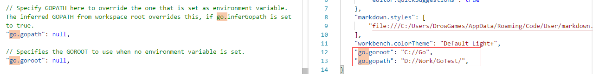
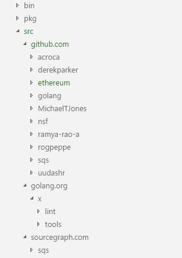
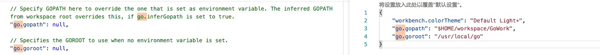

# GoLang环境配置

[TOC]

## Windows平台（VSCode为例）

### Ⅰ.安装Go语言包

官网下载[Golang语言包](https://dl.google.com/go/go1.10.windows-amd64.msi)并安装，默认安装路径为`C:/Go`

### Ⅱ.Go环境变量配置

安装完成后，会自动添加系统变量`GOROOT`，指向安装路径`C:/Go`，还需添加系统变量`GOPATH`作为工作路径，所有的Go项目在此路径下才能正常编译。这里设置`GOPATH`为`D:/Work/GoWork`

### Ⅲ.VSCode插件安装

VSCode安装[Go插件](https://github.com/Microsoft/vscode-go)

### Ⅳ.VSCodeGo环境配置

VSCode也需要配置goroot和gopath，文件-首选项-设置，查找`go.gopath`和`go.goroot`并修改，详情如图：



### Ⅴ.配置工程目录

在VSCode中打开文件夹GoWork，文件底下目录结构为：

```txt
-bin（可省略）

-pkg（可省略）

-src
```

### Ⅵ.配置VSCode环境

VSCode下可以安装工具用于拓展功能，完整的工具如下图所示：



这里如果git是通过Cygwin安装的，则不能通过VSCode自动安装所需工具，会提示找不到git命令，所以需要手动安装所需工具，如果安装的是完整版本的git则可参照[Mac下配置VSCode环境](###Ⅵ.Mac配置VSCode环境)

src目录下新建github.com、golang.com目录
下载以下文件：

- 必装：
  - [github.com/nsf/gocode](https://github.com/nsf/gocode)
  - [golang.org/x/tools](https://github.com/golang/tools/)

- 可选：
  - [github.com/acroca/go-symbols](https://github.com/acroca/go-symbols)
  - [github.com/derekparker/delve](https://github.com/derekparker/delve)
  - [github.com/golang/lint/golint](https://github.com/golang/lint)此处注意下载的是lint文件安装文件是此目录下golint，lint文件同时也需放到golang.org/x/下
  - [github.com/MichaelTJones/walk](https://github.com/MichaelTJones/walk)
  - [github.com/ramya-rao-a/go-outline](https://github.com/ramya-rao-a/go-outline)
  - [github.com/rogpeppe/godef](https://github.com/rogpeppe/godef)
  - [github.com/sqs/goreturns](https://github.com/sqs/goreturns)
  - [github.com/uudashr/gopkgs](https://github.com/uudashr/gopkgs)

安装方式：以上下载文件放到指定目录，在VSCode终端处进入到指定目录以`gocode`为例介绍

- 进入到gocode目录`cd src/github.com/nsf/gocode`
- 安装工具`go install`如提示`go`命令不存在，则返回步骤2确认系统变量是否正确

### Ⅶ.重新打开VSCode

若右下角仍有错误提示，则根据错误提示安装相应工具。

## MacOS平台（VSCode为例）

### Ⅰ.Mac安装Go语言包

下载[Golang语言包MacOS版本](https://studygolang.com/dl)并双击安装。默认安装路径为`/usr/local/go`

### Ⅱ.Mac下Go环境变量配置

执行命令`go env`或`go version`显示go信息则此步骤可跳过。

此处有坑，默认安装会自动配置环境变量，即在`/etc/paths.d`目录下生成go文件，内容为`/usr/local/go/bin`

Mac下默认环境变量的加载顺序为：

```txt
/etc/profile

/etc/paths

~/.bash_profile

~/.bash_login

~/.profile

~/.bashrc
```

可通过配置用户环境变量解决此问题，如果有~/.bash_profile则在此文件中添加路径，没有则依次往下选择，添加如下内容：

```txt
export GOROOT=/usr/local/go
export GOPATH=$HOME/workspace/GoWork
export PATH=$PATH:$GOROOT/bin
```

这里GOROOT为go安装路径，GOPATH为go项目的存放路径，保存文件后执行命令

```txt
source ~/.bash_profile
```

再次尝试`go env`或`go version`命令

### Ⅲ.Mac下VSCode插件安装

此步骤参照[Windows平台 Ⅲ.VSCode插件安装](###Ⅲ.VSCode插件安装)

### Ⅳ.Mac下VSCode Go环境配置

VSCode需要配置goroot和gopath，Code-Insiders-首选项-设置，查找`go.gopath`和`go.goroot`并修改，详情如图：



### Ⅴ.Mac下配置工程目录

此步骤参照[Windows平台 Ⅴ.配置工程目录](###Ⅴ.配置工程目录)

### Ⅵ.Mac配置VSCode环境

将GoWork文件夹添加到VSCode工作区，并在文件下新建test.go文件，内容如下：

```go
package main

import "fmt"

func main() {

 fmt.Println("Hello, World!")

}
```

此时VSCode底下会提示有工具未安装：


点击`Install All`，等待需要的支持和工具安装完成，直到左下角不再显示`Analysis Tools Missing`提示，如果有工具文件下载安装有问题，可参照[Windows配置VSCode环境](###Ⅵ.配置VSCode环境)安装所需包。
