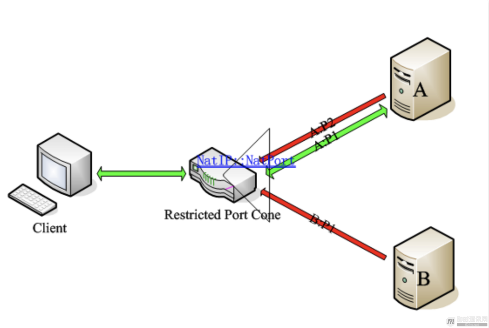
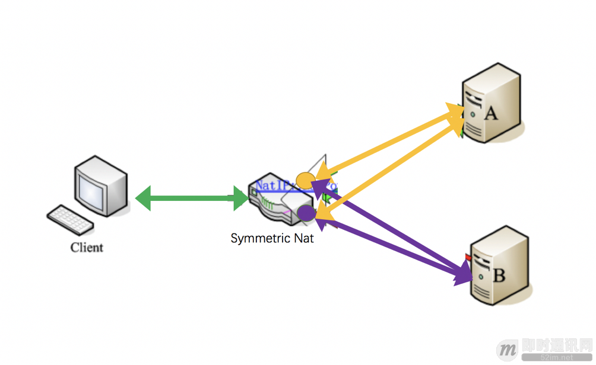
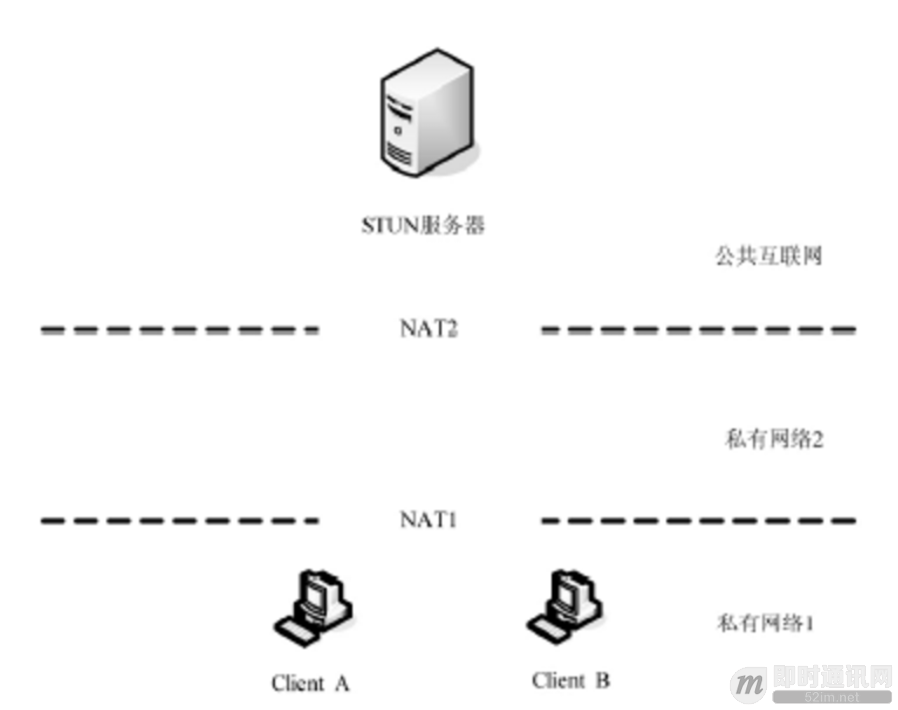
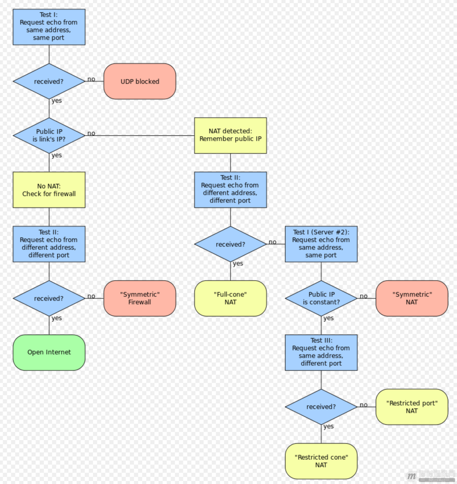

# 快速理解P2P技术中的NAT穿透原理

[原文](https://cloud.tencent.com/developer/article/1005974)
[TOC]

## 导语

P2P技术在现实的应用场景中，主要用于诸如IM（尤其移动端IM）、在线直播、在线教育等（这些应用里的实时音视频功能通常都会涉及到P2P），了解P2P的原理对于开发相关的应用来说还是很有必要的。

最近介入测试P2P的相关逻辑，因此对NAT穿透原理做了一定程度的了解（当然也没有很深入）。本篇文章也是综合和参考了些网络上和文献里的一些资料（文中没有对引用处进行标记，请见谅）。写本文的目的就是，用自己的语言描述了这个过程，同时也在描述过程中加入了一些自己的理解，形成一篇文章作为要点的记录。对于这一块的知识，自己也有很多盲点，还请各路大神多多指教。

## 一、背景知识介绍

### 1. 什么是NAT？

NAT（Network Address Translation，网络地址转换），也叫做网络掩蔽或者IP掩蔽。NAT是一种网络地址翻译技术，主要是将内部的私有IP地址（private IP）转换成可以在公网使用的公网IP（public IP）。

### 2. 为什么会有NAT？

时光回到上个世纪80年代，当时的人们在设计网络地址的时候，觉得再怎么样也不会有超过32bits位长即2的32次幂台终端设备连入互联网，再加上增加ip的长度（即使是从4字节增到6字节）对当时设备的计算、存储、传输成本也是相当巨大的。后来逐渐发现IP地址不够用了，然后就NAT就诞生了！（虽然ipv6也是解决办法，但始终普及不开来，而且未来到底ipv6够不够用仍是未知）。

因此，NAT技术能够兴起的原因还是因为在我们国家公网IP地址太少了，不够用，所以才会采取这种地址转换的策略。可见，NAT的本质就是让一群机器公用同一个IP，这样就暂时解决了IP短缺的问题。

### 3. NAT有什么优缺点？

优势其实上面已经刚刚讨论过了，根据定义，比较容易看出，NAT可以同时让多个计算机同时联网，并隐藏其内网IP，因此也增加了内网的网络安全性；此外，NAT对来自外部的数据查看其NAT映射记录，对没有相应记录的数据包进行拒绝，提高了网络安全性。

那么，NAT与此同时也带来一些弊端：首先是，NAT设备会对数据包进行编辑修改，这样就降低了发送数据的效率；此外，各种协议的应用各有不同，有的协议是无法通过NAT的（不能通过NAT的协议还是蛮多的），这就需要通过穿透技术来解决。我们后面会重点讨论穿透技术。

简单的背景了解过后，下面介绍下NAT实现的主要方式，以及NAT都有哪些类型。

## 二、NAT实现方式及主要类型

### 1. NAT实现方式

#### 1. 静态NAT

也就是静态地址转换。是指一个公网IP对应一个私有IP，是一对一的转换，同时注意，这里只进行了IP转换，而没有进行端口的转换。

举个栗子：

#### 2. NAPT

端口多路复用技术。与静态NAT的差别是，NAPT不但要转换IP地址，还要进行传输层的端口转换。具体的表现形式就是，对外只有一个公网IP，通过端口来区别不同私有IP主机的数据。

再举个栗子：

通过上面NAT实现方式的介绍，我们其实不难看出，现实环境中NAPT的应用显然是更广泛的。因此下面就重点介绍下NAPT的主要类型有哪些。

### 2. NAT的主要类型

对于NAPT我们主要分为两大类：**锥型NAT**和**对称型NAT**。
其中锥型NAT又分：**完全锥型**，**受限锥型**和**端口受限锥型**。

概括的说：对称型NAT是一个请求对应一个端口；锥型NAT（非对称NAT）是多个请求（外部发向内部）对应一个端口，只要源IP端口不变，无论发往的目的IP是否相同，在NAT上都映射为同一个端口，形象的看起来就像锥子一样。

下面分别介绍这四种类型及其差异。

#### 1. 完全锥型NAT（Full Cone NAT，后面简称FC）

- **特点**：IP和端口都不受限。
- **表现形式**：将来自内部同一个IP地址同一个端口号（IP_IN_A : PORT_IN_A）的主机监听/请求，映射到公网IP某个端口（IP_OUT_B : PORT_OUT_B）的监听。任意外部IP地址与端口对其自己公网的IP这个映射后的端口访问（IP_OUT_B : PORT_OUT_B），都将重新定位到内部这个主机（IP_IN_A : PORT_IN_A）。该技术中，基于C/S架构的应用可以在任何一端发起连接。是不是很绕啊。再简单一点的说，就是，只要客户端，由内到外建立一个映射（NatIP:NatPort -> A1）之后，其他IP的主机B或端口A2都可以使用这个洞给客户端发送数据。见下图（图片来自网络）。

#### 2. 受限锥型NAT（Restricted Cone NAT）

- **特点**：IP受限，端口不受限。
- **表现形式**：与完全锥形NAT不同的是，在公网映射端口后，并不允许所有IP进行对于该端口的访问，要想通信必需内部主机对某个外部IP主机发起过连接，然后这个外部IP主机就可以与该内部主机通信了，但端口不做限制。举个栗子。当客户端由内到外建立映射(NatIP:NatPort –> A1)，A机器可以使用他的其他端口（P2）主动连接客户端，但B机器则不被允许。因为IP受限啦，但是端口随便。见下图（绿色是允许通信，红色是禁止通信）。

#### 3. 端口受限型NAT（Port Restricted Cone NAT）

- **特点**：IP和端口都受限。
- **表现形式**：该技术与受限锥形NAT相比更为严格。除具有受限锥形NAT特性，对于回复主机的端口也有要求。也就是说：只有当内部主机曾经发送过报文给外部主机（假设其IP地址为A且端口为P1）之后，外部主机才能以公网IPORT中的信息作为目标地址和目标端口，向内部主机发送UDP报文，同时，其请求报文的IP必须是A，端口必须为P1（使用IP地址为A，端口为P2，或者IP地址为B，端口为P1都将通信失败）。例子见下图。这一要求进一步强化了对外部报文请求来源的限制，从而较Restrictd Cone更具安全性。

#### 对称型NAT（Symmetric NAT）

- **特点**：对每个外部主机或端口的会话都会映射为不同的端口（洞）。
- **表现形式**：只有来自同一内部IPORT、且针对同一目标IPORT的请求才被NAT转换至同一个公网（外部）IPORT，否则的话，NAT将为之分配一个新的外部（公网）IPORT。并且，只有曾经收到过内部主机请求的外部主机才能向内部主机发送数据包。内部主机用同一IP与同一端口与外部多IP通信。客户端想和服务器A（IP_AORT_A）建立连接，是通过NAT映射为NatIP:NatPortA来进行的。而客户端和服务器B（IP_BORT_B）建立连接，是通过NAT映射为NatIP:NatPortB来进行的。即同一个客户端和不同的目标IP:PORT通信，经过NAT映射后的公网IP:PORT是不同的。此时，如果B想要和客户端通信，也只能通过NatIP:NatPortB（也就是紫色的洞洞）来进行，而不能通过NatIP:NatPortA（也就是黄色的洞洞）。

以上，就是NAPT的四种NAT类型。可以看出从类型1至类型4，NAT的限制是越来越大的。

## 三、NAT路由类型判断

根据上面的介绍，我们可以了解到，在实际的网络情况中，各个设备所处的网络环境是不同的。那么，如果这些设备想要进行通信，首先判断出设备所处的网络类型就是非常重要的一步。

举个例子来说：对于IM中的实时音视频功能和VoIP软件，对位于不同NAT内部的主机通信需要靠服务器来转发完成，这样就会增加服务器的负担。为了解决这种问题，要尽量使位于不同NAT内部的主机建立直接通信，其中，最重要的一点就是要判断出NAT的类型，然后才能根据NAT的类型，设计出直接通信方案。不然的话，两个都在NAT的终端怎么通信呢？我们不知道对方的内网IP，即使把消息发到对方的网关，然后呢？网关怎么知道这条消息给谁，而且谁允许网关这么做了？

为了解决这个问题，也就是处于内网的主机之间能够穿越它们之间的NAT建立直接通信，已经提出了许多方法，STUN（Session Traversal Utilities for NAT，NAT会话穿越应用程序）技术就是其中比较重要的一种解决方法，并得到了广泛的应用。在这个部分，我们将重点介绍下STUN技术的原理。（PS：除此之外，还有UPNP技术，ALG应用层网关识别技术，SBC会话边界控制，ICE交互式连接建立，TURN中继NAT穿越技术等等，本文不一一做介绍。）

## 四、STUN协议介绍

### 1. STUN基本介绍

STUN是一种网络协议，它允许位于NAT（或多重NAT）后的客户端找出自己的公网地址，查出自己位于哪种类型的NAT之后以及NAT为某一个本地端口所绑定的Internet端端口。这些信息被用来在两个同时处于NAT路由器之后的主机之间建立UDP通信。该协议由RFC 5389定义。

STUN由三部分组成：

- STUN客户端；
- STUN服务器端；
- NAT路由器。

STUN服务端部署在一台有着两个公网IP的服务器上，大概的结构参考下图。STUN客户端通过向服务器端发送不同的消息类型，根据服务器端不同的响应来做出相应的判断，一旦客户端得知了Internet端的UDP端口，通信就可以开始了。

### 2. STUN的检测过程

**STUN协议定义了三类测试过程来检测NAT类型**：

- **Test1**：STUN Client通过端口{IP-C1:Port-C1}向STUN Server{IP-S1:Port-S1}发送一个Binding Request（没有设置任何属性）。STUN Server收到该请求后，通过端口{IP-S1:Port-S1}把它所看到的STUN Client的IP和端口{IP-M1,Port-M1}作为Binding Response的内容回送给STUN Client。
- **Test1#2**：STUN Client通过端口{IP-C1:Port-C1}向STUN Server{IP-S2:Port-S2}发送一个Binding Request（没有设置任何属性）。STUN Server收到该请求后，通过端口{IP-S2:Port-S2}把它所看到的STUN Client的IP和端口{IP-M1#2,Port-M1#2}作为Binding Response的内容回送给STUN Client。
- **Test2**：STUN Client通过端口{IP-C1:Port-C1}向STUN Server{IP-S1:Port-S1}发送一个Binding Request（设置了Change IP和Change Port属性）。STUN Server收到该请求后，通过端口{IP-S2:Port-S2}把它所看到的STUN Client的IP和端口{IP-M2,Port-M2}作为Binding Response的内容回送给STUN Client。
- **Test3**：STUN Client通过端口{IP-C1:Port-C1}向STUN Server{IP-S1:Port-S1}发送一个Binding Request（设置了Change Port属性）。STUN Server收到该请求后，通过端口{IP-S1:Port-S2}把它所看到的STUN Client的IP和端口{IP-M3,Port-M3}作为Binding Response的内容回送给STUN Client。

**STUN协议的输出是**：

- 1）公网IP和Port；
- 2）防火墙是否设置；
- 3）客户端是否在NAT之后，及所处的NAT的类型。

**因此我们进而整理出，通过STUN协议，我们可以检测的类型一共有以下七种**：

- A：公开的互联网IP：主机拥有公网IP，并且没有防火墙，可自由与外部通信；
- B：完全锥形NAT；
- C：受限制锥形NAT；
- D：端口受限制形NAT；
- E：对称型UDP防火墙：主机出口处没有NAT设备,但有防火墙,且防火墙规则如下：从主机UDP端口A发出的数据包保持源地址，但只有从之前该主机发出包的目的IP/PORT发出到该主机端口A的包才能通过防火墙；
- F：对称型NAT；
- G：防火墙限制UDP通信。

### 3. STUN协议的判断过程

输入和输出准备好后，附上一张维基百科的流程图，就可以描述STUN协议的判断过程了。

- **STEP1：**检测客户端是否有能力进行UDP通信以及客户端是否位于NAT后 -- Test1
    客户端建立UDP socket，然后用这个socket向服务器的（IP-1，Port-1）发送数据包要求服务器返回客户端的IP和Port，客户端发送请求后立即开始接受数据包。重复几次。
    1. 如果每次都超时收不到服务器的响应，则说明客户端无法进行UDP通信，可能是：G防火墙阻止UDP通信；
    2. 如果能收到回应，则把服务器返回的客户端的（IP:PORT）同（Local IP: Local Port）比较：
        - 如果完全相同则客户端不在NAT后，这样的客户端是：A具有公网IP可以直接监听UDP端口接收数据进行通信或者E。
        - 否则客户端在NAT后要做进一步的NAT类型检测（继续）。

- **STEP2：**检测客户端防火墙类型 -- Test2
    STUN客户端向STUN服务器发送请求，要求服务器从其他IP和PORT向客户端回复包：
    1. 收不到服务器从其他IP地址的回复，认为包前被前置防火墙阻断，网络类型为E；
    2. 收到则认为客户端处在一个开放的网络上，网络类型为A。

- **STEP3：**检测客户端NAT是否是FULL CONE NAT -- Test2
    客户端建立UDP socket然后用这个socket向服务器的(IP-1,Port-1)发送数据包要求服务器用另一对(IP-2,Port-2)响应客户端的请求往回发一个数据包，客户端发送请求后立即开始接受数据包。 重复这个过程若干次。
    1. 如果每次都超时，无法接受到服务器的回应，则说明客户端的NAT不是一个Full Cone NAT，具体类型有待下一步检测（继续）；
    2. 如果能够接受到服务器从(IP-2,Port-2)返回的应答UDP包，则说明客户端是一个Full Cone NAT，这样的客户端能够进行UDP-P2P通信。

- **STEP4：**检测客户端NAT是否是SYMMETRIC NAT -- Test1#2
    客户端建立UDP socket然后用这个socket向服务器的(IP-1,Port-1)发送数据包要求服务器返回客户端的IP和Port, 客户端发送请求后立即开始接受数据包。 重复这个过程直到收到回应（一定能够收到，因为第一步保证了这个客户端可以进行UDP通信）。

    用同样的方法用一个socket向服务器的(IP-2,Port-2)发送数据包要求服务器返回客户端的IP和Port。
比较上面两个过程从服务器返回的客户端(IP,Port),如果两个过程返回的(IP,Port)有一对不同则说明客户端为Symmetric NAT，这样的客户端无法进行UDP-P2P通信（检测停止）因为对称型NAT，每次连接端口都不一样，所以无法知道对称NAT的客户端，下一次会用什么端口。否则是Restricted Cone NAT，是否为Port Restricted Cone NAT有待检测（继续）。

- **STEP5：**检测客户端NAT是Restricted Cone 还是 Port Restricted Cone -- Test3
    客户端建立UDP socket然后用这个socket向服务器的(IP-1,Port-1)发送数据包要求服务器用IP-1和一个不同于Port-1的端口发送一个UDP 数据包响应客户端, 客户端发送请求后立即开始接受数据包。重复这个过程若干次。如果每次都超时，无法接受到服务器的回应，则说明客户端是一个Port Restricted Cone NAT，如果能够收到服务器的响应则说明客户端是一个Restricted Cone NAT。以上两种NAT都可以进行UDP-P2P通信。

通过以上过程，至此，就可以分析和判断出客户端是否处于NAT之后，以及NAT的类型及其公网IP，以及判断客户端是否具备P2P通信的能力了。
