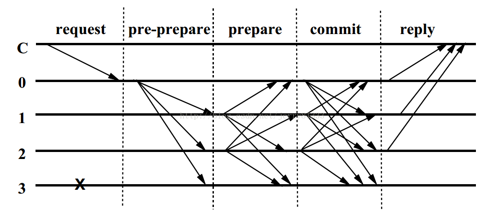
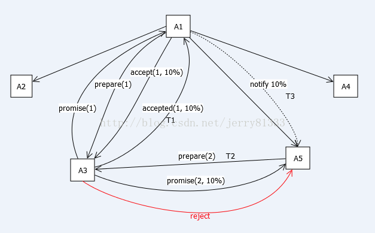
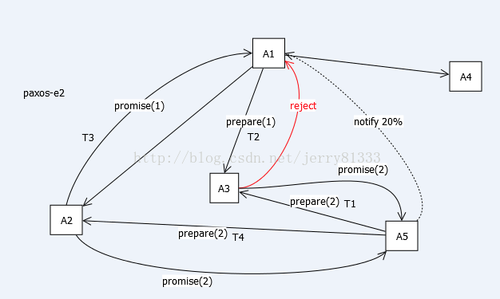

# 区块链共识算法 PBFT（拜占庭容错）、PAXOS、RAFT简述

## 共识算法

区块链中最重要的便是共识算法，比特币使用的是POS（Proof of Work，工作量证明），以太币使用的是POS（Proof of Stake，股权证明）使得算理变的不怎么重要了，而今POS的变体DPOS（Delegated Proof of Stake，股份授权证明）进一步削减算力的浪费，同时也加强了区块链的安全性。
不过，对于不需要货币体系的许可链或者私有链而言，绝对信任的节点，以及高效的需求上述共识算法并不能够提供，因此对于这样的区块链，传统的一致性算法成为首选，PBFT（拜占庭容错）、PAXOS、RAFT。

## PBFT（拜占庭容错）

基于拜占庭将军问题，一致性的确保主要分为这三个阶段：预准备（pre-prepare）、准备(prepare)和确认(commit)。流程如下图所示：

其中C为发送请求端，0123为服务端，3为宕机的服务端，具体步骤如下：

1. Request：请求端C发送请求到任意一节点，这里是0
2. Pre-Prepare：服务端0收到C的请求后进行广播，扩散至123
3. Prepare：123,收到后记录并再次广播，1->023，2->013，3因为宕机无法广播
4. Commit：0123节点在Prepare阶段，若收到超过一定数量的相同请求，则进入Commit阶段，广播Commit请求
5. Reply：0123节点在Commit阶段，若收到超过一定数量的相同请求，则对C进行反馈

根据上述流程，在 N ≥ 3F + 1 的情況下一致性是可能解決，N为总计算机数，F为有问题的计算机总数

N=4 F=0 时：
| N  |  得到数据 |  最终数据 |
| :- | --------:| :------: |
| A  |   1111   |  1       |
| B  |   1111   |  1       |
| C  |   1111   |  1       |
| D  |   1111   |  1       |

N=4 F=1 时：
| N  |  得到数据 |  最终数据 |
| :- | --------:| :------: |
| A  |   1110   |  1       |
| B  |   1101   |  1       |
| C  |   1011   |  1       |
| D  |   0111   |  1       |

N=4 F=2 时：
| N  |  得到数据 |  最终数据 |
| :- | --------:| :------: |
| A  |   1100   |  NA      |
| B  |   1001   |  NA      |
| C  |   0011   |  NA      |
| D  |   0110   |  NA      |

由此可以看出，拜占庭容错能够容纳将近1/3的错误节点误差，IBM创建的Hyperledger就是使用了该算法作为共识算法。

## PAXOS

算法本身用语言描述极其精简：

**phase 1**:

- proposer向网络内超过半数的acceptor发送prepare消息
- acceptor正常情况下回复promise消息

**phase 2**:

- 在有足够多acceptor回复promise消息时，proposer发送accept消息
- 正常情况下acceptor回复accepted消息

PAXOS中有三类角色Proposer、Acceptor及Learner，主要交互过程在Proposer和Acceptor之间，做成图便如下图所示：

其中1,2,3,4代表顺序。

以下图描述多Proposer的情况，T代表时间轴，图中仅画全一个Proposer与Acceptor的关系：

A3在T1发出accepted给A1，然后在T2收到A5的prepare，在T3的时候A1才通知A5最终结果(税率10%)。这里会有两种情况：

1. A5发来的N5小于A1发出去的N1，那么A3直接拒绝(reject)A5
2. A5发来的N5大于A1发出去的N1，那么A3回复promise，但带上A1的(N1, 10%)，最终A5也会接受10%

上图描述，如果已经Promise一个更大的N，那么会直接Reject更小的N

上述描述了，即使Promise了一个N，如果在未Accepted前，再收到一个更大的N，那么依旧会Reject那个即使已经Promise的N

总流程图氪概括如下：

PAXOS协议用于微信PaxosStore中，每分钟调用Paxos协议过程数十亿次量级。

## RAFT

RAFT核心思想很容易理解，如果数个数据库，初始状态一致，只要之后的进行的操作一致，就能保证之后的数据一致。由此RAFT使用的是Log进行同步，并且将服务器分为三中角色：Leader，Follower，Candidate，相互可以互相转换。
RAFT从大的角度看，分为两个过程：

1. 选举Leader
2. Leader生成Log，并与Follower进行Headbeats同步

### 选举Leader

Follower自增当前任期，转换为Candidate，对自己投票，并发起RequestVote RPC，等待下面三种情形发生；

1. 获得超过半数服务器的投票，赢得选举，成为Leader
2. 另一台服务器赢得选举，并接收到对应的心跳，成为Follower
3. 选举超时，没有任何一台服务器赢得选举，自增当前任期，重新发起选举

### 同步日志

Leader接受客户端请求，Leader更新日志，并向所有Follower发送Heatbeats，同步日志。所有Follwer都有ElectionTimeout，如果在ElectionTimeout时间之内，没有收到Leader的Headbeats，则认为Leader失效，重新选举Leader

流程图示：

### 安全性保证

1. 日志的流向只有Leader到Follower，并且Leader不能覆盖日志
2. 日志不是最新者不能成为Candidate

[画演示RAFT](http://thesecretlivesofdata.com/raft/)
