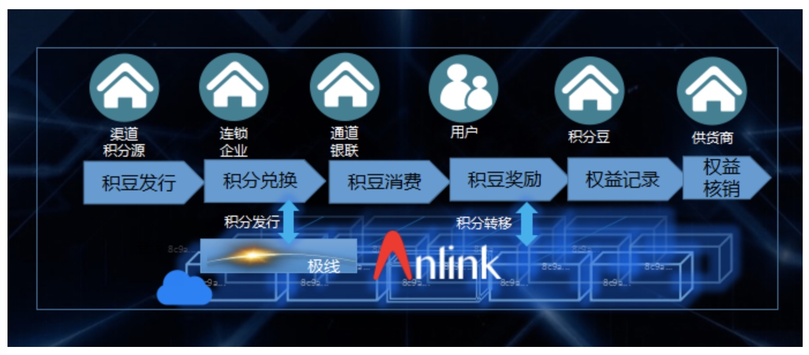

# 积分豆
## 技术平台
[安链云](https://anlink.com)

## 企业概述
上海积豆信息科技有限公司是由多名互联网行业精英联合创立的新型互联网电子商务公司，注册资金500万元人民币，致力于为企业提供整体积分兑换业务解决方案和互联网应用开发运营策划推广支持。
积豆科技携手电信运营商等多家机构推出多样化积分兑换管理平台。平台提供积分管理兑换功能，让销售者手中的积分不再闲置浪费。

## 合作场景：
- 区块链积分权益共享账本“倍积链”的技术方案支持与搭建。
- 商户积分权益发行兑换SAAS云服务平台“积分云”。
- 企业积分应用、积分发行、权益兑换、权益增值的数字资产管理平台“积分豆”。
- 以商户积分为例，电信的积分可以积分商城商品形式兑换为积豆，并在积分豆平台上与消费者在其他商户的积分打通，如兑换为东航里程。

## 解决方案

