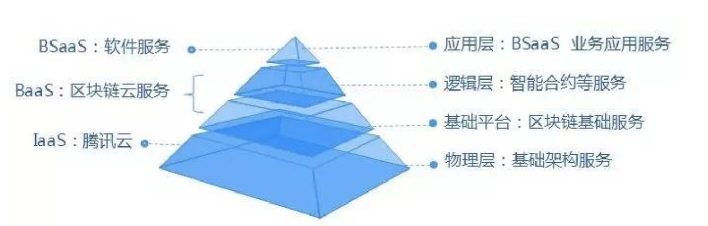

# 微众银行区块链贷款结算
## 痛点
作为一家没有物理网点的互联网银行，微众银行80%资金来自其他银行，合作方式是联合放贷。微粒贷是微众银行的领军产品，这是面向于个人的消费贷款，目前为止已经有超过一千万客户，发放了一千万笔贷款，发放金额也超过了一千亿元。目前微粒贷日利率为万分之5，年化利率为18.25%，其中合作银行可获取70%利息，微众获得30%利息。在这样的合作模式下，对微众银行来说，其与20多家合作银行之间的资金清算显得非常重要。

## 解决方案
2016年5月，微众银行联合深证通、深圳市金融信息服务协会等机构，牵头发起成立了金融区块链合作联盟（深圳）（简称“金链盟”），目前成员单位已涵括银行、证券、保险、基金、区域股权交易所、科技公司等六大领域的67家机构。
2017年7月，微众银行联合腾讯打造了“区块链云服务BaaS”，集成了在云端搭建区块链应用的所有必需品，如区块链底层基础设施、开发者工具、模板、资源等。区块链云服务BaaS已经在腾讯云平台上发布，接入的机构可以自建联盟链，并控制审批区块链上的的节点身份。

