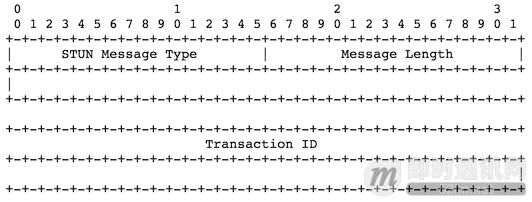
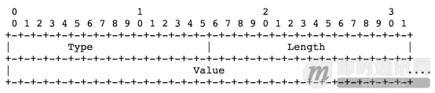
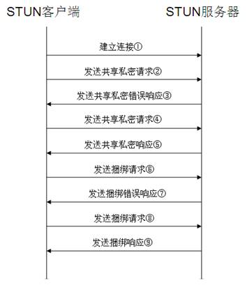
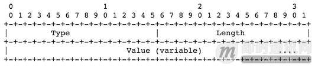
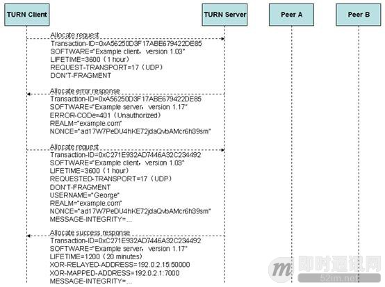
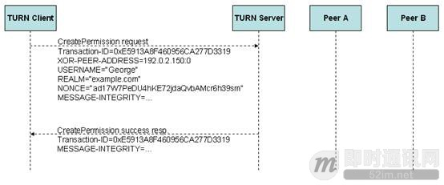
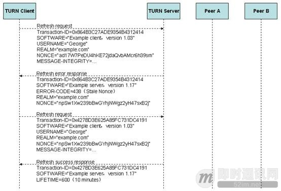
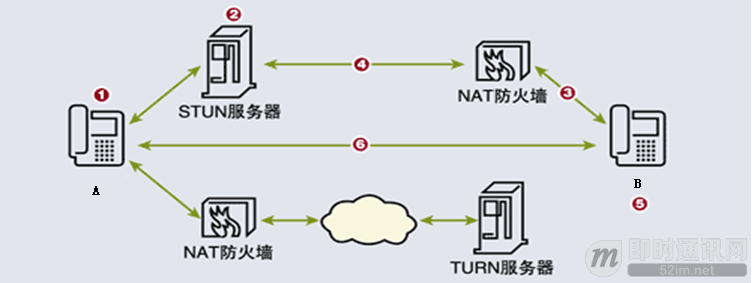

# P2P技术详解(三)：P2P技术之STUN、TURN、ICE详解
[TOC]

## 1、内容概述

在现实Internet网络环境中，大多数计算机主机都位于防火墙或NAT之后，只有少部分主机能够直接接入Internet。很多时候，我们希望网络中的两台主机能够直接进行通信，即所谓的P2P通信，而不需要其他公共服务器的中转。由于主机可能位于防火墙或NAT之后，在进行P2P通信之前，我们需要进行检测以确认它们之间能否进行P2P通信以及如何通信。这种技术通常称为NAT穿透（NAT Traversal）。最常见的NAT穿透是基于UDP的技术，如[RFC3489](https://tools.ietf.org/html/rfc3489)中定义的STUN协议。

STUN，首先在[RFC3489](https://tools.ietf.org/html/rfc3489)中定义，作为一个完整的NAT穿透解决方案，英文全称是Simple Traversal of UDP Through NATs，即简单的用UDP穿透NAT。

在新的[RFC5389](https://tools.ietf.org/html/rfc5389)修订中把STUN协议定位于为穿透NAT提供工具，而不是一个完整的解决方案，英文全称是Session Traversal Utilities for NAT，即NAT会话穿透效用。[RFC5389](https://tools.ietf.org/html/rfc5389)与[RFC3489](https://tools.ietf.org/html/rfc3489)除了名称变化外，最大的区别是支持TCP穿透。

TURN，首先在[RFC5766](https://tools.ietf.org/html/rfc5766)中定义，英文全称是Traversal Using Relays around NAT:Relay Extensions to Session Traversal Utilities for NAT，即使用中继穿透NAT:STUN的扩展。简单的说，TURN与STURN的共同点都是通过修改应用层中的私网地址达到NAT穿透的效果，异同点是TURN是通过两方通讯的“中间人”方式实现穿透。

ICE跟STUN和TURN不一样，ICE不是一种协议，而是一个框架（Framework），它整合了STUN和TURN。

## 2、STUN详解

了解STUN之前，我们需要了解NAT的种类。

NAT对待UDP的实现方式有4种，分别如下：

- **Full Cone NAT：**
  完全锥形NAT，所有从同一个内网IP和端口号发送过来的请求都会被映射成同一个外网IP和端口号，并且任何一个外网主机都可以通过这个映射的外网IP和端口号向这台内网主机发送包。

- **Restricted Cone NAT：**
  限制锥形NAT，它也是所有从同一个内网IP和端口号发送过来的请求都会被映射成同一个外网IP和端口号。与完全锥形不同的是，外网主机只能够向先前已经向它发送过数据包的内网主机发送包。

- **Port Restricted Cone NAT：**
 端口限制锥形NAT，与限制锥形NAT很相似，只不过它包括端口号。也就是说，一台IP地址X和端口P的外网主机想给内网主机发送包，必须是这台内网主机先前已经给这个IP地址X和端口P发送过数据包。

- **Symmetric NAT：**
  对称NAT，所有从同一个内网IP和端口号发送到一个特定的目的IP和端口号的请求，都会被映射到同一个IP和端口号。如果同一台主机使用相同的源地址和端口号发送包，但是发往不同的目的地，NAT将会使用不同的映射。此外，只有收到数据的外网主机才可以反过来向内网主机发送包。

### 2.1 RFC3489/STUN

STUN（Simple Traversal of User Datagram Protocol Through Network Address Translators），即简单的用UDP穿透NAT，是个轻量级的协议，是基于UDP的完整的穿透NAT的解决方案。它允许应用程序发现它们与公共互联网之间存在的NAT和防火墙及其他类型。它也可以让应用程序确定NAT分配给它们的公网IP地址和端口号。STUN是一种Client/Server的协议，也是一种Request/Response的协议，默认端口号是3478。（IETF官方文档[RFC3489/STUN](https://tools.ietf.org/html/rfc3489)点此进入）

#### 2.1.1 报文结构

**【Ø  消息头】**

所有的STUN消息都包含20个字节的消息头，包括16位的消息类型，16位的消息长度和128位的事务ID。

消息类型许可的值如下：

* 0x0001：捆绑请求
* 0x0101：捆绑响应
* 0x0111：捆绑错误响应
* 0x0002：共享私密请求
* 0x0102：共享私密响应
* 0x0112：共享私密错误响应

消息长度，是消息大小的字节数，但不包括20字节的头部。事务ID，128位的标识符，用于随机请求和响应，请求与其相应的所有响应具有相同的标识符。

**【Ø  消息属性】**

消息头之后是0或多个属性，每个属性进行TLV编码，包括16位的属性类型、16位的属性长度和变长属性值。

属性类型定义如下：

- **MAPPED-ADDRESS**：MAPPED-ADDRESS属性表示映射过的IP地址和端口。它包括8位的地址族，16位的端口号及长度固定的IP地址。
- **RESPONSE-ADDRESS**：RESPONSE-ADDRESS属性表示响应的目的地址
- **CHASNGE-REQUEST**：客户使用32位的CHANGE-REQUEST属性来请求服务器使用不同的地址或端口号来发送响应。
- **SOURCE-ADDRESS**：SOURCE-ADDRESS属性出现在捆绑响应中，它表示服务器发送响应的源IP地址和端口。
- **CHANGED-ADDRESS**：如果捆绑请求的CHANGE-REQUEST属性中的“改变IP”和“改变端口”标志设置了，则CHANGED-ADDRESS属性表示响应发出的IP地址和端口号。
- **USERNAME**：USERNAME属性用于消息的完整性检查，用于消息完整性检查中标识共享私密。USERNAME通常出现在共享私密响应中，与PASSWORD一起。当使用消息完整性检查时，可有选择地出现在捆绑请求中。
- **PASSWORD**：PASSWORD属性用在共享私密响应中，与USERNAME一起。PASSWORD的值是变长的，用作共享私密，它的长度必须是4字节的倍数，以保证属性与边界对齐。
- **MESSAGE-INTEGRITY**：MESSAGE-INTEGRITY属性包含STUN消息的HMAC-SHA1，它可以出现在捆绑请求或捆绑响应中；MESSAGE-INTEGRITY属性必须是任何STUN消息的最后一个属性。它的内容决定了HMAC输入的Key值。
- **ERROR-CODE**：ERROR-CODE属性出现在捆绑错误响应或共享私密错误响应中。它的响应号数值范围从100到699。
- **UNKNOWN-ATTRIBUTES**：UNKNOWN-ATTRIBUTES属性只存在于其ERROR-CODE属性中的响应号为420的捆绑错误响应或共享私密错误响应中。
- **REFLECTED-FROM**：REFLECTED-FROM属性只存在于其对应的捆绑请求包含RESPONSE-ADDRESS属性的捆绑响应中。属性包含请求发出的源IP地址，它的目的是提供跟踪能力，这样STUN就不能被用作DOS攻击的反射器。

具体的ERROR-CODE（响应号），与它们缺省的原因语句一起，目前定义如下：

- **400（错误请求）**：请求变形了。客户在修改先前的尝试前不应该重试该请求。
- **401（未授权）**：捆绑请求没有包含MESSAGE-INTERITY属性。
- **420（未知属性）**：服务器不认识请求中的强制属性。
- **430（过期资格）**：捆绑请求没有包含MESSAGE-INTEGRITY属性，但它使用过期的共享私密。客户应该获得新的共享私密并再次重试。
- **431（完整性检查失败）**：捆绑请求包含MESSAGE-INTEGRITY属性，但HMAC验证失败。这可能是潜在攻击的表现，或者客户端实现错误
- **432（丢失用户名）**：捆绑请求包含MESSAGE-INTEGRITY属性，但没有USERNAME属性。完整性检查中两项都必须存在。
- **433（使用TLS）**：共享私密请求已经通过TLS（Transport Layer Security，即安全传输层协议）发送，但没有在TLS上收到。
- **500（服务器错误）**：服务器遇到临时错误，客户应该再次尝试。
- **600（全局失败**）：服务器拒绝完成请求，客户不应该重试。

属性空间分为可选部分与强制部分，值超过0x7fff的属性是可选的，即客户或服务器即使不认识该属性也能够处理该消息；值小于或等于0x7fff的属性是强制理解的，即除非理解该属性，否则客户或服务器就不能处理该消息。

#### 2.1.2实现原理

STUN协议的完整交互过程如上，下面我们来介绍具体实现步骤。

一般情况下，客户会配置STUN服务器提供者的域名，该域名被解析为IP地址和SRV过程的端口号。服务器名是“stun”，使用UDP协议发送捆绑请求，使用TCP协议发送共享私密请求。STUN协议的缺省端口号为3478。

若要提供完整性检查，STUN在客户和服务器间使用128位的共享私密，作为在捆绑请求和捆绑响应中的密匙。

首先，客户通过发现过程获得它将与之建立TCP连接的IP地址和端口号。客户打开该地址和端口的连接，开始TLS协商，验证服务器的标识。客户发送共享私密请求。该请求没有属性，只有头。服务器生成响应。

客户会在该连接上生成多个请求，但在获得用户名和密码后关闭该连接。

服务器收到共享私密请求，验证从TLS连接上到达的该请求；如果不是通过TLS收到的请求，则生成共享私密错误响应，并设置ERROR-CODE属性为响应号433；这里区分两种情况：若通过TCP收到请求，则错误响应通过收到请求的相同连接发送；若通过UDP收到请求，则错误响应发送回请求送出的源IP和端口。

服务器检查请求中的任何属性，当其中有不理解的小于或等于0x7fff的值，则生成共享私密错误响应，设置ERROR-CODE属性为响应号420,并包括UNKNOWN-ATTRIBUTE属性，列出它不理解的小于或等于0x7fff的属性的值。该错误响应通过TLS连接发送。

若请求正确，服务器创建共享私密响应，包含与请求中相同的事务ID，并包含USERNAME和PASSWORD属性。用户名在10分钟内有效。

共享私密响应通过与收到请求的相同的TLS连接发送，服务器保持连接打开状态，由客户关闭它。

接着，客户发送捆绑请求，携带的属性包括：
- 可选属性：RESPONSE-ADDRESS属性和CHANGE-REQUEST属性；
- 强制属性：MESSAGE-INTEGRITY属性和USERNAME属性。

客户发送捆绑请求，通过客户重传来提供可靠性。客户开始用100ms的间隔重传，每次重传间隔加倍，直至1.6秒。之间间隔1.6秒的重传继续，直到收到响应或总共已经发送了9次。因此，若9500ms后，还未收到响应，客户认为传输已经失败。

服务器检查捆绑请求的MESSAGE-INTEGRITY属性，不存在则生成捆绑错误响应，设置ERROR-CODE属性为响应号401；若存在，计算请求的HMACKey值。

服务器检查USERNAME属性，不存在则生成捆绑错误响应，设置ERROR-CODE属性为响应号432；若存在，但不认识该USERNAME的共享私密（例如，它超时了），生成捆绑错误响应，设置ERROR-CODE属性为响应号430。

若服务器知道该共享私密，但所计算的HMAC与请求的不同，生成捆绑错误响应，设置ERROR-CODE属性为响应号431。

假设消息完整性检查通过了，服务器检查请求中的任何属性的值，若遇到不理解的小于或等于0x7fff的值，生成捆绑错误响应，设置ERROR-CODE属性为响应号420，该响应包含UNKNOWN-ATTRIBUTE属性，并列出不理解的小于或等于0x7fff的属性。

若请求正确，服务器生成单个捆绑响应，包含与捆绑请求相同的事务ID。服务器在捆绑响应中加入MAPPED-ADDRESS属性，该属性的IP地址和端口号为捆绑请求的源IP地址和端口号。

捆绑响应的源地址和端口号取决于捆绑请求中CHANGE-REQUEST属性的值及捆绑请求收到的地址和端口号相关。总结如下：

服务器在捆绑响应中加入SOURCE-ADDRESS属性，包含用于发送捆绑响应的源地址和端口号；加入CHANGED-ADDRESS属性，包含源IP地址和端口号。

如果捆绑请求中包含了USERNAME和MESSAGE-INTEGRITY属性，则服务器在捆绑响应中加入MESSAGE-INTEGRITY属性。

如果捆绑请求包含RESPONSE-ADDRESS属性，则服务器在捆绑响应中加入REFLECTED-FROM属性：如果捆绑请求使用从共享私密请求获得的用户名进行认证，则REFLECTED-FROM属性包含共享私密请求到达的源IP地址和端口号；若请求中的用户名不是使用共享私密分配的，则REFLECTED-FROM属性包含获得该用户名的实体的源IP地址和端口号；若请求中没有用户名，且服务器愿意处理该请求，则REFLECTED-FROM属性包含请求发出的源IP地址和端口号。

服务器不会重传响应，可靠性通过客户周期性地重发请求来保障，每个请求都会触发服务器进行响应。

客户端判断响应的类型是捆绑错误响应还是捆绑响应。捆绑错误响应通常在请求发送的源地址和端口收到；捆绑响应通常在请求中的RESPONSE-ADDRESS属性的地址和端口收到，若没有该属性，则捆绑响应将在请求发送的源地址和端口号收到。

若是捆绑错误响应，客户检查响应中的ERROR-CODE属性的响应号：400至499之间的未知属性按属性400处理，500至599之间的未知属性按500处理，600至699之间的未知属性按600处理。任何100和399之间的响应都会使请求重传中止，但其他则忽略；若客户收到响应的属性类型大于0x7fff，则忽略该属性，若小于或等于0x7fff，则请求重传停止，并忽略整个响应；
若是捆绑响应，客户检查响应的MESSAGE-INTEGRITY属性：如果不存在，客户在请求中加入MESSAGE-INTEGRITY属性，并放弃该响应；如果存在，客户计算响应的HMAC。如果计算出的HMAC与响应中的不同，则放弃该响应，并警告客户可能受到了攻击；若计算出的HMAC与响应中的匹配，则过程继续；
不论收到捆绑响应还是捆绑错误响应，都将中止该请求的重传。客户在第一次响应后继续监听捆绑请求的响应10秒钟，如果这期间它收到任何消息类型不同的响应或不同的MAPPED-ADDRESS属性，它将警告用户可能受到攻击；并且，如果客户收到的捆绑响应次数超过它发送的捆绑请求数的两倍，它将警告用户可能受到攻击；若捆绑响应经过认证，上述攻击并未导致客户丢弃MAPPED-ADDRESS，则客户可以使用该MAPPED-ADDRESS和SOURCE-ADDRESS属性。

### 2.1.3 STUN功能举例

客户通过带外方式获得STUN服务器信息后，就打开对应的地址和端口的连接，并开始与STUN服务器进行TLS协商。一旦打开了连接，客户就通过TCP协议发送共享私密请求，服务器生成共享私密响应。STUN在客户和服务器间使用共享私密，用作捆绑请求和捆绑响应中的密匙。之后，客户使用UDP协议向STUN服务器发送捆绑请求，当捆绑请求消息到达服务器的时候，它可能经过了一个或者多个NAT。结果是STUN服务器收到的捆绑请求消息的源IP地址被映射成最靠近STUN服务器的NAT的IP地址，STUN服务器把这个源IP地址和端口号复制到一个捆绑响应消息中，发送回拥有这个IP地址和端口号的客户端。

当STUN客户端收到捆绑响应消息之后，它会将自己发送捆绑请求时绑定的本地IP地址和端口号同捆绑响应消息中的IP地址和端口号进行比较，如果不匹配，就表示客户端正处于一个或者多个NAT的前面。

在Full-Cone NAT的情况下，在捆绑响应消息中的IP地址和端口是属于公网的，公网上的任何主机都可以使用这个IP地址和端口号向这个应用程序发送数据包，应用程序只需要在刚才发送捆绑请求的IP地址和端口上监听即可。

当然，客户可能并不在一个Full-Cone NAT的前面，实际上，它并不知道自己在一个什么类型的NAT的前面。为了确定NAT的类型，客户端使用附加的捆绑请求。具体过程是很灵活的，但一般都会像下面这样工作：客户端再发送一个捆绑请求，这次发往另一个IP地址，但是使用的是跟上一次同一个源IP地址和源端口号，如果返回的数据包里面的IP地址和端口号和第一次返回的数据包中的不同，客户端就会知道它是在一个对称NAT的前面。客户端为了确认自己是否在一个完全锥形NAT的前面，客户端可以发送一个带有标志的捆绑请求，这个标志告诉服务器使用另一个IP地址和端口发送捆绑响应。换句话说，如果客户端使X/Y的IP地址端口对向A/B的IP地址端口对发送捆绑请求，服务器就会使用源IP地址和源端口号为C/D的地址端口对向X/Y发送捆绑响应。如果客户端收到了这个响应，它就知道它是在一个Full-Cone NAT前面。

STUN协议允许客户端请求服务器从收到捆绑请求的IP地址往回发捆绑响应，但是要使用不同的端口号。这可以用来检查客户端是否在Port Restricted Cone NAT的前面还是在Restricted Cone NAT的前面。

### 2.2 [RFC5389/STUN](https://tools.ietf.org/html/rfc5389)

STUN协议在[RFC5389](https://tools.ietf.org/html/rfc5389)中被重新命名为**Session Traversal Utilities for NAT**，即NAT会话穿透效用。在这里，NAT会话穿透效用被定位为一个用于其他解决NAT穿透问题协议的协议。它可以用于终端设备检查由NAT分配给终端的IP地址和端口号。同时，它也被用来检查两个终端之间的连接性，好比是一种维持NAT绑定表项的保活协议。STUN可以用于多种NAT类型，并不需要它们提供特殊的行为。

STUN本身不再是一种完整的NAT穿透解决方案，它相当于是一种NAT穿透解决方案中的工具。这是与[RFC3489/STUN](https://tools.ietf.org/html/rfc3489)版本相比最重要的改变。

#### 2.2.1 STUN用途

目前定义了三种STUN用途：

- Interactive Connectivity Establishment（ICE）[MMUSIC-ICE]，交互式连接建立
- Client-initiated connections for SIP [SIP-OUTBOUND]，用于SIP的客户端初始化连接
- NAT Behavior Discovery [BEHAVE-NAT]，NAT行为发现

#### 2.2.2报文结构

**【Ø  消息头】**

STUN消息头为20字节，后面紧跟0或多个属性。STUN头部包含一STUN消息类型、magic cookie、事务ID和消息长度。

每个STUN消息的最高位前2位必须为0。当STUN协议为多个协议多路复用时若使用的是同一个端口，这可以用于与其他协议区分STUN数据包。
消息类型确定消息的类别（如请求、成功回应、失败回应、标志）。虽然这里有四种消息类型，但可以分为2类事务：请求/响应事务、标志事务。

消息类型字段可进一步划分为下面结构：

消息类型定义如下：

* 0b00，表示请求
* 0b01，表示标志
* 0b10，表示成功响应
* 0b11，表示错误响应

魔术字域必须包含固定的值0x2112A442。在[RFC3489](https://tools.ietf.org/html/rfc3489)中，该域是事务ID的一部分。配置魔术字允许服务器检测客户是否理解某些在改进的版本中增加的属性。另外，还可用于STUN多路复用时与其他协议的包进行区分。

96位的事务ID用于唯一的识别STUN事务。对于请求/响应事务，事务ID由STUN客户端来选择；对于标志事务，由代理（代理指支持STUN的客户端或服务器）来选择并发送。它主要服务于与请求相关的响应，因此它也扮演着一个帮助阻止确定类型的攻击的角色。服务器使用事务ID来唯一的标识出所有客户端的每一个事务。事务ID本身必须是唯一的，并且随机的从0到2的96-1次方中选择。重新发送相同的请求时，也必须使用新的事务ID。成功或错误响应必须携带与相对应的请求相同的事务ID。

消息长度字段不包括20字节的STUN头部。所有的STUN属性必须填充为4字节的倍数。消息长度字段的最后2位总是为0，这为区分STUN包与其他协议的包提供了另外一种方法。

**【Ø  消息属性】**

STUN头之后是0或多个属性。每个属性都采用TLV编码，16位的类型、16位的长度及可变长度的值。每个STUN属性必须是4字节边界对齐。

属性空间被划分为2个范围。属性的类型值在0x0000到0x7fff是强制理解属性，这意味着除非STUN代理能够理解这些属性，否则将不能正常处理包含该属性的消息；属性的类型值在0x8000到0xffff范围是可选理解属性，这意味着如果STUN代理不能理解它们的话这些属性可以被忽略。

STUN属性类型集由**IANA**维护，具体定义详见[IETF官方文档 RFC5389](https://tools.ietf.org/html/rfc5389)。

### 2.3 [RFC5389](https://tools.ietf.org/html/rfc5389)与[RFC3489](https://tools.ietf.org/html/rfc3489)的区别

[RFC5389](https://tools.ietf.org/html/rfc5389)与[RFC3489](https://tools.ietf.org/html/rfc3489)的不同点如下：

- 去掉STUN是一种完整的NAT穿透方案的概念，现在是一种用于提供NAT穿透解决方案的工具。因而，协议的名称变为NAT会话穿透效用；
- 定义了STUN的用途；
- 去掉了STUN关于NAT类型检测和绑定生命期发现的用法，去掉了RESPONSE-ADDRESS、CHANGED-ADDRESS、CHANGE-REQUEST、SOURCE-ADDRESS和REFLECTED-FROM属性；
- 增加了一个固定的32位的魔术字字段，事务ID字段减少了32位长度；
- 增加了XOR-MAPPED-ADDRESS属性，若魔术字在捆绑请求中出现时，该属性包括在捆绑响应中。否则，[RFC3489](https://tools.ietf.org/html/rfc3489)中的行为是保留的（换句话说，捆绑响应中包括MAPPED-ADDRESS）；
- 介绍了消息类型字段的正式结构，带有一对明确的位来标识Request、Response、Error-Response或Indication消息。因此，消息类型字段被划分为类别和方法两部分；
- 明确的指出了STUN的最高2位是0b00，当用于ICE时可以简单的与RTP包区分开来；
- 增加指纹属性来提供一种明确的方法来检测当STUN协议多路复用时，STUN与其他协议之间的差异；
- 增加支持IPv6，IPv4客户端可以获取一个IPv6映射地址，反之亦然；
- 增加一个long-term-credential-based认证机制；
- 增加了SOFTWARE、REALM、NONCE和ALTERNATE-SERVER属性；
- 去掉了共享密匙方法，因此PASSWORD属性也去掉了；
- 去掉了使用连续10秒侦听STUN响应来识别一个攻击的做法；
- 改变事务计时器来增加TCP友好性；
- 去掉了STUN例子如集中分离控制和媒体面，代替的，在使用STUN协议时提供了更多的信息；
- 定义了一类填充机制来改变长度属性的说明；
- REALM、SERVER、原因语句和NONCE限制在127个字符，USERNAME限制在513个字节以内；
- 为TCP和TLS改变了DNS SRV规程，UDP仍然和以前保持一致。

IETF官文档，详见：[RFC5389](https://tools.ietf.org/html/rfc5389)、[RFC3489](https://tools.ietf.org/html/rfc3489)。

### 2.4 新特性介绍
#### 2.4.1指纹机制

FINGERPRINT机制是一种可选的用于其他协议多路复用STUN时发送给相同的传输地址时区分STUN数据包的机制，该机制不支持与[RFC3489](https://tools.ietf.org/html/rfc3489)相兼容。

在一些用途中，基于相同的传输地址时多个协议会多路复用STUN消息，例如RTP协议。STUN消息必须首先和应用报文分离开。目前，在STUN报头中有3种固定的字段可以用于该目的。尽管如此，在一些案例中，三种固定字段仍然不能充分的区别开。

当扩展的指纹机制被使用时，STUN代理在发送给其他STUN代理的消息中包括FINGERPRINT属性。当其他STUN代理收到时，除基本的检查之外，还将检查是否包含FINGERPRINT属性及它是否包含正确的值，至此，它将相信这是一个STUN消息。指纹机制帮助STUN代理检查其他协议那些看起来像是STUN消息的消息。

#### 2.4.2通过DNS发现服务器机制

STUN客户端可以使用DNS来发现STUN服务器的IP地址和端口。客户端必须知道服务器的域名。

当客户端希望找出服务器在公网上的位置就采用捆绑请求/响应事务，SRV（资源记录表）中服务器名称是“stun”。当通过TLS会话采用捆绑请求/响应事务，SRV中服务器名称为“stuns”。STUN用户可以定义额外的DNS资源记录服务名称。

STUN请求的默认端口是3478，用于TCP和UDP。STUN在TLS上的默认端口是5349。服务器能够在TLS上运行STUN与STUN在TCP上时使用相同的端口，只有服务器软件支持决定初始消息是否是TLS或STUN消息。

如果SRV中没有记录可查，客户端执行A或AAAA记录查找域名。结果将会是1张IP地址表，每一个都可以使用TCP或UDP采用默认端口号连接。通常要求使用TLS，客户端使用STUN在TLS上的默认端口号连接其中一个IP地址。

#### 2.4.3认证和消息完整性机制

短期证书机制
短期证书机制假设在STUN事务之前，客户端和服务器已经使用了其他协议来交换了证书，以username和password形式。这个证书是有时间限制的。例如，在ICE用途中，两个终端使用带外方式交换信息来对username和password达成一致，并在媒体会话期间使用。这个证书被用来进行消息完整性检查，用于每个请求和多个响应中。与长期证书机制相比，没有挑战和响应方式，因此，这种证书的时间限制特性的优点是可以阻止重播。

长期证书机制
长期证书机制依赖于一个长期证书，username和password在客户端和服务器中是共用的。这个证书从它提供给 用户开始将一直是有效的，直到该用户不再是该系统的用户。这本质上是一个提供给用户username和password的传统的登入方式。    

客户端初始发送一个请求，没有提供任何证书和任何完整性检测。服务器拒绝这个请求，并提供给用户一个范围（用于指导用户或代理选择username和password）和一个nonce。这个nonce提供重放保护。它是一个cookie，由服务器选择，以这样一种方式来标示有效时间或客户端身份是有效的。客户端重试这个请求，这次包括它的username和realm和服务器提供的nonce来回应。服务器确认这个nonce和检查这个message integrity。如果它们匹配，请求则通过认证。如果这个nonce不再有效，即过期了，服务器就拒绝该请求，并提供一个新的nonce。

在随后的到同一服务器的请求，客户端重新使用这个nonce、username和realm，和先前使用的password。这样，随后的请求不会被拒绝直到这个nonce变成无效的。需要注意的是，长期证书机制不能用来保护Indications，由于Indications不能被改变，因此，使用Indications时要么使用短期证书，要么就省略认证和消息完整性。因为长期证书机制对离线字典攻击敏感，部署的时候应该使用很难猜测的密码。

#### 2.4.4备份服务器机制

服务器使用增强的重定向功能将一个客户端转向另一个服务器，通过回应一个错误响应号为300（尝试备份）的错误响应。服务器在错误响应中携带一个ALTERNATE-SERVER属性。

客户端收到错误响应号为300的错误响应后，在该响应中查找ALTERNATE-SERVER属性。若找到一个，客户端就会将当前的事务作废，并重新尝试发送请求到该属性中列出的服务器。请求报文若已经通过认证，则必须使用与先前发送给执行重定向操作的服务器同样的证书。如果客户端在最后5分钟里已经重试发送请求时已经重定向到了一个服务器，它必须忽略重定向操作并将当前的事务作废，这是为了防止无限的重定向循环。

### 2.5 RFC5389与RFC3489的兼容

在RFC3489中：

- UDP是唯一支持的传输协议
- RFC5389中的魔术字字段是RFC3489中事务ID的一部分，事务ID长128位
- 没有XOR-MAPPED-ADDRESS属性，绑定方法是使用MAPPED-ADDRESS属性代替
- 有3个需要强制理解的属性，分别是：RESPONSE-ADDRESS、CHANGE-REQUEST、CHANGED-ADDRESS属性，而RFC5389中不再支持这些属性。

#### 2.5.1客户端处理的改变

客户端想要与[RFC3489](https://tools.ietf.org/html/rfc3489)的服务器互操作，应发送一个使用绑定方法的请求消息，不包含任何消息，使用UDP协议发送给服务器。如果成功，将收到服务器发回的包含MAPPED-ADDRESS属性而不是XOR-MAPPED-ADDRESS属性的成功响应。客户端试图与基于[RFC3489](https://tools.ietf.org/html/rfc3489)的应用服务器互操作必须准备好接收任意一个属性。此外，客户端必须忽略任何在响应中出现的保留的强制理解的属性。[RFC3489](https://tools.ietf.org/html/rfc3489)中规定保留属性中的0x0002、0x0004、0x0005和0x000B可能出现在绑定响应中。

#### 2.5.2服务器处理的改变

服务器能够察觉由[RFC3489](https://tools.ietf.org/html/rfc3489)中的客户端发送的携带有不正确的魔术字的捆绑请求消息。当服务器察觉到[RFC3489](https://tools.ietf.org/html/rfc3489)中的客户端，它应该将捆绑请消息中魔术字域中的值拷贝到捆绑响应中的魔术字字段中，并且插入一个MAPPED-ADDRESS属性代替XOR-MAPPED-ADDRESS属性。

客户端在极少的环境下可能包括RESPONSE-ADDRESS或CHANGE-REQUEST属性中的一个。在这些情况下，服务器把这些属性看做是一个不认识的强制理解的属性，并回应一个错误响应。[RFC3489](https://tools.ietf.org/html/rfc3489)版本中的STUN缺少魔术字和指纹属性这两种能够高可靠性的正确标识其他协议多路复用时的STUN消息。因此，STUN执行与[RFC3489](https://tools.ietf.org/html/rfc3489)兼容时不应该被用于多个协议。

## 3、TURN详解

### 3.1 RFC5766/TURN

TURN，在[RFC5766](https://tools.ietf.org/html/rfc5766)中定义，英文全称**Traversal Using Relays around NAT**（TURN）：Relay Extensions to Session Traversal Utilities for NAT（STUN），即使用中继穿透NAT：STUN的中继扩展。简单的说，TURN与STUN的共同点都是通过修改应用层中的私网地址达到NAT穿透的效果，异同点是TURN是通过两方通讯的“中间人”方式实现穿透。

如果一个主机位于NAT的后面，在某些情况下它不能够与其他主机点对点直接连接。在这些情况下，它需要使用中间网点提供的中继连接服务。TURN协议就是用来允许主机控制中继的操作并且使用中继与对端交换数据。TURN与其他中继控制协议不同的是它能够允许一个客户端使用一个中继地址与多个对端连接。

TURN协议被设计为ICE的一部分，用于NAT穿越，虽然如此，它也可以在没有ICE的地方单独使用。

### 3.2 操作概述

在一个典型组网中，一个TURN客户端连接在一个私有网络中，通过一个或多个NAT来连接到公网。在公网中有一个TURN服务器。在因特网的别处有一个或多个对端是这个TURN客户端希望通讯的。这些对端也有可能是在一个或多个NAT的后面。该客户端使用服务器作为一个中继来发送数据包 到这些对端去，并且从这些对端接收数据包。

客户端通过一个IP地址和端口的组合来与服务器建立会话。客户端使用TURN命令在服务器上创建和操作一个ALLOCATION。一旦这个allocation创建好了，客户端能够在数据发往哪个对端的指示下发送应用数据到这个服务器，服务器将中继这些数据到合适的对端。客户端发送的应用数据包含在TURN消息中，服务器将数据提取出来，并以UDP数据包方式发送给对端。反向上，对端以UDP数据包方式发送应用数据到这个allocation提供的中继传输地址。因为TURN消息总是包含客户端与哪些对端通讯的指示，客户端能够使用单一的allocation来与多个对端通讯。

### 3.3 术语

- TURN client：遵循[RFC5766](https://tools.ietf.org/html/rfc5766)的STUN客户端。
- TURN server：遵循[RFC5766](https://tools.ietf.org/html/rfc5766)的STUN服务器。
- Peer：TURN客户端希望连接的主机。TURN服务器为TURN客户端和它的对端中继流量，但Peer并不与TURN服务器使用TURN协议进行交互，它接收从TURN服务器发送过来的数据，并向TURN服务器发送数据。
- Transport Address：IP地址与端口号的组合。
- Host Transport Address：客户端或对端的传输地址。
- Server-Reflexive Transport Address：NAT公网侧的传输地址，该地址由NAT分配，相当于一个特定的主机传输地址。
- Relayed Transport Address：TURN服务器上的传输地址，用于客户端和对端中继数据。
- TURN Server Transport Address：TURN服务器上的传输地址，用于客户端发送STUN消息给服务器。
- Peer Transport Address：服务器看到的对端的传输地址，当对端是在NAT后面，则是对端的服务器反射传输地址。
- Allocation：通过Allocate请求将中继传输地址提供给客户端，除了中继状态外，还有许可和超时定时器等。
- 5-tuple：五元组，包括客户端IP地址和端口，服务器IP地址和端口和传输协议（包括UDP、TCP、TLS）的组合。
- Channel：通道号与对端传输地址的关联，一旦一个通道号与一个对端的传输地址绑定，客户端和服务器就能够利用带宽效应更大的通道数据消息来交换数据。
- Permission：一个对端允许使用它的IP地址和传输协议来发送数据到TURN服务器，服务器只为从对端发来的并且匹配一个已经存在的许可的流量中继到相应的客户端。
- Realm：服务器内用于描述服务器或内容的一个字符串，这个realm告诉客户端哪些用户名和密码的组合可用于认证请求。
- Nonce：服务器随机选择的一个字符串，包含在报文摘要中。为了防止中继攻击，服务器应该有规律的改变这个nonce。

具体协议细节，详见IETF官方文档：[RFC5766](https://tools.ietf.org/html/rfc5766).

### 3.4 协议交互过程详细举例

以上图为例进行讲解，每个消息中，多个属性包含在消息中并显示它们的值。为了方便阅读，值以人们可读的格式来显示。

客户端使用10.1.1.2:49271作为传输地址向服务器的传输地址发送Allocate请求。客户端随机选择一个96位的事务ID。该Allocate请求消息包括SOFTWARE属性来提供客户端的软件版本信息；包括LIFETIME属性，指明客户端希望该allocation具有1小时的生命期而非缺省的10分钟；包括REQUESTED-TRANSPORT属性来告诉服务器与对端之间采用UDP协议来传输；包括DONT-FRAGMENT属性因为客户端希望在随后的Send indications中使用DON’T-FRAGMENT属性。

服务器需要任何请求必须是经过认证的，因此服务器拒绝了该最初的Allocation请求，并且回应了携带有错误响应号为401（未授权）的Allocate错误响应；该响应包括一个REALM属性，指明认证的域；还包括一个NONCE属性和一个SOFTWARE属性。

客户端收到了错误响应号为401的Allocate错误响应，将重新尝试发送Allocate请求，此时将包括认证属性。客户端在新的请求中重新选择一个新的事务ID。客户端包括一个USERNAME属性，使用从服务器那收到的realm值来帮助它决定使用哪个值；请求还包括REALM和NONCE属性，这两个属性是从收到的错误响应中拷贝出来的。最后，客户端包括一个MESSAGE-INTEGRITY属性。

服务器收到认证的Allocate请求后，检查每个属性是否正确；然后，产生一个allocation，并给客户端回应Allocate成功响应。服务器在该成功响应中携带一个LIFETIME属性，本例中服务器将客户端请求的1小时生命期减小为20分钟，这是因为这个特定的服务器可能不允许超过20分钟的生命期；该响应包括XOR-RELAYED-ADDRESS属性，值为该allocation的中继传输地址；该响应还包括XOR-MAPPED-ADDRESS属性，值为客户端的server-reflexive地址；该响应也包含一个SOFTWARE属性；最后，包括一个MESSAGE-INTEGRITY属性来证明该响应，确保它的完整性。

接着，客户端为了准备向对端A发送一些应用数据而创建一个permission。这里通过一个CreatePermission请求来做到。该请求携带XOR-PEER-ADDRESS属性包含有确定的请求的IP地址，这里为对端A的地址；需要注意的是，属性中地址的端口号被设置为0在CreatePermission请求中，并且客户端使用的是对端A的server-reflexive地址而不是它的主机地址（私网地址）；客户端在该请求中携带与之前的Allocate请求中一样的username、realm和nonce值，因此该请求被服务器认可。此时在该请求中，客户端没有携带SOFTWARE属性。

服务器收到该CreatePermission请求，产生一个相应的许可，并以CreatePermission成功响应来回应。该响应中只包含了Transaction-ID和MESSAGE-INTEGRITY属性。

现在客户端使用Send indication来发送应用数据到对端A。对端的server-reflexive传输地址包含在XOR-PEER-ADDRESS属性中，应用数据包含在DATA属性中。客户端已经在应用层上执行了路径MTU发现功能，因此通过DON’T-FRAGMENT属性来告知服务器当通过UDP方式来向对端发送数据时应设置DF位。Indications不能使用长期证书机制来认证，所以该消息中没有MESSAGE-INTEGRITY属性。

服务器收到Send indication后，提取出应用数据封装成UDP格式发给对端A；UDP报文的源传输地址为中继传输地址，并设置DF位。

对端A回应它自己的包含有应用数据的UDP包给服务器。目的地址为服务器的中继传输地址。当服务器收到后，将生成Data indication消息给客户端，携带有XOR-PEER-ADDRESS属性。应用数据包含在DATA属性中。

客户端现在若要绑定一个通道到对端B，将指定一个空闲的通道号（本例中为0x4000）包含在CHANNEL-NUMBER属性中，对端B的传输地址包含在XOR-PEER-ADDRESS属性中。与以前一样，客户端再次利用上次请求中的username、realm和nonce。

当服务器收到该请求后，服务器绑定这个对端的通道号，为对端B的IP地址安装一个permission，然后给客户端回应一个ChannelBind成功响应消息。

客户端现在发送一个ChannelData消息给服务器，携带有发送给对端B的数据。这个消息不是一个STUN消息，因此没有事务ID。它之有3个字段：通道号、数据、数据长度；服务器收到后，检查通道号后发现当前已经绑定了，就以UDP方式发送数据给对端B。

接着，对端B发送UDP数据包回应给服务器的中继传输地址。服务器收到后，回应给客户端ChannelData消息，包含UDP数据包中的数据。服务器知道是给哪个客户端发送ChannelData消息，这是因为收到的UDP数据包中的目的地址（即服务器的中继传输地址），并且知道使用的是哪个通道号，这是因为通道已经与相应的传输地址绑定了。

有时候，20分钟的生命期已经到了，客户端需要刷新allocation。此时通过发送Refresh请求来进行。该请求包含最后一次使用的username、realm和nonce，还包含SOFTWARE属性。当服务器收到这个Refresh请求时，它注意到这个nonce值已经超期了，则给客户端回应一个错误响应号为438（过期Nonce）的Refresh错误响应，并提供一个新的nonce值。可护端将重试该请求，此时携带新的nonce值。若第二次尝试被接受，服务器将回应一个成功响应。需要注意的是，此时客户端在请求中没有携带LIFETIME属性，所以服务器刷新客户端的allocation时采用缺省的10分钟生命期。

## 4、ICE简明介绍
### 4.1 简介

ICE的全称Interactive Connectivity Establishment（互动式连接建立），由IETF的MMUSIC工作组开发出来的，它所提供的是一种框架，使各种NAT穿透技术可以实现统一。ICE跟STUN和TURN不一样，ICE不是一种协议，而是一个框架（Framework），它整合了STUN和TURN。

### 4.2 应用模型

如上图所示，如果A想与B通信，那么其过程如下：

- 1）A收集所有的IP地址，并找出其中可以从STUN服务器和TURN服务器收到流量的地址；
- 2）A向STUN服务器发送一份地址列表，然后按照排序的地址列表向B发送启动信息，目的是实现节点间的通信；
- 3）B向启动信息中的每一个地址发送一条STUN请求；
- 4）A将第一条接收到的STUN请求的回复信息发送给B；
- 5）B接到STUN回复后，从中找出那些可在A和B之间实现通信的地址；
- 6）利用列表中的排序列最高的地址进一步的设备间通信。

由于该技术是建立在多种NAT穿透协议的基础之上，并且提供了一个统一的框架，所以ICE具备了所有这些技术的优点，同时还避免了任何单个协议可能存在的缺陷。因此，ICE可以实现在未知网络拓扑结构中实现的设备互连，而且不需要进行对手配置。另外，由于该技术不需要为VoIP流量手动打开防火墙，所以也不会产生潜在的安全隐患。

## 5、本文总结

在现实Internet网络环境中，大多数计算机主机都位于防火墙或NAT之后，只有少部分主机能够直接接入Internet。很多时候，我们希望网络中的两台主机能够直接进行通信（即所谓的P2P通信），而不需要其它公共服务器的中转。由于主机可能位于防火墙或NAT之后，在进行P2P通信之前，我们需要进行检测以确认它们之间能否进行P2P通信以及如何通信。这种技术通常被称为NAT穿透（NAT Traversal）。

[RFC3489](https://tools.ietf.org/html/rfc3489)中定义的STUN，即简单地用UDP穿过NAT（STUN）是个轻量级的协议。它允许应用发现它们与公共互联网之间存在的NAT和防火墙及其他类型。它还为应用提供判断NAT给它们分配的公共网际协议（IP）地址。STUN可工作在许多现存NAT上，并且不需要它们做任何特别的行为。它允许广泛的各类的应用穿越现存的NAT设施。

[RFC5389](https://tools.ietf.org/html/rfc5389)中对STUN协议进行了修订，将其定位于为穿透NAT提供工具，即NAT会话穿透效用是一个用于其他解决NAT穿透问题协议的协议。它可以用于终端设备检查由NAT分配给终端的IP地址和端口号。同时，它也被用来检查两个终端之间的连接性，好比是一种维持NAT绑定表项的保活协议。STUN本身并不是一种完整的NAT穿透解决方案。它相当于是一种NAT穿透解决方案中的工具。这是与先前的版本相比最重要的改变。之前的[RFC3489](https://tools.ietf.org/html/rfc3489)中定义的STUN是一个完整的穿透NAT解决方案。此外，最大的区别是支持TCP穿透。

[RFC5766](https://tools.ietf.org/html/rfc5766)中对STUN协议再次进行了扩展，即中继穿透NAT：STUN的扩展。TURN与STUN的共同点都是通过修改应用层中的私网地址达到NAT穿透的效用，异同点是TUN采用了两方通讯的“中间人”方式实现穿透，突破了原先STUN协议无法在两台主机不能够点对点直接连接下提供作用的限制。

技术无止境，NAT穿透技术仍在不断更新中，这里只对STUN/TURN协议作了简单的介绍，具体细节请参考[RFC3489](https://tools.ietf.org/html/rfc3489)/[5389](https://tools.ietf.org/html/rfc5389)/[5766](https://tools.ietf.org/html/rfc5766)。

