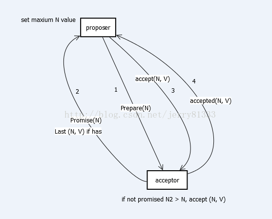

# PAXOS

## 介绍

算法本身用语言描述极其精简：

**phase 1**:

- proposer向网络内超过半数的acceptor发送prepare消息
- acceptor正常情况下回复promise消息

**phase 2**:

- 在有足够多acceptor回复promise消息时，proposer发送accept消息
- 正常情况下acceptor回复accepted消息

PAXOS中有三类角色Proposer、Acceptor及Learner，主要交互过程在Proposer和Acceptor之间，做成图便如下图所示：

其中1,2,3,4代表顺序。

以下图描述多Proposer的情况，T代表时间轴，图中仅画全一个Proposer与Acceptor的关系：

A3在T1发出accepted给A1，然后在T2收到A5的prepare，在T3的时候A1才通知A5最终结果(税率10%)。这里会有两种情况：

1. A5发来的N5小于A1发出去的N1，那么A3直接拒绝(reject)A5
2. A5发来的N5大于A1发出去的N1，那么A3回复promise，但带上A1的(N1, 10%)，最终A5也会接受10%

上图描述，如果已经Promise一个更大的N，那么会直接Reject更小的N

上述描述了，即使Promise了一个N，如果在未Accepted前，再收到一个更大的N，那么依旧会Reject那个即使已经Promise的N

总流程图氪概括如下：

## 项目

- PAXOS协议用于微信PaxosStore中，每分钟调用Paxos协议过程数十亿次量级。

