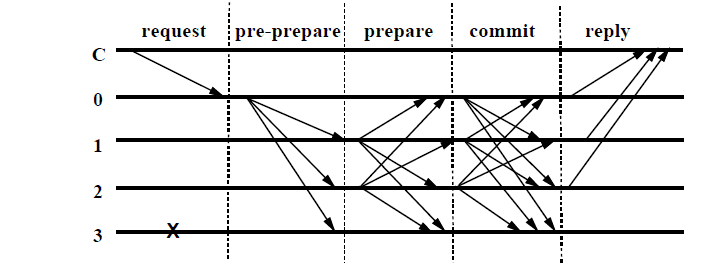

# 区块链共识机制简要介绍

[TOC]

## 前言

本文对区块链中常见的共识机制做了一些介绍和自己的看法，欢迎指教。

区块链解决了在不可信信道上传输可信信息、价值转移的问题，而共识机制解决了区块链如何在分布式场景下达成一致性的问题。所以我认为区块链的伟大之处就是它的共识机制在去中心化的思想上解决了节点间互相信任的问题。区块链能在众多节点达到一种较为平衡的状态也是因为共识机制。尽管密码学占据了区块链的半壁江山，但是共识机制是保障区块链系统不断运行下去的关键。

其实当分布式的思想被提出来时，人们就开始根据**FLP定理**和**CAP定理**设计共识算法。

**规范的说，理想的分布式系统的一致性应该满足以下三点**：

1. 可终止性（Termination）：一致性的结果可在有限时间内完成。
2. 共识性(Consensus)：不同节点最终完成决策的结果应该相同。
3. 合法性(Validity)：决策的结果必须是其他进程提出的提案。

**但是在实际的计算机集群中，可能会存在以下问题**:

1. 节点处理事务的能力不同，网络节点数据的吞吐量有差异
2. 节点间通讯的信道可能不安全
3. 可能会有作恶节点出现
4. 当异步处理能力达到高度一致时，系统的可扩展性就会变差（容不下新节点的加入）。

科学家认为，在分布式场景下达成完全一致性是不可能的。但是工程学家可以牺牲一部分代价来换取分布式场景的一致性，上述的两大定理也是这种思想，所以基于区块链设计的各种公式机制都可以看作牺牲那一部分代价来换取多适合的一致性，我的想法是可以在这种思想上进行一个灵活的变换，即在适当的时间空间牺牲一部分代价换取适应于当时场景的一致性，可以实现灵活的区块链系统，即可插拔式的区块链系统。

### POW:比特币莱特币等货币型区块链（公有链）(proof of work)

在比特币等货币型区块链中让各节点达成一致性的共识机制为工作量证明，也是我们说的挖矿。

工作量证明是矿工在处理交易数据（对数据也是进行哈希）的同时不断的进行哈希计算，求得一位前23位为0的哈希值，这个值成为nonce黄金数。当全网有一位矿工哈希出nonce时，他就会把自己打包的区块公布出去，其他节点收到区块验证区块后就会一致性认为这个区块接到了区块链上，就继续进行下一个区块的打包和哈希计算。在这个过程中，中本聪大神是通过算力的比拼牺牲了一部分最终一致性（因为会有分叉的产生）并且需要等待多个确认，但是这种简单暴力的方法却保证了整个区块链系统的合法性，而且把区块链系统的健壮性提升到极致，就算全网只剩下一个节点运行，这个区块链系统还是会继续运行下去。最后POW也充分提高了区块链系统的安全性，依靠51%攻击理论去破坏区块链系统是只有政府或者疯子才会采取的方法。

**应用场景**：

- [比特币挖矿](../../公链/比特币/比特币白皮书.md)
- [莱特币挖矿](../../公链/莱特币白皮书.md)
- [RootStock与比特币联合挖矿](../../公链/RootStock白皮书.md)
- [以太坊](../../公链/以太坊/以太坊白皮书.md)

**优点**：

- 完全去中心化
- 节点自由进出，容易实现。
- 破坏系统花费的成本巨大

**缺点**：

- 对节点的性能网络环境要求高
- 无法达成最终一致性
- 最关键的，浪费能源！

### POS:Bitshares和qutm等合约型区块链（proof of stake）

如果简单的把POW当作比力量大小的话，POS就是比耐力多少。
POS是根据钱包里面货币的多少以及货币在钱包里存在的天数来合成一个单位（币天）。它根据币天的关系对计算机进行哈希计算降低了难度，降低了计算机的门槛，但是对计算机还是有一定要求的，它把钱包和区块链系统的一致性绑定在一起。谁的钱包里的币天数越大谁拥有记账权的概率就越大。但是它和POW机制一样解决问题的思想也导致了它与POW拥有一样的缺点，也是牺牲了一部分的共识（同样分叉），而且需要等待多个确认。

**应用场景**：

- [DeepOnion](../../公链/DeepOnion白皮书.md)
- [DFINITY](../../公链/莱特币白皮书.md)
- [NXT](../../公链/NXT白皮书.md)
- [以太坊后续支持PoS](../../公链/以太坊/以太坊白皮书.md)

**优点**：

- 对节点性能要求低，达成共识时间短（网络环境好的话可实现毫秒级）

**缺点**：

- 没有最终一致性

### DPOS

是基于POS衍生出的更专业的解决方案，他是类似于董事会的投票机制，选举出n个记账节点，在节点中提案者提交的提案被这些记账节点投票决定谁是正确的。

**应用场景**：

- [公信宝-用于区块链记账和数据交换](../../公链/公信宝/公信宝白皮书.md)
- [EOS-用于区块生成](../../公链/EOS白皮书.md)

**优点**：

- 减少记账节点规模，属于弱中心化，效率提高。

**缺点**：

- 牺牲了去中心化的概念，不适合公有链。

以太坊前三个阶段即Frontier（前沿）、Homestead（家园）、Metropolis（大都会）。第四个阶段，即Serenity（宁静），将采用PoS机制。
Casper：以太坊前三个阶段采用的是POW共识机制，第四个阶段将采用自己创建的POS机制，名为投注共识。这种机制增加了惩罚机制，并基于POS的思想在记账节点中选取验证人。详情见以太坊紫皮书。

### DBFT：小蚁区块链（delegated BFT，授权拜占庭容错机制）

用权益来选出记账人，然后记账人之间通过拜占庭容错算法 达成共识。

**应用场景**：

- [NEO](../../公链/NEO白皮书.md)

**优点**：

- 专业化的记账人可以容忍任何类型的错误记账由多人协同完成，每一个区块都有最终性，不会分叉算法的可靠性有 严格的数学证明

**缺点**：

- 当三分之一或以上记账人停止工作后，系统将无法提供服务当三分之一或以上记账人联合作恶，且其他所有的记账人恰好分割为两个网络孤岛时，恶意记账人可以使系统出现分叉，但是会留下密码学证据

### PBFT：Fabric使用的经典算法（拜占庭容错）

这是一种基于消息传递的一致性算法，算法经过三个阶段达成一致性，这些阶段可能因为失败而重复进行。
假设节点总数为3f+1，f为拜占庭错误节点：

1. 当节点发现leader作恶时，通过算法选举其他的replica为leader。
2. leader通过pre-prepare （第一个协议阶段）消息把它选择的 value广播给其他replica节点，其他的replica节点如果接受则发送 prepare（第二个协议阶段），如果失败则不发送。
3. 2f个节点接受prepare消息，则节点发送commit（第三个协议阶段）消息。
4. 当2f+1个节点接受commit消息后，代表该value值被确定 如下图表示了4个节点，0为eader，同时节点3为fault节点，该节点不响应和发出任何消息。最终节点状态达到commited时，表示该轮共识成功达成。 注：预准备阶段（pre-prepare）： 主节点分配一个序列号n给收到的请求，然后向所有备份节点群发预准备消息，预准备消息的格式为<<PRE-PREPARE,v,n,d>,m>，这里v是视图编号，m是客户端发送的请求消息，d是请求消息m的摘要。 准备阶段（prepare）： 如果备份节点i接受了预准备消息<<PRE-PREPARE,v,n,d>,m>，则进入准备阶段。在准备阶段的同时，该节点向所有副本节点发送准备消息<PREPARE,v,n,d,i>，并且将预准备消息和准备消息写入自己的消息日志。如果看预准备消息不顺眼，就什么都不做。 确认阶段（commit）： 当(m,v,n,i)条件为真的时候，副本i将<COMMIT,v,n,D(m),i>向其他副本节点广播，于是就进入了确认阶段。

**优点**：

- 上述其他算法都脱离不了币的存在，币的存在及它的奖励机制会让区块链这一单一的世界穷者更穷，富者更富。共识效率高，可实现高频交易。

**缺点**：

- 当系统只剩下33%的节点运行时，系统会停止运行。

### Paxos

**非拜占庭容错的共识机制即不考虑有恶意节点的情况**，人们考虑到1990 年由 Leslie Lamport 提出的 Paxos 共识算法，在工程角度实现了一种最大化保障分布式系统一致性（存在极小的概率无法实现一致）的机制。

Paxos被用于分布式系统中典型的例子就是**Zookeeper**，他是第一个被证明的共识算法，其原理基于两阶段提交并扩展。

Paxos算法中将节点分为三种类型：proposer：提出一个提案，等待大家批准为结案。往往是客户端担任该角色acceptor：负责对提案进行投票。往往是服务端担任该角色learner：被告知结案结果，并与之统一，不参与投票过程。可能为客户端或服务端基本过程包括 proposer 提出提案，先争取大多数 acceptor 的支持，超过一半支持时，则发送结案结果给所有人进行确认。一个潜在的问题是 proposer 在此过程中出现故障，可以通过超时机制来解决。极为凑巧的情况下，每次新的一轮提案的 proposer 都恰好故障，系统则永远无法达成一致（概率很小）。Paxos 能保证在超过50%的正常节点存在时，系统能达成共识。

### Paft

Raft算法是对Paxos算法的一种简单实现。
它包括三种角色：leader、candiate 和 follower，其基本过程为：Leader 选举：每个 candidate 随机经过一定时间都会提出选举方案，最近阶段中得票最多者被选为 leader同步 log：leader 会找到系统中 log 最新的记录，并强制所有的 follower 来刷新到这个记录，这里的log指的是各种事件的发生记录

### Pool验证池：布比区块链

基于传统的分布式一致性技术，加上数据验证机制。

**优点**：

- 不需要代币也可以工作，在成熟的分布式一致性算法（Pasox、Raft）基础上，实现秒级共识验证。

**缺点**：

- 去中心化程度不如bictoin；更适合多方参与的多中心商业模式。
