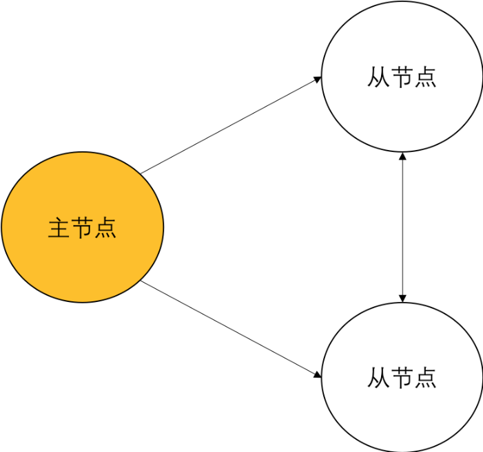

# 物联网区块链共识机制漫谈之一，DAG算法优缺点浅析

共识机制一直是区块链领域最值得争议的话题之一。从最初的PoW到近期的PoS，到未来的DPoS，每种架构和理论所带来性能、特点与优劣势各自非常明显。而近一段时间IOTA提出的DAG理论及其各种变型也充斥在社区上被大家讨论。在这里笔者阐述一下自己的看法，片面之处也请业界专家指正。

区块链即分布式多活数据库，这是笔者一直以来对区块链本质的理解。抛开账本即事务日志的存储模块，其所谓的“共识”机制从本质上来说与分布式数据库中“一致性算法”有异曲同工之处。

纵观数据库历史的发展，IBM DB2 for z/OS与Oracle RAC是Share Disk架构中的鼻祖，其核心理念在于多个服务实例共享存储，而在服务之间通过高速网络连接以实现共享锁与共享内存（RDMA等）。这种架构一般被用来实现高可用（HA），但是对于异地灾备环境来说，业界的普遍做法是采用主从日志复制（Log Shipping）的方式进行。

在传统Log Shipping机制中，集群中存在一个可读写的主数据节点，与一个或多个只读的从节点（开始时从节点只是冷备，后来2008年前后业界才提出在业务层面牺牲强一致的理念，做到备节点只读）。因此可以看出，数据库发展到今天，其灾备架构中一般来说存在一个相对持久的主节点进行交易日志生成，之后通过网络将该节点生成的交易日志发送给其他备节点进行回访，从而达到主备节点之间数据最终一致的目标。

而这种机制与区块链的“出块”何其相似。可以说区块链数据同步的本质就是Log Shipping，唯一不同的地方在于每次出块的过程中需要进行多节点间竞争，只有获胜的节点才获得记账权（也就是发送事务日志的权利）。这部分与传统数据库永远由主节点发送日志不同，区块链的第一个开源实现比特币，其十分钟出块的设计思路使得集群中的主节点每十分钟改变一次，从而避免了任何“主从”概念，做到全节点对等。

而另一个与数据库事务日志不同之处则在于，区块链的节点间数据同步采用定时检查点的理念，而非以事务提交回滚为检查点。这里定义，检查点即数据从内存真实落入磁盘的过程。只有数据从非永久存储的内存写入永久存储介质后，才认为该数据被永久保存。数据库一般在提交回滚操作时会触发一个日志缓存刷盘的过程，通过DIO的方式将日志写入磁盘。而比特币则只有每次出块时，才会将数据块作为日志永久结构写入链条并发送给其他节点进行持久化存储。从本质上讲，两者之间没有任何区别。

因此可以看到，区块链的出块、同步、以及回放机制都是一种检查点同步的过程，而该过程不论从PoW、PoS、甚至DPoS来看都是一种同步操作。因此，我们可以认为，区块链的链式结构中，使用账本同步机制实现的共识算法为检查点式同步持久化策略。

而IOTA则提出DAG模式，以及近期依据DAG思路所提出的一系列变种，则采用异步持久化策略。

从数据结构体系来看，DAG模式是一种典型的谣言传播算法，那么不论IOTA的DAG白皮书中写到的一大堆数学公式再如何精妙，也无法改变谣言传播算法的本质，即异步通讯。

异步通讯所带来最大的问题在于一致性不可控。就好像微服务架构中最让开发者头痛的在于各个微服务之间一致性与先后顺序控制的逻辑，远比传统开发模式复杂许多。在DAG模型中所带来最大的问题在于交易确认时间完全未知。当然，某种程度上同样可以认为在链式模型中，一个区块被超过2/3以上节点数接受才算全网最终确认，因此最终确认时间同样无法准确判断，但是IOTA的DAG所面对的是数以亿计的海量小型设备节点，与全球万级别的账本节点所需要的通讯确认时长要高出很多。

另一个DAG一直宣称的利用全部节点带宽所带来的优势，实际上会被网络中成几何级数增长的通讯量所迅速湮灭。为什么这么说？

试想链式结构中仅仅账本节点记账，大量的钱包节点仅仅向一个账本节点通讯即可，因此全网络账本节点的数量远远小于钱包节点。在这种情况下，所有的数据同步均在账本节点之间完成，假设网络中有M个账本节点，每一条记录在网络中传输的次数为M+1（即钱包向一个账本发送数据，同时账本节点将数据转发给其他账本节点）。

而对比DAG结构，在全网存在N个设备节点时（N成千上万倍大于M），每一个消息都需要在设备间进行点对点通讯，因此对于任何消息的发送，网络中都会存在N^2次数据发送（每一个节点都尝试将信息发送给其他邻居节点）。及时进行优化，每个节点有针对性地发送给相邻的K个节点，那么其网络信息传播速度同样为K*N，当N取值极大时对整体网络压力极为夸张。

因此，DAG利用谣言传播算法可以有效使用大量节点闲置网络资源，但是带来的负面影响则是每个节点的网络通讯量暴增，因此对于整体网络吞吐量并不一定会得到大幅度提升。

因此，DAG所带来的两个问题

- （1）交易时长不可控；
- （2）网络传输数据量大幅度增加；

这两个问题某种程度上制约着DAG的应用场景。

首先，问题（1）基本明确了DAG很难作为严格的支付结算手段应用于高速响应的物联网设备远程调用。一般来说，服务提供者希望能够在提供服务之前收取一部分甚至全部费用，或在服务提供后能够最短时间内得到支付。而以DAG作为结算手段，会造成支付时间完全不可控，而在IOTA给出的实现原理中更没有对极端情况作出设计，导致一些权重较低的交易长时间甚至永久无法被其他节点审批。在这种情况下，DAG在支付结算领域是否能够得到应用是一个问题。

而问题（2）则在于对于简单设备之间的调用命令尚可，但是如果调用命令较为复杂，甚至需要传输一段较长的指令代码，其通讯原理必须使用P2P直连，否则如果所有信息以DAG转发的形式传输会造成严重网络风暴。

因此，笔者认为，DAG与链式结构相比有创新有不足，其优势在于将异步通讯理念替换传统的同步检查点机制，以期望提升设备的响应速度。但是其几个核心问题使其在物联网交互与结算领域能否真正得到大规模应用，提出了不小的挑战。