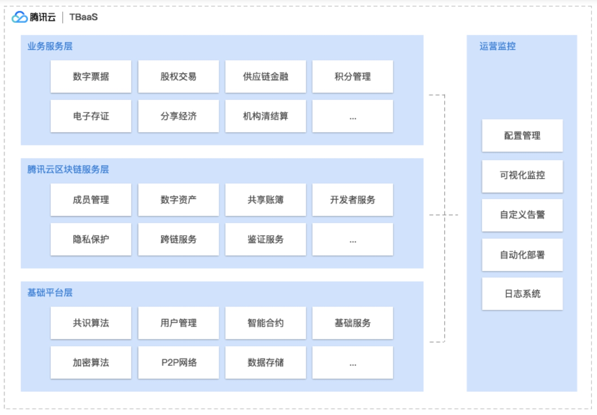

# 理性探索区跨链研讨会
[TOC]

## 基本信息
时间：2018-3-20
地点：无限极荟购物中心 湖滨路168号 3楼
参会：王俊
讲师：
>章贡  Tencent区块链资深专家
>李永峰 Oracle区块链技术专家
>周崧弢 利欧集团数字科技有限公司

## 核心观点
- 章贡：继蒸汽机、电力、信息和互联网技术之后，第五轮颠覆式核心技术
- 章贡：区块链是金融行业颠覆性创新，区块链系统治理金融行业
- 李永峰：Oracle提供区块链云服务
- 普华永道：推出“即时”区块链审计工具
- 周崧弢：“古典”互联网广告上链的历史必然

## 交流内容
### TBaas介绍
主讲人：章贡  Tencent区块链资深专家
> 腾讯云区块链服务TBaaS（Tencent Blockchain as a Service），构建于金融云基础之上。 平台系统不仅符合金融级别的安全合规性要求，同时还具备了腾讯云完备的能力，用户在弹性、开放的云平台上能够快速构建自己的IT基础设施和区块链服务。

#### 产品概述
- 技术门槛低

    > 无需担心区块链底层技术实现和平台构建，一键式快速部署，即买即用，整体系统配置安装时间缩短 80% 以上
- 开放平台
    > 源代码开放，代码兼容社区标准，数据迁移标准化，迁移成本可控
- 弹性接入
    > 根据用户的需求，无缝进行扩展，而不中断现有业务
- 成本节约
    > 相比自建 BaaS 平台集群设备，节约 60% 以上研发和初始成本
- 场景应用广
    > 面对各行业领域场景，满足用户个性化需求，一站式快速交付定制 TBaaS
- 管理可视化
    > 腾讯云区块链浏览器，帮助用户可视化地进行区块链运营管理
- 完善生态圈
    > 整合腾讯在支付、社交、媒体、征信平台等众多业界领先领域的资源，打造一个开放分享、能力全面，标准统一的区块链生态圈

#### 产品优势
|           |  腾讯区块链TBaas | 自建区块链  |
| --------  | :--------  |:--  |
| 开放性   |**源代码开放**： 1. Linux Foundation 金牌会员， Hyperledger 会员 2. 源代码开放给 Linux 社区,提供代码给合作伙伴与监管机构，供对方进行代码安全审查 3. 代码兼容社区标准，数据迁移标准化，迁移成本可控|**私有代码，私有化块数据格式** 1. BaaS平台基于私有/专有协议开发，源代码没有开放给 Linux 社区，存在监管安全风险隐患 2. 兼容性差，平台迁移成本高 |
| 高性能     |**高性能，灵活横向扩展** 1. 多角色节点成员动态加入/退出TBaaS服务 2. 容器化物理资源管理 3. 提供商用版本的多链、闪电网络等技术解决方案，提升 TBaaS 效率     |**性能差，缺少横向扩展能力** 1. 缺乏成员加入，推出机制 2. 缺乏物理方式资源管理 3. 缺乏商用版本性能加速技术集成  |
| 高可靠性     | **可用性高** 1. TBaaS 构建于成熟的腾讯云平台，整个平台遵循等保四级的高可用设计准则     | **存在单点故障** 1. 自建 BaaS 没有冗余设计，存在单点故障风险|
| 自动化运维     | **全流程运维服务** 1. 满足用户个性化需求，一站式快速交付定制TBaaS服务 2. 主动升级底层区块链平台和更新补丁|**工作量大，运维过程繁琐** 1. 自行构建区块链平台，交付时间不可控 2. 平台和补丁更新不及时，需手工更新,存在运维风险|
| 企业级监控     | **一体化监控** 1. 集群全天候监控 2. TBaaS实时多维度监控 3. 自定义、多渠道告警|**监控体系不周全** 1. 监控体系不健全 2. 需额外人力开发|
| 高性价比    |**性价比具有竞争力** 1. 可根据用户需求进行弹性伸缩 2. 节约运维成本 3. 节约监控开发成本 4. 按年租用的计费模式，减少客户前期投入成本|**投入大，维护成本高** 1. 需要购买昂贵设备和厂商的服务 2. 硬件不能按需弹性伸缩，需要提前购买，一次性投资巨大 3. 投入大量的人力资源以保障运维的可靠性|
| 全球互联与分布     |**全球部署跨域互通** 1. 拥有部署全球的能力以及完备的跨区域全球数据中心基础设施，助力客户在腾讯区块链 TBaaS 上跨地域部署 2. 完备的多链路冗余，保障多区域的区块链网络节点正常运行 3. 可靠的网络安全基础能力，使用户的运营安全无忧|**网络设施能力差** 1. 缺少云上的网络基础设施支持,需要自己构建复杂的网络 2. 需要向运营商购买昂贵的网络流量 3. 缺乏网络安全、网络冗余的考虑 4. 不具网络设备故障处理能力|

#### TBaas基础设施架构
腾讯云区块链服务TBaaS，提供两种模式的服务：腾讯公有云金融专区和腾讯专有云。用户可以根据自己的需求，灵活的进行构建自己的系统，即可购买金融云上的区块链即服务系统，也可以将系统搭建在自建机房专有云上。

#### TBaas业务架构

#### 区块链是金融行业颠覆性创新
继蒸汽机、电力、信息和互联网技术之后，第五轮颠覆式核心技术，本质是**去中心化的分布式账本**
- 金融脱媒
- 实时交易
- 智能合约

#### 区跨链在金融领域的创新
- 传统商业基本制度框架
    - 商业信任是依赖权威和法律
    - 信用中介保障资产转移
    - 集中式的清算机构完成结算和清算 
- 区块链带来的变革
    - 交易都是“发生即清算”
    - 系统间都是使用技术协议
    - 交易规则达成共识，不得篡改
    
#### 区块链系统治理金融行业
- 区块链技术覆盖银行业务
- 惠及所有参与方
- 解决全流程环节存在痛点  
  
-----
### Oracle区块链云服务
主讲人：李永峰 Oracle区块链技术专家
#### Oracle区块链云服务
- 作为PaaS在OPC中提供
- 同时提供OCMOP方式部署
- Oracle负责基础设施的管理服务，可加快客户部署
- 可部署在Bare Metal上。

#### 企业级客户解决方案
- 满足企业客户的关键需求：伸缩性、隐私/保密性、厂商支持，易于业务成员加入并与现有业务有序集成

#### 为开发者和ISVs提供Sandbox
- 对不同的区块链用例进行开发测试所需进行简单、快速的配置

#### 行业中立Industry neutral解决方案
- 慢速不同行业用例的平台级解决方案
- 支持Oracle Fusion Applicatins/SaaS的集成实际需求提供更大价值和随时可用的业务模型
- 与ISV和SI实施伙伴合作，提供完整的解决方案

----
### 普华永道
#### 区块链解决效率问题
- 防伪
- 非金融领域
- 金融领域
- 监管

#### 区块链审计
- "即时"区块链审计工具
- 当场操作
- 智能合约的审计

----
### 利欧数字的互联网广告上链探索
主讲人：周崧弢 利欧集团数字科技有限公司

#### “古典”互联网广告上链的历史必然
- 信任  Confidence
- 透明度 Transparency
- 信息熵 Entropy

#### 链上互联网广告的对立统一
铁三角1：去中心化、速度、安全
铁三角2：自组织、商业、政府

#### "古典"互联网广告上链的挑战
共识算法的效率  Consensus Aigorithm
经济系统的重新设计和平衡 TOKEN
生产关系的再造 DAO

#### 公式算法的效率遵循
- 在异步通信场景，及时只有一个进程失效，也没有任何算法能保证飞失败进程达到一致性
- Termination 可终止性
- 一致性的结果需要在有限的时间内达成
- Agreement 共识性
- 不同节点最终完成决策的结果应该是相同的
- Validity的合法性
- 决策的结果必须来自其他节点提出的提案

#### CAP 定理
- Consistency 一致性
- Availability 可用性
- Partition Tolerance 分区容错性
- 不可兼得

#### 主流共识算法的特点
|           |  非许可公有 | 许可联盟/私有|可信环境/公有  |
| -------- | :--------  | :--       |:--  |
| 去中心化   | pow/pos    | BFT         |PADOX  |
| 代理人     | DPOS       | PBFT        |RAFT  |
| 中心化     | RIPPLE     | XBFT        | ---  |

#### 互联网广告的应用场景与共识机制的选择
|           |  可信环境/私有 | 许可联盟/私有| 非许可公有  |
| -------- | :--------  | :--       |:--  |
| 去中心化   | Padox 广告数据交换 广告交易、广告日志    | BFT 广告素材制作 广告交易 广告机构验证 广告合规管理        |pow、pos 广告呆逼  |
| 代理人     | RAFT 广告数据交换 广告交易 广告日志记录      | PBFT 广告数据的交换 广告素材制作 广告交易        |DPos 广告代币  |
| 中心化     | 古典互联网时代     | XBFT 广告数据交换 广告素材制作        | Ripple 广告代币 广告促销活动  |

