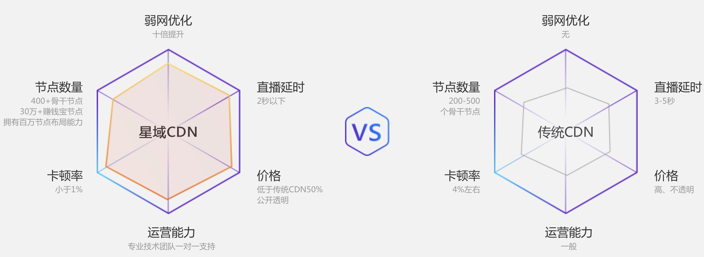

# 网心科技

## 简介
深圳市网心科技有限公司，是一家专注于技术创新的共享经济云计算公司，致力于为全球互联网发展提供技术源动力。

## 企业理念
Forward永远向前

## 企业愿景
成为全球共享计算领域的领导者

## 企业使命
通过技术创新，放大每个人的力量

## 核心技术-星域CDN
- 无线节点
- 星域调度
- 动态防御
- 弱网加速

## 产品
- [玩客云](../../应用场景/行业-共享/共享CDN-玩客云.md)
- 迅雷赚钱宝
- 迅雷赚钱包Pro

